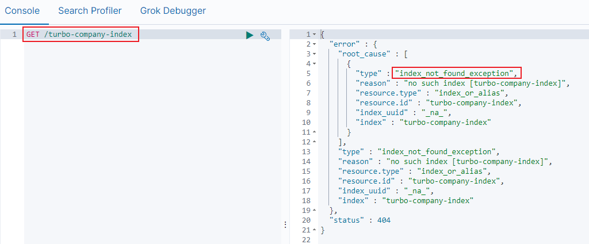
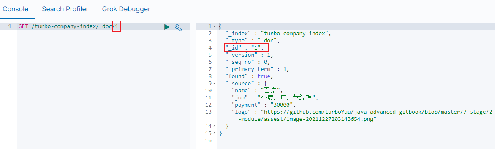

第二部分 Elasticsearch入门使用

Elasticsearch是基于Lucene的全文检索引擎，本质也是存储和检索数据。ES种的很多概念与MySQL类似。

# 1 核心概念

- **索引（index）**

  类似的数据放在一个索引，非类似的数据放不同索引，一个索引也可以理解成一个关系型数据库。

- **类型（type）**

  代表document属于index中的哪个类别（type）也有一种说法：一种type就像是数据库的表。

  注意ES每个大版本之间的区别很大：

  ES 5.x 中的一个index可以有多种type；

  ES 6.x 中的一个index只能有一种type；

  ES 7.x 以后要逐渐移除type这个概念。

- **映射（mapping）**

  mapping定义了每个字段的类型等信息。相等于关系型数据库中的表结构。

  常用数据类型：text、keyword、number、array、range、bolean、date、go_point、ip、nested、object

  https://www.elastic.co/guide/en/elasticsearch/reference/current/mapping-types.html#_multi_fields_2

  | 关系型数据库（如MySQL） | 非关系型数据库（Elasticsearch） |
  | ----------------------- | ------------------------------- |
  | 数据库Database          | 索引 index                      |
  | 表 Table                | 索引 index类型（原为Type）      |
  | 数据行 Row              | 文档 Document                   |
  | 数据列 Column           | 字段 Field                      |
  | 约束 Schema             | 映射 Mapping                    |

  

# 2 Elasticsearch API 介绍

Elasticsearch提供了Rest风格的API，即http请求接口，而且也提供了各种语言的客户端API。

- Rest风格API

  文档地址：https://www.elastic.co/guide/en/elasticsearch/reference/7.3/index.html

  

- 客户端API

  Elasticsearch支持的语言客户端非常多：https://www.elastic.co/guide/en/elasticsearch/client/index.html，实战中将使用到Java客户端API。

  

Elasticsearch没有自带图形化界面，可以通过安装Elasticsearch的图形化插件，完成图形化界面的效果，完成索引数据的查看，比如可视化插件Kibana。

# 3 安装配置Kibana

> 1.什么是Kibana

Kibana是一个基于Node.js的Elasticsearch索引库数据统计工具，可以利用Elasticsearch的聚合功能，生成各种图表、如柱状图、线状图、饼图等。

而且还提供了操作Elasticsearch索引数据的控制台，并且提供了一定的API提示，非常有利于学习Elasticsearch的语法。


> 2.安装Kibana

**1）下载Kibana**


[Kibana与操作系统](https://www.elastic.co/cn/support/matrix#matrix_os)

**2）安装Kibana**

1. 上传kibana-7.3.0-linux-x86_64.tar.gz，解压

   ```shell
   [root@node1 ~]# tar -xvf kibana-7.3.0-linux-x86_64.tar.gz -C /usr
   [root@node1 usr]# mv kibana-7.3.0-linux-x86_64 kibana
   ```

2. 修改kibana目录拥有者和权限

   ```shell
   # 改变kibana目录拥有者账号
   [root@node1 usr]# chown -R estest /usr/kibana/
   # 设置访问权限
   [root@node1 usr]# chmod -R 777 /usr/kibana/
   ```

3. 修改配置文件

   ```shell
   [root@node1 usr]# vim /usr/kibana/config/kibana.yml
   ```

   修改端口号，访问ip，elasticsearch服务ip

   ```yml
   server.port: 5601
   server.host: "0.0.0.0"
   # The URLs of the Elasticsearch instances to use for all your queries
   elasticsearch.hosts: ["http://192.168.31.71:9200"]
   
   ```

4. 启动kibana

   ```shell
   [root@node1 usr]# su estest
   [estest@node1 usr]$ cd kibana/bin/
   [estest@node1 bin]$ ./kibana
   # root用户启动
   [root@node1 ~]# /usr/kibana/bin/kibana --allow-root
   ```

   没有error错误启动成功：

   

   访问ip:5601，即可看到安装成功

   

   已全部安装完成，然后可以接入数据使用了。

**3）kibana使用页面**

选择左侧的Dev Tools菜单，即可进入控制台页面：


**4）扩展kibana dev tools快捷键：**

`ctrl+enter` 提交请求

`ctrl+i` 自动缩进

# 4 Elasticsearch继承IK分词器

## 4.1 集成IK分词器

IKAnalyzer是一个开源的，基于Java语言开发的轻量级的中文分析工具包。从2006年12月退出1.0版开始，IKAnalyzer已经推出了3个大版本。最初，它是以开源项目Lucene为应用主体的，结合词典分词和文法分析算法的中文分词组件。新版本的IKAnalyzer 3.0 则发证为面向Java的公用分词组件，独立于Lucene项目，同时提供了对Lucene的默认优化实现。

IK分词器 3.0 的特性如下：

1. 采用了特有的“正向迭代最细粒度切分算法”，具有60万/秒的高速处理能力。
2. 采用了多子处理器分析模式，支持：英文字母（IP地址、Email、URL）、数字（日期，常用中文量词，罗马数字，科学计数法），中文词汇（姓名，地名处理）等分词处理。
3. 支持个人词条的优化的词典存储，更小的内存占用。
4. 支持用户词典扩展定义。
5. 针对Lucene全文检索优化的查询分析器IKQueryParser；采用歧义分析算法优化查询关键字的搜索排列组合，能极大的提高Lucene检索的命中率。

**下载地址**：

https://github.com/medcl/elasticsearch-analysis-ik/releases/tag/v7.3.0

> **下载插件并安装（安装方式一）**

1. 在elasticsearch的bin目录下执行以下命令，es插件管理器会自动帮我们安装，然后等待安装完成：

   ```shell
   [root@node1 ~]# /usr/elasticsearch/bin/elasticsearch-plugin install https://github.com/medcl/elasticsearch-analysis-ik/releases/download/v7.3.0/elasticsearch-analysis-ik-7.3.0.zip
   ```

2. 下载完成后会提示 Continue with installation? 输入`y` 即可完成安装

3. 重启Elasticsearch 和 Kibana


> **上传安装包安装（安装方式二）**

1. 在elasticsearch安装目录的plugins目录下新建 `analysis-ik` 目录

   ```shell
   #新建analysis-ik文件夹 
   mkdir analysis-ik
   #切换至analysis-ik文件夹下 
   cd analysis-ik
   #上传资料中的elasticsearch-analysis-ik-7.3.0.zip 
   #解压
   unzip elasticsearch-analysis-ik-7.3.3.zip
   #解压完成后删除zip
   rm -rf elasticsearch-analysis-ik-7.3.0.zip
   ```

2. 重启Elasticsearch 和 Kibana


> **测试案例**

IK分词器有两种分词模式：ik_max_word和 ik_smart模式。

1. ik_max_word（常用）

   会将文本做最细粒度的拆分

2. ik_smart

   会做最粗粒度的拆分


先不管语法，先在kibana测试一波，输入下面的请求：

```json
POST _analyze 
{
 "analyzer": "ik_max_word",
 "text": "南京市长江大桥"
}
```

ik_max_word 分析模式运行得到结果

```json
{
  "tokens" : [
    {
      "token" : "南京市",
      "start_offset" : 0,
      "end_offset" : 3,
      "type" : "CN_WORD",
      "position" : 0
    },
    {
      "token" : "南京",
      "start_offset" : 0,
      "end_offset" : 2,
      "type" : "CN_WORD",
      "position" : 1
    },
    {
      "token" : "市长",
      "start_offset" : 2,
      "end_offset" : 4,
      "type" : "CN_WORD",
      "position" : 2
    },
    {
      "token" : "长江大桥",
      "start_offset" : 3,
      "end_offset" : 7,
      "type" : "CN_WORD",
      "position" : 3
    },
    {
      "token" : "长江",
      "start_offset" : 3,
      "end_offset" : 5,
      "type" : "CN_WORD",
      "position" : 4
    },
    {
      "token" : "大桥",
      "start_offset" : 5,
      "end_offset" : 7,
      "type" : "CN_WORD",
      "position" : 5
    }
  ]
}

```


```json
POST _analyze
{
 "analyzer": "ik_smart", 
 "text": "南京市长江大桥" 
}
```

ik_smart分词模式运行得到结果：

```json
{
  "tokens" : [
    {
      "token" : "南京市",
      "start_offset" : 0,
      "end_offset" : 3,
      "type" : "CN_WORD",
      "position" : 0
    },
    {
      "token" : "长江大桥",
      "start_offset" : 3,
      "end_offset" : 7,
      "type" : "CN_WORD",
      "position" : 1
    }
  ]
}
```

如果现在假如**江大桥**是一个人名，是南京市市长，那么上面的分词显然是不合理的，该怎么办？


## 4.2 扩展词典使用

**扩展词**：就是不想让哪些词被分开，让他们分成一个词。比如上面的**江大桥**

**自定义扩展词库**

1. 进入到config/analysis-ik/(**插件命令安装**) 或 plugins/analysis-ik/config (**安装包安装方式**) 目录下，新增自定义词典

   ```shell
   [root@node1 analysis-ik]# vim turbo_ext_dict.dic
   ```

   输入：江大桥

2. 将我们自定义的扩展词典文件添加到 IKAnalyzer.cfg.xml 配置中

   vim IKAnalyzer.cfg.xml

   ```xml
   <?xml version="1.0" encoding="UTF-8"?>
   <!DOCTYPE properties SYSTEM "http://java.sun.com/dtd/properties.dtd">
   <properties>
           <comment>IK Analyzer 扩展配置</comment>
           <!--用户可以在这里配置自己的扩展字典 -->
           <entry key="ext_dict">turbo_ext_dict.dic</entry>
            <!--用户可以在这里配置自己的扩展停止词字典-->
           <entry key="ext_stopwords"></entry>
           <!--用户可以在这里配置远程扩展字典 -->
           <!-- <entry key="remote_ext_dict">words_location</entry> -->
           <!--用户可以在这里配置远程扩展停止词字典-->
           <!-- <entry key="remote_ext_stopwords">words_location</entry> -->
   </properties>
   ```

3. 重启Elasticsearch

   ik_max_word 分析模式运行得到结果中会出现：江大桥


## 4.3 停用词典使用

**停用词**：有些词在文本中出现的频率非常高。但对文本的语义产生不了多大的影响。例如英文的a、an、the、of等，或中文 的、了、呢  等。这样的词称为停用词。停用词经常被过滤掉，不会进行索引。在检索过程中，如果用户的查询中含有停用词，系统会自动过滤掉。停用词可以加快索引的速度，减少索引库文件的大小。

**自定义停用词库**

1. 进入到config/analysis-ik/(**插件命令安装**) 或 plugins/analysis-ik/config (**安装包安装方式**) 目录下，新增自定义词典

   ```shell
   vim turbo_stop_dict.dic
   ```

   输入

   ```xml
   的
   了
   啊
   ```

2. 将自定义的停用词典文件添加到IKAnalyzer.cfg.xml配置中

3. 重启Elasticsearch


## 4.4 同义词典使用

很多相同意思的词，称之为同义词。在搜索时，输入“番茄”，但是应该把含有“西红柿”的数据也查出来，这种情况叫 同义词查询。

注意：扩展词和停用词是在索引的时候使用，而同义词是检索时候使用。

**配置IK同义词**

Elasticsearch 自带一个名为 synonym 的同义词filter。为了能让 IK 和 synonym 同时工作，需要定义新的analyzer，用 IK 做 tokenizer，synonym 做 filter。实际只需要加一段配置。

1. 创建 /config/analysis-ik/synonym.txt 文件，输入一些同义词并存为 utf-8（linux默认格式就是 utf-8） 格式。例如

   ```tex
   turbo,涡轮
   china,中国
   ```

2. 创建索引时，使用同义词配置，示例模板如下

   ```json
   PUT /索引名称
   {
     "settings": {
       "analysis": {
         "filter": {
           "word_sync": {
             "type": "synonym",
             "synonyms_path": "analysis-ik/synonym.txt"
           }
         },
         "analyzer": {
           "ik_sync_max_word": {
             "filter": [
               "word_sync"
             ],
             "type": "custom",
             "tokenizer": "ik_max_word"
           },
           "ik_sync_smart": {
             "filter": [
               "word_sync"
             ],
             "type": "custom",
             "tokenizer": "ik_smart"
           }
         }
       }
     },
     "mappings": {
       "properties": {
         "字段名": {
           "type": "字段类型",
           "analyzer": "ik_sync_smart",
           "search_analyzer": "ik_sync_smart"
         }
       }
     }
   }
   ```

   以上配置定义了ik_sync_max_word 和 ik_sync_smart 这两个新的 analyzer，对应 IK 的 ik_max_word 和 ik_smart 两种分词策略。ik_sync_max_word 和 ik_sync_smart 都会使用 synonym filter 实现同义词转换。

3. 到此，索引创建模板中同义词配置完成，搜索时指定分词器为 ik_sync_max_work 或 ik_sync_smart。

4. 案例

   ```json
   PUT /turbo-es-synonym
   {
     "settings": {
       "analysis": {
         "filter": {
           "word_sync": {
             "type": "synonym",
             "synonyms_path": "analysis-ik/synonym.txt"
           }
         },
         "analyzer": {
           "ik_sync_max_word": {
             "filter": [
               "word_sync"
             ],
             "type": "custom",
             "tokenizer": "ik_max_word"
           },
           "ik_sync_smart": {
             "filter": [
               "word_sync"
             ],
             "type": "custom",
             "tokenizer": "ik_smart"
           }
         }
       }
     },
     "mappings": {
       "properties": {
         "name": {
           "type": "text",
           "analyzer": "ik_sync_smart",
           "search_analyzer": "ik_sync_smart"
         }
       }
     }
   }
   ```

   插入数据

   ```json
   POST /turbo-es-synonym/_doc/1
   {
     "name": "涡轮是一种将流动工质的能量转换为机械功的旋转式动力机械"
   }
   ```

   使用同义词 "turbo" 或者 "涡轮" 进行搜索

   ```json
   POST /turbo-es-synonym/_doc/_search
   {
     "query": {
       "match": {
         "name": "turbo"
       }
     }
   }
   ```

   


# 5 索引操作（创建、查看、删除）

## 5.1 创建索引库

Elasticsearch采用Rest风格API，因此其API就是一次http请求，可以用任何工具发起http请求

> 语法

```json
PUT /索引名称 
{
 "settings": {
   "属性名": "属性值" 
 }
}
```

settings：就是索引库设置，其中可以定义索引库的各种属性，比如分片数、副本数等，目前可以不设置，都使用默认。

> 示例

PUT /turbo-company-index


可以看到索引创建成功了。

## 5.2 判断索引是否存在

> 语法

```json
HEAD /索引名称
```

> 示例

HEAD /turbo-company-index


## 5.3 查看索引

Get 请求可以帮助查看索引的相关属性信息，格式：

- 查看单个索引

  > 语法

  ```
  GET /索引名称
  ```

  > 示例

  GET /turbo-company-index

  

- 批量查看索引

  > 语法

  ```
  GET /索引名称1,索引名称2,索引名称3,...
  ```

  > 示例

  GET /turbo-company-index,turbo-employee-index

  

- 查看所有索引

  > 方式一

  ```
  GET _all
  ```

  

  > 方式二

  ```
  GET /_cat/indices?v
  ```

  

  绿色：索引的所有分片都正常分配。

  黄色：至少有一副没有得到正确的分配。

  红色：至少有一个主分片没有得到正确的分配。

## 5.4 打开索引

> 语法

```
POST /索引名称/_open
```


## 5.5 关闭索引

> 语法

```
POST /索引名称/_close
```


关闭的索引，不能再进行搜索。

## 5.6 删除索引

删除索引使用 DELETE 请求

> 语法

```
DELETE /索引名称1,索引名称2,索引名称3,...
```

> 示例


再次查看，返回索引不存在




# 6 映射操作

索引创建之后，等于有了关系型数据库中的database。Elasticsearch 7.x 取消了索引type类型的设置，不允许指定类型，默认为 _doc，但字段仍然是有的，我们需要设置字段的约束信息，叫做字段映射（mapping）。

字段的约束包括但不限于：

- 字段的数据类型
- 是否要存储
- 是否要索引
- 分词器

## 6.1 创建映射字段

> 语法

```json
PUT /索引库名/_mapping/
{
  "properties": {
    "字段名": {
      "type": "类型",
      "index":true,
      "store":true
      "analyzer": "分词器"
    }
  }
}
```

https://www.elastic.co/guide/en/elasticsearch/reference/7.3/mapping-params.html

字段名：任意填写，下面指定许多属性，例如：

- type：类型，可以是 text、long、short、date、integer、object 等
- index：是否索引，默认为true
- store：是否存储，默认为false
- analyzer：指定分词器

> 示例

发起请求

```
PUT /turbo-company-index

PUT /turbo-company-index/_mapping/
{
  "properties": {
    "name": {
      "type": "text",
      "analyzer": "ik_max_word"
    },
    "job": {
      "type": "text",
      "analyzer": "ik_max_word"
    },
    "logo": {
      "type": "keyword",
      "index": "false"
    },
    "payment": {
      "type": "float"
    }
  }
}
```

响应结果：


上述案例中，就给 turbo-company-index 这个索引库设置了 4 个字段：

- name：企业名称
- job：需求岗位
- logo：logo图片地址
- payment：薪资

并且给这些字段设置了一些属性，以至于这些属性对应的含义，后续详细介绍。

## 6.2 映射属性详解

> 1 **type**

Elasticsearch 中支持的数据类型非常丰富：

https://www.elastic.co/guide/en/elasticsearch/reference/7.3/mapping-types.html


说几个关键的：

- String类型，又分为两种：

  - text：可分词，不可参与聚合
  - keyword：不可分析，数据会作为完整字段进行匹配，可以参与聚合

- Numeric：数值类型，分两类

  - 基本数据类型：long, integer, short, byte, double, float, half_float
  - 浮点数的高精度类型：scaled_float
    - 需要指定一个精度因子，比如10或100。elasticsearch会把真实值 乘以这个因子后存储，取出时再还原。

- Date：日期类型

  elasticsearch可以对日期格式化为字符串存储，但是建议我们存储为毫秒值，存储为long，节省空间。

- Array：数组类型

  - 进行匹配时，任意一个元素满足，都认为满足
  - 排序时，如果升序则用数组中的最小值来排序，如果降序则用数组中的最大值来排序

- Object：对象

  ```json
  {
   name:"Jack",
   age:21,
   girl:{
    name:"Rose",age:21
   }
  }
  ```

  如果存储到索引库的是对象类型，例如上面的girl，会把girl变成两个字段：girl.name和girl.age


> 2 **index**

index影响字段的索引情况。

- true：字段会被索引，则可以用来进行搜索。默认值就是true
- false：字段不会被索引，不能用来搜索

index的默认值就是true，也就是说你不进行任何配置，所有字段都会被索引。<br>但是有些字段是不希望被索引的，比如企业logo图片地址，就需要手动设置index为false。


> 3 **store**

是否将数据机型独立存储。

原始的文本会存储在`_source`里面，默认情况下其他提取出来的字段都不是独立存储的，是从`_source`里面提取出来的。当然你也可以独立存储某个字段，只需要设置 store:true 即可，获取独立存储的字段要比从 _source 中解析快得多，但是也会占用更多的空间，索引要根据实际业务需求来设置，默认为false。


> 4 **analyzer：指定分词器**

一般会处理中文会选择ik分词器	ik_max_word、ik_smart


## 6.3 查看映射关系

- 查看单个索引映射关系

  > 语法

  ```
  GET /索引名称/_mapping
  ```

  > 示例

  

- 查看所有索引映射关系

  > 方式一

  ```
  GET _mapping
  ```

  > 方式二

  ```
  GET _all/_mapping
  ```

- **修改索引映射关系**

  > 语法

  ```json
  PUT /索引库名/_mapping/
  {
    "properties": {
      "字段名": {
        "type": "类型",
        "index":true,
        "store":true
        "analyzer": "分词器"
      }
    }
  }
  ```

  注意：**修改映射只可以增加字段**，做其他更改只能删除索引，重新建立映射

## 6.4 一次性创建索引和映射

`6.1`中把创建索引个映射分开来做，其实也可以在创建索引库的同时，直接制定索引库中的索引，基本语法：

```json
put /索引库名称 
{
   "settings":{
       "索引库属性名":"索引库属性值"    
   },
   "mappings":{
       "properties":{            
       		"字段名":{
           		"映射属性名":"映射属性值"        
			}
		}  
	}
}
```

案例

```json
PUT /turbo-employee-index
{
  "settings": {},
  "mappings": {
    "properties": {
      "name": {
        "type": "text",
        "analyzer": "ik_max_word"
      }
    }
  }
}
```


# 7 文档增删改查及局部更新

文档，即索引库中的数据，会根据规则创建索引，将来用于搜索。可以类比做数据库中的一行数据。


## 7.1 新建文档

新增文档时，涉及到id的创建方式，手动指定或者自动生成。

- 新增文档（手动指定id）

  > 语法

  ```
  POST /索引名称/_doc/{id}
  ```

  > 示例

  ```json
  POST /turbo-company-index/_doc/1
  {
    "name": "百度",
    "job": "小度用户运营经理",
    "payment": "30000",
    "logo": "https://github.com/turboYuu/java-advanced-gitbook/blob/master/7-stage/2-module/assest/image-20211227203143654.png"
  }
  ```

  

  

- 新增文档（自动生成id）

  > 语法

  ```json
  POST /索引名称/_doc 
  {
  	"field":"value" 
  }
  ```

  > 示例

  ```json

  ```
  
  
  
  可以看到结果显示为：`created`，代表创建成功。<br>另外，需要注意的是，在响应结果中有个`_id`字段，这个就是这条文档数据的`唯一标识`，以后的增删改查 都依赖这个 _id 作为位移标识，这里是Elasticsearch帮助随机生成的 id 。

## 7.2 查看单个文档

> 语法

```
GET /索引名称/_doc/{id}
```

> 示例

```
GET /turbo-company-index/_doc/1
```



> 文档元数据解读：

| 元数据项      | 含义                                                         |
| ------------- | ------------------------------------------------------------ |
| _index        | document所属 index                                           |
| _type         | document 所属 type，Elasticsearch 7.x 默认 type 为 _doc      |
| _id           | 代表 document 的位移标识，与 index 和 type 一起，可以唯一标识和定位一个 document |
| _version      | document的版本号，Elasticsearch利用 _version（版本号）的方式来确保应用中<br/>相互冲突的变更不会导致数据丢失。需要修改数据时，需要指定想要修改文档的 version 号，<br>如果该版本不是当前版本，请求将会失败 |
| _seq_no       | 严格递增的顺序号，每个文档一个，Shard级别严格递增，<br>保证后写入的Doc  *seq_no大于先写入的 Doc的*  seq_no |
| _primary_term | 任何类型的写操作，包括 index、create、update 和 Delete，都会生成一个 _seq_no。 |
| found         | true/false，是否查找到文档                                   |
| _source       | 存储原始文档                                                 |


## 7.3 查看所有文档

> 语法

```json
POST /索引名称/_search 
{
 "query":{
   "match_all": {  
   }
 }
}
```


```json
POST /turbo-company-index/_search
{
  "query":{
    "match_all":{
    }
  }
}
```


## 7.4 _source定制返回结果

某些业务场景下，不需要搜索引擎返回 *source* 中的所有字段，可以使用 source 进行定制，如下，多个字段之间使用逗号分隔。

```
GET /turbo-company-index/_doc/1?_source=name,job
```

 


## 7.5 更新文档（全部更新）

把刚才新增的请求方式改为 PUT ，就是修改了，不过修改必须执行id

- id对应文档存在，则修改
- id对应文档不存在，则新增

比如：id为3，不存在，则应该新增


可以看到的是`created`，是新增。

再次执行刚才的请求，不过把数据改一下：


可以看到结果是：`update`，显然是更新数据

## 7.6 更新文档（局部更新）

Elasticsearch 可以使用PUT 或者 POST 对文档进行更新（全部更新），如果指定ID的文档已经存在，则执行更新操作。

**注意**：Elasticsearch 执行更新操作的时候，Elasticsearch 首先将旧的文档标记为 删除状态，然后添加新文档，旧的文档不会立即消失，但是你也无法访问，Elasticsearch 会在你继续添加更多数据的时候在后台清理已经标记为删除状态的文档。

全部更新，是直接把之前的老数据，标记为删除状态，然后在添加一条更新的（使用 PUT 或 POST）

局部更新，只是修改某个字段（使用 POST）

> 语法

```
POST /索引名/_update/{id} 
{
	"doc":{
		"field":"value" 
	}
}
```

> 示例

```json
POST /turbo-company-index/_update/sP0KOX4BUesRrkoH_8eq
{
  "doc":{
    "job":"AI算法工程师"
  }
}
```


## 7.7 删除文档

- 根据 id 进行删除

  > 语法

  ```
  DELETE /索引名/_doc/{id}
  ```

  > 示例

  ```
  DELETE /turbo-company-index/_doc/3
  ```

  

  可以看到结果是：`deleted`，显然是删除数据

- 根据查询条件进行删除

  > 语法

  ```json
  POST  /索引库名/_delete_by_query 
  {
   "query": {
    "match": {
       "字段名": "搜索关键字"
    }
   } 
  }
  ```

  > 示例

  ```json
  POST /turbo-company-index/_delete_by_query
  {
    "query":{
      "match":{
        "name":"1"
      }
    }
  }
  ```

  

- 删除所有文档

  > 语法

  ```
  POST /索引名称/_delete_by_query
  {
    "query":{
      "match_all":{}
    }
  }
  ```

  > 示例

  ```
  POST /turbo-company-index/_delete_by_query
  {
    "query":{
      "match_all":{}
    }
  }
  ```

  

## 7.8 文档的全量替换、强制创建

- 全量替换

  - 语法与创建文档是一样的，如果文档 id 不存在，那么就是创建；如果文档 id 已经存在，就是全量替换操作，替换文档的json串内容；
  - 文档是不可变的，如果要修稿文档的内容，第一种方式就是全量替换，直接对文档重新建立索引，替换里面的所有内容，elasticsearch 会将老的文档标记为 deleted，然后新增我们给定的一个文档，当我们创建越来越多文档的时候，elasticsearch 会在适当的时机在后台自动删除标记为deleted的文档。

- 强制创建

  ```
  PUT /index/_doc/{id}?op_type=create {}，PUT /index/_doc/{id}/_create {}
  ```

  如果 id 存在就会报错。

