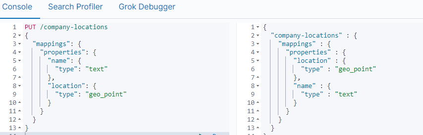
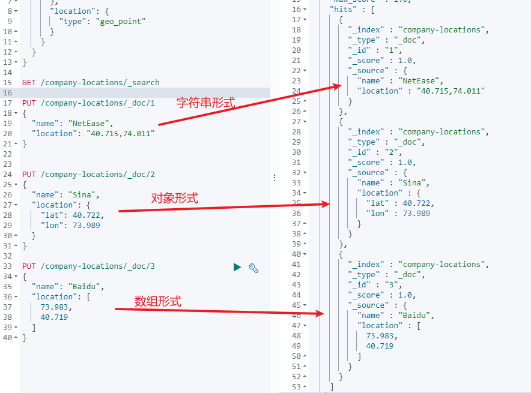
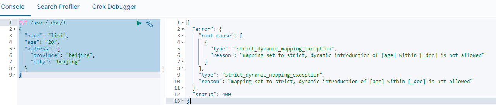

第三部分 Elasticsearch高级应用

# 1 映射高级

## 1.1 地理坐标点数据类型

- 地理坐标点

  地理坐标点是指地球表面可以用经纬度描述的一个点。地理坐标点可以用来计算两个坐标间的距离，还可以判断一个坐标是否在一个区域中。地理坐标点需要显式声明对应字段类型为`geo_point`:

  > 示例

  ```json
  PUT /company-locations
  {
    "mappings": {
      "properties": {
        "name": {
          "type": "text"
        },
        "location": {
          "type": "geo_point"
        }
      }
    }
  }
  ```

  

- 经纬度坐标格式

  如上例，`location`字段被声明为`geo_point`后，我们就可以索引包含了经纬度信息的文档了。经纬度信息的形式可以是字符串、数组或者对象。

  ```json
  # 字符串形式
  PUT /company-locations/_doc/1
  {
    "name": "NetEase",
    "location": "40.715,74.011"
  }
  # 对象形式
  PUT /company-locations/_doc/2
  {
    "name": "Sina",
    "location": {
      "lat": 40.722,
      "lon": 73.989
    }
  }
  # 数组形式
  PUT /company-locations/_doc/3
  {
    "name": "Baidu",
    "location": [
      73.983,
      40.719
    ]
  }
  ```

  

  **注意**

  字符串形式以保健逗号分隔，如："lat,lon"

  对象形式显式命名为 lat 和 lon

  数组形式表示为 [lon,lat]

- 通过地理坐标点过滤

  有四种地理坐标点相关的过滤器，可以用来选中或者排除文档

  | 过滤器             | 作用                                                         |
  | ------------------ | ------------------------------------------------------------ |
  | geo_bounding_box   | 找出落在指定矩形框中的点                                     |
  | geo_distance       | 找出与指定位置在给定距离内的点                               |
  | geo_distance_range | 找出与指定距离在给定最小距离和最大距离之间的点               |
  | geo_polygon        | 找出落在多边形中的点，**这个过滤器使用代价很大**，<br>当你觉得自己需要使用它，最好先看看[geo-shapes](https://www.elastic.co/guide/cn/elasticsearch/guide/current/geo-shapes.html) |

- geo_bounding_box 查询

  这是目前位置最有效的地理坐标过滤器，因为它计算起来非常简单。你指定一个矩形的顶部，底部，左边界和右边界。然后过滤器只需要判断坐标的经度是否在左右边界之间，纬度是否在上下边界之间

  然后可以使用`geo_bounding_box`过滤器执行以下查询

  ```json
  GET /company-locations/_search
  {
    "query": {
      "bool": {
        "must": {
          "match_all": {}
        },
        "filter": {
          "geo_bounding_box": {
            "location": {
              "top_left": {
                "lat": 40.73,
                "lon": 71.12
              },
              "bottom_right": {
                "lat": 40.01,
                "lon": 74.1
              }
            }
          }
        }
      }
    }
  }
  ```

  location这些坐标可以用 bottom_left 和 top_right 来表示。

- geo_distance

  过滤仅包含与地理位置相距特定距离内的匹配文档。假设一下映射和索引文档

  然后可以使用`geo_distance`过滤器执行以下查询

  ```json
  GET /company-locations/_search
  {
    "query": {
      "bool": {
        "must": {
          "match_all": {}
        },
        "filter": {
          "geo_distance": {
            "distance": "400km",
            "location": {
              "lat": 40,
              "lon": 70
            }
          }
        }
      }
    }
  }
  ```
  
  
  
  

## 1.2 动态映射

Elasticsearch在遇到文档中以前未遇到的字段，可以使用dynamic mapping（动态映射机制）来确定字段的数据类型并自动把新的字段添加到类型映射。

Elastic的动态映射机制可以进行开关控制，通过设置mappings的dynamic属性，dynamic有如下设置项

- true：遇到陌生字段就执行dynamic mapping处理机制
- false：遇到陌生字段就忽略
- strict：遇到陌生字段就报错

```json
# 设置为报错
PUT /user
{
  "settings": {
    "number_of_shards": 3,
    "number_of_replicas": 0
  },
  "mappings": {
    "dynamic": "strict",
    "properties": {
      "name": {
        "type": "text"
      },
      "address": {
        "type": "object",
        "dynamic": true
      }
    }
  }
}

# 插入以下文档，将会报错
# user索引层设置 dynamic是strict，在user层内设置age将报错
# 在address层设置dynamic是true，将动态映射生成字段
PUT /user/_doc/1
{
  "name": "lisi",
  "age": "20",
  "address": {
    "province": "beijing",
    "city": "beijing"
  }
}

PUT /user
{
  "settings": {
    "number_of_shards": 3,
    "number_of_replicas": 0
  },
  "mappings": {
    "dynamic": "true",
    "properties": {
      "name": {
        "type": "text"
      },
      "address": {
        "type": "object",
        "dynamic": true
      }
    }
  }
}
```



## 1.3 自定义动态映射

如果你想在运行时增加新的字段，你可能会启用动态映射。然而，有时候，动态映射规则 可能不太智能。幸运的是，可以通过设置系定义这些规则，以便更好的适用于你的数据。

### 1.3.1 日期检测

当Elasticsearch遇到一个新的字符串字段时，它会检测这个字段是否包含一个可识别的日期，比如 2014-0-01如果它像日期，这个字段就会被作为date类型添加。否则，它会被作为string类型添加。这些时候这个行为可能导致一些问题。假如，你有如下这样的一个文档：<br>{"note":"2014-01-01"}<br>假设这是第一次识别note 字段，它会被添加为 date 字段。但是如果下一个文档像这样：<br>{"note":"Logged out"}<br>这显然不是一个日期，但为时已晚。这个字段已经是一个日期类型，这个不合法的日期，将会造成一个异常。

日期检测可以通过在根对象上设置 date_detection 为 false 来关闭

```json
PUT /my_index
{
  "mappings": {
    "date_detection": false
  }
}

PUT /my_index/_doc/1
{
  "note": "2014-01-01"
}

PUT /my_index/_doc/1
{
  "note": "Logged out"
}

```

使用这个映射，字符串将始终作为 string 类型。如果需要一个 date 字段，必须手动添加。

Elasticsearch 判断字符串为日期的规则可以通过 dynamic_date_formats setting 来设置。

```json
PUT /my_index
{
  "mappings": {
    "dynamic_date_formats": "MM/dd/yyyy"
  }
}

PUT /my_index/_doc/1
{
  "note": "2014-01-01"
}

PUT /my_index/_doc/1
{
  "note": "01/01/2014"
}
```


### 1.3.2 dynamic templates

使用dynamic_templates 可以完全控制新生成字段的映射，甚至可以通过字段名称或数据类型来应用不同的映射。每个模板都有一个名称，你可以用来描述这个模板的用途，一个 mapping 来直送映射应该怎样使用，以及至少一个参数（如 match）来定义这个模板适用于哪个字段。

模板按照顺序来检测；第一个匹配的模板会被启用，例如，给 string 类型字段定义两个模板：<br>es：以 _es 结尾的字段名需要使用 spanish 分词器。<br>en：所有其他字段使用 english 分词器。<br>将 es 模板放在第一位，因为他比匹配所有字符串字段的 en 模板更特殊：

```json
PUT /my_index2
{
  "mappings": {
    "dynamic_templates": [
      {
        "es": {
          "match": "*_es",
          "match_mapping_type": "string",
          "mapping": {
            "type": "text",
            "analyzer": "spanish"
          }
        }
      },
      {
        "en": {
          "match": "*",
          "match_mapping_type": "string",
          "mapping": {
            "type": "text",
            "analyzer": "english"
          }
        }
      }
    ]
  }
}
```

```json
PUT /my_index2/_doc/1
{
  "name_es": "testes",
  "name": "es"
}
```

1. 匹配字段名以 _es 结尾的字段
2. 匹配其他所有字符串类型字段

match_mapping_type 允许你应用到特定类型的字段上，就像有标准动态映射规则检测的一样（例如 string 或 long）<br>match 参数只匹配字段名称，patch_match 参数匹配字段在对象上的完整路径，所以 address.*.name 将匹配这样的字段

```json
{
  "address": {
    "city": {
      "name": "New York"
    }
  }
}
```


# 2 Query SQL

https://www.elastic.co/guide/en/elasticsearch/reference/7.3/query-dsl.html

Elasticsearch 提供了基于 JSON 的完整查询 DSL（Domain Specific Language 特定域的语言）来定于查询。将查询 DSL 视为查询的 AST（抽象语法树），它由两种子句组成：

- 叶子查询子句

  叶子查询子句 在特定域中寻找特定的值，如 match，term，或 range 查询。

- 复合查询子句

  复合查询子句包装其他叶子查询或复合查询，并用于以逻辑方式组合多个查询（例如 bool 或 dis_max查询），或更改其行为（例如 constant_score查询）。

我们在使用 Elasticsearch 的时候，避免不了使用DSL语句去查询，就像使用关系型数据库的时候要学会 SQL 语法一样。如果学好了 DSL 语法的使用，那么在日后使用和使用 Java Client 调用时候也会变得非常简单。

> 基本语法

```json
POST /索引库名/_search
{
  "query": {
    "查询类型": {
      "查询条件":"查询条件值"
    }
  }
}
```

这里的query代表一个查询对象，里面可以有不同的查询属性

- 查询类型：
  - 例如：`match_all`，`match`，`term`，`range`等等
- 查询条件：查询条件会根据类型的不同，写法也会有差异，后面详细讲解

## 2.1 查询所有（match_all_query）

> 示例

```json
POST /lagou-company-index/_search
{
  "query": {
    "match_all": {}
  }
}
```

- `query`：代表查询对象
- `match_all`：代表查询所有

> 结果

- took：查询花费时间，单位是毫秒
- time_out：是否超时
- _shards：分片信息
- hints：搜索结果总览对象
  - total：搜索到的总条数
  - max_score：所有结果中文档得分的最高分
  - hits：搜索结果的文档对象数组，每个元素是一条搜索到的文档信息
    - _index：索引库
    - _type：文档类型
    - _id：文档id
    - _score：文档得分
    - _source：文档的元数据

## 2.2 全文搜索（full-text query）

全文搜索能够搜索已分析的文本字段，如：电子邮件正文，商品描述。使用索引期间应用于字段的统一分析器处理查询字符串。全文搜索的分类很多，几个典型的如下：

### 2.2.1 匹配搜索（match query）

全文查询的标准查询，它可以对一个字段进行模糊、短语查询。match queries 接收 text/numerics/dates，对他们进行分词分析，在组织成一个 boolean 查询。可通过 operator 指定 bool 组合操作（or、and 默认是 or）。

现在，索引库中有2部手机，1台电视：

```CQL
PUT /turbo-property
{
  "settings": {},
  "mappings": {
    "properties": {
      "title": {
        "type": "text",
        "analyzer": "ik_max_word"
      },
      "images": {
        "type": "keyword"
      },
      "price": {
        "type": "float"
      }
    }
  }
}

POST /turbo-property/_doc/
{
  "title": "小米电视4A",
  "images": "http://image.turbo.com/12479122.jpg",
  "price": 4288
}
POST /turbo-property/_doc/
{
  "title": "小米手机",
  "images": "http://image.turbo.com/12479622.jpg",
  "price": 2699
}
POST /turbo-property/_doc/
{
  "title": "华为手机",
  "images": "http://image.turbo.com/12479922.jpg",
  "price": 5699
}
```

#### 2.2.1.1 or 关系

`match` 类型查询，会把查询条件进行分词，然后进行查询，多个词条之间是or的关系。

```CQL
POST /turbo-property/_search
{
  "query": {
    "match": {
      "title": "小米电视4A"
    }
  }
}
```

结果

```yaml
{
  "took" : 5,
  "timed_out" : false,
  "_shards" : {
    "total" : 1,
    "successful" : 1,
    "skipped" : 0,
    "failed" : 0
  },
  "hits" : {
    "total" : {
      "value" : 2,
      "relation" : "eq"
    },
    "max_score" : 2.8330114,
    "hits" : [
      {
        "_index" : "turbo-property",
        "_type" : "_doc",
        "_id" : "3m_DSH4BmNQQ3AvLPonA",
        "_score" : 2.8330114,
        "_source" : {
          "title" : "小米电视4A",
          "images" : "http://image.turbo.com/12479122.jpg",
          "price" : 4288
        }
      },
      {
        "_index" : "turbo-property",
        "_type" : "_doc",
        "_id" : "32_DSH4BmNQQ3AvLR4mE",
        "_score" : 0.52354836,
        "_source" : {
          "title" : "小米手机",
          "images" : "http://image.turbo.com/12479622.jpg",
          "price" : 2699
        }
      }
    ]
  }
}
```

在上面的案例中，不仅会查询到电视，而且与小米相关的都会查询到，多个词之间是 `or` 的关系。

#### 2.2.1.2 and 关系

在某些情况下，我们需要更精准查找，希望这个关系变成 `and`，可以这样做：

```CQL
POST /turbo-property/_search
{
  "query": {
    "match": {
      "title": {
        "query": "小米电视4A",
        "operator": "and"
      }
    }
  }
}
```

结果：

```CQL
{
  "took" : 2,
  "timed_out" : false,
  "_shards" : {
    "total" : 1,
    "successful" : 1,
    "skipped" : 0,
    "failed" : 0
  },
  "hits" : {
    "total" : {
      "value" : 1,
      "relation" : "eq"
    },
    "max_score" : 2.8330114,
    "hits" : [
      {
        "_index" : "turbo-property",
        "_type" : "_doc",
        "_id" : "3m_DSH4BmNQQ3AvLPonA",
        "_score" : 2.8330114,
        "_source" : {
          "title" : "小米电视4A",
          "images" : "http://image.turbo.com/12479122.jpg",
          "price" : 4288
        }
      }
    ]
  }
}
```

本例中，只有同时包含 `小米` 和`电视`的词条才会被搜索到。

### 2.2.2 短语搜索（match phrase query）

match_phrase 查询用来对一个字段进行短语查询，可以指定 analyzer，slop 移动因子

```
GET /turbo-property/_search
{
  "query": {
    "match_phrase": {
      "title": "小米电视"
    }
  }
}

GET /turbo-property/_search
{
  "query": {
    "match_phrase": {
      "title": "小米 4A"
    }
  }
}

GET /turbo-property/_search
{
  "query": {
    "match_phrase": {
      "title": {
        "query": "小米 4A",
        "slop": 2
      }
    }
  }
}
```


### 2.2.3 query_string 查询

> Query String Query 提供了无需指定某字段而对文档进行匹配查询的一个高级查询，同时可以指定在哪些字段上进行匹配。

```CQL
# 默认
GET /turbo-property/_search
{
  "query": {
    "query_string": {
      "query": "2699"
    }
  }
}
# 指定字段
GET /turbo-property/_search
{
  "query": {
    "query_string": {
      "default_field": "title",
      "query": "2699"
    }
  }

# 逻辑查询
GET /turbo-property/_search
{
  "query": {
    "query_string": {
      "default_field": "title",
      "query": "手机 OR 小米"
    }
  }
}
GET /turbo-property/_search
{
  "query": {
    "query_string": {
      "default_field": "title",
      "query": "手机 AND 小米"
    }
  }
}

# 模糊查询
GET /turbo-property/_search
{
  "query": {
    "query_string": {
      "default_field": "title",
      "query": "大米~1"
    }
  }
}

# 多字段支持
GET /turbo-property/_search
{
  "query": {
    "query_string": {
      "query": "2699",
      "fields": ["title","price"]
    }
  }
}
```


### 2.2.4 多字段匹配搜索（multi match query）

如果你需要在多个字段上进行文本搜索，可用multi_match。multi_match 在 match 的基础上支持多个字段进行文本查询。

```CQL
GET /turbo-property/_search
{
  "query": {
    "multi_match": {
      "query": "2699",
      "fields": ["title","price"]
    }
  }
}
```

还可以使用 * 匹配多个字段：

```CQL
GET /turbo-property/_search
{
  "query": {
    "multi_match": {
      "query": "http://image.turbo.com/12479622.jpg",
      "fields": ["title","ima*"]
    }
  }
}
```


## 2.3 词条级搜索（term-level queries）

可以使用 term-level queries 根据结构化数据中的精确值查找文档。结构化数据的值包括日期范围、IP地址、价格或产品ID。

与全文查询不同，term-level queries 不分析搜索词。相反，词条与存储在字段级别中的术语完全匹配。

```
PUT /turbo_book
{
  "settings": {},
  "mappings": {
    "properties": {
      "description": {
        "type": "text",
        "analyzer": "ik_max_word"
      },
      "name": {
        "type": "text",
        "analyzer": "ik_max_word"
      },
      "price": {
        "type": "float"
      },
      "timestamp": {
        "type": "date",
        "format": "yyyy-MM-dd HH:mm:ss||yyyy-MM-dd||epoch_millis"
      }
    }
  }
}

PUT /turbo_book/_doc/1
{
  "name": "lucene",
  "description": "Lucene Core is a Java library providing powerful indexing and search features, as well as spellchecking, hit highlighting and advanced analysis/tokenization capabilities. The PyLucene sub project provides Python bindings for Lucene Core. ",
  "price": 100.45,
  "timestamp": "2020-08-21 19:11:35"
}

PUT /turbo_book/_doc/2
{
  "name": "solr",
  "description": "Solr is highly scalable, providing fully fault tolerant distributed indexing, search and analytics. It exposes Lucenes features through easy to use JSON/HTTP interfaces or native clients for Java and other languages.",
  "price": 320.45,
  "timestamp": "2020-07-21 17:11:35"
}

PUT /turbo_book/_doc/3
{
  "name": "Hadoop",
  "description": "The Apache Hadoop software library is a framework that allows for the distributed processing of large data sets across clusters of computers using simple programming models.",
  "price": 620.45,
  "timestamp": "2020-08-22 19:18:35"
}

PUT /turbo_book/_doc/4
{
  "name": "ElasticSearch",
  "description": "Elasticsearch是一个基于Lucene的搜索服务器。它提供了一个分布式多用户能力 的全文搜索引擎，基于RESTful web接口。Elasticsearch是用Java语言开发的，并作为Apache许可条 款下的开放源码发布，是一种流行的企业级搜索引擎。Elasticsearch用于云计算中，能够达到实时搜 索，稳定，可靠，快速，安装使用方便。官方客户端在Java、.NET（C#）、PHP、Python、Apache Groovy、Ruby和许多其他语言中都是可用的。根据DB-Engines的排名显示，Elasticsearch是最受欢 迎的企业搜索引擎，其次是Apache Solr，也是基于Lucene。",
  "price": 999.99,
  "timestamp": "2020-08-15 10:11:35"
}
```


### 2.3.1 词条搜索（term query）

term 查询用于查询指定字段包含某个词项的文档

```
POST /turbo_book/_search
{
  "query": {
    "term": {
      "name": "solr"
    }
  }
}
```


### 2.3.2 词条集合搜索（terms query）

term 查询用于查询指定字段包含某些词项的文档

```
GET /turbo_book/_search
{
  "query": {
    "terms": {
      "name": ["elasticSearch","solr"]
    }
  }
}
```


### 2.3.3 范围搜索（range query）

- gte：大于等于
- gt：大于
- lte：小于等于
- lt：小于
- boost：查询权重

```
GET /turbo_book/_search
{
  "query": {
    "range": {
      "price": {
        "gte": 10,
        "lte": 200,
        "boost": 2.0
      }
    }
  }
}

GET /turbo_book/_search
{
  "query": {
    "range": {
      "timestamp": {
        "gte": "now-2y/y",
        "lt": "now/d"
      }
    }
  }
}

GET /turbo_book/_search
{
  "query": {
    "range": {
      "timestamp": {
        "gte": "18/08/2020",
        "lte": "2022",
        "format": "dd/MM/yyyy||yyyy"
      }
    }
  }
}
```


### 2.3.4 不为空搜索（exists query）

查询指定字段值不为空的文档。相当于 SQL 中的 column is not null

```
GET /turbo_book/_search
{
  "query": {
    "exists": {"field": "price"}
  }
}
```


### 2.3.5 词项前缀搜索（prefix query）

```
GET /turbo_book/_search
{
  "query": {
    "prefix": {
      "name": "el"
    }
  }
}
```


### 2.3.6 通配符搜索（wildcard query）

```
GET /turbo_book/_search
{
  "query": {
    "wildcard": {
      "name": "el*h"
    }
  }
}

GET /turbo_book/_search
{
  "query": {
    "wildcard": {
      "name": {
        "value": "lu*",
        "boost": 2
      }
    }
  }
}
```


### 2.3.7 正则搜索（regexp query）

regexp允许使用正则表达式进行term查询，注意 regexp 如果使用埠镇古鳄，会给服务器带来很严重的性能压力。比如 .* 开头的查询，将会匹配所有的倒排序索引中的关键字，这几乎相当于全表扫描，会很慢。因此如果可以的话，最好在使用正则前，加上匹配的前缀。

```
GET /turbo_book/_search
{
  "query": {
    "regexp": {
      "name": "s.*"
    }
  }
}

GET /turbo_book/_search
{
  "query": {
    "regexp": {
      "name": {
        "value": "s.*",
        "boost": 1.2
      }
    }
  }
}
```


### 2.3.8 模糊搜索（fuzzy query）

```
GET /turbo_book/_search
{
  "query": {
    "fuzzy": {
      "name": "so"
    }
  }
}

GET /turbo_book/_search
{
  "query": {
    "fuzzy": {
      "name": {
        "value": "so",
        "boost": 1.0,
        "fuzziness": 2
      }
    }
  }
}

GET /turbo_book/_search
{
  "query": {
    "fuzzy": {
      "name": {
        "value": "sorl",
        "boost": 1.0,
        "fuzziness": 2
      }
    }
  }
}
```


### 2.3.9 ids搜索（id集合查询）

```
GET /turbo_book/_search
{
  "query": {
    "ids": {
      "type":"_doc",
      "values": ["1","3"]
    }
  }
}
```


## 2.4 复合搜索（compound query）

### 2.4.1 constant_score query

用来包装成另一个查询，将查询匹配的文档的评分设为一个常值

```
GET /turbo_book/_search
{
  "query": {
    "term": {
      "description": {"value": "solr"}
    }
  }
}

GET /turbo_book/_search
{
  "query": {
    "constant_score": {
      "filter": {
        "term": {
          "description": "solr"
        }
      },
      "boost": 1.2
    }
  }
}
```


### 2.4.2 布尔搜索（bool query）

bool 查询用 bool 操作来组合多个查询子句为一个查询。可用的关键字：

- must：必须满足
- filter：必须满足，但执行的是filter上下文，不参与，不影响评分
- should：或
- must_not：必须不满足，在filter上下文中执行，不参与，不影响评分

```
GET /turbo_book/_search
{
  "query": {
    "bool": {
      "must": {
        "match": {
          "description": "Java"
        }
      },
      "filter": {
        "term": {
          "name": "solr"
        }
      },
      "must_not": {
        "range": {
          "price": {
            "gte": 200,
            "lte": 300
          }
        }
      },
      "minimum_should_match": 1,
      "boost": 1
    }
  }
}
```

minimum_should_match 代表了最小匹配精度，如果设置 minimum_should_match=1，那么should 语句中至少需要一个条件满足。

## 2.5 排序

### 2.5.1 相关性评分排序

默认情况下，返回的结果是按照相关性 进行排序的 —— 最相关的文档排在最前。在本章后面部分，我们会解释相关性 意味着什么以及它是如何计算的，不过让我们首先看看 `sort`参数以及如何使用它。

为了按照相关性来排序，需要将相关性表示为一个数值。在Elasticsearch中，相关性得分 由一个浮点数进行表示，并在搜索结果中通过 `_source` 参数返回，默认排序是 `_source` 降序，按照相关性评分升序排序如下：

```
POST /turbo_book/_search
{
  "query": {
    "match": {
      "description": "solr"
    }
  }
}

POST /turbo_book/_search
{
  "query": {
    "match": {
      "description": "solr"
    }
  },
  "sort": [
    {
      "_score": {
        "order": "asc"
      }
    }
  ]
}
```


### 2.5.2 字段值排序

```
POST /turbo_book/_search
{
  "query": {
    "match_all": {}
  },
  "sort": [
    {
      "price": {
        "order": "desc"
      }
    }
  ]
}
```


### 2.5.3 多级排序

假定我们想要结合使用 price 和 _score（得分）进行查询，并且匹配的结果首先按照价格排序，然后按照相关性得分排序：

```
POST /turbo_book/_search
{
  "query": {
    "match_all": {}
  },
  "sort": [
    {"price": {"order": "desc"}},
    {"timestamp": {"order": "desc"}},
    {"_score": {"order": "desc"}}
  ]
}
```


## 2.6 分页

Elasticsearch中实现分页的语法非常简单：

```
POST /turbo_book/_search
{
  "query": {
    "match_all": {}
  },
  "size": 2,
  "from": 0
}

POST /turbo_book/_search
{
  "query": {
    "match_all": {}
  },
  "sort": [
    {
      "price": {
        "order": "desc"
      }
    }
  ], 
  "size": 2,
  "from": 0
}
```

size：每页显示多少条

from：当前页起始索引，int start=(pageNum-1)*size

## 2.7 高亮

Elasticsearch 中实现改良的语法比较简单：

```
POST /turbo_book/_search
{
  "query": {
    "match": {
      "name": "elasticsearch"
    }
  },
  "highlight": {
    "pre_tags": "<font color='pink'>",
    "post_tags": "</font>",
    "fields": [{"name":{}}]
  }
}

POST /turbo_book/_search
{
  "query": {
    "match": {
      "name": "ElasticSearch"
    }
  },
  "highlight": {
    "pre_tags": "<font color='pink'>",
    "post_tags": "</font>",
    "fields": [{"name":{}},{"description":{}}]
  }
}

POST /turbo_book/_search
{
  "query": {
    "query_string": {
      "query": "elasticSearch"
    }
  },
  "highlight": {
    "pre_tags": "<font color='pink'>",
    "post_tags": "</font>",
    "fields": [{"name":{}},{"description":{}}]
  }
}
```

在使用match查询的同时，加上一个highlight属性：

- pre_tags：前置标签
- post_tags：后置标签
- fields：需要高亮的字段
  - name：这里声明title 字段需要高亮，后面可以为这个字符按设置特有配置，也可以空

结果：

```yaml
{
  "took" : 4,
  "timed_out" : false,
  "_shards" : {
    "total" : 1,
    "successful" : 1,
    "skipped" : 0,
    "failed" : 0
  },
  "hits" : {
    "total" : {
      "value" : 1,
      "relation" : "eq"
    },
    "max_score" : 1.6317781,
    "hits" : [
      {
        "_index" : "turbo_book",
        "_type" : "_doc",
        "_id" : "4",
        "_score" : 1.6317781,
        "_source" : {
          "name" : "ElasticSearch",
          "description" : "Elasticsearch是一个基于Lucene的搜索服务器。它提供了一个分布式多用户能力 的全文搜索引擎，基于RESTful web接口。Elasticsearch是用Java语言开发的，并作为Apache许可条 款下的开放源码发布，是一种流行的企业级搜索引擎。Elasticsearch用于云计算中，能够达到实时搜 索，稳定，可靠，快速，安装使用方便。官方客户端在Java、.NET（C#）、PHP、Python、Apache Groovy、Ruby和许多其他语言中都是可用的。根据DB-Engines的排名显示，Elasticsearch是最受欢 迎的企业搜索引擎，其次是Apache Solr，也是基于Lucene。",
          "price" : 999.99,
          "timestamp" : "2020-08-15 10:11:35"
        },
        "highlight" : {
          "name" : [
            "<font color='pink'>ElasticSearch</font>"
          ],
          "description" : [
            "<font color='pink'>Elasticsearch</font>是一个基于Lucene的搜索服务器。它提供了一个分布式多用户能力 的全文搜索引擎，基于RESTful web接口。",
            "<font color='pink'>Elasticsearch</font>是用Java语言开发的，并作为Apache许可条 款下的开放源码发布，是一种流行的企业级搜索引擎。",
            "<font color='pink'>Elasticsearch</font>用于云计算中，能够达到实时搜 索，稳定，可靠，快速，安装使用方便。",
            "根据DB-Engines的排名显示，<font color='pink'>Elasticsearch</font>是最受欢 迎的企业搜索引擎，其次是Apache Solr，也是基于Lucene。"
          ]
        }
      }
    ]
  }
}
```


## 2.8 文档批量操作（bulk 和 mget）

### 2.8.1 mget 批量查询

单条查询 GET /turbo_book/_doc/1，如果查询多个id的文档一条一条查询，网络开销太大。

```
GET /_mget
{
  "docs": [
    {
      "_index": "turbo_book",
      "_id": 1
    },
    {
      "_index": "turbo-company-index",
      "_id": 1
    }
  ]
}
```

返回：

```yaml
{
  "docs" : [
    {
      "_index" : "turbo_book",
      "_type" : "_doc",
      "_id" : "1",
      "_version" : 1,
      "_seq_no" : 0,
      "_primary_term" : 1,
      "found" : true,
      "_source" : {
        "name" : "lucene",
        "description" : "Lucene Core is a Java library providing powerful indexing and search features, as well as spellchecking, hit highlighting and advanced analysis/tokenization capabilities. The PyLucene sub project provides Python bindings for Lucene Core. ",
        "price" : 100.45,
        "timestamp" : "2020-08-21 19:11:35"
      }
    },
    {
      "_index" : "turbo-company-index",
      "_type" : "_doc",
      "_id" : "1",
      "_version" : 5,
      "_seq_no" : 15,
      "_primary_term" : 1,
      "found" : true,
      "_source" : {
        "name" : "百度",
        "job" : "小度用户运营经理",
        "payment" : "30000",
        "logo" : "https://github.com/turboYuu/image-3654.png"
      }
    }
  ]
}

```

同一索引下批量查询：

```
GET /turbo_book/_mget
{
  "docs": [
    {
      "_id": 1
    },
    {
      "_id": 2
    }
  ]
}
```

搜索简化写法：

```
POST /turbo_book/_search
{
  "query": {
    "ids": {"values": ["1","4"]}
  }
}
```


### 2.8.2 bulk 批量增删改

Bulk 操作解释将文档的增删改查一些列操作，通过一次请求全部做完。减少网络传输次数。

语法：

```
POST /_bulk
{"action": {"metadata"}} 
{"data"}
```

如下操作，删除1，新增5，修改2：

```
POST /_bulk
{"delete":{"_index":"turbo_book","_id":"1"}}
{"create":{"_index":"turbo_book","_id":"5"}}
{"name":"kafka","description":"Kafka","price":100.99,"timestamp": "2021-01-12 10:11:35"}
{"update":{"_index":"turbo_book","_id":"2"}}
{"doc":{"timestamp": "2021-01-12 10:11:35"}}
```

结果：

```yaml
{
  "took" : 52,
  "errors" : false,
  "items" : [
    {
      "delete" : {
        "_index" : "turbo_book",
        "_type" : "_doc",
        "_id" : "1",
        "_version" : 2,
        "result" : "deleted",
        "_shards" : {
          "total" : 2,
          "successful" : 1,
          "failed" : 0
        },
        "_seq_no" : 4,
        "_primary_term" : 1,
        "status" : 200
      }
    },
    {
      "create" : {
        "_index" : "turbo_book",
        "_type" : "_doc",
        "_id" : "5",
        "_version" : 1,
        "result" : "created",
        "_shards" : {
          "total" : 2,
          "successful" : 1,
          "failed" : 0
        },
        "_seq_no" : 5,
        "_primary_term" : 1,
        "status" : 201
      }
    },
    {
      "update" : {
        "_index" : "turbo_book",
        "_type" : "_doc",
        "_id" : "2",
        "_version" : 2,
        "result" : "updated",
        "_shards" : {
          "total" : 2,
          "successful" : 1,
          "failed" : 0
        },
        "_seq_no" : 6,
        "_primary_term" : 1,
        "status" : 200
      }
    }
  ]
}
```

功能：

- delete：删除一个文档，只要1个json就可以，删除的批量操作不需要请求体
- create：相当于强制创建 ，`PUT /index/type/id/_create`
- index：普通的put操作，可以是创建文档，也可以是全量替换文档
- update：执行的是局部更新 partial update 操作

格式：每个json不能换行，相邻json必须换行。

隔离：每个操作互不影响，操作失败的行会返回失败信息


实际用法：bulk请求一次不要太大，否则以下积压到内存中，性能会下降。所以，一次请求几千个操作，大小在几M正好。<br>bulk会将要处理的数据载入内存中，所以数据是有限的，最佳的数据量不是一个确定的数据，它取决于你的硬件，你的文档大小以及复杂性，你的索引以及索引的负载。<br>一般建议是1000-5000个文档，大小建议是5-15MB，默认不能超过100M，可以在es的配置文件（ES的config下的elasticsearch.yml）中配置。

```
http.max_content_length:10mb
```


# 3 Filter DSL

# 4 定位非法搜索及原因

# 5 聚合分析

## 5.1 聚合介绍

## 5.2 指标聚合

## 5.3 桶聚合

# 6 Elasticsearch零停机索引重建

## 6.1 说明

## 6.2 方案一：外部数据导入方案

## 6.3 方案二：基于scroll+bulk+索引别名方案

## 6.4 方案三：Reindex API 方案

## 6.5 小结

# 7 Elasticsearch Suggester 智能搜索建议

# 8 Elasticsearch Java Client

## 8.1 说明

## 8.2 SpringBoot 中使用 RestClient