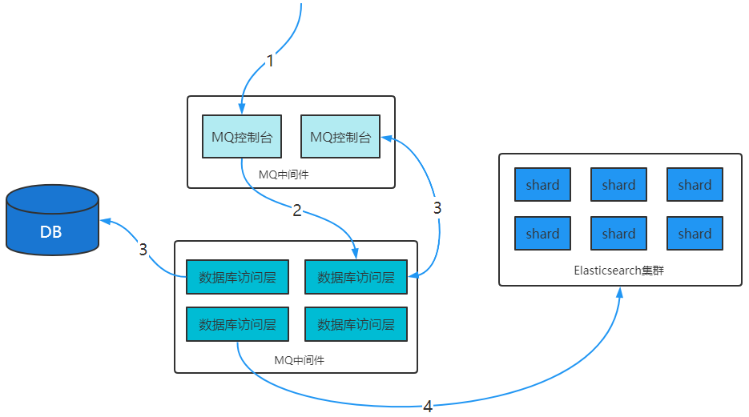

第三部分 Elasticsearch高级应用

# 1 映射高级

## 1.1 地理坐标点数据类型

- 地理坐标点

  地理坐标点是指地球表面可以用经纬度描述的一个点。地理坐标点可以用来计算两个坐标间的距离，还可以判断一个坐标是否在一个区域中。地理坐标点需要显式声明对应字段类型为`geo_point`:

  > 示例

  ```yaml
  PUT /company-locations
  {
    "mappings": {
      "properties": {
        "name": {
          "type": "text"
        },
        "location": {
          "type": "geo_point"
        }
      }
    }
  }
  ```

  

- 经纬度坐标格式

  如上例，`location`字段被声明为`geo_point`后，我们就可以索引包含了经纬度信息的文档了。经纬度信息的形式可以是字符串、数组或者对象。

  ```yaml
  # 字符串形式
  PUT /company-locations/_doc/1
  {
    "name": "NetEase",
    "location": "40.715,74.011"
  }
  # 对象形式
  PUT /company-locations/_doc/2
  {
    "name": "Sina",
    "location": {
      "lat": 40.722,
      "lon": 73.989
    }
  }
  # 数组形式
  PUT /company-locations/_doc/3
  {
    "name": "Baidu",
    "location": [
      73.983,
      40.719
    ]
  }
  ```

  

  **注意**

  字符串形式以保健逗号分隔，如："lat,lon"

  对象形式显式命名为 lat 和 lon

  数组形式表示为 [lon,lat]

- 通过地理坐标点过滤

  有四种地理坐标点相关的过滤器，可以用来选中或者排除文档

  | 过滤器             | 作用                                                         |
  | ------------------ | ------------------------------------------------------------ |
  | geo_bounding_box   | 找出落在指定矩形框中的点                                     |
  | geo_distance       | 找出与指定位置在给定距离内的点                               |
  | geo_distance_range | 找出与指定距离在给定最小距离和最大距离之间的点               |
  | geo_polygon        | 找出落在多边形中的点，**这个过滤器使用代价很大**，<br>当你觉得自己需要使用它，最好先看看[geo-shapes](https://www.elastic.co/guide/cn/elasticsearch/guide/current/geo-shapes.html) |

- geo_bounding_box 查询

  这是目前位置最有效的地理坐标过滤器，因为它计算起来非常简单。你指定一个矩形的顶部，底部，左边界和右边界。然后过滤器只需要判断坐标的经度是否在左右边界之间，纬度是否在上下边界之间

  然后可以使用`geo_bounding_box`过滤器执行以下查询

  ```yaml
  GET /company-locations/_search
  {
    "query": {
      "bool": {
        "must": {
          "match_all": {}
        },
        "filter": {
          "geo_bounding_box": {
            "location": {
              "top_left": {
                "lat": 40.73,
                "lon": 71.12
              },
              "bottom_right": {
                "lat": 40.01,
                "lon": 74.1
              }
            }
          }
        }
      }
    }
  }
  ```

  location这些坐标可以用 bottom_left 和 top_right 来表示。

- geo_distance

  过滤仅包含与地理位置相距特定距离内的匹配文档。假设一下映射和索引文档

  然后可以使用`geo_distance`过滤器执行以下查询

  ```yaml
  GET /company-locations/_search
  {
    "query": {
      "bool": {
        "must": {
          "match_all": {}
        },
        "filter": {
          "geo_distance": {
            "distance": "400km",
            "location": {
              "lat": 40,
              "lon": 70
            }
          }
        }
      }
    }
  }
  ```
  
  
  
  

## 1.2 动态映射

Elasticsearch在遇到文档中以前未遇到的字段，可以使用dynamic mapping（动态映射机制）来确定字段的数据类型并自动把新的字段添加到类型映射。

Elastic的动态映射机制可以进行开关控制，通过设置mappings的dynamic属性，dynamic有如下设置项

- true：遇到陌生字段就执行dynamic mapping处理机制
- false：遇到陌生字段就忽略
- strict：遇到陌生字段就报错

```yaml
# 设置为报错
PUT /user
{
  "settings": {
    "number_of_shards": 3,
    "number_of_replicas": 0
  },
  "mappings": {
    "dynamic": "strict",
    "properties": {
      "name": {
        "type": "text"
      },
      "address": {
        "type": "object",
        "dynamic": true
      }
    }
  }
}

# 插入以下文档，将会报错
# user索引层设置 dynamic是strict，在user层内设置age将报错
# 在address层设置dynamic是true，将动态映射生成字段
PUT /user/_doc/1
{
  "name": "lisi",
  "age": "20",
  "address": {
    "province": "beijing",
    "city": "beijing"
  }
}

PUT /user
{
  "settings": {
    "number_of_shards": 3,
    "number_of_replicas": 0
  },
  "mappings": {
    "dynamic": "true",
    "properties": {
      "name": {
        "type": "text"
      },
      "address": {
        "type": "object",
        "dynamic": true
      }
    }
  }
}
```


## 1.3 自定义动态映射

如果你想在运行时增加新的字段，你可能会启用动态映射。然而，有时候，动态映射规则 可能不太智能。幸运的是，可以通过设置系定义这些规则，以便更好的适用于你的数据。

### 1.3.1 日期检测

当Elasticsearch遇到一个新的字符串字段时，它会检测这个字段是否包含一个可识别的日期，比如 2014-0-01如果它像日期，这个字段就会被作为date类型添加。否则，它会被作为string类型添加。这些时候这个行为可能导致一些问题。假如，你有如下这样的一个文档：<br>{"note":"2014-01-01"}<br>假设这是第一次识别note 字段，它会被添加为 date 字段。但是如果下一个文档像这样：<br>{"note":"Logged out"}<br>这显然不是一个日期，但为时已晚。这个字段已经是一个日期类型，这个不合法的日期，将会造成一个异常。

日期检测可以通过在根对象上设置 date_detection 为 false 来关闭

```yaml
PUT /my_index
{
  "mappings": {
    "date_detection": false # 关闭日期检测
  }
}

PUT /my_index/_doc/1
{
  "note": "2014-01-01"
}

PUT /my_index/_doc/1
{
  "note": "Logged out"
}

```

使用这个映射，字符串将始终作为 string 类型。如果需要一个 date 字段，必须手动添加。

Elasticsearch 判断字符串为日期的规则可以通过 dynamic_date_formats setting 来设置。

```yaml
PUT /my_index
{
  "mappings": {
    "dynamic_date_formats": "MM/dd/yyyy"
  }
}

PUT /my_index/_doc/1
{
  "note": "2014-01-01" # 会以字符串的形式存储
}

# 重建索引后执行，字段类型为 date
PUT /my_index/_doc/2
{
  "note": "01/01/2014"
}
```


### 1.3.2 dynamic templates

使用dynamic_templates 可以完全控制新生成字段的映射，甚至可以通过字段名称或数据类型来应用不同的映射。每个模板都有一个名称，你可以用来描述这个模板的用途，一个 mapping 来指定映射应该怎样使用，以及至少一个参数（如 match）来定义这个模板适用于哪个字段。

模板按照顺序来检测；第一个匹配的模板会被启用，例如，给 string 类型字段定义两个模板：<br>es：以 _es 结尾的字段名需要使用 spanish 分词器。<br>en：所有其他字段使用 english 分词器。<br>将 es 模板放在第一位，因为它比匹配所有字符串字段的 en 模板更特殊：

```yaml
PUT /my_index2
{
  "mappings": {
    "dynamic_templates": [
      {
        "es": {
          "match": "*_es",
          "match_mapping_type": "string",
          "mapping": {
            "type": "text",
            "analyzer": "spanish"
          }
        }
      },
      {
        "en": {
          "match": "*",
          "match_mapping_type": "string",
          "mapping": {
            "type": "text",
            "analyzer": "english"
          }
        }
      }
    ]
  }
}
```

```yaml
PUT /my_index2/_doc/1
{
  "name_es": "testes",
  "name": "es"
}
```

1. 匹配字段名以 _es 结尾的字段
2. 匹配其他所有字符串类型字段

match_mapping_type 允许你应用到特定类型的字段上，就像有标准动态映射规则检测的一样（例如 string 或 long）<br>match 参数只匹配字段名称，*patch_match* 参数匹配字段在对象上的完整路径，所以 address.*.name 将匹配这样的字段

```json
{
  "address": {
    "city": {
      "name": "New York"
    }
  }
}
```


# 2 Query SQL

https://www.elastic.co/guide/en/elasticsearch/reference/7.3/query-dsl.html

Elasticsearch 提供了基于 JSON 的完整查询 DSL（Domain Specific Language 特定域的语言）来定于查询。将查询 DSL 视为查询的 AST（抽象语法树），它由两种子句组成：

- 叶子查询子句

  叶子查询子句 在特定域中寻找特定的值，如 match，term，或 range 查询。

- 复合查询子句

  复合查询子句包装其他叶子查询或复合查询，并用于以逻辑方式组合多个查询（例如 bool 或 dis_max查询），或更改其行为（例如 constant_score查询）。

我们在使用 Elasticsearch 的时候，避免不了使用DSL语句去查询，就像使用关系型数据库的时候要学会 SQL 语法一样。如果学好了 DSL 语法的使用，那么在日后使用和使用 Java Client 调用时候也会变得非常简单。

> 基本语法

```yaml
POST /索引库名/_search
{
  "query": {
    "查询类型": {
      "查询条件":"查询条件值"
    }
  }
}
```

这里的query代表一个查询对象，里面可以有不同的查询属性

- 查询类型：
  - 例如：`match_all`，`match`，`term`，`range`等等
- 查询条件：查询条件会根据类型的不同，写法也会有差异，后面详细讲解

## 2.1 查询所有（match_all_query）

> 示例

```yaml
POST /turbo-company-index/_search
{
  "query": {
    "match_all": {}
  }
}
```

- `query`：代表查询对象
- `match_all`：代表查询所有

> 结果

- took：查询花费时间，单位是毫秒
- time_out：是否超时
- _shards：分片信息
- hints：搜索结果总览对象
  - total：搜索到的总条数
  - max_score：所有结果中文档得分的最高分
  - hits：搜索结果的文档对象数组，每个元素是一条搜索到的文档信息
    - _index：索引库
    - _type：文档类型
    - _id：文档id
    - _score：文档得分
    - _source：文档的元数据

## 2.2 全文搜索（full-text query）

全文搜索能够搜索已分析的文本字段，如：电子邮件正文，商品描述。使用索引期间应用于字段的同一分析器处理查询字符串。全文搜索的分类很多，几个典型的如下：

### 2.2.1 匹配搜索（match query）

全文查询的标准查询，它可以对一个字段进行模糊、短语查询。match queries 接收 text/numerics/dates，对他们进行分词分析，在组织成一个 boolean 查询。可通过 operator 指定 bool 组合操作（or、and 默认是 or）。

现在，索引库中有2部手机，1台电视：

```yaml
PUT /turbo-property
{
  "settings": {},
  "mappings": {
    "properties": {
      "title": {
        "type": "text",
        "analyzer": "ik_max_word"
      },
      "images": {
        "type": "keyword"
      },
      "price": {
        "type": "float"
      }
    }
  }
}

POST /turbo-property/_doc/
{
  "title": "小米电视4A",
  "images": "http://image.turbo.com/12479122.jpg",
  "price": 4288
}
POST /turbo-property/_doc/
{
  "title": "小米手机",
  "images": "http://image.turbo.com/12479622.jpg",
  "price": 2699
}
POST /turbo-property/_doc/
{
  "title": "华为手机",
  "images": "http://image.turbo.com/12479922.jpg",
  "price": 5699
}
```

#### 2.2.1.1 or 关系

`match` 类型查询，会把查询条件进行分词，然后进行查询，多个词条之间是or的关系。

```yaml
POST /turbo-property/_search
{
  "query": {
    "match": {
      "title": "小米电视4A"
    }
  }
}
```

结果

```yaml
{
  "took" : 5,
  "timed_out" : false,
  "_shards" : {
    "total" : 1,
    "successful" : 1,
    "skipped" : 0,
    "failed" : 0
  },
  "hits" : {
    "total" : {
      "value" : 2,
      "relation" : "eq"
    },
    "max_score" : 2.8330114,
    "hits" : [
      {
        "_index" : "turbo-property",
        "_type" : "_doc",
        "_id" : "3m_DSH4BmNQQ3AvLPonA",
        "_score" : 2.8330114,
        "_source" : {
          "title" : "小米电视4A",
          "images" : "http://image.turbo.com/12479122.jpg",
          "price" : 4288
        }
      },
      {
        "_index" : "turbo-property",
        "_type" : "_doc",
        "_id" : "32_DSH4BmNQQ3AvLR4mE",
        "_score" : 0.52354836,
        "_source" : {
          "title" : "小米手机",
          "images" : "http://image.turbo.com/12479622.jpg",
          "price" : 2699
        }
      }
    ]
  }
}
```

在上面的案例中，不仅会查询到电视，而且与小米相关的都会查询到，多个词之间是 `or` 的关系。

#### 2.2.1.2 and 关系

在某些情况下，我们需要更精准查找，希望这个关系变成 `and`，可以这样做：

```CQL
POST /turbo-property/_search
{
  "query": {
    "match": {
      "title": {
        "query": "小米电视4A",
        "operator": "and"
      }
    }
  }
}
```

结果：

```CQL
{
  "took" : 2,
  "timed_out" : false,
  "_shards" : {
    "total" : 1,
    "successful" : 1,
    "skipped" : 0,
    "failed" : 0
  },
  "hits" : {
    "total" : {
      "value" : 1,
      "relation" : "eq"
    },
    "max_score" : 2.8330114,
    "hits" : [
      {
        "_index" : "turbo-property",
        "_type" : "_doc",
        "_id" : "3m_DSH4BmNQQ3AvLPonA",
        "_score" : 2.8330114,
        "_source" : {
          "title" : "小米电视4A",
          "images" : "http://image.turbo.com/12479122.jpg",
          "price" : 4288
        }
      }
    ]
  }
}
```

本例中，只有同时包含 `小米` 和`电视`的词条才会被搜索到。

### 2.2.2 短语搜索（match phrase query）

match_phrase 查询用来对一个字段进行短语查询，可以指定 analyzer，slop 移动因子

```yaml
GET /turbo-property/_search
{
  "query": {
    "match_phrase": {
      "title": "小米电视"
    }
  }
}

GET /turbo-property/_search
{
  "query": {
    "match_phrase": {
      "title": "小米 4A"
    }
  }
}
# slop因子设置
GET /turbo-property/_search
{
  "query": {
    "match_phrase": {
      "title": {
        "query": "小米 4A",
        "slop": 2
      }
    }
  }
}
```


### 2.2.3 query_string 查询

> Query String Query 提供了无需指定某字段而对文档进行匹配查询的一个高级查询，同时可以指定在哪些字段上进行匹配。

```yaml
# 默认
GET /turbo-property/_search
{
  "query": {
    "query_string": {
      "query": "2699"
    }
  }
}
# 指定字段
GET /turbo-property/_search
{
  "query": {
    "query_string": {
      "default_field": "title",
      "query": "2699"
    }
  }

# 逻辑查询
GET /turbo-property/_search
{
  "query": {
    "query_string": {
      "default_field": "title",
      "query": "手机 OR 小米"
    }
  }
}
GET /turbo-property/_search
{
  "query": {
    "query_string": {
      "default_field": "title",
      "query": "手机 AND 小米"
    }
  }
}

# 模糊查询
GET /turbo-property/_search
{
  "query": {
    "query_string": {
      "default_field": "title",
      "query": "大米~1"
    }
  }
}

# 多字段支持
GET /turbo-property/_search
{
  "query": {
    "query_string": {
      "query": "2699",
      "fields": ["title","price"]
    }
  }
}
```


### 2.2.4 多字段匹配搜索（multi match query）

如果你需要在多个字段上进行文本搜索，可用multi_match。multi_match 在 match 的基础上支持多个字段进行文本查询。

```yaml
GET /turbo-property/_search
{
  "query": {
    "multi_match": {
      "query": "2699",
      "fields": ["title","price"]
    }
  }
}
```

还可以使用 * 匹配多个字段：

```yaml
GET /turbo-property/_search
{
  "query": {
    "multi_match": {
      "query": "http://image.turbo.com/12479622.jpg",
      "fields": ["title","ima*"]
    }
  }
}
```


## 2.3 词条级搜索（term-level queries）

可以使用 term-level queries 根据结构化数据中的精确值查找文档。结构化数据的值包括日期范围、IP地址、价格或产品ID。

与全文查询不同，term-level queries 不分析搜索词。相反，词条与存储在字段级别中的术语完全匹配。

```yaml
PUT /turbo_book
{
  "settings": {},
  "mappings": {
    "properties": {
      "description": {
        "type": "text",
        "analyzer": "ik_max_word"
      },
      "name": {
        "type": "text",
        "analyzer": "ik_max_word"
      },
      "price": {
        "type": "float"
      },
      "timestamp": {
        "type": "date",
        "format": "yyyy-MM-dd HH:mm:ss||yyyy-MM-dd||epoch_millis"
      }
    }
  }
}

PUT /turbo_book/_doc/1
{
  "name": "lucene",
  "description": "Lucene Core is a Java library providing powerful indexing and search features, as well as spellchecking, hit highlighting and advanced analysis/tokenization capabilities. The PyLucene sub project provides Python bindings for Lucene Core. ",
  "price": 100.45,
  "timestamp": "2021-08-21 19:11:35"
}

PUT /turbo_book/_doc/2
{
  "name": "solr",
  "description": "Solr is highly scalable, providing fully fault tolerant distributed indexing, search and analytics. It exposes Lucenes features through easy to use JSON/HTTP interfaces or native clients for Java and other languages.",
  "price": 320.45,
  "timestamp": "2021-07-21 17:11:35"
}

PUT /turbo_book/_doc/3
{
  "name": "Hadoop",
  "description": "The Apache Hadoop software library is a framework that allows for the distributed processing of large data sets across clusters of computers using simple programming models.",
  "price": 620.45,
  "timestamp": "2021-08-22 19:18:35"
}

PUT /turbo_book/_doc/4
{
  "name": "ElasticSearch",
  "description": "Elasticsearch是一个基于Lucene的搜索服务器。它提供了一个分布式多用户能力 的全文搜索引擎，基于RESTful web接口。Elasticsearch是用Java语言开发的，并作为Apache许可条 款下的开放源码发布，是一种流行的企业级搜索引擎。Elasticsearch用于云计算中，能够达到实时搜 索，稳定，可靠，快速，安装使用方便。官方客户端在Java、.NET（C#）、PHP、Python、Apache Groovy、Ruby和许多其他语言中都是可用的。根据DB-Engines的排名显示，Elasticsearch是最受欢 迎的企业搜索引擎，其次是Apache Solr，也是基于Lucene。",
  "price": 999.99,
  "timestamp": "2021-08-15 10:11:35"
}
```


### 2.3.1 词条搜索（term query）

term 查询用于查询指定字段包含某个词项的文档

```yaml
POST /turbo_book/_search
{
  "query": {
    "term": {
      "name": "solr"
    }
  }
}
```


### 2.3.2 词条集合搜索（terms query）

term 查询用于查询指定字段包含某些词项的文档

```yaml
GET /turbo_book/_search
{
  "query": {
    "terms": {
      "name": ["elasticSearch","solr"]
    }
  }
}
```


### 2.3.3 范围搜索（range query）

- gte：大于等于
- gt：大于
- lte：小于等于
- lt：小于
- boost：查询权重

```yaml
GET /turbo_book/_search
{
  "query": {
    "range": {
      "price": {
        "gte": 10,
        "lte": 200,
        "boost": 2.0
      }
    }
  }
}

GET /turbo_book/_search
{
  "query": {
    "range": {
      "timestamp": {
        "gte": "now-2y/y",
        "lt": "now/d"
      }
    }
  }
}

GET /turbo_book/_search
{
  "query": {
    "range": {
      "timestamp": {
        "gte": "18/08/2020",
        "lte": "2022",
        "format": "dd/MM/yyyy||yyyy"
      }
    }
  }
}
```


### 2.3.4 不为空搜索（exists query）

查询指定字段值不为空的文档。相当于 SQL 中的 column is not null

```yaml
GET /turbo_book/_search
{
  "query": {
    "exists": {"field": "price"}
  }
}
```


### 2.3.5 词项前缀搜索（prefix query）

```yaml
GET /turbo_book/_search
{
  "query": {
    "prefix": {
      "name": "el"
    }
  }
}
```


### 2.3.6 通配符搜索（wildcard query）

```yaml
GET /turbo_book/_search
{
  "query": {
    "wildcard": {
      "name": "el*h"
    }
  }
}

GET /turbo_book/_search
{
  "query": {
    "wildcard": {
      "name": {
        "value": "lu*",
        "boost": 2
      }
    }
  }
}
```


### 2.3.7 正则搜索（regexp query）

regexp允许使用正则表达式进行term查询，注意 regexp 如果使用不正确，会给服务器带来很严重的性能压力。比如 .* 开头的查询，将会匹配所有的倒排序索引中的关键字，这几乎相当于全表扫描，会很慢。因此如果可以的话，最好在使用正则前，加上匹配的前缀。

```yaml
GET /turbo_book/_search
{
  "query": {
    "regexp": {
      "name": "s.*"
    }
  }
}

GET /turbo_book/_search
{
  "query": {
    "regexp": {
      "name": {
        "value": "s.*",
        "boost": 1.2
      }
    }
  }
}
```


### 2.3.8 模糊搜索（fuzzy query）

```yaml
GET /turbo_book/_search
{
  "query": {
    "fuzzy": {
      "name": "so"
    }
  }
}

GET /turbo_book/_search
{
  "query": {
    "fuzzy": {
      "name": {
        "value": "so",
        "boost": 1.0,
        "fuzziness": 2
      }
    }
  }
}

GET /turbo_book/_search
{
  "query": {
    "fuzzy": {
      "name": {
        "value": "sorl",
        "boost": 1.0,
        "fuzziness": 2
      }
    }
  }
}
```


### 2.3.9 ids搜索（id集合查询）

```yaml
GET /turbo_book/_search
{
  "query": {
    "ids": {
      "type":"_doc",
      "values": ["1","3"]
    }
  }
}

# 使用terms 查询
GET /turbo_book/_search
{
  "query": {
    "terms": {
      "_id": ["1","3"]
    }
  }
}
```


## 2.4 复合搜索（compound query）

### 2.4.1 constant_score query

用来包装成另一个查询，将查询匹配的文档的评分设为一个常值

```yaml
GET /turbo_book/_search
{
  "query": {
    "term": {
      "description": {"value": "solr"}
    }
  }
}
# 固定分数查询
GET /turbo_book/_search
{
  "query": {
    "constant_score": {
      "filter": {
        "term": {
          "description": "solr"
        }
      },
      "boost": 1.2
    }
  }
}
```


### 2.4.2 布尔搜索（bool query）

bool 查询用 bool 操作来组合多个查询子句为一个查询。可用的关键字：

- must：必须满足
- filter：必须满足，但执行的是filter上下文，不参与，不影响评分
- should：或
- must_not：必须不满足，在filter上下文中执行，不参与，不影响评分

```yaml
GET /turbo_book/_search
{
  "query": {
    "bool": {
      "must": {
        "match": {
          "description": "Java"
        }
      },
      "filter": {
        "term": {
          "name": "solr"
        }
      },
      "must_not": {
        "range": {
          "price": {
            "gte": 200,
            "lte": 300
          }
        }
      },
      "minimum_should_match": 1,
      "boost": 1
    }
  }
}
```

minimum_should_match 代表了最小匹配精度，如果设置 minimum_should_match=1，那么should 语句中至少需要一个条件满足。

## 2.5 排序

### 2.5.1 相关性评分排序

默认情况下，返回的结果是按照相关性 进行排序的 —— 最相关的文档排在最前。在本章后面部分，我们会解释相关性 意味着什么以及它是如何计算的，不过让我们首先看看 `sort`参数以及如何使用它。

为了按照相关性来排序，需要将相关性表示为一个数值。在Elasticsearch中，相关性得分 由一个浮点数进行表示，并在搜索结果中通过 `_source` 参数返回，默认排序是 `_source` 降序，按照相关性评分升序排序如下：

```yaml
POST /turbo_book/_search
{
  "query": {
    "match": {
      "description": "solr"
    }
  }
}

POST /turbo_book/_search
{
  "query": {
    "match": {
      "description": "solr"
    }
  },
  "sort": [
    {
      "_score": {
        "order": "asc"
      }
    }
  ]
}
```


### 2.5.2 字段值排序

```yaml
POST /turbo_book/_search
{
  "query": {
    "match_all": {}
  },
  "sort": [
    {
      "price": {
        "order": "desc"
      }
    }
  ]
}
```


### 2.5.3 多级排序

假定我们想要结合使用 price 和 _score（得分）进行查询，并且匹配的结果首先按照价格排序，然后按照相关性得分排序：

```yaml
POST /turbo_book/_search
{
  "query": {
    "match_all": {}
  },
  "sort": [
    {"price": {"order": "desc"}},
    {"timestamp": {"order": "desc"}},
    {"_score": {"order": "desc"}}
  ]
}
```


## 2.6 分页

Elasticsearch中实现分页的语法非常简单：

```yaml
POST /turbo_book/_search
{
  "query": {
    "match_all": {}
  },
  "size": 2,
  "from": 0
}

POST /turbo_book/_search
{
  "query": {
    "match_all": {}
  },
  "sort": [
    {
      "price": {
        "order": "desc"
      }
    }
  ], 
  "size": 2,
  "from": 0
}
```

size：每页显示多少条

from：当前页起始索引，int start=(pageNum-1)*size

## 2.7 高亮

Elasticsearch 中实现高亮的语法比较简单：

```yaml
POST /turbo_book/_search
{
  "query": {
    "match": {
      "name": "elasticsearch"
    }
  },
  "highlight": {
    "pre_tags": "<font color='pink'>",
    "post_tags": "</font>",
    "fields": [{"name":{}}]
  }
}
# 只对 name 字段 高亮
POST /turbo_book/_search
{
  "query": {
    "match": {
      "name": "ElasticSearch"
    }
  },
  "highlight": {
    "pre_tags": "<font color='pink'>",
    "post_tags": "</font>",
    "fields": [{"name":{}},{"description":{}}]
  }
}

POST /turbo_book/_search
{
  "query": {
    "query_string": {
      "query": "elasticSearch"
    }
  },
  "highlight": {
    "pre_tags": "<font color='pink'>",
    "post_tags": "</font>",
    "fields": [{"name":{}},{"description":{}}]
  }
}
```

在使用match查询的同时，加上一个highlight属性：

- pre_tags：前置标签
- post_tags：后置标签
- fields：需要高亮的字段
  - name：这里声明title 字段需要高亮，后面可以为这个字符按设置特有配置，也可以空

结果：

```yaml
{
  "took" : 4,
  "timed_out" : false,
  "_shards" : {
    "total" : 1,
    "successful" : 1,
    "skipped" : 0,
    "failed" : 0
  },
  "hits" : {
    "total" : {
      "value" : 1,
      "relation" : "eq"
    },
    "max_score" : 1.6317781,
    "hits" : [
      {
        "_index" : "turbo_book",
        "_type" : "_doc",
        "_id" : "4",
        "_score" : 1.6317781,
        "_source" : {
          "name" : "ElasticSearch",
          "description" : "Elasticsearch是一个基于Lucene的搜索服务器。它提供了一个分布式多用户能力 的全文搜索引擎，基于RESTful web接口。Elasticsearch是用Java语言开发的，并作为Apache许可条 款下的开放源码发布，是一种流行的企业级搜索引擎。Elasticsearch用于云计算中，能够达到实时搜 索，稳定，可靠，快速，安装使用方便。官方客户端在Java、.NET（C#）、PHP、Python、Apache Groovy、Ruby和许多其他语言中都是可用的。根据DB-Engines的排名显示，Elasticsearch是最受欢 迎的企业搜索引擎，其次是Apache Solr，也是基于Lucene。",
          "price" : 999.99,
          "timestamp" : "2020-08-15 10:11:35"
        },
        "highlight" : {
          "name" : [
            "<font color='pink'>ElasticSearch</font>"
          ],
          "description" : [
            "<font color='pink'>Elasticsearch</font>是一个基于Lucene的搜索服务器。它提供了一个分布式多用户能力 的全文搜索引擎，基于RESTful web接口。",
            "<font color='pink'>Elasticsearch</font>是用Java语言开发的，并作为Apache许可条 款下的开放源码发布，是一种流行的企业级搜索引擎。",
            "<font color='pink'>Elasticsearch</font>用于云计算中，能够达到实时搜 索，稳定，可靠，快速，安装使用方便。",
            "根据DB-Engines的排名显示，<font color='pink'>Elasticsearch</font>是最受欢 迎的企业搜索引擎，其次是Apache Solr，也是基于Lucene。"
          ]
        }
      }
    ]
  }
}
```


## 2.8 文档批量操作（bulk 和 mget）

### 2.8.1 mget 批量查询

单条查询 GET /turbo_book/_doc/1，如果查询多个id的文档一条一条查询，网络开销太大。

```yaml
GET /_mget
{
  "docs": [
    {
      "_index": "turbo_book",
      "_id": 1
    },
    {
      "_index": "turbo-company-index",
      "_id": 1
    }
  ]
}
```

返回：

```yaml
{
  "docs" : [
    {
      "_index" : "turbo_book",
      "_type" : "_doc",
      "_id" : "1",
      "_version" : 1,
      "_seq_no" : 0,
      "_primary_term" : 1,
      "found" : true,
      "_source" : {
        "name" : "lucene",
        "description" : "Lucene Core is a Java library providing powerful indexing and search features, as well as spellchecking, hit highlighting and advanced analysis/tokenization capabilities. The PyLucene sub project provides Python bindings for Lucene Core. ",
        "price" : 100.45,
        "timestamp" : "2020-08-21 19:11:35"
      }
    },
    {
      "_index" : "turbo-company-index",
      "_type" : "_doc",
      "_id" : "1",
      "_version" : 5,
      "_seq_no" : 15,
      "_primary_term" : 1,
      "found" : true,
      "_source" : {
        "name" : "百度",
        "job" : "小度用户运营经理",
        "payment" : "30000",
        "logo" : "https://github.com/turboYuu/image-3654.png"
      }
    }
  ]
}

```

同一索引下批量查询：

```yaml
GET /turbo_book/_mget
{
  "docs": [
    {
      "_id": 1
    },
    {
      "_id": 2
    }
  ]
}
```

搜索简化写法：

```yaml
POST /turbo_book/_search
{
  "query": {
    "ids": {"values": ["1","4"]}
  }
}
```


### 2.8.2 bulk 批量增删改

Bulk 操作解释将文档的增删改查一些列操作，通过一次请求全部做完。减少网络传输次数。

语法：

```yaml
POST /_bulk
{"action": {"metadata"}} 
{"data"}
```

如下操作，删除1，新增5，修改2：

```yaml
POST /_bulk
{"delete":{"_index":"turbo_book","_id":"1"}}
{"create":{"_index":"turbo_book","_id":"5"}}
{"name":"kafka","description":"Kafka","price":100.99,"timestamp": "2021-01-12 10:11:35"}
{"update":{"_index":"turbo_book","_id":"2"}}
{"doc":{"timestamp": "2021-01-12 10:11:35"}}
```

结果：

```yaml
{
  "took" : 52,
  "errors" : false,
  "items" : [
    {
      "delete" : {
        "_index" : "turbo_book",
        "_type" : "_doc",
        "_id" : "1",
        "_version" : 2,
        "result" : "deleted",
        "_shards" : {
          "total" : 2,
          "successful" : 1,
          "failed" : 0
        },
        "_seq_no" : 4,
        "_primary_term" : 1,
        "status" : 200
      }
    },
    {
      "create" : {
        "_index" : "turbo_book",
        "_type" : "_doc",
        "_id" : "5",
        "_version" : 1,
        "result" : "created",
        "_shards" : {
          "total" : 2,
          "successful" : 1,
          "failed" : 0
        },
        "_seq_no" : 5,
        "_primary_term" : 1,
        "status" : 201
      }
    },
    {
      "update" : {
        "_index" : "turbo_book",
        "_type" : "_doc",
        "_id" : "2",
        "_version" : 2,
        "result" : "updated",
        "_shards" : {
          "total" : 2,
          "successful" : 1,
          "failed" : 0
        },
        "_seq_no" : 6,
        "_primary_term" : 1,
        "status" : 200
      }
    }
  ]
}
```

功能：

- delete：删除一个文档，只要1个json就可以，删除的批量操作不需要请求体
- create：相当于强制创建 ，`PUT /index/type/id/_create`
- index：普通的put操作，可以是创建文档，也可以是全量替换文档
- update：执行的是局部更新 partial update 操作

格式：每个json不能换行，相邻json必须换行。

隔离：每个操作互不影响，操作失败的行会返回失败信息


实际用法：bulk请求一次不要太大，否则一下积压到内存中，性能会下降。所以，一次请求几千个操作，大小在几M正好。<br>bulk会将要处理的数据载入内存中，所以数据是有限的，最佳的数据量不是一个确定的数据，它取决于你的硬件，你的文档大小以及复杂性，你的索引以及索引的负载。<br>一般建议是1000-5000个文档，大小建议是5-15MB，默认不能超过100M，可以在es的配置文件（ES的config下的elasticsearch.yml）中配置。

```yaml
http.max_content_length:10mb
```


# 3 Filter DSL

Elasticsearch中的所有查询都会触发相关度得分的计算，对于那些我们不需要相关度得分的场景下，Elasticsearch以过滤器的形式提供了另一种查询功能，过滤器在概念上类似于查询，但是他们有非常快的执行速度，执行速度快主要有以下两个原因：

- 过滤器不会计算相关度的得分，所以它们在计算上更快一些；
- 过滤器可以被缓存到内存中，这使得在重复搜索查询上，其要比相应的查询快出许多。

为了理解过滤器，可以将一个查询（像是 match_all，match，bool等）和一个过滤器结合起来。以范围过滤器为例，它允许通过一个区间的值来过滤文档。这通常被用在数字和日期的过滤上，下面这个例子使用一个被过滤的查询，其返回price值是在200到1000之间（闭区间）的数据。

> 示例

```yaml
POST /turbo_book/_search
{
  "query": {
    "filtered":{
      "query":{
        "match_all":{}
      },
      "filter":{
        "range":{
          "price":{
            "gte":200,
            "lte":1000
          }
        }
      }
    }
  }
}

# 5.0 之后的写法
POST /turbo_book/_search
{
  "query": {
    "bool": {
      "must": {"match_all":{}},
      "filter": {
        "range": {
          "price": {
            "gte": 200,
            "lte": 1000
          }
        }
      }
    }
  }
}
```

分解上面的例子，被过滤的查询包含一个match_all查询（查询部分）和一个过滤器（filter部分）。可以在查询部分中放入其他查询，在 filter 部分放入其他过滤器。在上面的应用场景中，由于所有的在这个范围之内的文档都是平等的（或者说相关度都是一样的），没有一个文档比另一个文档更相关，所以在这个时候使用范围过滤器就非常合适了。通常情况下，要决定是使用过滤器还是使用查询，就需要问自己是否需要相关部分。如果相关度不重要，使用过滤器；否则使用查询。查询和过滤器在概念上类似于 SELECT WHERE 语句。


# 4 定位非法搜索及原因

在开发的时候，可能会写到上百行的查询语句，如果出错的话，找起来很麻烦，Elasticsearch提供了帮助开发人员定位不合法查询 的API ：_validate

> 示例

```yaml
GET /turbo_book/_search?explain
{
  "query": {
    "match1": {
      "name": "kafka"
    }
  }
}
# 使用validate
GET /turbo_book/_validate/query?explain
{
  "query": {
    "match1": {
      "name": "kafka"
    }
  }
}
```

返回结果：

```yaml
{
  "valid" : false,
  "error" : "org.elasticsearch.common.ParsingException: no [query] registered for [match1]"
}
```

在查询时，不小心把`match`写成`match1`，通过 validate api 可以清楚的看到错误原因

正确查询返回：

```yaml
{
  "_shards" : {
    "total" : 1,
    "successful" : 1,
    "failed" : 0
  },
  "valid" : true,
  "explanations" : [
    {
      "index" : "turbo_book",
      "valid" : true,
      "explanation" : "name:kafka"
    }
  ]
}
```


# 5 聚合分析-<font color='red'>重要</font>

## 5.1 聚合介绍

聚合分析是数据库中重要的功能特性，完成对一个查询的数据集中数据的聚合计算，如：找出某字段（或计算表达式的结果）的最大值、最小值、计算和、平均值等。Elasticsearch作为搜索引擎兼数据库，同样提供了强大的聚合分析能力。

对于一个数据集求最大、最小、和、平均值 等指标的聚合，在ES中称为**指标聚合 metric**，而关系型数据库中除了有聚合函数外，还可以对查询出的数据进行分组 group by，再在组上进行指标聚合。在ES中 group by 称为 **分桶，桶聚合 bucketing**。

Elasticsearch聚合分析语法<br>在查询请求体中以 aggregations 节点按如下语法定义聚合分析：

```yaml
"aggregations" : {
   "<aggregation_name>" : { <!--聚合的名字-->
       "<aggregation_type>" : { <!--聚合的类型-->
           <aggregation_body> <!--聚合体：对哪些字段进行聚合-->      
       }
       [,"meta" : {  [<meta_data_body>] } ]? <!--元-->
       [,"aggregations" : { [<sub_aggregation>]+ } ]? <!--在聚合里面在定义子聚合-->
   }
   [,"<aggregation_name_2>" : { ... } ]*<!--聚合的名字--> 
}
```

**说明**：aggregations 也可简写为aggs

## 5.2 指标聚合

- max min sum avg

  > 示例一：查询所有书中最贵的

  ```yaml
  POST /turbo_book/_search
  {
    "size": 0,
    "aggs": {
      "max_price": {
        "max": {
          "field": "price"
        }
      }
    }
  }
  ```

- 文档计数 count

  > 示例：统计price大于100的文档数量

  ```yaml
  POST /turbo_book/_count
  {
    "query": {
      "range": {
        "price": {
          "gt": 100
        }
      }
    }
  }
  ```

- value_count 统计某字段有值的文档数

  ```yaml
  POST /turbo_book/_search?size=0
  {
    "aggs": {
      "price_count": {
        "value_count": {
          "field": "price"
        }
      }
    }
  }
  ```

- cardinality值去重计数 基数

  ```yaml
  POST /turbo_book/_search?size=0
  {
    "aggs": {
      "_id_count": {
        "cardinality": {
          "field": "_id"
        }
      },
      "price_count":{
        "cardinality": {
          "field": "price"
        }
      }
    }
  }
  ```

- state 统计 count max min avg sum 5个值

  ```yaml
  POST /turbo_book/_search?size=0
  {
    "aggs": {
      "price_stats": {
        "stats": {
          "field": "price"
        }
      }
    }
  }
  ```

- Extended stats

  高级统计，比stats多4个统计结果：平方和、方差、标准差、平均值加/减 两个标准差的区间

  ```
  POST /turbo_book/_search?size=0
  {
    "aggs": {
      "price_stats": {
        "extended_stats": {
          "field": "price"
        }
      }
    }
  }
  ```

- Percentiles 占比百分位对应的值统计

  ```
  POST /turbo_book/_search?size=0
  {
    "aggs": {
      "price_percents": {
        "percentiles": {
          "field": "price"
        }
      }
    }
  }
  ```

  指定分位值

  ```
  POST /turbo_book/_search?size=0
  {
    "aggs": {
      "price_percents": {
        "percentiles": {
          "field": "price",
          "percents": [75,99,99.9]
        }
      }
    }
  }
  ```

- Percentiles rank 统计值小于等于指定值的文档占比

  统计price小于 100 和 200 的文档的占比

  ```
  POST /turbo_book/_search?size=0
  {
    "aggs": {
      "gge_perc_rank": {
        "percentile_ranks": {
          "field": "price",
          "values": [100,200]
        }
      }
    }
  }
  ```

  

## 5.3 桶聚合

[Bucket Aggregations](https://www.elastic.co/guide/en/elasticsearch/reference/7.3/search-aggregations-bucket.html)，聚合桶。

它执行的是对文档分组的操作（与sql中的group by类似），把满足相关特性的文档分到一个桶里，即桶分，输出结果往往是一个个包含多个文档的桶（一个桶就是一个group）

bucket：一个数据分组

metric：对一个数据分组执行的统计

```yaml
POST /turbo_book/_search
{
  "size": 0,
  "aggs": {
    "group_by_price": {
      "range": {
        "field": "price",
        "ranges": [
          {
            "from": 100,
            "to": 200
          },
          {
            "from": 200,
            "to": 500
          },
          {
            "from": 600,
            "to": 1000
          }
        ]
      },
      "aggs": {
        "average_price": {
          "avg": {
            "field": "price"
          }
        }
      }
    }
  }
}
```

值的个数统计

```yaml
POST /turbo_book/_search
{
  "size": 0,
  "aggs": {
    "group_by_price": {
      "range": {
        "field": "price",
        "ranges": [
          {
            "from": 100,
            "to": 200
          },
          {
            "from": 200,
            "to": 500
          },
          {
            "from": 600,
            "to": 1000
          }
        ]
      },
      "aggs": {
        "count_price": {
          "value_count": {
            "field": "price"
          }
        }
      }
    }
  }
}
```

实现having效果

```yaml
POST /turbo_book/_search
{
  "size": 0,
  "aggs": {
    "group_by_price": {
      "range": {
        "field": "price",
        "ranges": [
          {
            "from": 100,
            "to": 200
          },
          {
            "from": 200,
            "to": 500
          },
          {
            "from": 600,
            "to": 1000
          }
        ]
      },
      "aggs": {
        "average_price": {
          "avg": {
            "field": "price"
          }
        },
        "having": {
          "bucket_selector": {
            "buckets_path": {
              "avg_price": "average_price"
            },
            "script": {
              "source": "params.avg_price >= 200"
            }
          }
        }
      }
    }
  }
}
```

# 6 Elasticsearch零停机索引重建

## 6.1 说明

Elasticsearch 是一个实时的分布式搜索引擎，为用户提供搜索服务，当我们决定存储某种数据时，在创建索引的时候需要将数据结构完整的确定下来，与此同时索引的设定和很多固定配置将不能改变，当需要改变数据结构时就需要重建索引，为此，Elasticsearch团队提供了辅助工具帮助开发人员进行索引重建。

**零停机完成索引重建的三种方案**：

## 6.2 方案一：外部数据导入方案

> **1 整体介绍**

系统架构设计中，由关系型数据库用来存储数据，Elasticsearch在系统架构里起到查询加速的作用，如果需要索引重建的操作，待系统模块发布新版本后，可从数据库将数据查询出来，重新灌到Elasticsearch即可。

> **2 执行步骤**

建议的功能方案：数据库 + MQ + 应用模块 + Elasticsearch，可以在MQ控制台发送MQ消息来触发重导数据，按批次对数据进行导入，整个过程异步化处理，请求操作示意图如下所示：



> **3 详细操作步骤**

1. 通过MQ的web控制台或cli命令行，发送指定的MQ消息
2. MQ消息被微服务模块的消费者消费，触发ES数据重新导入功能
3. 微服务模块从数据库里查询数据的总数及批次信息，并将每个数据批次的分页信息重新发送给MQ消息，分页信息包含查询条件和偏移量，此MQ消息还是会被微服务的MQ消息接收者处理。
4. 微服务根据接收的查询条件和分页信息，从数据库获取到数据后，根据索引结构的定义，将数据组装成 ES 支持的 JSON 个数，并执行 bulk 命令，将数据发送给Elasticsearch集群。

这样就可以完成索引的重建工作。

> **4 方案特点**

MQ中间件的选型不做具体要求，常见的rabbitmq、activemq、rocketmq等均可。

在微服务模块方面，提供MQ消息处理接口，数据处理模块需要事先开发的，一般是创建新的索引时，配套把重建的功能也一起做好。整体功能共用一个topic，针对每个索引，有单独的结构定义和MQ消息处理tag，代码尽可能复用。处理的批次大小需要根据实际的情况设置。

微服务模块示例会部署多个，数据是分批处理的，批次信息会一次性全部先发给MQ，各个实例处理的数据相互不重叠，利用MQ消息的异步处理机制，可以充分利用并发的优势，加快数据重建的速度。

> **5 方案缺点**

1. 对数据库造成读取压力，短时间内的读操作，会占用数据库的硬件资源，严重时可能引起数据库性能下降
2. 网络带宽占用多，数据毕竟是从一个库传到另一个库，虽说是内网，但大量的数据传输带宽占用也需要注意。
3. 数据重建时间稍长，跟迁移的数据量大小有关。


## 6.3 方案二：基于scroll+bulk+索引别名方案

> 1 整体介绍

利用Elasticsearch自带的一些工具完成索引的重建工作，当然在方案实际落地时，可能也会依赖客户端的一些功能，比如用Java客户端持续的做scroll查询、bulk命名的封装等。数据完全自给自足，不依赖其他数据源。

> **2 执行步骤**

假设原索引名称是book，新的索引名称为book_new，Java客户端使用别名 book_alias 连接 Elasticsearch，该别名指向原索引 book。

1. 若Java客户端没有使用别名，需要给客户端分配一个：`PUT/turbo_book/_alias/turbo_book_alias`

2. 新建索引 `turbo_book_new`，将 mapping 信息，settings 信息等按新的要求全部定义好

3. 使用scroll api 将数据批量查询出来

   为了使用scroll，初始搜索请求应该在查询中指定 `scroll`参数，这可以告诉 Elasticsearch需要保持搜索的上下文环境多久，1m即一分钟。

   ```yaml
   GET /turbo_book/_search?scroll=1m
   {
     "query": {
       "match_all": {}
     },
     "sort": ["_doc"],
     "size": 2
   }
   ```

4. 采用 bulk api 将scroll 查出来的一批数据，批量写入新索引

   ```yaml
   POST /_bulk
   { "index":  { "_index": "turbo_book_new", "_id": "对应的id值" }} 
   { 查询出来的数据值}
   ```

5. 反复执行修改后的步骤3和步骤4，查询一批导入一批，以后可以借助Java Client或其他语言API支持。

   注意做时，需要指定步骤3查询出的 scroll_id，指定后，可以查出对应的下一页文档<br>步骤3和步骤5组合一起是完整的。

   ```yaml
   GET /_search/scroll  {
      "scroll": "1m",
      "scroll_id" : "步骤三中查询出来的值"  # _scroll_id
   }
   ```

6. 切换别名 turbo_book_alias 到新的索引 turbo_book_new 上面，此时 Java 客户端仍然使用别名访问，也不需要修改任何代码，不需要停机。

   ```yaml
   POST /_aliases {
      "actions": [
          { "remove": { "index": "tutbo_book", "alias": "tutbo_book_alias" }},        
          { "add":    { "index": "tutbo_book_new", "alias": "tutbo_book_alias" }}  
      ]
   }
   ```

7. 验证别名查询的是否为新索引的数据


> **3 方案特点**

在数据传输上基本自给自足，不依赖于其他数据源，Java客户端不需要停机等待数据迁移，网络传输占用带宽较小。只是 scroll 查询和 bulk 提交这部分，数据量大时需要依赖一些客户端工具。

> 4 补充一点

在Java客户端或其他客户端访问Elasticsearch集群时，使用别名是一个好习惯。


## 6.4 方案三：Reindex API 方案

Elasticsearch v 6.3.1 已经支持 Reindex API，它对 scroll、bulk做了一层封装，能够对文档重建索引而不需要任何插件或外部工具。

> **1 最基础的命令**

```yaml
POST _reindex
{
  "source": {
    "index": "turbo_book"
  },
  "dest": {
    "index": "turbo_book_new"
  }
}
```

响应结果：

```yaml
{
  "took" : 338,
  "timed_out" : false,
  "total" : 4,
  "updated" : 0,
  "created" : 4,
  "deleted" : 0,
  "batches" : 1,
  "version_conflicts" : 0,
  "noops" : 0,
  "retries" : {
    "bulk" : 0,
    "search" : 0
  },
  "throttled_millis" : 0,
  "requests_per_second" : -1.0,
  "throttled_until_millis" : 0,
  "failures" : [ ]
}
```

注意：如果不手动创建新索引 turbo_book_new 的 mapping 信息，那么Elasticsearch 将启动自动映射模板对数据进行类型映射，可能不是期望的类型，这点要注意。

> **2 version_type 属性**

使用reindex api也是创建快照后再执行迁移的，这样目标索引的数据可能会与原索引有差异，version_type属性可以决定乐观锁并发处理的规则。

reindex api 可以设置 version_type 属性，如下：

```yaml
POST _reindex
{
  "source": {
    "index": "turbo_book"
  },
  "dest": {
    "index": "turbo_book_new",
    "version_type": "internal"
  }
}
```

version_type属性含义如下：

- internal：直接拷贝文档到目标索引，对相同的type，文档ID直接进行覆盖，默认值
- external：迁移文档到目标索引时，保留version信息，对目标索引中不存在的文档进行创建，已存在的文档按version进行更新，遵循乐观锁机制。

> **3 op_type属性 和 conflicts 属性**

如果 op_type 设置为create，那么迁移时只在目标索引中创建ID，不存在的文档，已存在的文档，会提示错误，如下请求：

```yaml
POST _reindex
{
  "source": {
    "index": "turbo_book"
  },
  "dest": {
    "index": "turbo_book_new",
    "op_type": "create"
  }
}
```

有错误提示响应，节选部分：

```yaml
{
  "took": 5,
  "timed_out": false,
  "total": 4,
  "updated": 0,
  "created": 0,
  "deleted": 0,
  "batches": 1,
  "version_conflicts": 4,
  "noops": 0,
  "retries": {
    "bulk": 0,
    "search": 0
  },
  "throttled_millis": 0,
  "requests_per_second": -1,
  "throttled_until_millis": 0,
  "failures": [
    {
      "index": "turbo_book_new",
      "type": "_doc",
      "id": "3",
      "cause": {
        "type": "version_conflict_engine_exception",
        "reason": "[3]: version conflict, document already exists (current version [1])",
        "index_uuid": "Z0NIeM_3Qaydn0dgoF38Cg",
        "shard": "0",
        "index": "turbo_book_new"
      },
      "status": 409
    }
  ]
}
```

如果加上"conflicts":"proceed"配置项，那么冲突信息将不展示，只展示冲突的文档数量，请求和响应结果将变成这样：

请求：

```yaml
POST _reindex
{
  "conflicts": "proceed", 
  "source": {
    "index": "turbo_book"
  },
  "dest": {
    "index": "turbo_book_new",
    "op_type": "create"
  }
}
```

响应：

```yaml
{
  "took" : 6,
  "timed_out" : false,
  "total" : 4,
  "updated" : 0,
  "created" : 0,
  "deleted" : 0,
  "batches" : 1,
  "version_conflicts" : 4,
  "noops" : 0,
  "retries" : {
    "bulk" : 0,
    "search" : 0
  },
  "throttled_millis" : 0,
  "requests_per_second" : -1.0,
  "throttled_until_millis" : 0,
  "failures" : [ ]
}

```


> **4 query支持**

reindex api 支持数据过滤、数据排序、size设置、_source选择等，也支持脚本执行，这里提供一个简单示例：

```yaml
POST _reindex
{
  "size": 100,
  "source": {
    "index": "turbo_book",
    "query": {
      "term": {
        "language": "english"
      }
    },
    "sort": {
      "likes": "desc"
    }
  },
  "dest": {
    "index": "turbo_book_new"
  }
}
```


## 6.5 小结

零停机索引操作的三个方案，从自研功能，scroll + bulk 到 reindex，我们作为 Elasticsearch的使用者，三个方案的参与度是逐渐弱化的，但稳定性却是逐渐上升，我们需要清楚的去了解各个方案的优劣，适宜的场景，然后根据实际的情况去权衡，哪个方案更适合我们的业务模型。


# 7 Elasticsearch Suggester 智能搜索建议

现代的搜索引擎，一般会具备“Suggest As You Type”功能，即在用户输入搜索的过程中，进行自动补全或者纠错。通过协助用户输入更精准的关键词，提高后续全文搜索阶段文档匹配的程度。

类似的功能在Elasticsearch里如何实现呢？答案就在Suggesters API。Suggesters 基本的原作原理是将输入的文本分解为token，然后在索引的字典里面查找相似的term并返回，根据使用场景的不同，Elasticsearch里设计了4种类别的Suggester，分别是：

- Term Suggester
- Phrase Suggester
- Completion Suggester
- Context Suggester

在官方的参考文档里面，对这四种Suggester API 都有比较详细的介绍，下面的案例将在Elasticsearch 7.x 上通过示例讲解Suggester的基础用法，希望能够帮助部分国内开发者快速用于实际项目开发。

## 7.1 Term Suggester

首先看一个**Term  Suggester**的示例：<br>准备一个叫做blogs的索引，配置一个text字段

```yaml
PUT /blogs
{
  "mappings": {
    "properties": {
      "body":{
        "type": "text"
      }
    }
  }
}
```

通过bulk api写入几条文档

```yaml
POST _bulk/?refresh=true
{"index":{"_index":"blogs"}}
{"body":"Lucene is cool"}
{"index":{"_index":"blogs"}}
{"body":"Elasticsearch builds on top of lucene"}
{"index":{"_index":"blogs"}}
{"body":"Elasticsearch rocks"}
{"index":{"_index":"blogs"}}
{"body":"Elastic is the company behind ELK stack"}
{"index":{"_index":"blogs"}}
{"body":"elk rocks"}
{"index":{"_index":"blogs"}}
{"body":"elasticsearch is rock solid"}
```

此时blogs索引里已经有一些文档了，可以进行下一步的探索。为了帮助理解，先看看那些term会存在于词典里。

将输入的文本分析一下：

```yaml
POST _analyze
{
  "text": [
    "Lucene is cool",
    "Elasticsearch builds on top of lucene",
    "Elasticsearch rocks",
    "elk rocks",
    "Elasticsearch is rock solid"
  ]
}
```

这些分析出来的token都会称为词典里的一个term，注意有些token会出现多次，因此在倒排序索引里记录的词频会比较高，同时记录的还有这些token在原文档里的偏移量和相对位置信息。

执行一次suggester搜索看看效果：

```yaml
POST /blogs/_search
{
  "suggest": {
    "my-suggestion": {
      "text": "lucne rock",
      "term": {
        "suggest_mode": "missing",
        "field": "body"
      }
    }
  }
}
```

suggest就是一种特殊类型的搜索，DSL内部的“text”指的是 api 调用方提供的文本，也就是筒仓用户界面上用户输入的内容。这里的lucne是错误的拼写，模拟用户输入错误。"term"表示这是一个term suggester。"field"指定suggest针对的字段，另外有一个可选的"suggest_mode"。范例里的"missing"实际上就是缺省值，它是什么意思....？还是先看看返回结果：

```yaml
{
  "took" : 3,
  "timed_out" : false,
  "_shards" : {
    "total" : 1,
    "successful" : 1,
    "skipped" : 0,
    "failed" : 0
  },
  "hits" : {
    "total" : {
      "value" : 0,
      "relation" : "eq"
    },
    "max_score" : null,
    "hits" : [ ]
  },
  "suggest" : {
    "my-suggestion" : [
      {
        "text" : "lucne",
        "offset" : 0,
        "length" : 5,
        "options" : [
          {
            "text" : "lucene",
            "score" : 0.8,
            "freq" : 2
          }
        ]
      },
      {
        "text" : "rock",
        "offset" : 6,
        "length" : 4,
        "options" : [ ]
      }
    ]
  }
}
```

在返回结果里"suggest" -> "my-suggestion" 部分包含了一个数组，每个数组项对应从输入文本分解出来的 token（存放在"text"这个key里）以及为该token提供的建议词项（存放在options数组里）。示例里返回了"lucne","rock"这2个词的建议项（options），<br>其中"rock"的options是空的，表示没有可以建议的选项，因为我们为查询提供的suggest mode是"missing"，由于"rock"在索引的词典里已经存在了，够精准，就不建议了。只有词典里找不到的词，才会为其提供相似的选项。<br>如果将"suggest_mode"换成"**popular**"会是什么效果？<br>重新执行查询，返回的结果里"rock"这个词的option不再是空的，而是建议为rocks。

```yaml
{
  "took" : 112,
  "timed_out" : false,
  "_shards" : {
    "total" : 1,
    "successful" : 1,
    "skipped" : 0,
    "failed" : 0
  },
  "hits" : {
    "total" : {
      "value" : 0,
      "relation" : "eq"
    },
    "max_score" : null,
    "hits" : [ ]
  },
  "suggest" : {
    "my-suggestion" : [
      {
        "text" : "lucne",
        "offset" : 0,
        "length" : 5,
        "options" : [
          {
            "text" : "lucene",
            "score" : 0.8,
            "freq" : 2
          }
        ]
      },
      {
        "text" : "rock",
        "offset" : 6,
        "length" : 4,
        "options" : [
          {
            "text" : "rocks",
            "score" : 0.75,
            "freq" : 2
          }
        ]
      }
    ]
  }
}
```

回想一下，rock和rocks在索引词典里都是有的，不难看出即使用户输入的token在索引的词典里已经有了，但是因为存在一个词频更高的相似项，这个相似项可能是更合适的，就被挑选到options里了。最后还有一个"**always**" mode，其含义是不管token是否存在于索引词典里都要给出相似项。

有人可能会问，两个term的相似性是如何判断的？ES使用了一种叫做 ***Levenstein edit distance***的算法，其核心思想就是一个词改动多少个字符就可以和另外一个词一致。Term suggester还有其他很多可选参数来控制这个相似性的模糊程度...

## 7.2 Phrase Suggester

**Phrase suggester** 在 Term suggester的基础上，会考量多个term之间的关系，比如是否同时出现在索引的原文里，相邻程度，以及词频等等。看个返利就比较容易明白了：

```yaml
POST /blogs/_search
{
  "suggest": {
    "my-suggestion": {
      "text": "lucne and elasticsear rock",
      "phrase": {
        "field": "body",
        "highlight": {
          "pre_tag": "<em>",
          "post_tag": "</em>"
        }
      }
    }
  }
}
```

返回结果：

```yaml
{
  "took" : 66,
  "timed_out" : false,
  "_shards" : {
    "total" : 1,
    "successful" : 1,
    "skipped" : 0,
    "failed" : 0
  },
  "hits" : {
    "total" : {
      "value" : 0,
      "relation" : "eq"
    },
    "max_score" : null,
    "hits" : [ ]
  },
  "suggest" : {
    "my-suggestion" : [
      {
        "text" : "lucne and elasticsear rock",
        "offset" : 0,
        "length" : 26,
        "options" : [
          {
            "text" : "lucene and elasticsearch rock",
            "highlighted" : "<em>lucene</em> and <em>elasticsearch</em> rock",
            "score" : 0.009113543
          },
          {
            "text" : "lucne and elasticsearch rock",
            "highlighted" : "lucne and <em>elasticsearch</em> rock",
            "score" : 0.006093812
          },
          {
            "text" : "lucene and elasticsear rock",
            "highlighted" : "<em>lucene</em> and elasticsear rock",
            "score" : 0.005325866
          }
        ]
      }
    ]
  }
}
```

options直接返回一个phrase列表，由于加了highlight选项，被替换的term会被高亮。因为lucene和elasticsearch曾经在同一条原文里出现过，同时替换2个term的可信度更高，所以打分较高，排在第一位返回。Phrase suggester有相当多的参数用于控制匹配的模糊程度，需要根据实际应用情况去挑选和调试

## 7.3 Completion Suggester

下面谈一下Completion Suggester，它只要针对的应用场景就是"Auto Completion"。此场景下用户每输入一个字符的时候，就需要即时发送一次查询到后端查找匹配项，在用户输入速度较高的情况下对后端响应速度要求比较苛刻。因此实际上它和前面两个Suggester采用了不同的数据结构，索引并非通过倒排来完成，而是将 analyze 过的数据编码成 FST 和 索引一起存放，对于一个open状态的索引，FST 会被 ES 整个装载到内存里的，进行前缀查找速度极快。***但是 FST 只能用于前缀查找，这也是 Completion Suggester 的局限所在。***

为了使用 Completion Suggester，字段的类型需要专门定义：

```yaml
PUT /blogs_completion
{
  "mappings": {
    "properties": {
      "body": {
        "type": "completion"
      }
    }
  }
}
```

用 bulk API 索引写入数据：

```yaml
POST _bulk/?refresh=true
{"index":{"_index":"blogs_completion"}}
{"body":"Lucene is cool"}
{"index":{"_index":"blogs_completion"}}
{"body":"Elasticsearch builds on top of lucene"}
{"index":{"_index":"blogs_completion"}}
{"body":"Elasticsearch rocks"}
{"index":{"_index":"blogs_completion"}}
{"body":"Elastic is the company behind ELK stack"}
{"index":{"_index":"blogs_completion"}}
{"body":"the elk stack rocks"}
{"index":{"_index":"blogs_completion"}}
{"body":"elasticsearch is rock solid"}
```

查找：

```yaml
POST /blogs_completion/_search?pretty
{
  "size": 0,
  "suggest": {
    "blog-suggest": {
      "prefix": "elastic i",
      "completion": {
        "field": "body"
      }
    }
  }
}
```

结果：

```yaml
{
  "took" : 13,
  "timed_out" : false,
  "_shards" : {
    "total" : 1,
    "successful" : 1,
    "skipped" : 0,
    "failed" : 0
  },
  "hits" : {
    "total" : {
      "value" : 0,
      "relation" : "eq"
    },
    "max_score" : null,
    "hits" : [ ]
  },
  "suggest" : {
    "blog-suggest" : [
      {
        "text" : "elastic i",
        "offset" : 0,
        "length" : 9,
        "options" : [
          {
            "text" : "Elastic is the company behind ELK stack",
            "_index" : "blogs_completion",
            "_type" : "_doc",
            "_id" : "K8qpVn4BrKgruy4eCDYI",
            "_score" : 1.0,
            "_source" : {
              "body" : "Elastic is the company behind ELK stack"
            }
          }
        ]
      }
    ]
  }
}
```

值得注意的一点是Completion Suggester 在原始索引数据的时候也要经过 analyze 阶段，取决于选用的 analyzer 不同，某些词可能被转换，某些词可能被去除，这些会影响 FST 编码结果，也会影响查找匹配的效果。

比如我们删除上面的索引，重新设置索引的mapping，将 analyzer更改为 "english"：

```yaml
PUT /blogs_completion
{
  "mappings": {
    "properties": {
      "body": {
        "type": "completion",
        "analyzer": "english"
      }
    }
  }
}

POST _bulk/?refresh=true
{"index":{"_index":"blogs_completion"}}
{"body":"Lucene is cool"}
{"index":{"_index":"blogs_completion"}}
{"body":"Elasticsearch builds on top of lucene"}
{"index":{"_index":"blogs_completion"}}
{"body":"Elasticsearch rocks"}
{"index":{"_index":"blogs_completion"}}
{"body":"Elastic is the company behind ELK stack"}
{"index":{"_index":"blogs_completion"}}
{"body":"the elk stack rocks"}
{"index":{"_index":"blogs_completion"}}
{"body":"elasticsearch is rock solid"}
```

bulk api 索引同样的数据后，执行下面的查询：

```yaml
POST /blogs_completion/_search?pretty
{
  "size": 0,
  "suggest": {
    "blog-suggest": {
      "prefix": "elastic i",
      "completion": {
        "field": "body"
      }
    }
  }
}
```

居然没有匹配结果了，多么费解！原来我们用的 english analyzer会剥离掉 stop wordji，而 is 就是其中一个，被剥离掉了！

用analyzer api 测试以下：

```yaml
POST _analyze
{
  "text": "elasticsearch is rock solid",
  "analyzer": "english"
}

# 会发现只有3个token:
{
  "tokens" : [
    {
      "token" : "elasticsearch",
      "start_offset" : 0,
      "end_offset" : 13,
      "type" : "<ALPHANUM>",
      "position" : 0
    },
    {
      "token" : "rock",
      "start_offset" : 17,
      "end_offset" : 21,
      "type" : "<ALPHANUM>",
      "position" : 2
    },
    {
      "token" : "solid",
      "start_offset" : 22,
      "end_offset" : 27,
      "type" : "<ALPHANUM>",
      "position" : 3
    }
  ]
}
```

FST（Finite StateTransducers）之编码了这三个token，并且默认的还会记录它们在文档中的文职和分隔符，用户输入"elastic i"进行查找的时候，输入被分解成"elastic"和"i"，FST没有编码这个"i"，匹配失败。

如果你现在哈不够清醒的话，试一下搜索"elastic is"，会发现又有结果，因为这次输入的text经过english analyzer的时候 ***is*** 也被剥离了，只需要在 FST 里查询"elastic"这个前缀，自然就可以匹配到了。

其他能影响 completion suggester 结果的，还有：<br>如"preserve_separators"，"preserve_position_increments" 等等 mapping 参数来控制匹配的模糊程度。以及搜索时可以选用 Fuzzy Queries，使得上面例子里的"elastic i"在使用 english analyzer 的情况下依然可以匹配到结果。

> "preserve_separators":false，这个设置为false，将忽略空格之类的分隔符<br>"preserve_position_increments":true，如果建议词第一个词是停用词，并且我们使用了过滤停用词的分析器，需要将此设置为false.

因此用好 Completion Suggester 并不是一件容易的事，实际应用开发过程中，需要根据数据特性和业务需要，灵活搭配 analyzer 和 mapping 参数，反复调试才能获得理想的补全效果。<br>回到百度搜索框的补全/纠错 功能，如果使用ES怎么实现？我能想到的一个实现方式：在用户刚开始输入的过程中，使用 Completion Suggester 进行关键词前缀匹配，刚开始匹配项会比较多，随着用户输入字符增多，匹配项越来越少。如果用户输入比较精准，可能 Competion Suggester 的结果已经够好，用户已经可以看到理想的备选项了。

如果Completion Suggester 已经到了零匹配，那么猜测是用户输入错误，这时候可以尝试一下 Phrase Suggester。如果Phrase Suggester 没有找到任何 option，开始尝试term suggester 。精准程度上（Precision）看：Completion > Phrase > term，而召回率上（Recall）则反之。从性能上看 Completion Suggester 是最快的，如果能满足业务需求，只用 Completion Suggester 做前缀匹配是最理想的。Phrase 和 Term 由于是做的倒排序索引的搜索，相比较而言性能应该要低不少，应尽量控制 suggester 用到的索引的数据量，最理想的状况是经过一定时间预热后，索引可以全量 map 到内存。

```
召回率（Recall）= 系统检索到的相关文件 / 系统所有线管的文件总数

准确率（Precision）= 系统检索到的相关文件 / 系统所有检索到的文件总数
从一个大规模数据集合中检索文档时，可把文档分成四组：
- 系统检索到的相关文档（A）
- 系统检索到的不相关文档（B）
- 相关但是系统没有检索到的文档（C）
- 不相关且没有被系统检索到的文档（D）
则：
- 召回率R：用实际检索到的相关文档数作为分子，所有相关文档总数作为分母，即 R=A/(A+C)
- 精度P：用实际检索到的相关文档数作为分子，所有检索到的文档总数作为分母，即 P=A/(A+B)

举例：一个数据库有1000个文档，其中有50个文档符合相关定义的问题，系统检索到75个文档，但其中只有45个文档被检索出。
	精度：P=45/75=60%
	召回率：R=45/50=90%
```

## 7.4 Context Suggester

- Completion Suggester 的扩展
- 可以在搜索中假如更多的上下文信息，然后根据不同的上下文信息，对相同的输入，比如"star"，提供不同的建议值，比如：
  - 咖啡相关：Starbucks
  - 电影相关：star wars

# 8 Elasticsearch Java Client

## 8.1 说明

ES 提供多种不同的客户端：

1. TransportClient ES 提供的传统客户端，官方计划 8.0 版本删除此客户端。
2. RestClient，RestClient 是官方推荐使用的，它包括两种：Java Low Level REST Client 和 Java High Level REST Client。ES在 6.0 之后提供 Java High Level REST Client ，两种客户端官方更推荐使用Java High Level REST Client，使用时加入对应版本的依赖即可。

## 8.2 SpringBoot 中使用 RestClient


