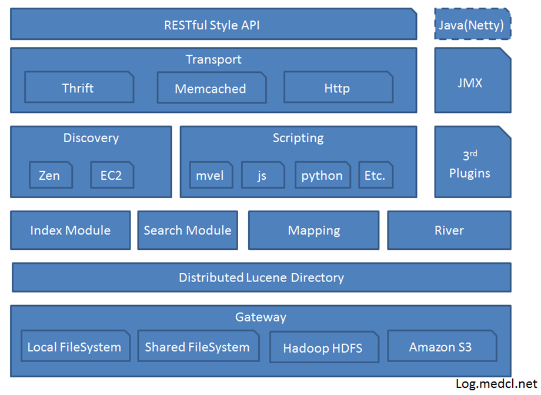
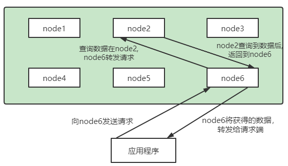
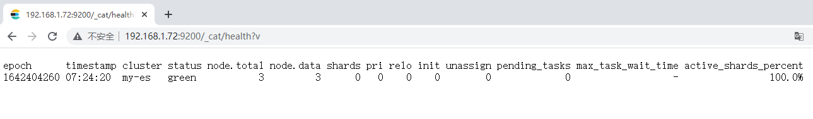

第四部分 Elasticsearch企业级高可用分布式集群

# 1 核心概念

## 1.1 集群（Cluster）

一个Elasticsearch集群由多个节点（Node）组成，每个集群都有一个共同的集群名称作为标识

## 1.2 节点（Node）

- 一个Elasticsearch实例即一个Node，一台机器可以有多个实例，正常使用下每个实例都应该会部署在不同的机器上。Elasticsearch的配置文件中可以通过node.master、node.data来设置节点类型。
- node.master：表示节点是否具有称为主节点的资格
  - true：代表的是有资格竞选主节点
  - false：代表的时没有资格竞选主节点
- node.data：表示节点是否存储数据

- Node 节点组合

  - 主节点 + 数据节点（master + data）默认

    - 节点既有成为主节点的，又存储数据

      ```properties
      node.mater: true
      node.data: true
      ```

    - 数据节点（data）

      节点没有成为主节点的资格，不参与选举，只会存储数据

      ```properties
      node.master: false
      node.data: true
      ```

    - 客户端节点（client）

      不会成为主节点，也不会存储数据，主要是针对海量请求的时候可以进行负载均衡

      ```properties
      node.master: false
      node.data: false
      ```


## 1.3 分片

每个索引有一个或多个分片，每个分片存储不同的数据。分片可分为主分片（primary shard）和复制分片（replica shard），复制分片是主分片的拷贝。默认每个主分片有一个复制分片，每个索引的复制分片数量可以动态调整，复制分片从不与它的主分片在同一个节点上

## 1.4 副本

这里指主分片的副本分片（主分片的拷贝）

```
提高恢复能力：当主分片挂掉时，某个复制分片可以变成主分片
提高性能：get 和 search 请求既可以又主分片又可以由复制分片处理
```


# 2 Elasticsearch分布式架构

Elasticsearch 的架构遵循其基本概念：一个采用Restful API 标准的高扩展性和高可用性的实时数据分析的全文搜索引擎。

## 2.1 特性

- 高扩展性：体现在Elasticsearch添加节点非常简单，新节点无需做复杂的配置，只需要配置好集群信息将会被集群自动发现。
- 高可用性：因为Elasticsearch是分布式的，每个节点都会有备份，所以宕机一两个节点也不会出现问题，集群会通过备份进行自动复盘
- 实时性：使用倒排序索引来建立存储结构，搜索时常在百毫秒内就可完成。

## 2.2 分层



> 第一层 Gateway

Elasticsearch支持的索引快照存储格式，ES 默认是先把索引存放在内存中，当内存满了之后再持久化到本地磁盘。gateway对索引快照进行存储，当Elasticsearch关闭再启动的时候，它就会从这个gateway里面读取索引数据；支持的格式有：本地的 Local FileSystem、分布式的Shared FileSystem、Hadoop的文件系统 HDFS、Amazon（亚马逊）的S3。

> 第二层 Lucene框架

Elasticsearch 基于 Lucene（基于Java开发）框架。

> 第三层 Elasticsearch数据的加工处理方式

Index Module（创建Index模块）、Search Module（搜索模块）、Mapping（映射）、River代表 ES 的一个数据源（运行在Elasticsearch 集群内存的一个插件，主要用来从外部获取异构数据，然后在Elasticsearch里面创建索引；常见的插件有 RabbitMQ River、Twitter River）。

> 第四层 Elasticsearch发现机制、脚本

Discovery 是 Elasticsearch 自动发现节点的机制模块，Zen Discovery 和 EC2 discovery。EC2：亚马逊弹性计算云 EC2 discovery主要在亚马逊云平台中使用。Zen Discovery作用就相当于 solrcloud 中的 zookeeper。<br>zen discovery 从功能上可以分为两部分，<br>第一部分是集群刚启动时的选主，或是新加入集群的节点发现当前集群的Master。<br>第二部分是选主完成后，Master和Follower的相互探活。

Scripting 是脚本执行功能，有这个功能能很方便对查询出来的数据进行加工处理。

3rd Plugins 表示 Elasticsearch支持安装很多第三方的插件，例如 elasticsearch-ik分词插件、elasticsearch-sql sql插件。

> 第五层 Elasticsearch的交互方式

有Thrift、Memcached、Http三种协议，默认的是用Http协议传输

> 第六层 Elasticsearch 的 API 支持模式

Restful Style API 风格的API接口标准是当下十分流行的。Elasticsearch作为分布式集群，客户端到服务端，节点与节点间通信有TCP和Http通信协议，底层实现为Netty框架


## 2.3 解析Elasticsearch的分布式架构

### 2.3.1 分布式架构的透明隐藏特性

Elasticsearch是一个分布式系统，隐藏了复杂的处理机制

分片机制：将文本数切割成n个小份存储在不同的节点上，减少大文件存储在单个节点上对设备带来的压力。

分片副本：在集群中某个节点宕机后，通过副本可以快速最缺失数据进行复盘。


- 集群发现机制（CLuster Discovery）：在当前启动了一个Elasticsearch进程，在启动第二个Elasticsearch进程时，这个进程将作为一个node自动就发现了集群，并自定加入，前提是这些node都必须配置一套集群信息。
- Shard负载均衡：例如现在有 10 个shard（分片），集群中有 三个节点，Elasticsearch会进行均衡分配，以保证每个节点均衡的负载请求。

**扩容机制**

垂直扩容：用新的机器替换已有的机器，服务器台数不变容量增加。

水平扩容：直接增加新机器，服务器台数和容量都增加。

**rebalance**

增加或减少节点是会自动负载


### 2.3.2 主节点

主节点的主要职责是和集群操作相关的内容，如创建或删除索引，跟踪哪些节点是集群的一部分，并决定哪些分片分配给相关的节点。稳定的主节点对集群的健康非常重要。

### 2.3.3 节点对等

每个节点都能接收请求，每个节点接收到请求后都能把该请求路由到有相关数据的其他节点上，接受原始请求的节点负责采集数据并返回给客户端。



# 3 集群环境搭建

搭建1个三个节点的集群服务，为了学习方便，只在一台服务器上来演示主从环境。调整虚拟机内存到 **3g** 以上。

| 操作系统 | 服务器IP      | 端口号 | 是否能成为主节点 |
| -------- | ------------- | ------ | ---------------- |
| centos 7 | 192.168.31.72 | 9200   | 是               |
| centos 7 | 192.168.31.72 | 9201   | 是               |
| centos 7 | 192.168.31.72 | 9202   | 是               |

## 3.1 节点搭建

elasticsearch.yml配置文件说明：

| 配置项                     | 作用                                                         |
| -------------------------- | ------------------------------------------------------------ |
| cluster.name               | 集群名称，相同名称为一个集群                                 |
| node.name                  | 节点名称，集群模式下每个节点名称唯一                         |
| node.master                | 当前节点是否可以被选举为master节点，是：true、否：false      |
| nade.date                  | 当前节点是否用于存储数据，是：true、否：false                |
| path.data                  | 索引数据存放的位置                                           |
| path.logs                  | 日志文件存放的位置                                           |
| bootstrap.memory_lock      | 需求锁住物理内存，是：true、否：false                        |
| network.host               | 监听地址，用于访问该es                                       |
| http.port                  | es对外提供的http端口，默认9200                               |
| transport.port             | 节点选举的通信端口，默认是9300                               |
| discovery.seed_hosts       | es 7.x 之后新增的配置，写入候选主节点的设备地址，在开启服务后可以被选为主节点 |
| cluter.inital_master_nodes | es 7.x 之后新增的配置，初始化一个新的集群时需要此配置来选举master |
| http.cors.enabled          | 是否支持跨域，是：true，在使用head插件时需要此配置           |
| http.cors.allow-origin "*" | 表示支持所有域名                                             |

只需要在之前的基础上，打开配置文件elasticsearch.yml，添加如下配置：

```yaml
cluster.name: my-es   #集群名称         --- 
node.name: node-1 # 节点名称      
node.master: true #当前节点是否可以被选举为master节点，是：true、否：false  --- 
network.host: 0.0.0.0
http.port: 9200
transport.port: 9300    # ---
#初始化一个新的集群时需要此配置来选举master
cluster.initial_master_nodes: ["node-1","node-2","node-3"] 
#写入候选主节点的设备地址         ---
discovery.seed_hosts: ["127.0.0.1:9300", "127.0.0.1:9301","127.0.0.1:9302"] 
http.cors.enabled: true
http.cors.allow-origin: "*"
```

修改完配置文件之后，一定要把之前的**data目录下node数据删除**在重新启动服务即可。

**第二节点配置**：

拷贝原来的ES节点elasticsearch，并命名为 elasticsearch1，并授权：

```shell
cp elasticsearch/ elasticsearch1 -rf
chown -R estest elasticsearch1
```

进入elasticsearch1 目录config文件夹，修改 elasticsearch.yml 配置文件并保存。

```yaml
# 修改node.name 和 http.port transport.port
node.name: node-2
http.port: 9201
transport.port: 9301
```

```shell
# 启动从环境1，一定要用estest用户来执行
cd bin/
./elasticsearch
```

**第三节点配置**：

拷贝第一个节点，并命名为elasticsearch2，并授权：

```shell
cp elasticsearch/ elasticsearch2 -rf
chown -R estest elasticsearch2
```

进入elasticsearch2目录 config文件夹，修改elasticsearch.yml配置文件并保存。

```yaml
# 修改node.name 和 http.port transport.port
node.name: node-3
http.port: 9202
transport.port: 9302
```

```shell
# 启动从环境2，一定要用estest用户来执行
cd bin/
./elasticsearch
```

简单验证

```xml
http://192.168.1.72:9200/_cat/health?v
```



## 3.2 Elasticsearch Head插件介绍及安装 和 验证主从环境

Elasticsearch Head插件介绍及安装

> elasticsearch-head 简介

elasticsearch-head 是一个界面化的集群操作和管理工具，可以对集群进行傻瓜式操作。你可以通过插件把它集成到ES。

es-head 主要有三个方面的操作：

1. 显示集群拓扑，能够快速访问并显示集群的状态，并且能够执行索引和节点级别操作
2. 搜索接口能够查询集群中原始json或表格格式的检索数据
3. 有一个输入窗口，允许任意调用RESTful API。

官方文档：https://github.com/mobz/elasticsearch-head

> elasticsearch-head 安装

安装步骤：

elasticsearch只是后端提供各种api，那么怎么直观的使用它呢？elasticsearch-head将是一款专门针对于 elasticsearch 的客户端工具 elasticsearch-head配置包，下载地址：[https://github.com/mobz/elasticsearch-head](https://github.com/mobz/elasticsearch-head) elasticsearch-head是一个基于node.js的前端工程。

1. nodejs安装

   ```shell
   [root@node2 ~]# wget https://nodejs.org/dist/v10.15.3/node-v10.15.3-linux-x64.tar.xz
   
   ```

   


# 4 集群规划

## 4.1 需要多大规模的集群

## 4.2 集群中的节点角色如何分配

## 4.3 如何避免脑裂问题

## 4.4 索引应该设置多少个分片

## 4.5 分片应该设置几个副本

# 5 分布式集群调优策略

## 5.1 Index(写)调优

## 5.3 Search(读)调优