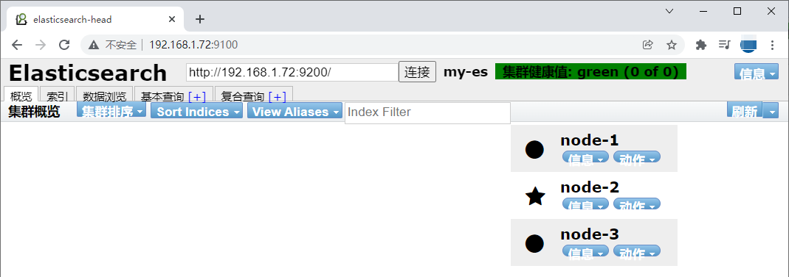

第四部分 Elasticsearch企业级高可用分布式集群

# 1 核心概念

## 1.1 集群（Cluster）

一个Elasticsearch集群由多个节点（Node）组成，每个集群都有一个共同的集群名称作为标识

## 1.2 节点（Node）

- 一个Elasticsearch实例即一个Node，一台机器可以有多个实例，正常使用下每个实例都应该会部署在不同的机器上。Elasticsearch的配置文件中可以通过node.master、node.data来设置节点类型。
- node.master：表示节点是否具有称为主节点的资格
  - true：代表的是有资格竞选主节点
  - false：代表的时没有资格竞选主节点
- node.data：表示节点是否存储数据

- Node 节点组合

  - 主节点 + 数据节点（master + data）默认

    - 节点既有成为主节点的，又存储数据

      ```properties
      node.mater: true
      node.data: true
      ```

    - 数据节点（data）

      节点没有成为主节点的资格，不参与选举，只会存储数据

      ```properties
      node.master: false
      node.data: true
      ```

    - 客户端节点（client）

      不会成为主节点，也不会存储数据，主要是针对海量请求的时候可以进行负载均衡

      ```properties
      node.master: false
      node.data: false
      ```


## 1.3 分片

每个索引有一个或多个分片，每个分片存储不同的数据。分片可分为主分片（primary shard）和复制分片（replica shard），复制分片是主分片的拷贝。默认每个主分片有一个复制分片，每个索引的复制分片数量可以动态调整，复制分片从不与它的主分片在同一个节点上

## 1.4 副本

这里指主分片的副本分片（主分片的拷贝）

```
提高恢复能力：当主分片挂掉时，某个复制分片可以变成主分片
提高性能：get 和 search 请求既可以由主分片又可以由复制分片处理
```


# 2 Elasticsearch分布式架构

Elasticsearch 的架构遵循其基本概念：一个采用Restful API 标准的高扩展性和高可用性的实时数据分析的全文搜索引擎。

## 2.1 特性

- 高扩展性：体现在Elasticsearch添加节点非常简单，新节点无需做复杂的配置，只需要配置好集群信息将会被集群自动发现。
- 高可用性：因为Elasticsearch是分布式的，每个节点都会有备份，所以宕机一两个节点也不会出现问题，集群会通过备份进行自动复盘
- 实时性：使用倒排序索引来建立存储结构，搜索时常在百毫秒内就可完成。

## 2.2 分层


> 第一层 Gateway

Elasticsearch支持的索引快照存储格式，ES 默认是先把索引存放在内存中，当内存满了之后再持久化到本地磁盘。gateway对索引快照进行存储，当Elasticsearch关闭再启动的时候，它就会从这个gateway里面读取索引数据；支持的格式有：本地的 Local FileSystem、分布式的Shared FileSystem、Hadoop的文件系统 HDFS、Amazon（亚马逊）的S3。

> 第二层 Lucene框架

Elasticsearch 基于 Lucene（基于Java开发）框架。

> 第三层 Elasticsearch数据的加工处理方式

Index Module（创建Index模块）、Search Module（搜索模块）、Mapping（映射）、River代表 ES 的一个数据源（运行在Elasticsearch 集群内存的一个插件，主要用来从外部获取异构数据，然后在Elasticsearch里面创建索引；常见的插件有 RabbitMQ River、Twitter River）。

> 第四层 Elasticsearch发现机制、脚本

Discovery 是 Elasticsearch 自动发现节点的机制模块，Zen Discovery 和 EC2 discovery。EC2：亚马逊弹性计算云 EC2 discovery主要在亚马逊云平台中使用。Zen Discovery作用就相当于 solrcloud 中的 zookeeper。<br>zen discovery 从功能上可以分为两部分，<br>第一部分是集群刚启动时的选主，或是新加入集群的节点发现当前集群的Master。<br>第二部分是选主完成后，Master和Follower的相互探活。

Scripting 是脚本执行功能，有这个功能能很方便对查询出来的数据进行加工处理。

3rd Plugins 表示 Elasticsearch支持安装很多第三方的插件，例如 elasticsearch-ik分词插件、elasticsearch-sql sql插件。

> 第五层 Elasticsearch的交互方式

有Thrift、Memcached、Http三种协议，默认的是用Http协议传输

> 第六层 Elasticsearch 的 API 支持模式

Restful Style API 风格的API接口标准是当下十分流行的。Elasticsearch作为分布式集群，客户端到服务端，节点与节点间通信有TCP和Http通信协议，底层实现为Netty框架


## 2.3 解析Elasticsearch的分布式架构

### 2.3.1 分布式架构的透明隐藏特性

Elasticsearch是一个分布式系统，隐藏了复杂的处理机制

分片机制：将文本数切割成n个小份存储在不同的节点上，减少大文件存储在单个节点上对设备带来的压力。

分片副本：在集群中某个节点宕机后，通过副本可以快速对缺失数据进行复盘。


- 集群发现机制（CLuster Discovery）：在当前启动了一个Elasticsearch进程，再启动第二个Elasticsearch进程时，这个进程将作为一个node自动就发现了集群，并自动加入，前提是这些node都必须配置一套集群信息。
- Shard负载均衡：例如现在有 10 个shard（分片），集群中有 三个节点，Elasticsearch会进行均衡分配，以保证每个节点均衡的负载请求。

**扩容机制**

垂直扩容：用新的机器替换已有的机器，服务器台数不变容量增加。

水平扩容：直接增加新机器，服务器台数和容量都增加。

**rebalance**

增加或减少节点是会自动负载


### 2.3.2 主节点

主节点的主要职责是和集群操作相关的内容，如创建或删除索引，跟踪哪些节点是集群的一部分，并决定哪些分片分配给相关的节点。稳定的主节点对集群的健康非常重要。

### 2.3.3 节点对等

每个节点都能接收请求，每个节点接收到请求后都能把该请求路由到有相关数据的其他节点上，接受原始请求的节点负责采集数据并返回给客户端。


# 3 集群环境搭建

搭建1个三个节点的集群服务，为了学习方便，只在一台服务器上来演示主从环境。调整虚拟机内存到 **3g** 以上。

| 操作系统 | 服务器IP      | 端口号 | 是否能成为主节点 |
| -------- | ------------- | ------ | ---------------- |
| centos 7 | 192.168.31.72 | 9200   | 是               |
| centos 7 | 192.168.31.72 | 9201   | 是               |
| centos 7 | 192.168.31.72 | 9202   | 是               |

## 3.1 节点搭建

elasticsearch.yml配置文件说明：

| 配置项                     | 作用                                                         |
| -------------------------- | ------------------------------------------------------------ |
| cluster.name               | 集群名称，相同名称为一个集群                                 |
| node.name                  | 节点名称，集群模式下每个节点名称唯一                         |
| node.master                | 当前节点是否可以被选举为master节点，是：true、否：false      |
| nade.date                  | 当前节点是否用于存储数据，是：true、否：false                |
| path.data                  | 索引数据存放的位置                                           |
| path.logs                  | 日志文件存放的位置                                           |
| bootstrap.memory_lock      | 需求锁住物理内存，是：true、否：false                        |
| network.host               | 监听地址，用于访问该es                                       |
| http.port                  | es对外提供的http端口，默认9200                               |
| transport.port             | 节点选举的通信端口，默认是9300                               |
| discovery.seed_hosts       | es 7.x 之后新增的配置，写入候选主节点的设备地址，在开启服务后可以被选为主节点 |
| cluter.inital_master_nodes | es 7.x 之后新增的配置，初始化一个新的集群时需要此配置来选举master |
| http.cors.enabled          | 是否支持跨域，是：true，在使用head插件时需要此配置           |
| http.cors.allow-origin "*" | 表示支持所有域名                                             |

只需要在之前的基础上，打开配置文件elasticsearch.yml，添加如下配置：

```yaml
cluster.name: my-es   #集群名称 --- 
node.name: node-1 # 节点名称      
node.master: true #当前节点是否可以被选举为master节点，是：true、否：false  --- 
network.host: 0.0.0.0
http.port: 9200
transport.port: 9300    # ---
#初始化一个新的集群时需要此配置来选举master
cluster.initial_master_nodes: ["node-1","node-2","node-3"] 
#写入候选主节点的设备地址         ---
discovery.seed_hosts: ["127.0.0.1:9300", "127.0.0.1:9301","127.0.0.1:9302"] 
http.cors.enabled: true
http.cors.allow-origin: "*"
```

修改完配置文件之后，一定要把之前的**data目录下node数据删除**在重新启动服务即可。

**第二节点配置**：

拷贝原来的ES节点elasticsearch，并命名为 elasticsearch1，并授权：

```shell
cp elasticsearch/ elasticsearch1 -rf
chown -R estest elasticsearch1
```

进入elasticsearch1 目录config文件夹，修改 elasticsearch.yml 配置文件并保存。

```yaml
# 修改node.name 和 http.port transport.port
node.name: node-2
http.port: 9201
transport.port: 9301
```

```shell
# 启动从环境1，一定要用estest用户来执行
cd bin/
./elasticsearch
```

**第三节点配置**：

拷贝第一个节点，并命名为elasticsearch2，并授权：

```shell
cp elasticsearch/ elasticsearch2 -rf
chown -R estest elasticsearch2
```

进入elasticsearch2目录 config文件夹，修改elasticsearch.yml配置文件并保存。

```yaml
# 修改node.name 和 http.port transport.port
node.name: node-3
http.port: 9202
transport.port: 9302
```

```shell
# 启动从环境2，一定要用estest用户来执行
cd bin/
./elasticsearch
```

简单验证

```xml
http://192.168.1.72:9200/_cat/health?v
```


## 3.2 Elasticsearch Head插件介绍及安装 和 验证主从环境

Elasticsearch Head插件介绍及安装

> elasticsearch-head 简介

elasticsearch-head 是一个界面化的集群操作和管理工具，可以对集群进行傻瓜式操作。你可以通过插件把它集成到ES。

es-head 主要有三个方面的操作：

1. 显示集群拓扑，能够快速访问并显示集群的状态，并且能够执行索引和节点级别操作
2. 搜索接口能够查询集群中原始json或表格格式的检索数据
3. 有一个输入窗口，允许任意调用RESTful API。

官方文档：https://github.com/mobz/elasticsearch-head

> elasticsearch-head 安装

安装步骤：

elasticsearch只是后端提供各种api，那么怎么直观的使用它呢？elasticsearch-head将是一款专门针对于 elasticsearch 的客户端工具 elasticsearch-head配置包，下载地址：[https://github.com/mobz/elasticsearch-head](https://github.com/mobz/elasticsearch-head) elasticsearch-head是一个基于node.js的前端工程。

1. nodejs安装

   ```shell
   # 下载
   [root@node2 ~]# wget https://nodejs.org/download/release/v10.15.3/node-v10.15.3-linux-x64.tar.xz
   # 解压
   [root@node2 ~]# tar xf node-v10.15.3-linux-x64.tar.xz
   # 进入解压目录
   [root@node2 ~]# cd node-v10.15.3-linux-x64
   # 执行node命令 查看版本
   [root@node2 node-v10.15.3-linux-x64]# ./bin/node -v
   v10.15.3
   ```

   解压文件的bin目录底下包含了 node、npm等命令，可以使用 ln 命令来设置软连接：

   ```shell
   [root@node2 ~]# ln -s /root/node-v10.15.3-linux-x64/bin/npm /usr/local/bin/
   [root@node2 ~]# ln -s /root/node-v10.15.3-linux-x64/bin/node /usr/local/bin/
   ```

2. phantomjs安装配置

   ```shell
   [root@node2 ~]# cd /usr/local/
   [root@node2 local]# wget https://bitbucket.org/ariya/phantomjs/downloads/phantomjs-2.1.1-linux-x86_64.tar.bz2
   # 注意安装
   [root@node2 ~]# yum install -y bzip2
   [root@node2 local]# tar -jxvf phantomjs-2.1.1-linux-x86_64.tar.bz2
   [root@node2 ~]# vim /etc/profile
   export PATH=$PATH:/usr/local/phantomjs-2.1.1-linux-x86_64/bin
   # 注意环境变量 $PATH 移动在最前面
   [root@node2 ~]# source /etc/profile
   ```

3. elasticsearch-head安装

   ```shell
   [root@node2 ~]# npm install -g grunt-cli
   [root@node2 ~]# npm install grunt
   [root@node2 ~]# npm install grunt-contrib-clean
   [root@node2 ~]# npm install grunt-contrib-concat
   [root@node2 ~]# npm install grunt-contrib-watch
   [root@node2 ~]# npm install grunt-contrib-connect
   [root@node2 ~]# yum -y install git
   [root@node2 local]# git clone git://github.com/mobz/elasticsearch-head.git
   [root@node2 local]# cd elasticsearch-head/
   [root@node2 elasticsearch-head]# npm install -g cnpm --registry=https://registry.npm.taobao.org
   ```

4. elasticsearch-head 发现主机，并连接 。elasticsearch.yml配置文件修改：

   如果之前设置过，可以忽略这一步

   ```yaml
   http.cors.enabled: true
   http.cors.allow-origin:yaml "*"
   ```

5. 启动

   在elasticsearch-head中执行命令

   ```shell
   npm run start
   # 如果启动出错，则把第三步中的依赖再安装一遍
   ```

   

6. 启动完成后，用Elasticsearch head查看，主从环境配置正常。

   

   在kibana中建立下面的索引

   ```yaml
   PUT /turbo-employee-index
   {
     "settings": {},
     "mappings": {
       "properties": {
         "name":{
           "type": "text"
         }
       }
     }
   }
   
   PUT /turbo-company-index
   {
     "settings": {
       "number_of_shards": "2",
       "number_of_replicas": "2"
     },
     "mappings": {
       "properties": {
         "name": {
           "type": "text"
         }
       }
     }
   }
   ```

   

# 4 集群规划

## 4.1 需要多大规模的集群

**需要从以下两个方面考虑**：

1. 当前的数据量有多大？数据增长情况如何？
2. 你的机器配置如何？cpu、内存大小、硬盘大小？

**推算的依据**：

Elasticsearch JVM heap 最大可以设置 32G。

30G heap 大概能够处理的数据量10T。如果内存很大如128G，可以在一台机器上运行多个ES节点实例。

备注：集群规划满足当前数据规模 + 适量增长规模即可，后续可按需扩展。

**两类应用场景**：

A. 用于构建业务搜索功能模块，且多是垂直领域的搜索。数据量级几千万到数十亿级别。一般2-4台机器的规模。

B. 用于大规模的实时OLAP（联机处理分析），经典的如ELK Stack，数据规模可达千亿或更多。几十到上百节点的规模

## 4.2 集群中的节点角色如何分配

**节点角色**：

**Master**

node.master:true 节点可以作为主节点

**DataNode**

node.data:true 默认是数据节点

**Coordinate node** 协调节点，一个节点只作为接受请求、转发请求到其他节点、汇总各个节点返回数据等功能的节点，就叫协调节点，将上两个配置设置为false。<br>说明：一个节点可以充当一个或多个角色，默认三个角色都有。

```
节点角色如何分配：
 A. 小规模集群，不需要严格区分。
 B. 中大规模集群（十个以上节点），应考虑单独的角色充当。特别是并发查询量大，查询的合并量大，可以增加独立的协调点。
角色分开的好处是分工分开，不互影响。如不会因协调角色负载过高而影响数据节点的能力。
```


## 4.3 如何避免脑裂问题

脑裂问题：

一个集群中只有一个A主节点，A主节点因为需要处理的东西太多或网络过于繁忙，从而导致其他从节点ping不通A主节点，这样其他从节点就会认为A主节点不可用，就会重新选出一个新的主节点B。过了一会A主节点恢复正常，这样就会出现了两个主节点，导致一部分数据源于A主节点，另外一部分数据来源于B主节点，出现数据不一致问题，这就是**脑裂**。

6.x 和之前版本 尽量避免脑裂，需要添加最小数量的主节点配置：

**discovery.zen.minimum_master_nodes**:(有master资格节点数/2)+1<br>这个参数控制的是，选举主节点时需要看到最少多少个具有master资格的活节点，才能进行选举。官方的推荐值是(N/2)+1，其中N是具有master资格的节点的数量。

在新版 7.x 的ES中，对ES的集群发现系统做了调整，不在有 `discovery.zen.minimum_master_nodes` 这个控制集群脑裂的配置，转而由集群自主控制，并且新版在启动一个新的集群的时候需要有 cluster.initial_master_nodes 初始化集群列表。

在es7中，discovery.zen.*开头的参数，有些已经失效


```
常用做法（中大规模集群）：
 1. Master 和 dataNode 角色分开，配置奇数个master，如3
 2. 单播发现机制，配置master资格节点（5.0之前）：
 	discovery.zen.ping.multicast.enabled: false --关闭多播发现机制，默认是关闭的
 3. 延长ping master的等待时长
 	discovery.zen.ping_timeout: 30（默认值是3秒） --其他节点ping主节点多久时间没有响应就认为主节点不可用了。
 	es7中换成了 discovery.request_peers_timeout
```


## 4.4 索引应该设置多少个分片

说明：**分片数指定后不可变，除非重建索引**。

分片设置的可参考原则：

Elasticsearch推荐的最大JVM堆空间是30-32G，所以把你的分片最大容量限制为30GB，然后在对分片数量做合理估算。例如，你认为你的数据能达到200GB，推荐你最多分配7到8个分片。<br>在开始阶段，一个好的方案是根据你的节点数量按照1.5~3倍的原则来创建分片，例如：如果你有3个节点，则推荐你创建的分片数最多不超过9（3x3）个。当性能下降时，增加节点，ES会平衡分片的放置。<br>对于基于日期的索引需求，并且对索引数据的搜索场景非常少，也许这些索引量将达到成百上千，但每个索引的数据量只有1GB甚至更小，对于这种类似场景，建议只需要为索引分片1个分片。如日志管理就是一个日期的索引需求，日期碎银会很多，但每个索引存在的存放的日志数据量就很少。

## 4.5 分片应该设置几个副本

副本设置基本原则：

为保证高可用，副本数设置为2即可。要求集群至少要有3个节点，来分开存放主副本、副本。<br>如果发现并发量大时，查询性能会下降，可增加副本数，来提升并发查询能力。

**注意**：新增副本时主节点会自动协调，然后拷贝数据到新增的副本节点，**副本数是可以随时调整的**。

```yaml
PUT /my_temp_index/_settings 
{
  "number_of_replicas": 1 
}
```


# 5 分布式集群调优策略

## 5.1 Index(写)调优

MySQL中的数据快速写入Elasticsearch的几个方面优化

### 5.1.1 副本数置0

如果是集群首次灌入数据，可以将副本数设置为0，写入完毕再调整会去，这样副本分片只需要拷贝，节省了索引过程。

```yaml
PUT /my_temp_index/_settings 
{
  "number_of_replicas": 0
}
```

### 5.1.2 自动生成doc ID

通过Elasticsearch写入流程可以看出，如果写入doc时如果外部指定了id，则Elasticsearch会尝试读取原来doc，以判断是否需要更新。这会涉及一次读取磁盘的操作，通过自动生成doc ID可以避免这个环节。

### 5.1.3 合理设置 mappings

- 将不需要建立索引的字段index属性设置为 not_analyzed或no。对字段不分词，或者不索引，可以减少很多运算操作，降低CPU占用，尤其是binary类型，默认情况下占用CPU非常高，而这种类型进行分词通常没有什么意义。
- 减少字段内容长度，如果原始数据的打断内容无须全部建立索引，则可以尽量减少不必要的内容。
- 使用不同的分析器（analyzer），不同的分析器在索引过程中，运算复杂度也有较大的差异。

### 5.1.4 调整 _source 字段

source字段用于存储doc原始数据，对于部分不需要存储的字段，可以通过 includes excludes过滤，或者将source禁用，一般用于索引和数据分离，这样可以降低 I/O 的压力，不过实际场景中大多数不会禁用_source。

### 5.1.5 对analyzed的字段禁用norms

Norms用于在搜索时计算doc的评分，如果不需要评分，则可以将其禁用：

```yaml
"title": {
   "type": "string",    
   "norms": {
     "enabled": false  
   }
```

### 5.1.6 调整索引的刷新间隔

该参数缺省值是1s，强制ES每秒创建一个新segment，从而保证新写入的数据近实时的可见，可被搜索到。比如该参数被调整到30s，降低了刷新的次数，把刷新操作消耗的系统资源释放出来给index操作使用。

```yaml
PUT /my_index/_settings {
 "index" : {
  "refresh_interval": "30s"     
 }
}
```

这种方案以牺牲可见性的方式，提高了index操作的性能。

### 5.1.7 批处理

批处理把多个index操作请求合并到一个batch中去处理，和mysql的jdbc的batch有类似之处，如图：


比如每批1000个document是一个性能比较好的size。每批中多少document条数合适，受很多因素印象而不同，如单个document的大小等。ES官网建议通过在单个node、单个shard做性能基准测试来确定这个参数的最优值。

### 5.1.8 Document的路由处理

当对一批中的document进行index操作时，该批index操作所需的线程个数由要写入的目的shard的个数决定。看下图：


上图中，有2批document写入ES，每批都需要写入4个shard，所以总共需要8个线程。如果能减少shard的个数，那么耗费的线程个数也会减少，例如下图，两批中每批的shard个数都只有2个，总共线程消耗个数 4 个，减少一半。

默认的routing就是id，也就是在发送请求的时候，手动指定一个routing value，比如说 put /index/doc/id?**routing=user_id**


值得注意的是线程数虽然降低了，但是单批的处理耗时可能增加了。和提高刷新间隔方法类似，这有可能会延长数据不见的时间。


## 5.2 Search(读)调优

在存储的Document条数超过**10亿**条后，如何进行搜索优化。

### 5.2.1 数据分组

很多人用ES存储日志，日志的索引管理方式一般是基于日期的，基于天、周、月、年建索引。如下图，基于 `天` 建索引：


当索引单天的数据，只需要查询一个索引的shard就可以了，当需要查询多天的数据时，需要查询多个索引的shards。这种方案其实和数据量的分表、分库、分区查询方案相比，思路类似，小数据范围查询而不是大海捞针。

开始的方案是建一个index，当数据量增大的时候，就扩容增加index的shard的个数。当shards增大时，要搜索的shards个数随之显著上升。基于数据分组的思路，可以基于client进行数据分组，每一个client只需要依赖自己的index的数据shards进行搜索，而不是所有的数据shards，大大提高了搜索的性能，如下图：


### 5.2.2 使用Filter替代Query

在搜索时使用Query，需要为Document的相关度打分。使用Filter，没有打分环节，做的事情更少，而且filter理论上更快一些。

如果搜索不需要打分，可以直接使用filter查询。如果部分搜索需要打分，建议使用 'bool' 查询。这种方式可以把打分的查询和不打分的查询组合在一起使用，如：

```yaml
GET /_search
{
  "query": {
    "bool": {
      "must": {
        "term": {
          "user": "kimchy"
        }
      },
      "filter": {
        "term": {
          "tag": "tech"
        }
      }
    }
  }
}
```

### 5.2.3 ID字段定义为keyword

一半情况，如果ID字段不会被用作Range类型搜索字段，搜可以定义成keyword类型。这是因为keyword会被优化，以便进行terms查询。Integers等数据类的mapping类型，会被优化来进行range类型搜索。

将integer改成keyword类型之后，搜索性能大约能提升 30%。

### 5.2.4 别让用户的无约束的输入拖累了ES集群的性能

为了不让用户无约束的查询语句拖累ES集群的查询性能，可以限制用户用来查询的keywords。对于可以用来查询的keywords，也可以写成文档来帮助用户更正确的使用。

