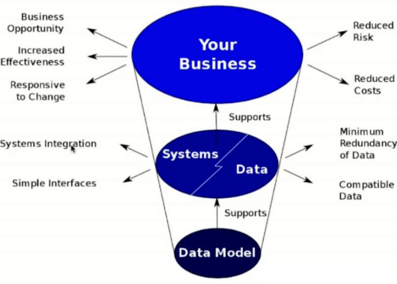
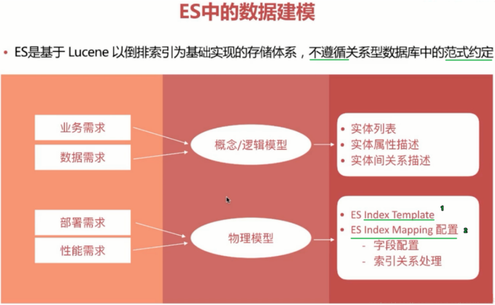
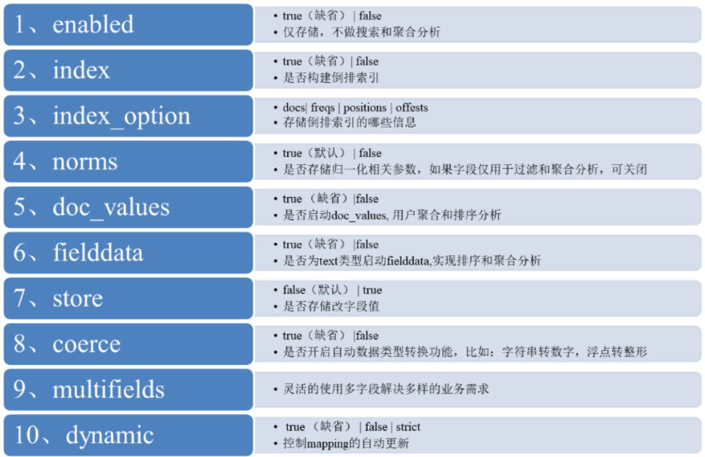
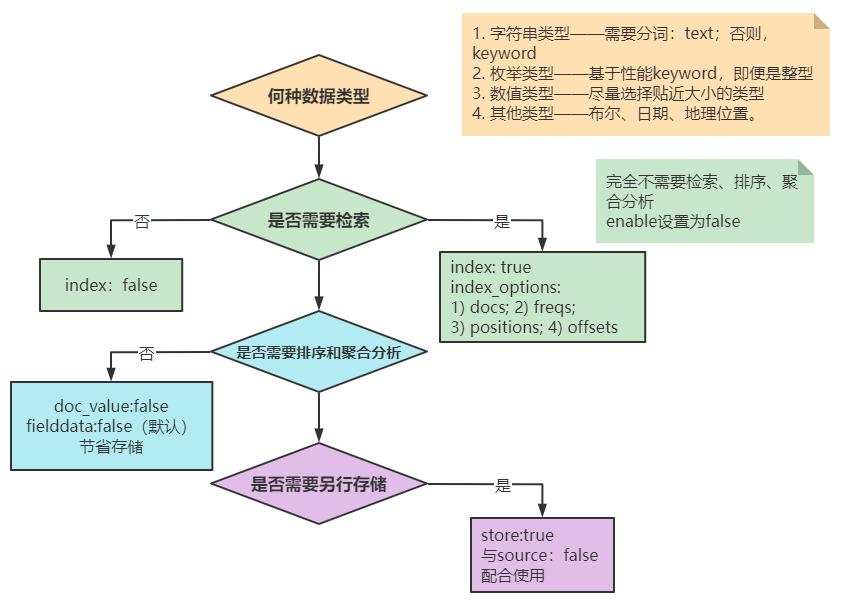

第五部分 Elasticsearch数据模型构建

# 1 什么时数据模型

数据建模是抽象描述现实世界的一种工具和方法，是通过抽象实体及实体之间联系的形式，用图形化的形式去描述业务规则的过程，从而表示现实世界中事物以及相互关系的一种映射。

核心概念：

1. 实体：现实世界中存在的可以相互区分的事物或概念成为实体。

   实体可以分为事物实体和概念实体。例如：一个学生是事物实体。一门课、一个班级等称为概念实体。

2. 实体属性：每个实体都有自己的特征，利用实体的属性可以描述不同的实体。例如：学生实体的属性为姓名、性别、年龄等。

# 2 数据建模的过程

数据建模大致分为三个阶段，概念建模阶段，逻辑建模阶段和物理建模阶段。

1. 概念建模阶段

   主要做三件事：

   - 客户交流
   - 理解需求
   - 形成实体

   确定系统的核心需求和范围边界，设计实体与实体之间的关系。

   在概念建模阶段，只需要关注实体即可，不用关注任何实现细节，很多人希望在这个节点把具体表结构，索引，约束，甚至是存储过程都想好，没必要！因为这些东西是我们在物理建模阶段需要考虑的东西。概念模式在整个数据建模时间占比：10%左右。

2. 逻辑建模阶段

   主要做两件事：

   - 进一步梳理业务需求
   - 确定每个实体的属性、关系和约束等

   逻辑模式是对概念模式的进一步分解和细化，描述了实体、实体属性以及实体之间的关系，是概念模型延申，一半的逻辑模型有第三范式，星型模型和雪花模型。模型的主要元素为主题、实体、实体属性和关系。

   雪花模型和星状模型的主要区别是维度的层级，标准的星状模型只有一层，而雪花模型可能涉及多层。

   逻辑模型的作用主要有两点：

   - 一是 便于技术开发人员和业务人员以及用户进行沟通交流，使得整个概念模型更易于理解，进一步明确需求。
   - 二是作为物理涉及的基础，由于逻辑模型不依赖于具体的数据库实现，使用逻辑模型可以生成针对具体数据库管理系统的物理模型，保证物理模型充分满足用户的需求。

   逻辑模型在整个数据建模时间占比：60-70%左右。

3. 物理建模阶段

   主要做一件事：

   结合具体的数据产品（mysql/oracle/mongo/elasticsearch），在满足业务读写性能等需求的前提下确定最终的定义。

   物理模式是在逻辑模型的基础上描述模型实体的细节，包括数据产品对应的数据类型、长度、索引等因素，为逻辑模型选择一个最有的物理存储环境。

   逻辑模型转化为物理模型的过程也就是实体名转化为表名，属性名转化为物理列名的过程。

   在设计物理模型时，还需要考虑数据存储空间的分配，包括对列属性必须做出明确的定义。

   ```
   例如：客户姓名的数据类型是varchar2，长度是20，存储在Oracle数据库中，并且建立索引用于提高该字段的查询效率。
   物理模型在整个数据建模时间占比：20—30%左右。
   ```

   

# 3 数据建模的意义

如下图所示：



数据建模支撑了系统和数据，系统和数据支撑了业务系统。一个好的数据模型：

- 能让系统更好的集成、能简化接口
- 能简化数据冗余、减少磁盘空间、提升传输效率
- 兼容更多的数据，不会因为数据类型的新增而导致实现逻辑更改
- 能帮助更多的业务机会，提升业务效率
- 能较少业务风险、降低业务成本。

```
举例：借助logstash实现mysql到Elasticsearch的增量同步，如果数据建模阶段没有设计时间戳或者自增ID，就几乎无法实现。
```


# 4 ES数据建模Mapping设置




## 4.1 ES Mapping 属性

https://www.elastic.co/guide/en/elasticsearch/reference/7.3/mapping-params.html




## 4.2 ES Mapping字段设置流程图




## 4.3 ES Mapping样例

```yaml
PUT /blog_index
{
  "mappings": {
    "doc": {
      "_source": {
        "enabled": false
      },
      "properties": {
        "title": {
          "type": "text",
          "fields": {
            "keyword": {
              "type": "keyword",
              "ignore_above": 100
            }
          },
          "store": true
        },
        "publish_date": {
          "type": "date",
          "store": true
        },
        "author": {
          "type": "keyword",
          "ignore_above": 100,
          "store": true
        },
        "abstract": {
          "type": "text",
          "store": true
        },
        "content": {
          "type": "text",
          "store": true
        },
        "url": {
          "type": "keyword",
          "doc_values": false,
          "norms": false,
          "ignore_above": 100,
          "store": true
        }
      }
    }
  }
}
```

这个索引mapping中，_source设置为false，同时各个字段的store根据需求设置了true 和 false。url的doc_value设置为false，该字段url不用于聚合和排序操作。

建mapping时，可以为字符串（专指keyword）指定`ignore_above`，用来限定字符长度。超过`ignore_above`的字符会被存储，但不会被索引。

注意，是字符长度，一个英文字母是一个字符，一个汉字也是一个字符。

在动态生成的 mapping 中，`keyword`类型会被设置`ignore_above: 256`。

`ignore_above`可以在创建 mapping 时指定。

# 5 ES关联关系处理

目前ES主要有以下4中常用的方法来处理数据实体间的关联关系：

## 5.1 Application-side joins

这种方式，索引之间完全独立（利于对数据进行标准化处理），由应用端的多次查询来实现近似关联关系查询。这种方法适用于关联的实体只有少量的文档记录的情况（使用ES 的terms 查询具有上限，默认 1024，具体可在elasticsearch.yml中修改），并且最好它们很少改变。这将允许应用程序对结果进行缓存，并避免经常运行第一次查询。

```yaml
PUT /user/_doc/1
{
  "name": "John Smith",
  "email": "john@smith.com",
  "dob": "1970/10/24"
}
PUT /blogpost/_doc/2
{
  "title": "Relationships",
  "body": "It's complicated...",
  "user": 1
}

GET /user/_search
{
  "query": {
    "match": {
      "name": "John"
    }
  }
}

GET /blogpost/_search
{
  "query": {
    "terms": {
      "user": [1]
    }
  }
}
```

## 5.2 Data denormalization (数据的非规范化)

这种方式，通俗点就是通过字段冗余，以一张大宽表来实现粗粒度的index，这样可以充分发挥扁平化的优势。但是这是以牺牲索引性能及灵活度为代价的。使用前提：冗余的字段应该是很少改变的，比较适合于一对少量关系的处理。当业务数据库并非采用非规范化设计时，这时要将数据同步到作为二级索引库的ES中，就需要进行定制化开发，基于特定业务进行应用开发来处理 join 关联和实体拼接。

说明：宽表处理 在处理一对多，多对多关系时，会有字段冗余问题，适合“一对少量”且这个“一”更新不频繁的应用场景。

```yaml
PUT /user/_doc/1
{
  "name": "John Smith",
  "email": "john@smith.com",
  "dob": "1970/10/24"
}

PUT /blogpost/_doc/2
{
  "title": "Relationships",
  "body": "It's complicated...",
  "user": {
    "id": 1,
    "name": "John Smith"
  }
}
GET /blogpost/_search
{
  "query": {
    "bool": {
      "must": [
        { "match": { "title": "relationships" }},
        { "match": { "user.name": "John" }}
      ]
    }
  }
}
```

## 5.3 Nested objects (嵌套文档)

索引性能和查询性能二者不可兼得，必须进行取舍。嵌套文档将实体关系嵌套组合在单文档内部，这种方式牺牲建立索引性能（文档内任一属性变化都需要重新索引该文档）来换取查询性能，比较适合于一对少量的关系处理。

当使用嵌套文档时，使用普通的查询方式是无法访问到的。必须使用合适的查询方式（nested query、nested filter、nested facet等），很多场景下，使用嵌套文档的复杂度在于索引阶段对关联关系的组织拼装。

```yaml
PUT /drivers
{
  "mappings": {
    "properties": {
      "driver": {
        "type": "nested",
        "properties": {
          "last_name": {
            "type": "text"
          },
          "vehicle": {
            "type": "nested",
            "properties": {
              "make": {
                "type": "text"
              },
              "model": {
                "type": "text"
              }
            }
          }
        }
      }
    }
  }
}
```

```yaml
PUT /drivers/_doc/1
{
  "driver": {
    "last_name": "McQueen",
    "vehicle": [
      {
        "make": "Powell Motors",
        "model": "Canyonero"
      },
      {
        "make": "Miller-Meteor",
        "model": "Ecto-1"
      }
    ]
  }
}

PUT /drivers/_doc/2?refresh 
{
  "driver": {
    "last_name": "Hudson",
    "vehicle": [
      {
        "make": "Mifune",
        "model": "Mach Five"
      },
      {
        "make": "Miller-Meteor",
        "model": "Ecto-1"
      }
    ]
  }
}
```

```yaml
GET /drivers/_search
{
  "query": {
    "nested": {
      "path": "driver",
      "query": {
        "nested": {
          "path": "driver.vehicle",
          "query": {
            "bool": {
              "must": [
                {
                  "match": {
                    "driver.vehicle.make": "Powell Motors"
                  }
                },
                {
                  "match": {
                    "driver.vehicle.model": "Canyonero"
                  }
                }
              ]
            }
          }
        }
      }
    }
  }
}
```

## 5.4 Parent/child relationships (父子文档)

父子文档牺牲了一定的查询性能来换取索引性能，适用于写多读少的场景。父子文档相比嵌套文档比较灵活，适用于"一对大量" 且这个 “一” 不是海量的应用场景，该方式比较耗内存和CPU，这种方式查询比嵌套方式慢 5-10倍，且需要使用特定的 has_parent 和 has_child 过滤器查询语法，查询结果不能同时返回父子文档（一次 join 查询只能返回一种类型的文档）。受限于父子文档必须在同一分片上（可以通过routing指定父文档 id 即可）操作子文档时需要指定routing。

```yaml
PUT /my_index
{
  "mappings": {
    "properties": {
      "my_join_field": {
        "type": "join",
        "relations": {
          "question": "answer"
        }
      }
    }
  }
}

# 插入父文档
PUT /my_index/_doc/1?refresh 
{
  "text": "This is a question",
  "my_join_field": {
    "name": "question"
  }
}
PUT /my_index/_doc/2?refresh 
{
  "text": "This is a question2",
  "my_join_field": "question"
}

# 插入子文档
PUT /my_index/_doc/3?routing=1 
{
  "text": "This is an answer",
  "my_join_field": {
    "name": "answer",
    "parent": "1"
  }
}
```

查询哪个文档有子文档：

```yaml
POST my_index/_search
{
  "query": {
    "has_child": {
      "type": "answer",
      "query": {
        "match": {
          "text": "this"
        }
      }
    }
  }
}
```

根据父文档id 查询子文档：

```yaml
GET my_index/_search
{
  "query": {
    "parent_id": {
      "type": "answer",
      "id": "1"
    }
  }
}
```

