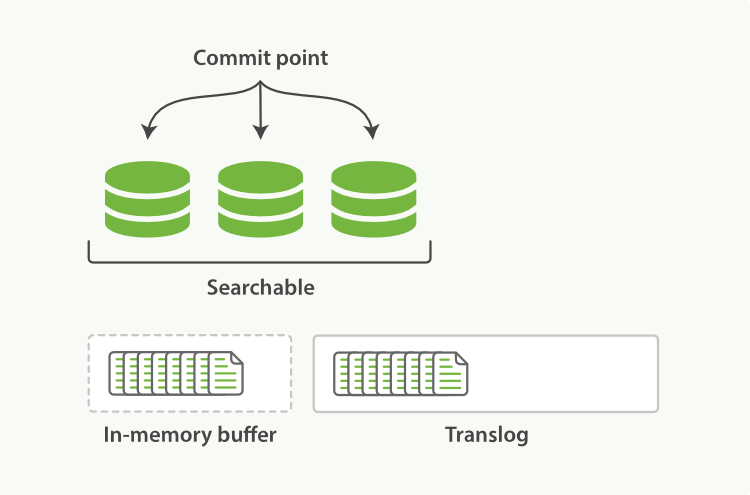
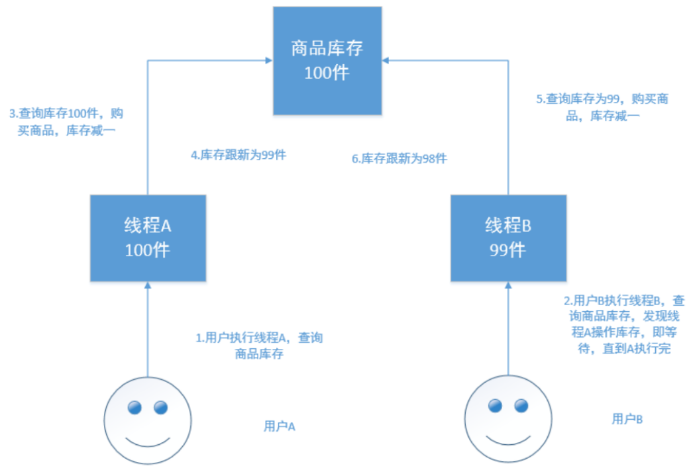

第七部分 Elasticsearch深度应用及原理剖析

[Elasticsearch: 权威指南](https://www.elastic.co/guide/cn/elasticsearch/guide/current/index.html)

# 1 索引文档写入和近实时搜索原理

## 1.1 基本概念

### 1.1.1 Segment in Lucene

众所周知，Elasticsearch 存储的基本单元是`shard`，ES 中一个 Index 可能分为多个 shard，事实上每个shard都是一个 Lucene的 Index ，并且每个 Lucene Index 由多个`segment`组成，每个Segment事实上是一些倒排序索引的集合，每次创建一个新的`Document`，都会归属于一个新的 Segment，而不会去修改原来的Segment。且每次的文档删除操作，会仅仅标记 Segment 中该文档为删除状态，而不会真正的立马物理删除，所以说 ES 的 index 可以理解为一个抽象的概念，就像下图所示：


### 1.1.2 Commits in Lucene

Commit 操作意味着将Segment 合并，并写入磁盘。保证内存数据尽量不丢失。但是刷盘是很重的 IO 操作，索引为了机器性能和近实时搜索，并不会刷盘那么及时。

### 1.1.3 Translog

新文档被索引意味着文档会被首先写入内存 buffer 和 translog 文件。每个 shard 都对应一个 translog 文件。


### 1.1.4 Refresh in Elasticsearch

在Elasticsearch中，`_refresh`操作默认每秒执行一次，意味着将内存 buffer 的数据写入到一个新的 Segment 中，这个时候索引变成了可被检索的。写入新Segment后，会清空内存buffer。


### 1.1.5 Flush in Elasticsearch

`Flush`操作意味着将内存 buffer 的数据全部都写入新的 Segments 中，并将内存中所有的 Segments 全部刷盘，并且清空 translog 日志的过程。


## 1.2 近实时搜索

[近实时搜索-官网参考](https://www.elastic.co/guide/cn/elasticsearch/guide/current/near-real-time.html)

提交（Commiting）一个新的段到磁盘需要一个 `fsync` 来确保段被物理性的写入磁盘，这样在断电的时候就不会丢失数据。但是`fsync`操作代价很大；如果每次索引一个文档都去执行一次的话会造成很大的性能问题。

我们需要的是一个更轻量的方式来使一个文档可被搜索，这意味着 `fsync` 要从整个过程中被移除。

在Elasticsearch 和 磁盘之间是文件系统缓存。像之前描述的一样，在内存索引缓冲区中的文档会被写入到一个**新的段**（文件系统缓存中的结构）中。**但是这里新段会被先写入到文件系统缓存**——这一步代价会比较低，稍后再被刷新到磁盘——这一步代价比较高。不过只要文件已经在系统缓存中，就可以像其他文件一样被打开和读取了。

**在内存缓冲区中包含了新文档的Lucene索引**：


Lucene 允许新段被写入和打开——使其包含的文档在未进行一次完整提交时便对搜索可见。这种方式比进行一次提交代价要小得多，并且在不影响性能的前提下可以被频繁的执行。

**缓冲区的内容已经被写入一个可被搜索的段中，但还没有进行提交**：


### 1.2.1 原理

下图表示是 es 写操作流程，当一个写请求发送到 es 后，es将数据写入 `memory buffer`中，并添加事务日志（`translog`）。如果每次一条数据写入内存后立即写到硬盘文件上，由于写入的数据肯定是离散的，因此写入硬盘的操作也就是随机写入。硬盘随机写入的效率相当低，会严重降低 es 的性能。

因此 es 在设计时`memory buffer`和硬盘间加入了 Linux 的高速缓存（`File system cache`）来提高 es 的写效率。

当写请求发送到 es 后，es将数据暂时写入`memory buffer`中，此时写入的数据还不能被查询到。默认设置下，es 每1秒钟 将 `memory buffer`中的数据 `refresh`到 Linux的 `File system cache`，并清空`memory buffer`，此时写入的数据就可以被查询到了。


### 1.2.2  refresh API

在Elasticsearch中，写入和打开一个新段的轻量的过程叫做*refresh*。默认情况下每个分片每秒自动刷新一次。这就是为什么我们说 Elasticsearch 是 **近**实时搜索：文档的变化并不是立即对搜索可见，但会在一秒之内变为可见。

这性行为可能会对新用户造成困惑：他们索引了一个文档然后尝试搜索它，但是没有搜到。这个问题的解决办法使用`refresh` API执行一次手动刷新：

```yaml
1. POST  /_refresh
2. POST  /my_blogs/_refresh
3. PUT   /my_blogs/_doc/1?refresh 
   {"test": "test"}
   PUT /test/_doc/2?refresh=true 
   {"test": "test"}
```

1. 刷新（Refresh）所有的索引
2. 只刷新（Refresh）`my_blogs`索引
3. 只刷新 文档

并不是所有的情况都需要每秒刷新。可能你正在使用 Elasticsearch 索引大量的日志文件，你可能想优化索引速度而不是近实时搜索，可以通过设置`refresh_interval`，降低每个索引的刷新频率。

```yaml
PUT /my_logs
{
  "settings": {
    "refresh_interval": "30s" 
  }
}
```

`refresh_interval`可以在既存索引上进行动态更新。在生产环境中，当你正在建立一个大的新索引时，可以先关闭自动刷新，待开始使用索引时，再把它们调回来：

```yaml
PUT /my_logs/_settings
{ "refresh_interval": -1 } 

PUT /my_logs/_settings
{ "refresh_interval": "1s" } 
```


## 1.3 持久化变更

[持久化变更-官网参考](https://www.elastic.co/guide/cn/elasticsearch/guide/current/translog.html)

### 1.3.1 原理

如果没有用`fsync`把数据从文件系统缓存 刷（flush）到硬盘，不能保证数据在断电甚至是程序正常退出之后依然存在。为了保证 Elasticsearch 的可靠性，需要确保数据变化被持久化到磁盘。

在 [动态更新索引]()，我们说一次完整的提交会将段刷到磁盘，并写入一个包含所有段列表的提交点。Elasticsearch 在启动或重新打开一个索引的过程中 ***使用这个提交点来判断哪些段隶属于当前分片***。

即使通过每秒刷新（refresh）实现了近实时搜索，我们仍然需要经常进行完整提交来确保能从失败中恢复。但是两次提交之间变化的文档怎么办？我们也不希望丢失这些数据。

Elasticsearch 增加了一个 *translog*，或者叫事务日志，在每一次对 Elasticsearch 进行操作时均进行了日志记录。通过 translog，整个流程看起来是下面这样：

1. 一个文档被索引之后，就会被添加到内存缓冲区，并且追加到了 translog，如下图：

   

2. 刷新（refresh）使分片处于 ”刷新（refresh）完成后，缓存被清空但是事务日志不会“ 的状态，分片每秒被刷新（refresh）一次：

   - 这些在内存缓冲区的文档被写入到一个新的段中，且没有进行`fsync`操作。
   - 这个段被打开，使其可被搜索
   - 内存缓冲区被清空

   

3. 这个进程继续工作，更多的文档被添加到内存缓冲区和追加到事务日志（见下图：事务日志不断积累文档）。

   

4. 每隔一段时间——例如 translog 变得越大——索引被刷新（flush）；一个新的 translog 被创建，并且一个全量提交被执行（见下图：在刷新（flush）之后，段被全量提交，并且事务日志被清空）：

   - 所有在内存缓冲区的文档都被写入一个新的阶段
   - 缓冲区被清空
   - 一个提交点被写入硬盘
   - 文件系统缓存通过`fsync`被刷新（flush）
   - 老的 translog 被删除

   translog 提供所有还没有被刷到磁盘的操作的一个持久化记录。当Elasticsearch启动的时候，它会从磁盘中使用最后一个提交点去恢复已知的段，并且会重放 translog 中所有在最后一次提交后发生的变更操作

   translog 也被用来提供实时 CRUD。当你试着通过 ID 查询、更新、删除一个文档，它会在尝试从相应的段中检索之前，首先检查 translog 任何最近的变更。这意味着它总是能够实时地获取到文档的最新版本。

   ***在刷新（flush）之后，段被全量提交，并且事务日志被清空***

   

### 1.3.2 flush API

这个 执行一个提交并且截断 translog 的行为在 Elasticsearch 被称为一次 *flush*。分片每30分钟被自动刷新（flush），或者在 translog 太大的时候也会被刷新。

`flush` API 可以被用来执行一个手工的刷新（flush）：

```yaml
1. POST /blogs/_flush
2. POST /_flush?wait_for_ongoin
```

1. 刷新（flush）`blogs`索引
2. 刷新（flush）所有索引并且等待所有刷新在返回前完成

很少需要自己动手执行`flush` 操作；通常情况下，自动刷新就够了。

这就是说，在重启节点或关闭索引之前执行 <font color='blue'>flush</font> 有益于你的索引。当 Elasticsearch 尝试恢复或重新打开一个索引，它需要重放 translog 中的所有操作，如果日志越短，恢复越快。

> **Translog 有多安全？**
>
> translog 的目的是保证操作不会丢失。这引出了这个问题：Translog 有多安全？
>
> 在文件被 `fsync` 到磁盘前，被写入的文件在重启之后就丢失了。默认 translog 是每5秒被 `fsync` 刷新到硬盘，或者在每次写请求完成之后执行（e.g. index, delete, update, bulk）。这个过程在主分片和复制分片都会发生。最终，基本上，这意味着在整个请求被 `fsync` 到主分片和复制分片的 translog 之前，你的客户端不会得到一个 200 OK 响应。
>
> 在每次请求后都执行一个 fsync 会带来一些性能损失，尽管实践表明这种损失相对较小（特别是 bulk 导入，它在一次请求中平摊了大量文档的开销）。
>
> 但是对于一些大容量的偶尔丢失几秒数据问题也并不严重的集群，使用异步的 fsync 还是比较有益的。比如，写入的数据被缓存到内存中，再每5秒执行一次 `fsync`。
>
> 这个行为可以通过设置`durability` 参数为 `async` 来启用：
>
> ```yaml
> PUT /my_index/_settings 
> {
>  "index.translog.durability":  "async", 
>  "index.translog.sync_interval":  "5s"
> }
> ```
>
> 这个选项可以针对索引单独设置，并且可以动态进行修改。如果你决定使用异步 translog 的话，你需要保证在发生 crash 时，丢掉 `sync_interval`时间段的数据也无所谓。请在决定前知晓这个特性。
>
> 如果你不确定这个行为的后果，最好使用默认参数（`"index.translog.sync_interval" : "request"`）来避免数据丢失。

# 2 索引文档存储段合并机制（segment merge、policy、optimize）

[段合并-官网参考](https://www.elastic.co/guide/cn/elasticsearch/guide/current/merge-process.html)

## 2.1 段合并机制

由于自动刷新流程每秒会创建一个新的段，这样会导致短时间内的段数量暴增。而段数目太多会带来较大的麻烦。每一段都会消耗文件句柄、内存和CPU运行周期。更重要的是，每个搜索请求都必须轮流检查每个段；所以段越多，搜索也就越慢。

Elasticsearch 通过在后台进行段合并来解决这个问题。小的段被合并到大的段，然后这些大的段再被合并到更大的段。段合并的时候会将那些旧的已删除文档 从文件系统中清除。被删除的文档（或被更新文档的旧版本）不会被拷贝到新的大段中。

启动段合并会在进行索引和搜索时自动进行。这个流程如下图：

1. 当索引的时候，刷新（refresh）操作会创建新的段并将段打开以供搜索使用

2. 合并进程选择一小部分大小相似的段，并且在后台将他们合并到更大的段中。这并不会中断索引和搜索。

   

3. 合并完成时的活动：

   - 新的段被刷新（flush）到磁盘。写入一个包含新段且排除旧的和较小的段的新提交点。
   - 新的段被打开用来搜索。
   - 老的段被删除

   ***一旦合并结束，老的段被删除***

   

   合并大的段需要消耗大量的 I/O 和 CPU 资源，如果任其发展会影响搜索性能。Elasticsearch 在默认情况下会对合并流程进行资源，所以搜索仍然有足够的资源很好的执行。

   默认情况下，归并线程的限速配置 indices.store.throttle.max_bytes_per_sec 是 20MB。对于写入量较大，磁盘转速较高，甚至使用 SSD 盘的服务器来说，可以考虑提高到100-200MB/s。

   ```yaml
   PUT /_cluster/settings 
   {
      "persistent" : {
          "indices.store.throttle.max_bytes_per_sec" : "100mb"  }
   }
   ```

   用于控制归并线程的数目，推荐设置为 cpu 核心数的一半，如果觉得自己磁盘性能跟不上，可以降低配置，免得IO瓶颈。

   ```yaml
   # 在elasticsearch.yml中配置
   index.merge.scheduler.max_thread_count: 1
   ```


> 查看 [段和合并](https://www.elastic.co/guide/cn/elasticsearch/guide/current/indexing-performance.html#segments-and-merging) 来为你的实例获取关于合并调整的建议

## 2.2 归并策略

```yaml
# 归并线程是按照一定的运行策略来挑选 segment 进行归并的。主要有以下几条：

index.merge.policy.floor_segment # 默认 2MB，小于这个大小的segment，优先被归并
index.merge.policy.max_merge_at_once # 默认一次最多归并10个segment
index.merge.policy.max_merge_at_once_explicit #默认 optimize时 一次最多归并 30个segment
index.merge.policy.max_merged_segment # 默认5GB，大于这个大小的 segment，不用参与归并。optimize除外。
```


## 2.3 optimize API

`optimize` API 可以看作是 强制合并 API。它会将一个分片强制合并到`max_num_segments` 参数指定大小的段数目。这样做的意图是减少段的数量（通常减少到一个），来提升搜索性能。

在特定情况下，使用`optimize` API 颇有益处。例如在日志这种用例下。每天、每周、每月的日志被存储在一个索引中。老的索引实质上是只读；他们也并不太可能发生变化。这种情况下，使用 optimize 优化老的索引，将每一个分片合并为一个单独的段就有用了；这样既可以节省资源，也可以使搜索更加快速：

```yaml
#合并索引中的每个分片为一个单独的段
POST /logstash-2014-10/_optimize?max_num_segments=1
```

```yaml
forceMergeRequest.maxNumSegments(1)
```


# 3 并发冲突处理机制剖析

## 3.1 详解并发冲突

在电商场景下，工作流程为：

1. 读取商品信息，包括库存数量
2. 用户下单购买
3. 更新商品信息，将库存数减一

如果是多线程操作，就可能有多个线程并发的去执行上述的3个步骤，加入此时有两个人来读取商品数据，两个线程并发的服务于两个人，同时在进行商品库存数据的修改。假设库存为100件，正确的情况：线程A将库存 -1，设置为99件；线程B接着读取99件，再 -1，变为98件。如果A、B线程都读取的为100件，A处理完之后修改为99件，B处理完之后再次修改为99件，此时结果就出错了。

## 3.2 解决方案

### 3.2.1 悲观锁

每次拿数据的时候都会加锁，以防止别人修改，知道操作完成后，才会被别人执行。常见的关系型数据库，就用到了很多这样的机制，如 行锁、表锁、写锁，都是载操作之前加锁。

悲观锁的优点：方便，直接加锁，对外透明，不需要额外的操作。

悲观锁的缺点：并发能力低，同一时间只能有一个操作。




### 3.2.2 乐观锁

乐观锁不加锁，每个线程都可以任意操作。比如每条文档中有一个 version 字段。新建文档后为1，修改一次累加，线程A、B同时读取到数据，version=1，A处理完之后库存为99，在写入es的时候会跟es中的版本号比较，都是1，则写入成功，version=2；B处理完之后也为99，存入es时与es中的数据版本号version=2相比，明显不同，此时不会用99去更新，而是重新读取最新的数据，再减一，变为98，执行上述操作写入。


### 3.2.3 Elasticsearch 的乐观锁

Elasticsearch的后台都是多线程异步，多个请求之间是乱序的，可能后修改的先到，先修改的后到。

Elasticsearch的多线程异步并修改是基于自己的 _version 版本号进行乐观锁并发控制的。

在后修改先到时，比较版本号，版本号相同修改可以成功，而当先修改的后到时，也会比较一下 _version 版本号，如果不相等就再次读取新的数据修改。这样结果就会保存为一个正确状态。

删除操作也会对这条数据的版本加1

在删除一个document之后，可以从一个侧面证明，它不是立即物理删除掉的，因为它的一些版本号等信息还是保留着的。先删除一条document，在重新创建这条document，其实会在delete version基础上，再把 version 号加1。

### 3.2.4 es的乐观锁并发控制示例

- 先建一条数据

  ```yaml
  PUT /test_index/_doc/4
  {
    "test_field": "test"
  }
  ```

- 模拟两个客户端，都获取到了同一条数据

  ```yaml
  GET /test_index/_doc/4
  # 返回
  {
    "_index" : "test_index",
    "_type" : "_doc",
    "_id" : "4",
    "_version" : 1,
    "_seq_no" : 0,
    "_primary_term" : 1,
    "found" : true,
    "_source" : {
      "test_field" : "test"
    }
  }
  ```

- 其中一个客户端，先更新一下这个数据，同时带上数据的版本号，确保说，es中数据的版本号，跟客户端中的数据的版本号（_seq_no）是相同的，才能修改

  ```yaml
  PUT /test_index/_doc/4
  {
    "test_field": "client1 changed"
  }
  # 返回结果
  {
    "_index" : "test_index",
    "_type" : "_doc",
    "_id" : "4",
    "_version" : 2,
    "result" : "updated",
    "_shards" : {
      "total" : 2,
      "successful" : 1,
      "failed" : 0
    },
    "_seq_no" : 1,
    "_primary_term" : 1
  }
  ```

- 另外一个客户端，尝试基于version=1的数据去进行修改，同样带上（if_seq_no 和 if_primary_term）version版本号，进行乐观锁的并发控制

  ```yaml
  PUT /test_index/_doc/4?if_seq_no=0&if_primary_term=1
  {
    "test_field": "client2 changed"
  }
  # 会报错，返回
  {
    "error": {
      "root_cause": [
        {
          "type": "version_conflict_engine_exception",
          "reason": "[4]: version conflict, required seqNo [0], primary term [1]. current document has seqNo [1] and primary term [1]",
          "index_uuid": "eBoi6EkbRLOIJI4c_gdONA",
          "shard": "0",
          "index": "test_index"
        }
      ],
      "type": "version_conflict_engine_exception",
      "reason": "[4]: version conflict, required seqNo [0], primary term [1]. current document has seqNo [1] and primary term [1]",
      "index_uuid": "eBoi6EkbRLOIJI4c_gdONA",
      "shard": "0",
      "index": "test_index"
    },
    "status": 409
  }
  ```

  乐观锁就成功阻止了并发问题

- 在乐观锁成功阻止并发问题之后，尝试正确的完成更新

  重新进行GET请求，得到version

  ```yaml
  GET /test_index/_doc/4
  # 结果
  {
    "_index" : "test_index",
    "_type" : "_doc",
    "_id" : "4",
    "_version" : 2,
    "_seq_no" : 1,
    "_primary_term" : 1,
    "found" : true,
    "_source" : {
      "test_field" : "client1 changed"
    }
  }
  ```

  基于最新的数据和版本号（以前是version，现在是if_seq_no和if_primary_term），去进行修改，修改后，带上最新的版本号，可能这个步骤会需要反序执行好几次，才能成功，特别是在多线程并发更新同一条数据很频繁的情况下

  ```yaml
  PUT /test_index/_doc/4?if_seq_no=1&if_primary_term=1
  {
    "test_field": "client2 changed"
  }
  # 返回
  {
    "_index" : "test_index",
    "_type" : "_doc",
    "_id" : "4",
    "_version" : 3,
    "result" : "updated",
    "_shards" : {
      "total" : 2,
      "successful" : 1,
      "failed" : 0
    },
    "_seq_no" : 2,
    "_primary_term" : 1
  }
  ```

  

### 3.2.5 基于 external version进行乐观锁并发控制

es 提供了一个feature，就是说，你可以不用它提供的内部 _version 版本号来进行并发控制，可以基于你自己维护的一个版本号进行并发控制。

```yaml
?version=1&version_type=external
```

区别在于，version方式，只有当你提供的 version 与 es 中的 version 一模一样的时候，才可以进行修改，只要不一样，就报错；<br>当version_type=external的时候，只有当你提供的 version 比 es 中的 _version 大的时候，才能完成修改。

```
es, if_seq_no=0&if_primary_term=1 和 文档中的值相等 才能更新成功
es, _version=1, ?version>1&version_type=external, 才能成功，eg:
	version=2&version_type=external
```

代码示例：

- 先创建一条数据

  ```yaml
  PUT /test_index/_doc/5
  {
    "test_field": "external test"
  }
  # 返回
  {
    "_index" : "test_index",
    "_type" : "_doc",
    "_id" : "5",
    "_version" : 1,
    "result" : "created",
    "_shards" : {
      "total" : 2,
      "successful" : 1,
      "failed" : 0
    },
    "_seq_no" : 3,
    "_primary_term" : 1
  }
  ```

- 模拟两个客户端同时查询到这条数据

  ```yaml
  GET /test_index/_doc/5
  # 返回
  {
    "_index" : "test_index",
    "_type" : "_doc",
    "_id" : "5",
    "_version" : 1,
    "_seq_no" : 3,
    "_primary_term" : 1,
    "found" : true,
    "_source" : {
      "test_field" : "external test"
    }
  }
  ```

- 第一个客户端先进行修改，此时客户端程序是在自己的数据库中获取到了这条数据的最新版本号，比如说是2

  ```yaml
  PUT /test_index/_doc/5?version=2&version_type=external
  {
    "test_field": "external client1 changed"
  }
  # 返回
  {
    "_index" : "test_index",
    "_type" : "_doc",
    "_id" : "5",
    "_version" : 2,
    "result" : "updated",
    "_shards" : {
      "total" : 2,
      "successful" : 1,
      "failed" : 0
    },
    "_seq_no" : 4,
    "_primary_term" : 1
  }
  ```

- 模拟第二个客户端，同时拿到了自己数据库中维护的那个版本号，也是2，同时基于version=2发起了修改

  ```yaml
  PUT /test_index/_doc/5?version=2&version_type=external
  {
    "test_field": "external client2 changed"
  }
  # 会报错，返回
  {
    "error": {
      "root_cause": [
        {
          "type": "version_conflict_engine_exception",
          "reason": "[5]: version conflict, current version [2] is higher or equal to the one provided [2]",
          "index_uuid": "eBoi6EkbRLOIJI4c_gdONA",
          "shard": "0",
          "index": "test_index"
        }
      ],
      "type": "version_conflict_engine_exception",
      "reason": "[5]: version conflict, current version [2] is higher or equal to the one provided [2]",
      "index_uuid": "eBoi6EkbRLOIJI4c_gdONA",
      "shard": "0",
      "index": "test_index"
    },
    "status": 409
  }
  ```

- 在并发控制成功后，重新基于最新的版本号发起更新

  ```yaml
  GET /test_index/_doc/5
  # 返回
  {
    "_index" : "test_index",
    "_type" : "_doc",
    "_id" : "5",
    "_version" : 2,
    "_seq_no" : 4,
    "_primary_term" : 1,
    "found" : true,
    "_source" : {
      "test_field" : "external client1 changed"
    }
  }
  
  PUT /test_index/_doc/5?version=3&version_type=external
  {
    "test_field": "external client2 changed"
  }
  # 返回
  {
    "_index" : "test_index",
    "_type" : "_doc",
    "_id" : "5",
    "_version" : 3,
    "result" : "updated",
    "_shards" : {
      "total" : 2,
      "successful" : 1,
      "failed" : 0
    },
    "_seq_no" : 2,
    "_primary_term" : 1
  }
  ```


# 4 分布式数据一致性如何保证？quorum及timeout机制的原理

在分布式环境中，一致性指的是多个数据副本是否能保持一致的特性。

在一致性的条件下，系统在执行数据更新操作之后能从一致性状态转移到另一个一致性状态。对系统的一个数据更新成功之后，如果所有用户能够读取到最新的值，该系统就被认为具有强一致性。

## 4.1 ES 5.0 以前的一致性

consistency(参数名称)：参数值包括：one（primary shard），all（all shard），quorum（default）

我们在发送任何一个增删改 操作的时候，比如`PUT /index/indextype/id`，都可以带上一个 consistency 参数，指明我们想要的写一致性是什么？`PUT /index/indextype/id?consistency=quorum`。

one：要求我们这个写操作，只要有一个primary shard是active状态，就可以执行。<br>all：要求我们这个写操作，必须所有的primary shard和replica shard都是活跃的，才可以执行这个写操作。<br>quorum：默认值，要求所有的shard中，必须是法定数的shard都是活跃的，可用的，才可以执行这个写操作。

## 4.2 quorum 机制

写之前必须确定法定数shard可用

1. 公式：

   ```xml
   int((primary shard + number_of_replicas) / 2) + 1
   当number_of_replicas > 1 时才生效
   ```

2. 举例

   比如：1个primary shard，3个replica，那么 quorum = ((1+3)/2)+1 = 3，要求3个primary shard + 1 个 replica shard = 4个 shard 中必须有 3 个 shard是要处于 active 状态，若这时只有两台机器的话，会出现什么情况？

   

   

## 4.3 timeout 机制

quorum不齐全时，会wait（等待）1分钟

```
默认1分钟，可以设置timeout手动去调，默认单位毫秒。
等待期间，期望活跃的shard数量可以增加，最后无法满足shard数量就会timeout。
我们其实可以在写操作的时候，加一个timeout参数，比如说 PUT /index/_doc/id?timeout=30s，
这个就是说自己去设定 quorum 不齐全的时候，ES的timeout时长。默认是毫秒，加个s代表秒
```


## 4.4 Elasticsearch 5.0 及以后的版本

从 ES 5.0 后，原先执行 put 带 consistency=all/quorum 参数的，都报错，提示语法错误。

原因是consistency检查是在 PUT 之前做的。然而，虽然检查的时候，shard满足quorum，但是真正从 primary shard 写到replica 之前，仍会出现 shard 挂掉，但Update Api 会返回succeed。因此，这个检查并不能保证replica成功写入，甚至这个primary shard是否成功写入也未必能保证。

因此，修改了语法，用来下面的 wait_for_active_shards，因为这个更能清除表述，而没有歧义。

例子：

```yaml
PUT /test_index/_doc/1?wait_for_active_shards=2&timeout=10s
{
   "name":"xiao mi" 
}
```


# 5 Query文档搜索机制剖析

Elasticsearch的搜索类型（SearchType类型）

2.0 之前四种 QUERY_AND_FETCH，DFS_QUERY_AND_FETCH，QUERY_THEN_FETCH，DFS_QUERY_THEN_FETCH

2.0 版本之后 只有两种了

```java
public enum SearchType {
	DFS_QUERY_THEN_FETCH((byte)0),    
    QUERY_THEN_FETCH((byte)1);
    
	public static final SearchType DEFAULT = QUERY_THEN_FETCH;
	public static final SearchType[] CURRENTLY_SUPPORTED = new SearchType[]{QUERY_THEN_FETCH,
                                                                            DFS_QUERY_THEN_FETCH};
}  
```

可以通过Java的API设置

```java
SearchRequest searchRequest = new SearchRequest(POSITION_INDEX); searchRequest.setSearchType(SearchType.DFS_QUERY_THEN_FETCH)
```

## 5.1 query and fetch

向索引的所有分片（shard）都发出查询请求，各分片返回的时候把元素文档（document）和计算后的排名信息一起返回。

这种搜索方式是最快的。因为相比下面的几种搜索方式，这种查询方法只需要去shard查询一次。但是各个shard返回的结果的数量值和可能是用户要求的size的n倍。

**优点**：这种搜索方式是最快的。因为相比后面的几种 es 的搜索方式，这种查询方法只需要去shard查询一次。

**缺点**：返回的数据量不准确，可能返回（N*分片数量）的数据且数据排名也不准确，同时各个shard返回的结果的数量值和可能是用户要求的size的n倍。


## 5.2 DFS query and fetch

DFS（Distributed Frequency Scatter），整个DFS是分布式词频率和文档频率散发的缩写。DFS其实就是在进行真正的查询之前，先把各个分片的词频率和文档频率收集一下，然后进行词搜索的时候，各分片依据全局的词频率和文档频率进行搜索和排名。这种方式比第一种方式多了一个 DFS 步骤（初始化散发（initial scatter）），可以更精准控制搜索打分和排名，也就是在进行查询之前，先对所有分片中的词频和文档频率等打分依据全部汇总到一块，再执行后面的操作。

**优点**：数据排名准确

**缺点**：性能一般，返回的数据量不准确，可能返回（N*分片数量）的数据

## 5.3 query then fetch（es 默认的搜索方式）

如果你搜索时，没有执行搜索方式，就是使用的这种搜索方式，这种搜索方式，大概分两个步骤：

1. 第一步，先向所有的shard发出请求，各分片只返回文档id（注意，不包括文档document）和排名相关的信息（也就是文档对应的分值），然后按照各分片返回的文档的分数进行重排序和排名，取前size个文档。
2. 第二步，根据文档id去相关的shard取document。这种方式返回的document数量与用户要求的大小是相等的。

详细过程：

```
1. 发送查询到每个shard
2. 找到所有匹配的文档，并使用本地的Term/Document Frequency 信息进行打分
3. 对结果构建一个优先队列（排序，标页等）
4. 返回关于结果的元数据请求节点。注意，实际文档还没有发送，只是分数
5. 来自所有shard的分数合并起来，并在请求节点上进行排序，文档被按照查询要求进行选择
6. 最终，实际文档从他们各自所在的独立的shard上检索出来
7. 结果被返回给用户
```

**优点**：返回的数据量是准确的。

**缺点**：性能一般，并且数据排名不准确。

## 5.4 DFS query then fetch

比第三种方式多了一个 DFS 步骤。

也就是在进行查询之前，先对所有分片发送请求，把所有分片种的词频和文档频率等打分依据全部汇总到一块，再执行后面的操作。

详细步骤：

```
1. 预查询每个shard,询问Term和Document frequency
2. 发送查询到每个shard
3. 找到所有匹配的文档，并使用全局的Term/Document Frequency信息进行打分
4. 对结果构建一个优先队列（排序，标页等）
5. 返回关于结果的元数据请求到请求节点。注意，实际文档还没有发送，只是分数
6. 来自所有shard的分数合并起来，并在请求节点上进行排序，文档被按照查询要求进行选择
7. 最终，实际文档从他们各自所在的独立的shard上检索出来
8. 结果被返回给用户
```

**优点**：返回的数据量是准确的，数据排名准确

**缺点**：性能最差（这个最差只是表示在这四种查询方式中性能最慢，也不至于不能忍受，如果对查询性能要求不是非常高，而对查询准确度要求比较高的时候可以考虑这个）

# 6 文档增删改和搜索请求过程

https://www.elastic.co/guide/cn/elasticsearch/guide/current/distrib-write.html


## 6.1 增删改流程

1. 客户端首先会选择一个节点node发送请求过去，这个节点 node 可能是协调节点 coordinating node
2. 协调节点 coordinating node 会对 document 数据进行路由，将请求转发给对应的 node（含有 primary shard）
3. 实际上 node 的 primary shard 会处理请求，然后将数据同步到对应的含有 replica shard 的 node
4. 协调节点 coordinating node 如果发现含有 primary shard 的 node 和 所有的含有 replica shard的 node 符合要求的数量之后，就会返回响应结果给客户端

## 6.2 search流程

1. 客户端首先会选择一个节点 node 发送请求过去，这个节点 node 可能是协调节点 coordinating node
2. 协调节点将搜索请求转发到所有的shard对应的primary shard 或 replica shard，都可以。
3. query phase：每个shard 将自己的搜索结果的元数据发送到请求节点（其实就是一些 doc id 和 打分信息等返回给协调节点），由协调节点进行数据的合并、排序、分页等操作，产出最终结果。
4. fetch phase：接着由协调节点根据 doc id 去各个节点上拉取实际的 document数据，最终返回给客户端。

# 7 相关性评分算法BM25

https://www.elastic.co/guide/cn/elasticsearch/guide/current/pluggable-similarites.html

[wiki/Okapi_BM25](https://en.wikipedia.org/wiki/Okapi_BM25)

## 7.1 BM25算法

BM25

## 7.2 ES调整BM25

# 8 排序那点事之内核级DocValues机制大揭秘

## 8.1 为什么要有 Doc Values

## 8.2 Doc Values 是什么

## 8.3 深入理解 Elasticsearch Doc Values

## 8.4 Doc Values 压缩

## 8.5 禁用 Doc Values

# 9 Filter过滤机制剖析（bitset机制与caching机制）

# 10 控制搜索精准度 - 基于boost的细粒度搜索的条件权重控制

# 11 控制搜索精准度 - 基于 dis_max 实现 best fields 策略

## 11.1 为帖子数据增加content字段

## 11.2 搜索title或content中包含java或solution的帖子

## 11.3 结果分析

## 11.4 best fields 策略，dis_max


# 12 控制搜索精准度 - 基于 function_score 自定义相关度分数算法

## 12.1 Function score 查询

## 12.2 Field Value factor

## 12.3 Decay functions

# 13 bulk操作的api json格式与底层性能优化的关系

# 14 deep paging 性能问题 和 解决方案