第一部分 Docker快速入门

# 1 初识 Docker

## 1.1 docker 官网

https://www.docker.com/

docker 官方文档地址：https://docs.docker.com/

## 1.2 github 地址

https://github.com/docker/docker-ce

## 1.3 Docker的历史

2010年，几个年轻人，就在美国的旧金山成立的一家公司 dotcloud。做一些Paas平台的创业公司！从事LXC（Linux Container 容器）有关的容器技术！Linux Container 容器是一种内核虚拟化技术，可以提供轻量级的虚拟化，以便隔离进程和资源。它们将自己的技术（容器化技术）命名为docker。docker刚刚诞生的时候，没有引起行业的注意，虽然获得来创业孵化器（Y Combinator）的支持、也获得过一些融资，但随着IT巨头们 也进入 Paas，dotCloud举步维艰。

2013年，dotCloud的创始人，28岁的Solo Hykes做了一个艰难的决定，将dotCloud的核心引擎开源，这项核心引擎技术能够将Linux容器中的应用程序、代码打包、轻松的在服务器之间进行迁移。这个基于LXC技术的核心管理引擎开源后，让全世界的技术人员感到惊艳。感叹这一切太方便了！越来越多的人发现 docker 的优点。之后，Docker每个月都会更新一个版本！2014年6月9日，Docker 1.0 发布！1.0 版本的发布，标志着docker频台已经足够成熟稳定，并可以被应用到生产环境。

docker为什么火。因为docker十分轻巧，在容器技术出来之前，我们都是使用虚拟机技术！比较笨重，Docker容器技术，也是一种虚拟化技术！

## 1.4 docker 版本

docker 从 17.03 版本之后分为 CE（Community Edition：社区版）和 EE（Enterprise Edition：企业版），我们使用社区版（CE）

## 1.5 DevOps（开发、运维）

一款产品：开发-上线 两套环境！应用环境，应用配置！开发-运维。

- 开发环境Windows，最后发布到 Linux！
- 应用更快速的交付和部署
- 更便捷的升级和扩缩容
- 更简单的系统运维
- 更高效的计算资源利用

## 1.6 什么是docker 

当人们说“Docker”时，他们通常是指 Docker Engine，它是一个客户端-服务器应用程序，由 Docker 守护进程，一个 REST API 指定与守护进程交互的接口，和一个命令行接口（CLI）与守护进程通信（通过封装 REST API）。Docker Engine 从 CLI 中接受 docker 命令，例如 docker run、docker ps 来列出正在运行的容器、docker images 列出镜像，等等。

- docker 是一个软件，可以运行在window、linux、mac等各种操作系统上
- docker是一个开源的应用容器引擎，基于Go语言开发并遵从 Apache 2.0 协议开源，项目代码托管在 github 上进行维护
- docker 可以让开发者打包他们的应用以及依赖包到一个轻量级、可移植的容器中，然后发布到任何流行的Linux 机器上。
- 容器是完全使用沙箱机制，相互之间不会有任何接口，更重要的是容器性能开销极低。

## 1.7 docker 基本组成

- docker主机（Host）：安装了Docker程序的机器（Docker直接安装在操作系统之上）；
- docker仓库（Registry）：用来保存各种打包好的软件镜像；仓库分为公有仓库和私有仓库。（很类似 maven）
- docker镜像（Images）：软件打包好的镜像；放在docker仓库中；
- docker容器（Container）：镜像启动后的示例称为一个容器；容器是独立运行的一个或一组应用

## 1.8 docker 与 操作系统比较

docker是一种轻量级的虚拟化技术，与传统操作系统技术的特性比较如下表：

| 特性     | 容器               | 虚拟机     |
| -------- | ------------------ | ---------- |
| 启动速度 | 秒级               | 分钟级     |
| 性能     | 接近原生           | 较弱       |
| 内存代价 | 很小               | 较多       |
| 硬盘使用 | 一般为MB           | 一般为GB   |
| 运行密度 | 单机支持上千个容器 | 一般几十个 |
| 隔离性   | 安全隔离           | 完全隔离   |
| 迁移性   | 优秀               | 一般       |

传统的虚拟机方式提供的是相对封闭的隔离。Docker利用Linux系统上的多种防护实现了严格的隔离可靠性，并且可以整合众多安全工具。从 1.3.0 版本开始，docker重点改善了容器的安全控制和镜像的安全机制，极大提高了使用docker的安全性。


# 2 Docker 安装

[Install Docker Engine on CentOS](https://docs.docker.com/engine/install/centos/)

## 2.1 安装 docker 前置条件

当我们安装 Docker的时候，会涉及两个主要组件：

- Docker CLI：客户端
- Docker daemon：有时也称为 “服务端” 或者 “引擎”

### 2.1.1 硬件安装要求

| 序号 |    硬件    |                    要求                    |
| :--: | :--------: | :----------------------------------------: |
|  1   |    CPU     |                 推荐 2 核                  |
|  2   |    内存    |                  至少 2G                   |
|  3   |    硬盘    |                  至少 50G                  |
|  4   | centos 7.7 | docker及K8S集群推荐<br>使用centos 7.8 版本 |

### 2.1.2 节点信息

服务器用户名：root，服务器密码：123456。及时做好系统快照。

| 主机名     | IP地址        | 说明       |
| ---------- | ------------- | ---------- |
| docker-100 | 192.168.31.81 | docker主机 |

### 2.1.3 centos下载

推荐使用centos 7.8 版本，版本号：CentOS-7-x86_64-Minimal-2003.iso

编写文档时，7.7 和 7.8 版本已经停用，下载链接为 7.9 版本，本版号：[CentOS-7-x86_64-Minimal-2009.iso](http://mirrors.aliyun.com/centos/7.9.2009/isos/x86_64/CentOS-7-x86_64-Minimal-2009.iso)

http://mirrors.aliyun.com/centos/7.9.2009/isos/x86_64/

https://mirrors.aliyun.com/centos-vault/7.8.2003/isos/x86_64/

实际使用的 7.7版本，版本号：CentOS-7-x86_64-Minimal-1908.iso

### 2.1.4 centos 配置

#### 2.1.4.1 查看centos系统版本命令

```
cat /etc/centos-release
```

#### 2.1.4.2 配置阿里云 yum 源

```shell
1. 下载安装wget
yum install -y wget

2. 备份默认的yum
mv /etc/yum.repos.d /etc/yum.repos.d.backup

3. 设置新的yum目录
mkdir -p /etc/yum.repos.d

4. 下载阿里yum配置到该目录中，选择对应版本
wget -O /etc/yum.repos.d/CentOS-Base.repo http://mirrors.aliyun.com/repo/Centos-7.repo

5. 更新epel源为 阿里云epel源
mv /etc/yum.repos.d/epel.repo /etc/yum.repos.d/epel.repo.backup
mv /etc/yum.repos.d/epel-testing.repo /etc/yum.repos.d/epel-testing.repo.backup
wget -O /etc/yum.repos.d/epel.repo http://mirrors.aliyun.com/repo/epel-7.repo

6. 重建缓存
yum clean all
yum makecache

7. 看一下 yum 仓库有多少包
yum repolist
```

#### 2.1.4.3 升级系统内核

```shell
rpm -Uvh http://www.elrepo.org/elrepo-release-7.0-3.el7.elrepo.noarch.rpm
yum --enablerepo=elrepo-kernel install -y kernel-lt
grep initrd16 /boot/grub2/grub.cfg
grub2-set-default 0

reboot
```

#### 2.1.4.4 查看 centos系统内核命令

```shell
uname -r 
uname -a
```

#### 2.1.4.5 查看CPU命令

```shell
lscpu
```

#### 2.1.4.6 查看内存命令

```shell
free
free -h
```

#### 2.1.4.7 查看硬盘信息

```shell
fdisk -l
```

#### 2.1.4.8 关闭防火墙

```shell
systemctl status firewalld
systemctl stop firewalld 
systemctl disable firewalld
```

#### 2.1.4.9 关闭 selinux

```shell
sed -i 's/SELINUX=enforcing/SELINUX=disabled/g' /etc/sysconfig/selinux
setenforce 0
```

#### 2.1.4.10  网桥过滤

```shell
vi /etc/sysctl.conf

net.bridge.bridge-nf-call-ip6tables = 1
net.bridge.bridge-nf-call-iptables = 1
net.bridge.bridge-nf-call-arptables = 1
net.ipv4.ip_forward=1
net.ipv4.ip_forward_use_pmtu = 0

生效命令 
sysctl --system
```

#### 2.1.4.11 命令补全

```shell
安装bash-completion
yum -y install bash-completion bash-completion-extras

使用bash-completion
source /etc/profile.d/bash_completion.sh
```

#### 2.1.4.12 上传文件

```shell
yum -y install lrzsz
1.鼠标拖拽上传文件

2.下载文件
   2.1下载一个文件
	sz filename
   2.2下载多个文件
	sz filename1 filename2
   2.3下载dir目录下所有文件，不包含dir下的文件夹 
   	sz dir/*
```

## 2.2 安装 docker

### 2.2.1 阿里云开发者平台

[docker官方安装过程](https://docs.docker.com/engine/install/centos/)

可以参考[阿里云官网](https://www.aliyun.com/)提供的docker安装教程进行安装。

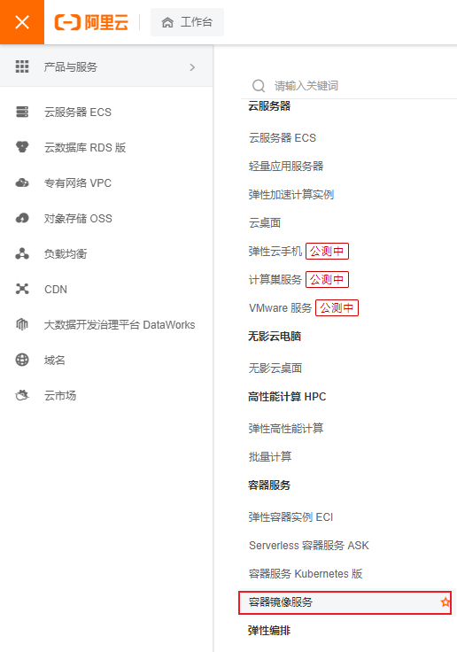

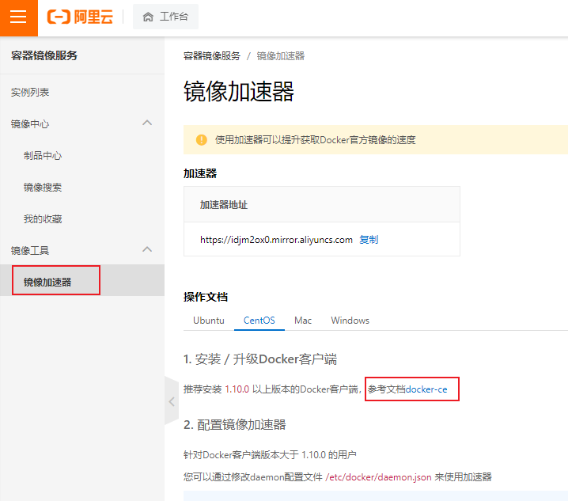

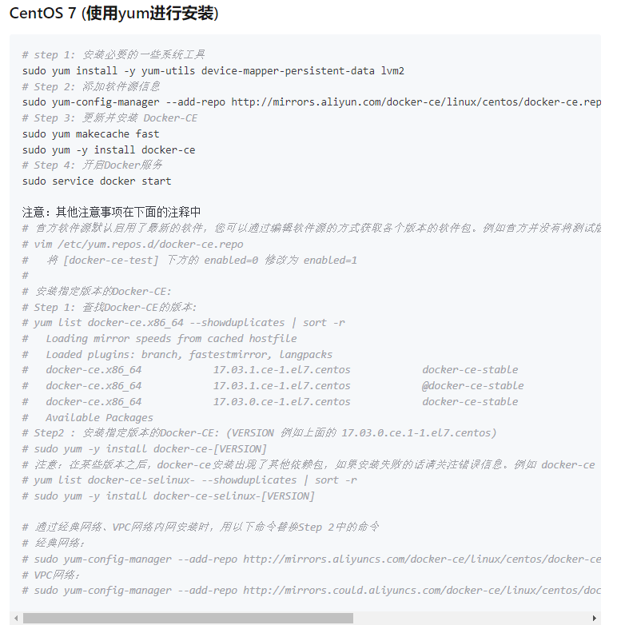

### 2.2.2 安装docker前置条件

```shell
yum install -y yum-utils device-mapper-persistent-data lvm2
```

### 2.2.3 添加源

```shell
yum-config-manager --add-repo http://mirrors.aliyun.com/docker-ce/linux/centos/docker-ce.repo
yum makecache fast
```

### 2.2.4 查看docker版本

```shell
yum list docker-ce --showduplicates | sort -r
```

### 2.2.5 安装 docker

```shell
安装最新版：推荐大家安装最新版本 
yum -y install docker-ce

安装指定版本：
语法规则：yum install docker-ce-<VERSION_STRING> docker-ce-cli-<VERSION_STRING> containerd.io
yum -y install docker-ce-18.06.3.ce-3.el7  docker-ce-cli.x86_64

yum install -y docker-ce-19.03.9-3.el7 docker-ce-cli-19.03.9-3.el7
```

#### 2.2.5.1 官网名词解释

- containerd.io: daemon to interface with the OS API (in this case, LXC - Linux Containers), essentially decouples Docker from the OS, also provides container services for non-Docker container managers
- docker-ce: Docker daemon, this is the part that does all the management work, requires the other two on Linux
- docker-ce-cli: CLI tools to control the daemon, you can install them on their own if you want to control a remote Docker daemon

### 2.2.6 开启docker服务

```shell
systemctl start docker 
systemctl status docker
```

### 2.2.7 安装阿里云镜像加速器

```shell
sudo mkdir -p /etc/docker
sudo tee /etc/docker/daemon.json <<-'EOF'
{
  "registry-mirrors": ["https://idjm2ox0.mirror.aliyuncs.com"]
}
EOF
sudo systemctl daemon-reload
sudo systemctl restart docker
```

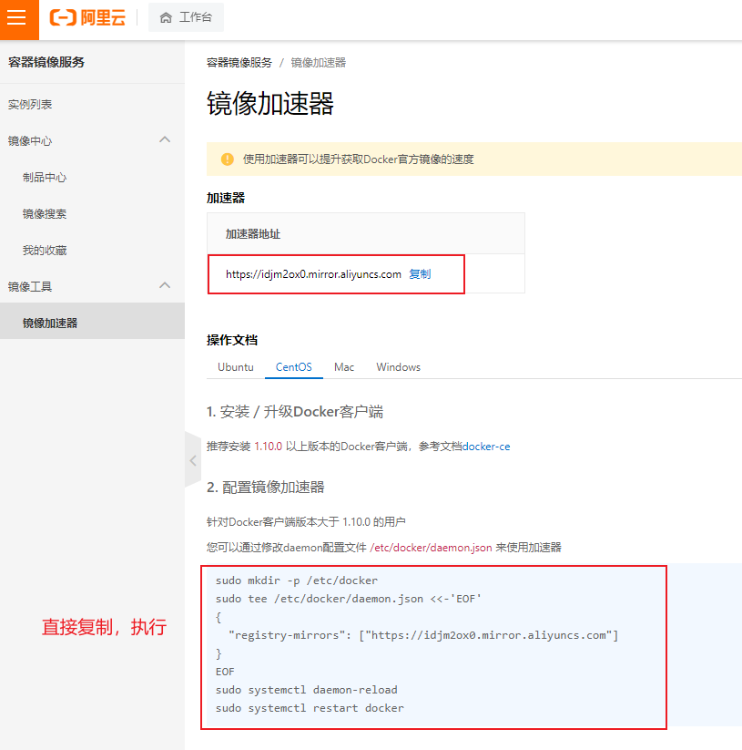

### 2.2.8 设置docker开启启动服务

```shell
systemctl enable docker
```

### 2.2.9 docker命令

```shell
docker -v
docker version
docker info
```

提示：别忘了关闭虚拟机，做好快照备份。方便以后随时恢复docker安装完毕状态。

# 3 Docker 的使用

## 3.1 docker命令分类

本章节记录 docker 命令在大部分情形下的使用，如果想了解每一项的细节，请参考官方文档，根据docker官网案例，总的来说分为以下几种：

1. Docker环境信息 — `docker [info|version]`
2. 容器生命周期管理 — `docker [create|exec|run|start|stop|restart|kill|rm|pause|unpause]`
3. 容器操作管理 — `docker [ps|inspect|top|attach|wait|export|port|rename|stat]`
4. 容器 rootfs 命令 — `docker [commit|cp|diff]`
5. 镜像仓库 — `docker [login|pull|push|search]`
6. 本地镜像管理 — `docker [build|images|rmi|tag|save|import|load]`
7. 容器资源管理 — `docker [volume|network]`
8. 系统日志信息 — `docker [events|history|logs]`


### 3.1.1 官网地址

https://docs.docker.com/engine/reference/run/

从docker命令使用出发，梳理出如下命令结构图：

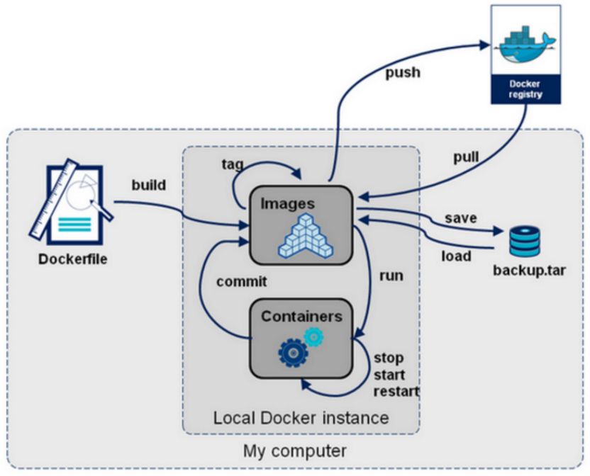

## 3.2 docker镜像（image）

### 3.2.1 Docker Hub 地址

docker hub 类似 maven 远程仓库地址

https://hub.docker.com/

作为一名研发人员，则可以将镜像理解为类（Class）。是一个应用程序。

首先需要先从镜像仓库中拉取镜像。常见的镜像仓库服务是 Docker Hub，但是也存在其他镜像仓库服务。

拉取操作会将镜像下载到本地 Docker 主机，可以使用该镜像启动一个或者多个容器。

镜像由多层组成，每层叠加之后，从外部看来就如一个独立的对象。镜像内存是一个精简的操作系统（OS），同时还包含应用运行所必须的文件和依赖包。

因为容器的设计初衷就是快速和小巧，所以镜像通常都比较小。

前面多次提到镜像就像停止运行的容器（类）。实际上，可以停止某个容器的运行，并从中创建新的镜像。

在该前提下，镜像可以理解为一种构建（build-time）结构，而容器可以理解为一种运行时（run-time）结构，如下图所示：

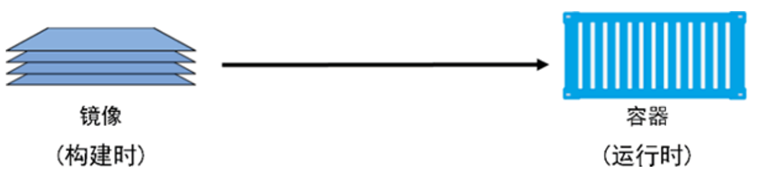

## 3.3 docker镜像常用命令

下面介绍几种镜像中常用的操作命令。

### 3.3.1 pull 命令

https://docs.docker.com/engine/reference/commandline/pull/

- 下拉镜像的命令。镜像从远程镜像仓库服务的仓库中下载。默认情况下，镜像会从  Docker Hub 的仓库中拉取。
- 通过下载过程，可以看到，一个镜像一般是由多个层组成，类似 `f7e2b70d04ae` 这样的串表示层的唯一 ID。


**问题一**：如果多个不同的镜像中，同时包含了同一层，这样重复下载，岂不是导致了存储空间的浪费吗？

实际上，Docker并不会这么傻，会去下载重复的层，Docker在下载之前，会去检测本地是否会有同样 ID 的层，如果本地已经存在了，就直接使用本地的就好了。

**问题二**：另一个问题，不同仓库中，可能也会存在镜像重名的情况，这种情况怎么办？

从严格意义上讲，我们在使用pull命令时，还需要在镜像前面指定仓库地址（Registry），如果不指定，则 Docker 会使用你默认配置的仓库地址。例如上面，由于我配置的是国内 docker.io 的仓库地址，我在 pull 的时候，docker会默认为我加上 docker.io/library 的前缀。

例如：当我执行 docker pull tomcat:9.0.20-jre8 命令时，实际上相当于 docker pull docker.io/tomcat:9.0.20-jre8，如果你未配置自定义仓库，则默认在下载的时候，会在镜像前面加上 DockerHub 的地址。Docker 通过前缀地址的不同，来保证不同仓库中，重名镜像的唯一性。

- 实际上完整的 ID 包括了 256 个 bit，64个十六进制字符组成的。

  ```
  https://hub.docker.com/_/tomcat
  
  docker pull tomcat:9.0.20-jre8
  docker pull tomcat:9.0.20-jre8-slim
  docker pull tomcat:9.0.20-jre8-alpine
  
  https://hub.docker.com/_/centos 
  docker pull centos:7.8.2003
  
  https://hub.docker.com/_/ubuntu 
  docker pull ubuntu:20.04
  
  https://hub.docker.com/_/debian 
  docker pull debian:10.6
  docker pull debian:10.6-slim
  
  https://hub.docker.com/_/alpine
  docker pull alpine:3.12.1
  ```

#### 3.3.1.1 常用参数

- `-a,--all-tags=true|false`：是否获取仓库中的所有镜像，默认为否；
- `--disable-content-trust`：跳过镜像内容的校验，默认为 true；

### 3.3.2 images命令

https://docs.docker.com/engine/reference/commandline/images/

通过使用如下两个命令，列出本机已有的镜像：

```shell
docker images
docker image ls
```

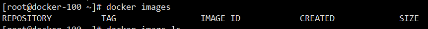

各个选项说明：

- **REPOSITIORY**：表示镜像的仓库源
- **TAG**：镜像的标签
- **IMAGE ID**：镜像ID
- **CREATED**：镜像创建时间
- **SIZE**：镜像大小

### 3.3.3 save命令 （保存镜像）

https://docs.docker.com/engine/reference/commandline/save/

#### 3.3.3.1 一个镜像

```shell
mkdir -p /data 
cd /data
docker save tomcat:9.0.20-jre8-alpine -o tomcat9.tar
docker save tomcat:9.0.20-jre8-slim > tomcat9.slim.tar
```

#####  3.3.3.1.1 常用参数

- `-o`：输出到文件

#### 3.3.3.2 多个镜像

推荐开发岗的小伙伴使用 idea 开发工具中的列编辑模式（Alt）制作 docker save 命令

```shell
mkdir -p /data
cd /data

docker save \ 
ubuntu:20.04 \ 
alpine:3.12.1 \ 
debian:10.6-slim \ 
centos:7.8.2003 \ 
-o linux.tar

docker save \
tomcat:9.0.20-jre8-alpine \
tomcat:9.0.20-jre8-slim \
tomcat:9.0.20-jre8 \
-o tomcat9.0.20.tar
```

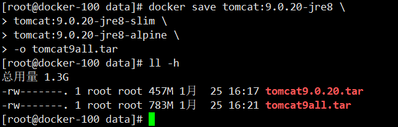

### 3.3.4 load命令

https://docs.docker.com/engine/reference/commandline/load/

压缩包 还原成 基础的镜像

```shell
mkdir -p /data 
cd /data

docker load -i linux.tar 
docker load < tomcat9.0.20.tar
```

#### 3.3.4.1 常用参数

- `--input,-i`：指定导入的文件
- `--quiet,-q`：精简输出信息

### 3.3.5 search命令

不推荐使用search命令查找镜像，不够直观。

```shell
docker search tomcat
```

#### 3.3.5.1 常用参数

- `-f,--filter filter`：过滤输出的内容
- `--limit int`：指定搜索内容展示个数
- `-no-index`：不截断输出内容
- `--no-trunc`：不截断输出内容

### 3.3.6 inspect命令

- 通过 docker inspect 命令，我们可以**获取镜像的详细信息**，其中，包括创建者，各层的数据摘要等。
- docker inspect 返回的是 JSON 格式的信息，如果你想获取其中指定的一项内容，可以通过 -f 来指定，如获取镜像大小

```shell
docker inspect tomcat:9.0.20-jre8-alpine
docker inspect -f {{".Size"}} tomcat:9.0.20-jre8-alpine
```


### 3.3.7 history命令

从前面的命令中，我们了解到，一个镜像是由多个层组成的，那么，我们要知道各个层的具体内容呢？

**通过 docker history 命令，可以列出各个层次的创建信息**。例如：查看 tomcat:9.0.20-jre8-alpine的各层信息

```shell
docker history tomcat:9.0.20-jre8-alpine
```


### 3.3.8 tag命令 *

标记本地镜像，将其归入某一仓库。先简单熟悉一下 tag 命令，后边的章节会详细进行讲解。

```shell
docker tag tomcat:9.0.20-jre8-alpine  turbo/tomcat:9
```

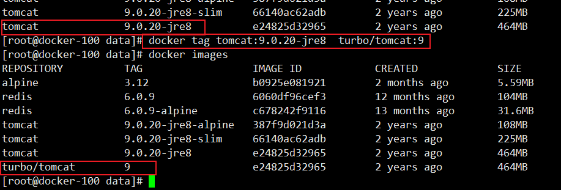

### 3.3.9 rmi命令

通过如下两个，都可以删除镜像：

```shell
docker rmi tomcat:9.0.20-jre8-alpine
docker image rm tomcat:9.0.20-jre8-alpine
```

#### 3.3.9.1 常用参数

- `-f,-force`：强制删除镜像，即便有容器引用该镜像；
- `-no-prune`：不要删除未带标签的父镜像；

#### 3.3.9.2 通过 ID 删除镜像

除了通过标签名称来删除镜像，还可以通过指定镜像ID，来删除镜像。一旦指定了通过 ID 来删除镜像，它会先尝试删除所有指向该镜像的标签，然后再删除镜像本身。

```shell
docker rmi ee7cbd482336
```

第一次实验

```
根据tomcat:9.0.20-jre8 镜像重新打一个新的tag
docker tag tomcat:9.0.20-jre8  turbo/tomcat:9

通过images命令查看镜像 
docker images

通过image的ID删除镜像 
docker rmi e24825d32965

错误信息如下：
Error response from daemon: conflict: unable to delete e24825d32965 (must be forced) - image is referenced in multiple repositories
```


#### 3.3.9.3 总结

- 推荐通过 image 的名称删除镜像
- image 的 ID 在 终端长度未完全显示，ID值会出现重复

#### 3.3.9.4 删除镜像的限制

删除镜像很简单，但也不是随时随地都能删除的，它存在一些限制条件。当通过该镜像创建的容器未被销毁时，镜像是无法被删除的。为了验证这一点，做个实验：

```shell
docker run -itd --name tomcat9 tomcat:9.0.20-jre8-alpine
```

可以看到提示信息，无法删除该镜像，因为有容器正在使用它！同时，这段信息还告诉我们，初分通过添加`-f`子命令，也就是强制删除，才能移除掉该镜像！

但是，一般不推荐这样暴力的做法，正确的做法应该是：

1. 先删除引用这个镜像的容器；
2. 再删除这个镜像。


### 3.3.10 清理镜像

我们在使用 Docker一段时间后，系统一般会残存一些临时的、没有被使用的镜像文件，可以通过以下命令进行清理。执行完命令后，还会告诉我们释放了多少存储空间！

```shell
docker image prune
```

#### 3.3.10.1 常用参数

- `-a,--all`： 删除所有没有用的镜像，而不仅仅是临时文件；
- `-f,--force`：强制删除镜像文件，无需弹出提示确认；

## 3.4 docker容器（container）

容器是镜像运行时的实例。正如从虚拟机模板上启动 VM 一样，用户也同样可以从单个镜像上启动一个或多个容器。虚拟机和容器最大的区别是容器更快并且更轻量级——与虚拟机运行在完整的操作系统之上相比，容器会共享其所在主机的操作系统/内核。下图为使用单个 Docker 镜像启动多个容器的示意图。

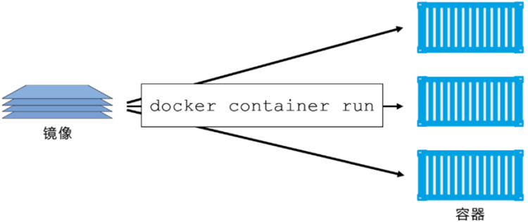

Docker容器类似于一个轻量级的沙箱，Docker利用容器来运行和隔离应用。

容器是镜像的一个运行实例。

可以将其启动、开始、停止、删除，而这些容器都是彼此相互隔离、互不可见的。<br>可以把容器看作是一个简易版的 Linux 系统环境（包括root用户权限、进程空间、用户空间 和 网络空间等）以及运行在其中的应用程序打包而成的盒子。

容器是基于镜像启动起来的，容器中可以运行一个或多个进程。

镜像是Docker生命周期 中的构建或打包 阶段，而容器则是启动或执行阶段

镜像自身是只读的。容器从镜像启动的时候，会在镜像的最上层创建一个可写层。

## 3.5 docker容器常用命令

### 3.5.1 新建并启动容器

https://docs.docker.com/engine/reference/commandline/run/

#### 3.5.1.1 语法

```shell
docker run [OPTIONS] IMAGE [COMMAND] [ARG...]
```

#### 3.5.1.2 运行容器

```shell
docker run -it --rm -p 8080:8080 tomcat:9.0.20-jre8-alpine
```

#### 3.5.1.3 常用参数

docker run 命令常用参数比较多，这里仅仅列出开发岗常用参数，

- **-d,--detch=false**：后台运行容器，并返回容器 ID

- **-i,--interactive=false**：以交互模式运行容器，通常与 -t 同时使用

- **-P,--publish-all=false**：随机端口映射，容器内部端口随机映射到主机的端口。**不推荐使用该参数**

- **-p,--publish=[]**：指定端口映射，格式为：**主机(宿主)端口:容器端口**，**推荐使用**

- **-t,--tty=false**：为容器重新分配一个伪输入终端，通常与 -i 同时使用

- **--name="nginx-lb"**：为容器指定一个名称

- **-h,--hostname="turbine"**：指定容器的hostname

- **-e,--env=[]**：设置环境变量，容器中可以使用该环境变量

- **--net="bridge"**：指定容器的网络链接类型，支持 bridge/host/none/container：四种类型

- **--link=[]**：添加链接到另一个容器；**不推荐使用该参数**

- **-v,--volume**：绑定一个卷

- **--privileged=false**：指定容器是否为特权容器，特权容器拥有所有的 capabilities

- **--restart=no**：指定容器停止后的重启策略

  no：容器退出时不重启

  on-failure：容器故障退出（返回值非零）时重启

  always：容器退出时总是重启，**推荐使用**

- **--rm=false**：指定容器停止后自动删除容器，**不能以 docker run -d 启动的容器**

### 3.5.2 容器日志

https://docs.docker.com/engine/reference/commandline/logs/

#### 3.5.2.1 语法

```shell
docker logs [OPTIONS] CONTAINER
```

#### 3.5.2.2 执行命令

```shell
docker run -itd --name tomcat9 -p 8080:8080 tomcat:9.0.20-jre8-alpine
docker logs -f tomcat9
```

#### 3.5.2.3 常用参数

- **-f**：跟踪日志输出
- **--tail**：仅列出尾部最新N条容器日志

### 3.5.3 删除容器

https://docs.docker.com/engine/reference/commandline/rm/

**docker rm** ：删除一个或多个容器。docker rm 命令智能删除处于终止或退出状态的容器，并不能删除还处于运行状态的容器

#### 3.5.3.1 语法

```shell
docker rm [OPTIONS] CONTAINER [CONTAINER...]
```

#### 3.5.3.2 执行命令

```shell
docker run -itd --name tomcat9 -p 8080:8080 tomcat:9.0.20-jre8-alpine 

需要先停止运行中的容器再删除，否则无法删除容器
docker stop tomcat9 

按照容器名称删除
docker rm tomcat9

按照容器ID删除
docker rm 8dd95a95e687
```

#### 3.5.3.3 常用参数

- **-f**：通过SIGKILL信号强制删除一个运行中的容器
- **-l**：移除容器间的网络链接，而非容器本身
- **-v**：删除与容器关联的卷

### 3.5.4 列出容器

https://docs.docker.com/engine/reference/commandline/ps/

#### 3.5.4.1 语法

```shell
docker ps [OPTIONS]
```

#### 3.5.4.2 执行命令

```shell
docker run -itd --name tomcat9 -p 8080:8080 tomcat:9.0.20-jre8-alpine 

查看运行中的容器
docker ps tomcat9 

查看所有容器
docker ps -a tomcat9
```

输出详情介绍：

**CONTAINER ID**：容器ID；

**IMAGE**：使用的镜像；

**COMMAND**：启动容器时运行的命令；

**CREATED**：容器的创建时间；

**STATUS**：容器状态；<br>状态有7中：

- created（已创建）
- restarting（重启中）
- running（运行中）
- removing（迁移中）
- paused（暂停）
- exited（停止）
- dead（死亡）

**PORTS**：容器的端口信息和使用的链接类型（tcp\udp）；

**NAMES**：自动分配的容器名称。

#### 3.5.4.3 常用参数

- **-a**：显示所有的容器，包括未运行的；
- **-q**：只显示容器编号。

#### 3.5.4.4 实用技巧

```shell
停止所有运行容器
docker stop $(docker ps -qa) 

删除所有的容器
docker rm $(docker ps -aq)

docker rm $(docker stop $(docker ps -q)) 

删除所有的镜像
docker rmi $(docker images -q)
```

### 3.5.5 创建容器

https://docs.docker.com/engine/reference/commandline/create/

**docker create**：创建一个新的容器但不启动它。用法同 docker run 命令。

#### 3.5.5.1 语法

```shell
docker create [OPTIONS] IMAGE [COMMAND] [ARG...]
```

#### 3.5.5.2 执行命令

```shell
docker create -it --name tomcat9 -p 8080:8080 9.0.20-jre8-alpine
```

#### 3.5.5.3 常用参数

大部分参数用法 与 docker run 命令参数相同

### 3.5.6 启动、重启、终止容器

[docker start](https://docs.docker.com/engine/reference/commandline/start/)：启动一个或多个已经被停止的容器

[docker stop](https://docs.docker.com/engine/reference/commandline/stop/)：停止一个运行中的容器

[docker restart](https://docs.docker.com/engine/reference/commandline/restart/)：重启容器

#### 3.5.6.1 语法

```shell
docker start [OPTIONS] CONTAINER [CONTAINER...]
docker stop [OPTIONS] CONTAINER [CONTAINER...]
docker restart [OPTIONS] CONTAINER [CONTAINER...]
```

#### 3.5.6.2 执行命令

```shell
docker start  tomcat9
docker stop tomcat9
docker restart tomcat9
```

### 3.5.7 进入容器

https://docs.docker.com/engine/reference/commandline/exec/

docker exec：在运行的容器中执行命令。早期有attach命令，对于阻塞命令会等待，所以不方便。在 Docker 1.3.0 后提供了 exec 可以在容器内直接执行命令

#### 3.5.7.1 语法

```shell
docker exec [OPTIONS] CONTAINER COMMAND [ARG...]
```

#### 3.5.7.2 执行命令

```shell
有bash命令的linux系统：例如centos
docker run -it --name tomcat9.1 -p 8080:8080 tomcat:9.0.20-jre8-slim 
docker exec -it tomcat9.1 /bin/bash

没有bash命令的linux系统：例如alpine系统
docker run -it --name tomcat9.2 -p 8081:8080 tomcat:9.0.20-jre8-alpine 
docker exec -it tomcat9.2 sh
```

#### 3.5.7.3 常用参数

- **-i**：即使没有附加也保持 STDIN 打开
- **-t**：分配一个伪终端

### 3.5.8 查看容器

https://docs.docker.com/engine/reference/commandline/inspect/

**docker inspect**：获取 容器/镜像 的元数据

#### 3.5.8.1 语法

```shell
docker inspect [OPTIONS] NAME|ID [NAME|ID...]
```

#### 3.5.8.2 执行命令

```shell
docker run -it --name tomcat9 -p 8081:8080 tomcat:9.0.20-jre8-alpine 
docker inspect tomcat9
```


#### 3.5.8.3 常用参数

- **-f**：指定返回值的模板文件
- **-s**：显示总的文件大小
- **--type**：为指定类型返回  JSON

### 3.5.9 更新容器

https://docs.docker.com/engine/reference/commandline/update/

**docker update**：可以动态的更新容器配置。可以更新一个或多个容器配置。多个容器名称或 ID 之间使用空格分隔。但 update 命令不是很成熟，很多配置项不能动态更新。推荐还是 rm 容器后，在重新 run 一个新的容器。

#### 3.5.9.1 语法

```shell
docker update [OPTIONS] CONTAINER [CONTAINER...]
```


#### 3.5.9.2 执行命令

```shell
docker run -it --name tomcat9 -p 8081:8080 tomcat:9.0.20-jre8-alpine 

更新容器restart策略
docker update --restart always tomcat9
```


### 3.5.10 杀掉容器

https://docs.docker.com/engine/reference/commandline/kill/

**docker kill**：杀掉一个运行中的容器。

#### 3.5.10.1 语法

```shell
docker kill [OPTIONS] CONTAINER [CONTAINER...]
```

#### 3.5.10.2 执行命令

```shell
docker run -it --name tomcat9 -p 8081:8080 tomcat:9.0.20-jre8-alpine

docker kill tomcat9

docker ps

docker ps -a

docker start tomcat9
```

#### 3.5.10.3 常用参数

- **-s**：向容器发送一个信号

## 3.5 docker常用命令汇总

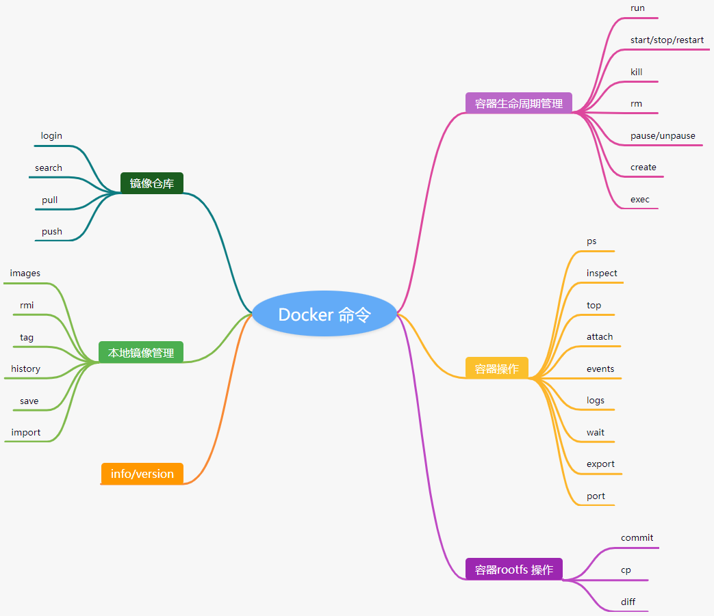

## 3.6 安装 nginx

### 3.6.1 docker官网地址

https://hub.docker.com/_/nginx

### 3.6.2 基础镜像

1. 拉取镜像

   ```shell
   docker pull nginx:1.19.3-alpine
   ```

2. 备份镜像

   ```shell
   docker save nginx:1.19.3-alpine -o nginx.1.19.3-alpine.tar
   ```

3. 导入镜像

   ```shell
   docker load -i nginx.1.19.3-alpine.tar
   ```


### 3.6.3 运行镜像

```shell
docker run -itd --name ngxin -p 80:80 nginx:1.19.3-alpine

进入容器
docker exec -it nginx sh

查看文件目录
cat /usr/share/nginx/html

配置文件目录
cat /etc/nginx/nginx.conf
```

浏览器测试：

```http
http://192.168.31.81/
```

## 3.7 安装 mysql

### 3.7.1 docker官网地址

https://hub.docker.com/_/mysql

### 3.7.2 基础镜像

1. 拉取镜像

   ```shell
   docker pull mysql:5.7.31
   ```

   

2. 备份镜像

   ```shell
   docker save mysql:5.7.31 -o mysql.5.7.31.tar
   ```

   

3. 导入镜像

   ```shell
   docker load -i mysql.5.7.31.tar
   ```

   

### 3.7.3 运行镜像

学习 **docker run -e** 参数

- -e,--evn=[]：设置环境变量，容器中可以使用该环境变量
- 官网中给出进入容器的第三种方式`bash`，前边学习了 `/bin/bash`，`sh`
- 向 my.cnf 文件中追加相关配置项

```shell
docker run -itd --name mysql --restart always --privileged=true -p 3306:3306 -e MYSQL_ROOT_PASSWORD=admin mysql:5.7.31 --character-set-server=utf8 --collation-server=utf8_general_ci

docker run -itd --name mysql --restart always -p 3306:3306 -e MYSQL_ROOT_PASSWORD=admin mysql:5.7.31 --character-set-server=utf8mb4 --collation-server=utf8mb4_unicode_ci
```


### 3.7.4 privilege参数

大多数熟悉 Unix 类系统的人，都习惯于通过使用 `sudo` 来随意提升自己的权限，成为 root 用户。我们在使用 docker 容器的过程中直到，docker 提供了一个 `--privileged` 的参数，其实它与随意使用 sudo 有很大的区别，它可能会让你的应用程序面临不必要的风险，下面我们将向你展示这与以 root 身份运行的区别，以及特权的实际含义。

#### 3.7.4.1 作为 root 运行

Docker 允许在其宿主机上隔离一个进程、capabilities 和文件系统，但是大多数容器实际上都是默认以 root 身份运行。这里我们拿DockerHub上几个比较流行的镜像来说明。

#### 3.7.4.2 避免以 root运行

虽然在容器内以 root 身份运行是很正常的，但是如果你想加固容器的安全性，还是应该避免这样做。


#### 3.7.4.3 特权模式

`--privilege`可以**不受限制地访问任何自己地系统调用**。在正常的操纵系统中，即使容器内有 root，Docker也会限制容器的 Linux Capabilities 的，这种限制包括像 `CAP_AUDIT_WRITE` 这样的中西，它允许覆盖内核的审计日志 —— 你的容器化工作负载很可能不需要这个 Capabilities。所以特权只应该在你真正需要它的特定设置中使用，简而言之，**它给容器提供了几乎所有主机（作为 root ）可以做的事情的权限**。

本质上，它就会是一个免费的通行证，可以逃避容器锁包含的文件系统、进程、socket套接字等，当然，他又特定的使用场景，比如在很多 CI/CD 系统中需要的 `Docker INN Docker` 模式（在 Docker 容器内部需要 Docker 守护进程），以及需要极端网络的地方。

### 3.7.5 测试mysql

#### 3.7.5.1 容器内测试

在容器内测试 mysql

```shell
进入容器：根据官网上的实例，使用bash命令进入容器
docker exec -it some-mysql bash

登录mysql
mysql -uroot -p

输入密码
admin

use mysql;
show databases;

退出mysql
exit

退出容器
exit
```


#### 3.7.5.2 SQLYog客户端测试

```
IP:192.168.31.81
username:root
password:admin
port:3306
```


## 3.8 安装zookeeper

### 3.8.1 docker官网地址

https://hub.docker.com/_/zookeeper

### 3.8.2 基础镜像

1. 拉取镜像

   ```shell
   docker pull zookeeper:3.6.2
   ```

2. 备份镜像

   ```shell
   docker save zookeeper:3.6.2 -o zookeeper.3.6.2.tar
   ```

3. 导入镜像

   ```shell
   docker load -i zookeeper.3.6.2.tar
   ```


### 3.8.3 单机版

运行镜像

```shell
docker run -itd --name zookeeper --restart always -p 2181:2181 zookeeper:3.6.2

进行容器
docker exec -it zookeeper /bin/bash

cat /etc/issue
返回信息:
Debian GNU/Linux 10 \n \l
```


### 3.8.4 测试容器

**ZooInspector**

下载地址：

https://issues.apache.org/jira/secure/attachment/12436620/ZooInspector.zip

进入目录 ZooInspector\build ，运行 zookeeper-dev-ZooInspector.jar。点击左上角链接按钮，输入zk 服务地址ip 或者 主机名:2181。点击 OK，即可查看 ZK 节点信息。

```shell
java -jar zookeeper-dev-ZooInspector.jar
```

## 3.9 安装activeMQ

### 3.9.1 docker官网

activeMQ没有官方镜像版本。需要使用第三方制作镜像，学完 docker技术后，可以自行制作属于自己的activeMQ镜像。

https://hub.docker.com/r/webcenter/activemq

### 3.9.2 基础镜像

1. 拉取镜像

   ```shell
   docker pull webcenter/activemq:5.14.3
   ```

2. 备份镜像

   ```shell
   docker save webcenter/activemq:5.14.3 -o webcenter.activemq.5.14.3.tar
   ```

3. 导入镜像

   ```shell
   docker load -i webcenter.activemq.5.14.3.tar
   ```


### 3.9.3 单机版

运行镜像

61616 为 ActiveMQ 的外部访问端口，8161 为 web 页面访问端口

```shell
docker run -itd --name activemq --restart always -p 61616:61616 -p 8161:8161 webcenter/activemq:5.14.3

进入容器
docker exec -it activmq /bin/bash 

cat /etc/issue
返回信息：
Ubuntu 15.10 \n \l
```

### 3.9.4 测试容器

使用 ip:8161 访问 ActiveMQ 管理界面，登录账号密码默认是 admin/admin

```http
http://192.168.31.81:8161/
```

