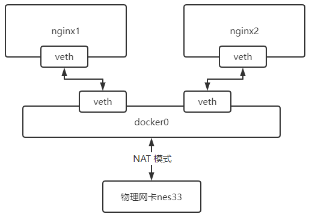

第二部分 Docker核心原理

# 1 虚拟化技术

“云计算”，相信大家都会熟悉。作为信息科技发展的主流趋势，它频繁地出现在我们眼前。伴随它一起出现的，还有这些概念名词——OpenStack、Hypervisor、KVM、Docker、K8S...

这些名词概念，全部属于云计算技术领域地范畴。对于初学者来说，理解这些概念地具体含义并不是一件容易的事情。在介绍那些古怪名词之前，先简单介绍以下**计算机发展史**


## 1.1 计算机发展史

上个世纪电脑被发明的时候，还没有网络，每个电脑（PC），就是一个单机。这台单机，包括CPU、内存、硬盘、显卡等硬件。用户在单机上，安装操作系统和应用软件，完成自己的工作。

后来有了**网络（Network）**，单机与单机之间，可以交换信息，协同工作。

再后来，单机性能越来越强，就有了**服务器（Server）**。人们发现，可以把一些服务器集中起来，放在机房里，然后让用户通过网络，去访问和使用机房里的计算机资源。再再后来，小型网络变成了大型网络，就有了**互联网（Internet）**。小型机房变成大型机房，就有了**IDC（Internet Data Center，互联网数据中心）**。


## 1.2 云计算

云计算的道理是简单的，说白了，就是把计算机资源集中起来，放在网络上。但是，云计算的实现方式，就非常复杂了。

举个例子，如果你只是在公司小机房摆了一个服务器，开个 FTP 下载服务，然后用于几个同事之间的电影分享，当然是很简单的。

如果是 “双11” 的淘宝购物节，全球几十亿用户访问阿里巴巴的淘宝网站，单日几十 PB（1PB=1024TB=1024 x 1024GB）的访问量，每秒几百GB的流量...这个，就不是几根网线几台服务器能解决的了。

这时，需要设计一个**超大容量、超高并发（同时访问）、超快速度、超强安全**的云计算系统，才能满足业务平稳运行的要求。这才是云计算的复杂之处。

**第一层次**

是最底层的硬件资源，主要包括 CPU（计算资源），硬盘（存储资源），还有网卡（网络资源）等。

**第二层次**

要高级一些，我不打算直接使用CPU、硬盘、网卡，我希望你把操作系统（例如：Windows、Linux）装好，把数据库软件装好，我再来使用。

**第三层次**

更高级一些，你不但要装好操作系统这些基本的，还要把具体的应用软件装好，例如 FTP 服务端软件、在线视频服务端软件等，我可以直接使用服务。


这三种层次，就是大家经常听到的 **IaaS**、**PaaS**、**SaaS**。

- **IaaS**：Infrastructure-as-a-Service（基础设施即服务），Infrastructure-as-a-Sevice。国内典型的就是阿里云，国际上的是 AWS
- **Paas**：Platform-as-a-Service（平台及服务），Platform-as-a-Service。国内典型的代表是新浪云，docker也属于PaaS
- **SaaS**：Software-as-a-Service（软件即服务）

目前主流的云计算服务提供商，例如亚马逊 AWS，阿里云、华为云、天翼云、腾讯云，说白了，都是为大家提供以上三个层次的云资源，你想要什么，它们就提供什么，你想要多少，它们就提供多少。

这样多样化多层次的云计算服务，阿里、华为们又是怎么提供的呢？

**于是，就有了各种软件和平台，负责对资源进行快速调用和集中管理**。


## 1.3 什么是虚拟化

如果要对物理资源进行管理，第一步，就是“**虚拟化**”。虚拟化是云计算的基础。简单来说，虚拟化就是在一套物理服务器上，运行多台“虚拟服务器”。这种虚拟服务器，也叫 **虚拟机（VM，Virtual Machine）**。

从表面上看，这些虚拟机都是独立的服务器，但实际上，它们共享物理服务器的 CPU、内存、硬盘、网卡等资源。通过模拟计算机的硬件，来实现在同一台计算机上同时运行不同操作系统的技术。常用的 vmwore、openstack、kvm 都是使用的虚拟化技术

- 物理机，通常称为“宿主机（Host）”
- 虚拟机，则称为“客户机（Guest）”

谁来完成物理资源虚拟化的工作？就是大名鼎鼎的 **Hypervisor**。

Hypervisor 也叫做 VMM（Virtual Machine Monitor，虚拟机监视器）。它不是一款具体的软件，而是一类软件的统称。Hypervisor 是一种运行在基础物理服务器硬件之上的软件层，可以虚拟化硬件资源，例如：cpu，硬盘、内存，声卡等资源，然后我们可以通过在虚拟化出来的资源之上安装操作系统。也就是所谓的虚拟机。通过 Hypervisor 我们可以创建不同的虚拟机，并且每个虚拟机都是分离的、独立的系统。这样操作，我们就可以在一台硬件服务器和本地操作系统之上虚拟化出来很多的服务器，供我们来部署应用程序。一台硬件服务器可以虚拟化多台服务器，让计算机资源得以充分利用。

Hypervisor 分为两大类：

- 第一类，hypervisor直接运行在物理机之上。虚拟机运行在 hypervisor之上。
- 第二类，物理机上安装正常的操作系统（例如Linux Windows），然后在正常操作系统上安装 hypervisor ，生成和管理虚拟机。像 **VMware**、**KVM**、**Xen**、**Virtual Box**，都属于Hypervisor。

人们在使用虚拟化一段时间后，发现它存在一些问题，不同的用户，有时候只是希望运行各自的一些简单程序，跑一个小程序，为了不互相影响，就要建立虚拟机。如果建虚拟机，显然浪费有点大，而且操作也会比较复杂，花费时间也会比较长。而且有的时候，想要迁移自己的服务程序，就要迁移整个虚拟机。显然，迁移过程也会很复杂。安装的虚拟机越多，消耗的资源对应越多。

环境兼容性问题，开发的时候环境运行正常，部署到虚拟机环境进行测试有可能发生错误。

有没有办法 **更灵活快捷**一些呢？有，这就引入了 **“容器（Container）”**。

## 1.4 什么是容器

基于硬件级虚拟化技术的缺点和不足，后续有发展出来另一种虚拟化技术，即操作系统级别的虚拟化技术。操作系统级虚拟化是运行在操作系统之上的虚拟化技术，它模拟的是运行在一个操作系统上的多个不同进程，并将其封闭在一个密闭的容器内，该技术也就被称之为容器化技术。

容器就是在隔离环境运行的一个进程，**如果进程停止，容器就会销毁**。隔离的环境拥有自己的系统文件，IP地址，主机名等。容器也就是虚拟化，但属于“轻量级”的虚拟化。它的目的和虚拟机一样，都是为了创建 “隔离环境”。但是，它又和虚拟机有很大的不同 —— 虚拟机时操作系统级别的资源隔离，而容器本质上是**进程级的资源隔离**。

## 1.5 容器和虚拟化的区别

容器是将代码和环境打包在一起的一个集合，而虚拟机是在物理层面上分离出来一个操作系统；<br>多个容器可以运行在同一台硬件服务器上，并共享一个操作系统的内核资源。<br>多个虚拟机也可以运行在同一台服务器上，但是每个虚拟机都需要一个完整的操作系统。

## 1.6 虚拟化技术分类


### 1.6.1 CPU虚拟化

虚拟化在计算机方面同城是指计算元件在虚拟的基础上而不是真实的基础上运行。虚拟化技术可以扩大硬件的容量，简化软件的重新配置过程。简单说来，CPU的虚拟化技术就是单CPU模拟多CPU并行，允许一个平台同时运行多个操作系统，并且应用程序都可以在相互独立的空间运行而互不影响。从而显著提高计算机的工作效率。

### 1.6.2 网络虚拟化

网络虚拟化 是目前业界关于虚拟化细分领域界定最不明显，存在争议比较多的一个概念，微软眼中的“网络虚拟化”，是指虚拟专用网络（VPN）。VPN对网络连接的概念进行了抽象，允许远程用户访问组织的内部网络，就像物理上连接到该网络一样。网络虚拟化可以帮助保护 IT环境，防止来自 Internet 的威胁，同时使用户能够快速安全的访问应用程序和数据。

### 1.6.3 服务器虚拟化

与网路虚拟化不同，服务器虚拟化缺失虚拟化技术最早细分出来的子领域。根据 2006年 2月 Forrester Research 的调查，全球范围的企业对服务器虚拟化的认知率达到 75%，三分之一的企业已经在使用或者准备部署服务器虚拟化。这个产生于 20世纪60年代的技术日益显出其重要价值。由于服务器虚拟化发展时间长，应用钢钒，所以很多时候人们几乎把服务器虚拟化技术等同于虚拟化。

### 1.6.4 存储虚拟化

醉着信息业务的不断运行和发展，存储系统网络平台已经称为一个核心平台，大量高价值数据积淀下来，围绕这些数据的应用对平台的要求也越来越高，不光是在存储容量上，还包括数据访问性能、数据传输性能、数据管理能力、存储扩展能力等等多个方面。可以说，存储网络平台的综合性能的优劣，将直接影响到整个系统的正常运行。因为这个原因，虚拟化技术又一子领域——虚拟存储技术，营运而生。

### 1.6.5 应用虚拟化

前面的几种虚拟化技术，主要还是专注于对硬件平台资源的虚拟优化分配，随着IT应用的日益广泛，应用虚拟化作为虚拟化家族的明日之星登上了历史舞台。2006年7月由Forrester咨询公司在美国对各种不同的行业高层 IT 管理人员所做的一项研究显示，当今的机构现在将应用虚拟化当作是业务上的一个必由之路，而不是一个 IT 决策。据统计，全世界目前至少有超过 18万个机构在利用应用虚拟化技术进行集中 IT 管理、加强安全性和减少总体成本。


# 2 docker网络

当你开始大规模使用 docker时，你会发现需要了解很多关于网络的知识。docker作为目前最火的轻量级容器技术，有很多令人称道的功能，如 docker的镜像管理。然而，docker同样有着很多不完善的地方，网络方面就是Docker比较薄软的部分。因此，作为一名运维工程师有必要深入了解docker的网络知识。作为一名微服务开发工程师，简单了解 docker网络环节即可。首先介绍 Docker自身的 3 种 local 网络工作方式，然后介绍一些 docker 自定义网络模式。

docker 安装后会自动创建 3 种网络：

- bridge
- host
- none

```shell
docker network ls
```


## 2.1 docker网络理论部分

docker使用 Linux 桥接网卡，在宿主机虚拟一个docker容器网桥（docker0），docker启动一个容器时会根据docker网桥的网段分配给容器一个IP地址，称为 Container-IP，同时docker网桥是每个容器的默认网关。因为在同一宿主机内的容器都接入同一个网桥，这样容器之间就能通过容器的Container-IP直接通信。

docker网桥是宿主机虚拟出来的，并不是真实存在的网络设备，外部网络是无法寻址到的，这也意味着外部网络无法通过直接 Container-IP访问到容器。如果容器希望外部访问能够访问到，可以通过映射容器端口到宿主主机（端口映射），即docker run创建容器的时候通过 -p 或 -P 参数来启动，访问容器的时候就通过 **[宿主机IP]:[容器端口]**访问容器。

```shell
使用命令查看 docker 网络部分
docker info
```

## 2.2 网络模式

| Docker网络模式  | 配置                      | 说明                                                         |
| --------------- | ------------------------- | ------------------------------------------------------------ |
| host模式        | -net=host                 | 容器和宿主机共享 Network namespace。<br>容器将不会虚拟出自己的网卡，配置自己的IP等，<br>而是使用宿主机的IP和端口 |
| container模式   | -net=container:NAME_or_ID | 容器和另外一个容器共享Network Namespace<br>kubernetes中的pod就是多个容器共享一个 Network namespace<br>创建的容器不会创建自己的网卡，配置自己的IP，<br>而是和一个指定的容器共享IP、端口范围。 |
| none模式        | -net=none                 | 容器有独立的Network namespace，并没有对其及逆行任何网络配置，<br>如分配 veth pair 和网桥连接，配置IP等。<br>该模式关闭了容器的网络功能 |
| bridge模式      | -net=bridge               | （默认为该模式）。此模式会为每一个容器分配、设置IP等，<br>并将容器连接到一个docker0虚拟网桥，通过docker0网桥<br>以及Iptables nat表配置与宿主机通信。 |
| Macvlan network | 无                        | 容器具备Mac地址，使其显示为网络上的物理设备                  |
| Overlay         | 无                        | (覆盖网络)：利用VXLAN实现的bridge模式                        |

## 2.3 bridge模式

**默认的网络模式**。bridge模式下容器没有一个公有 ip，只有宿主机可以直接访问，外部主机是不可见的，但容器通过宿主机的NAT规则后可以访问外网。

**Bridge 桥接模式的实现步骤：**

- Docker Daemon 利用 veth pair 技术，在宿主机上创建两个虚拟网络接口设备，假设为 veth0 和 veth1。而 veth pair 技术的特性可以保证无论哪一个 veth 接收到网络报文，都将报文传输给另一方。
- Docker Daemon 将 veth0 附加到 Docker Daemon 创建的 docker0 网桥上。保证宿主机的网络报文可以发往 veth0；
- Docker Daemon 将 **veth1** 附加到 Docker Container 所属的 namespace 下，并被改名 eth0。如此一来，保证宿主机的网络报文若发往 veth0，则立即会被 eth0 接收，实现宿主机到 Docker Container 网络的联通性；同时，也保证 Docker Container 单独使用 eth0，**实现容器网络环境的隔离性**。

**Bridge桥接模式的缺陷：**

1. 最明显的是，该模式下 Docker Container 不具有一个公有 IP，即和宿主机的 eth0 不处于同一个网段。导致的结果是宿主机以外的世界不能直接和容器进行通信
2. 虽然 NAT 模式经过中间处理实现了这一点，但是 NAT 模式仍然存在问题与不便，如：容器均需要在宿主机上竞争端口，容器内部服务的访问者需要使用使用服务发现获知服务的外部端口等。
3. 另外 NAT 模式由于是在 三层网络上的实现手段，故肯定会影响网络的传输效率。

**注意：**

veth设备是成双成对出现的，一端是容器内部命名为 eth0，一端是加入到网桥并命名的 veth（通常命名为 veth），它们组成了一个数据传输通道，一端进一端出，veth设备连接了两个网络设备并实现了数据通信

## 2.4 host模式

相当于 VMware 中的 NAT 模式，与宿主机在同一个网络中，但没有独立IP地址。

如果启动容器的时候使用 host 模式，那么这个容器将不会获得一个独立的 Network Namespace，而是和宿主机共用一个Network Namespace。容器将不会虚拟出自己的网卡，配置自己的IP等，而是使用宿主机的IP和端口。但是，容器的其他方面，如文件系统、进程列表等还是和宿主机隔离的。

使用host模式的容器可以直接使用宿主机的IP地址与外界通信，容器内部的服务端口也可以直接使用宿主机的端口，不需要进行 NAT，host最大的优势就是网络性能比较好，但是docker host上已经使用的端口就不能再用了，网络隔离性不好。

host网络模式需要在容器创建时指定 -network=host

host模式是bridge桥接很好的补充。采用 host 模式的 Docker Container，可以直接使用宿主机的IP地址与外界进行通信，若宿主机的eth0 是一个公有 IP，那么容器也拥有这个公有IP。同时容器内服务的端口也可以使用宿主机的端口，无需额外进行 NAT 转换。

host模式可以让容器共享宿主机网络栈，这样的好处是外部主机与容器直接通信，但是容器的网络缺少隔离性。

**Host网络模式的缺陷：**

最明显的是 Docker Container 网络环境隔离性的弱化。即容器不再拥有隔离、独立的网络环境。另外，使用host模式的 Docker Container 虽然可以让容器内部的服务和传统的情况无差别、无改造的使用，但是由于网络隔离性的弱化，该容器会与宿主机共享竞争网络栈的使用；<br>另外，容器内部将不再拥有所有的端口资源，原因是部分端口资源已经被宿主机本身的服务占用，还有部分端口已经用以 bridge 网络模式容器的端口映射。

## 2.5 Container网络模式

**一种特殊 host 网络模式**

Container 网络模式是 Docker 中一种较为特别的网络模式。在容器创建时使用 -network=container:vm1 指定。（vm1指定的是运行的容器名）

处于这个模式下的 docker 容器会共享一个网络环境，这样两个容器之间可以使用 localhost 高效快速通信。

**缺陷**：它并内有改善容器与宿主机以外世界通信的情况（和桥接模式一样，不能连接宿主机以外的其他设备）。

这个模式指定新创建的容器和已经存在的一个容器共享一个Network Namespace，而不是和宿主机共享。新创建的容器不会创建自己的网卡，配置自己的IP，而是和一个指定的容器共享IP、端口范围等。同样，两个容器除了网络方面，其他的入文件系统，进程列表等还是隔离的。两个容器的进程可以通过 lo 网卡设备通信。

## 2.6 none模式


## 2.7 overlay 网络模式


## 2.8 macvlan 网络模式

## 2.9 基础镜像

1. 拉取镜像

   ```shell
   docker pull nginx:1.19.3-alpine
   ```

   

2. 备份镜像

   ```sh
   docker save nginx:1.19.3-alpine -o nginx.1.19.3-alpine.tar
   ```

   

3. 导入镜像

   ```shell
   docker load -i nginx.1.19.3-alpine.tar
   ```

   

## 2.10 bridge网络

bridge网络表现形式就是 docker0 这个网络接口。容器默认都是通过 docker0 这个接口进行通信。也可以通过docker0 去和本机的以太网接口连接，这样容器内部才能访问互联网。

```shell
查看 docker0 网络，在默认环境中，一个名为 docker0 的linux bridge 自动被创建好，其上有一个docker 0 内部接口，IP地址为172.17.0.1/16
ip a

查看 docker 网络
docker network ls

查看bridge网络详情。主要关注Containers节点信息。
docker network inspect bridge
```

### 2.10.1 docker0 详解

#### 2.10.1.1 运行镜像

```shell
docker run -itd --name nginx1  nginx:1.19.3-alpine

查看bridge网络详情，主要关注 Containers节点信息。发现 nginx1 容器默认使用 bridge 网络
docker network inspect bridge
```

#### 2.10.1.2 创建容器时 IP 地址的分配

```shell
查看 docker100 主机的网络。发现多出了一块网卡 
ip a
```

Docker 创建一个容器的时候，会执行如下操作：

- 创建一对虚拟接口/网卡，也就是veth pair，分别放到本地主机和新容器中；
- 本地主机一端桥接到默认的 docker0 或指定网桥上，并具有一个唯一的名字，如 veth1a79c56；
- 容器一端放到新容器中，并修改名字作为 eth0，这个网卡/接口只在容器的名字空间可见；
- 从网桥可用地址段中（也就是与该bridge对应的network）获取一个空闲地址分配给容器的 eth0，并配置默认路由到桥接网卡 veth1a79c56 。

完成之后，容器就可以使用 eth0 虚拟网卡来连接其他容器和其他网络。<br>如果不指定 --network，创建容器默认都会挂到 docker0 上，使用本地主机上 docker0 接口的 IP 作为所有容器的默认网关。

```shell
第一种方式：
docker exec -it nginx1 sh

ip a

第二种方式：
docker exec -it nginx1 ip a
```

#### 2.10.1.3 安装brctl

```shell
yum install -y bridge-utils
```

#### 2.10.1.4 运行命令

```shell
brctl show
```




### 2.10.2 多容器之间通讯

```shell
docker run -itd --name nginx1 nginx:1.19.3-alpine

docker run -itd --name nginx2 nginx:1.19.3-alpine

docker network inspect bridge

docker exec -it nginx1 sh 
ping 172.17.0.2

docker exec -it nginx2 sh
ping 172.17.0.2
ping www.baidu.com
ping nginx1
```


### 2.10.3 容器IP地址会发生变化

```shell
docker stop nginx1 nginx2 

先启动nginx2，在启动nginx1
docker start nginx2
docker start nginx1

docker network inspect bridge
```


### 2.10.4 link容器

**学习docker run 命令的 link 参数**

- **--link=[]**：添加链接到另一个容器；**不推荐各位使用该参数**

使用link的场景：在企业开发环境中，有一个mysql的服务的容器 mysql_1，还有一个web应用程序 web_1，肯定web_1这台容器肯定要连接mysql_1这个数据库。前面网络命名空间的知识告诉我们，两个容器要通信，需要知道对方具体的IP地址。生产环境还比较好，IP地址很少变化，但是内部测试环境，容器部署的IP地址可能不断变化，所以，开发人员不能再代码中写死数据库的IP地址。这个时候，我们就可以利用容器之间 link 来解决这个问题。下面，来介绍如何通过容器名称来进行 ping，而不是通过 IP 地址。

```shell
docker rm -f nginx2

docker run -itd --name nginx2 --link nginx1 nginx:1.19.3-alpine

docker exec -it nginx2 sh
ping 172.17.0.2

ping www.baidu.com
ping nginx1
```

- 上面 link 命令，是在 nginx2 容器启动时 link 到 nginx1 容器，因此，在 nginx2 容器里面可以 ping 通 nginx1 容器名，link的作用相当于添加了 DNS 解析。在这里提醒下，在 nginx1 容器里去 ping nginx2 容器是不通的，因为link关系是单向的，不可逆。
- 实际工作中，docker官网已经不推荐使用 link 参数
- docker用其他方式替换掉link参数


### 2.10.5 新建bridge网络

```shell
docker network create -d bridge turbo-bridge
```

上面命令参数 -d 是指 DRIVER 的类型，后面的 turbo-bridge 是 network 的自定义名称，这个和 docker0 是类似的。下面开始介绍，如何把容器连接到 turbo-bridge 这个网络。

启动一个 nginx 的容器 nginx3，并通过参数 network connect 来连接 turbo-bridge 网络。在启动容器 nginx3 之前，我们查看目前还没有容器连接到 turbo-bridge 这个网络上

```shell
brctl show
docker network ls
docker network inspect turbo-bridge

docker run -itd --name nginx3 --network turbo-bridge  nginx:1.19.3-alpine 
brctl show
docker network inspect turbo-bridge
```

把一个运行中容器连接到 turbo-bridge网络

```shell
docker network connect turbo-bridge nginx2
docker network inspect turbo-bridge

docker exec -it nginx2 sh 
ping nginx3

docker exec -it nginx3 sh 
ping nginx2
```


## 2.11 none、host网络

先看看 none 网络

### 2.11.1 none 网络

环境准备，先stop和rm掉全部之前开启的容器。并且把前面创建的 turbo-bridge 网络也删除。当然，更简单的办法是使用快照方式。将 docker-100 主机恢复到 docker初始化安装时。

```shell
docker rm -f $(docker ps -aq)
docker network rm turbo-bridge

docker network ls
```

启动一个 nginx 的容器 nginx1，并且连接到 none 网络。然后执行 docker network inspect none，看看容器信息

```shell
docker run -itd --name nginx1 --network none  nginx:1.19.3-alpine
docker network inspect none
```

注意，容器使用none模式，是没有物理地址和IP地址。我们可以进入到 nginx1 容器里，执行 ip a命令看看。只有一个 lo 接口，没有其他网络接口，没有IP。也就是说，使用 none 模式，这个容器是不能被其他容器访问。这种场景很少，只有项目安全性很高的功能才能使用到。例如：密码加密算法容器。

```shell
docker exec -it nginx1 sh 
ip a
```


### 2.11.2 host 网络

前面学习 none 网络模式特点就是，容器没有IP地址，不能和其他容器通信。下面来看看host网络是什么特点。使用前面的命令，启动一个nginx2 容器，连接到host网络。然后 docker network inspect host，看看容器信息。

```shell
docker run -itd --name nginx2 --network host  nginx:1.19.3-alpine
docker network inspect host
```

这里看来也不显示IP地址，那么是不是和 none 一样，肯定不是，不然也不会设计 none 和 host 网络进行区分。下面为您进入 nginx2 容器，执行 ip a 看看效果。我们在容器里执行 ip a，发现打印内容和在 linux 本机外执行 ip a 是一样的。

```shell
docker exec -it nginx2 sh 
ip a
```

这说明什么？容器使用了host模式，说明容器和外层 linux主机共享一套网络接口。VMware 公司的虚拟管理软件，其中网络设置，也有 host 这个模式，作用是一样的，虚拟机里面使用网络和你自己外层机器是一模一样的。这种容器和本机使用共享一套网络接口，缺点还是很明显的，例如我们知道web服务器一般端口是80，共享一套网络接口，那么你这太机器上智能启动一个nginx端口为80的服务器了。否则，出现端口被占用的情况。

本篇很简单，就是简单了解下 docker 中 none 和 host 网络模式，学习重点还是如何使用 bridge 网络。

## 2.12 网络命令汇总

```shell
docker network --help

Usage:	docker network COMMAND

Manage networks

Commands:
  connect     Connect a container to a network
  create      Create a network
  disconnect  Disconnect a container from a network
  inspect     Display detailed information on one or more networks
  ls          List networks
  prune       Remove all unused networks
  rm          Remove one or more networks

Run 'docker network COMMAND --help' for more information on a command.
```

### 2.12.1 查看网络

```shell
查看网络    – docker network ls 
# 作用：
	查看已经建立的网络对象
# 命令格式：
	docker network ls [OPTIONS] 
# 命令参数(OPTIONS)：
	-f, --filter filter     过滤条件(如'driver=bridge’)
	    --format string     格式化打印结果    
	    --no-trunc          不缩略显示
	-q, --quiet             只显示网络对象的ID

# 注意：
	默认情况下，docker安装完成后，会自动创建bridge、host、none三种网络驱动
# 命令演示
docker network ls
docker network ls --no-trunc
docker network ls -f 'driver=host'
```


### 2.12.2 创建网络

```shell
创建网络    – docker network create
# 作用：
	创建新的网络对象
# 命令格式：
	docker network create [OPTIONS] NETWORK
# 命令参数(OPTIONS)：
	-d, --driver string             指定网络的驱动(默认    "bridge")
   		--subnet strings            指定子网网段(如192.168.0.0/16、172.88.0.0/24)    
   		--ip-range strings          执行容器的IP范围，格式同subnet参数
		--gateway strings           子网的IPv4 or IPv6网关，如(192.168.0.1) 
# 注意：
	host和none模式网络只能存在一个
	docker自带的overlay 网络创建依赖于docker swarm(集群负载均衡)服务 
	192.168.0.0/16 等于    192.168.0.0~192.168.255.255, 192.168.8.0/24 
	172.88.0.0/24 等于    172.88.0.0~172.88.0.255
# 命令演示
docker network ls
docker network create -d bridge my-bridge
docker network ls
```


### 2.12.3 网络删除

```shell
网络删除    – docker network rm 
# 作用：
	删除一个或多个网络
# 命令格式：
	docker network rm NETWORK [NETWORK...] 
# 命令参数(OPTIONS)：
	无
```


### 2.12.4 查看网络详细信息

```shell
查看网络详细信息  docker network inspect
# 作用：
	查看一个或多个网络的详细信息
# 命令格式：
	docker network inspect [OPTIONS] NETWORK [NETWORK...]      
	或者    docker inspect [OPTIONS] NETWORK [NETWORK...]
# 命令参数(OPTIONS)：
	-f, --format string     根据format输出结果
```


### 2.12.5 使用网络

```shell
使用网络    – docker run –-network
# 作用：
	为启动的容器指定网络模式
# 命令格式：
	docker run/create --network NETWORK 
# 命令参数(OPTIONS)：
	无
# 注意：
	默认情况下，docker创建或启动容器时，会默认使用名为bridge的网络
```


### 2.12.6 网络连接与断开

```shell
网络连接与断开    – docker network connect/disconnect
# 作用：
	将指定容器与指定网络进行连接或者断开连接
# 命令格式：
	docker network connect [OPTIONS] NETWORK CONTAINER 
	docker network disconnect [OPTIONS] NETWORK CONTAINER
# 命令参数(OPTIONS)：
	-f, --force         强制断开连接(用于disconnect)
```


## 2.13 小练习

```shell
docker network create -d bridge --subnet=172.172.0.0/24 --gateway 172.172.0.1 turbo-network

172.172.0.0/24: 24代表子码掩码是255.255.255.0
172.172.0.0/16: 16 代表子码掩码

docker network ls

docker run -itd --name nginx3 -p 80:80 --net turbo-network --ip 172.172.0.10 nginx:1.19.3-alpine

--net mynetwork:选择存在的网络
--ip 172.172.0.10:给nginx分配固定的IP地址

docker network inspect turbo-network
docker stop nginx3

docker start nginx3

docker network inspect turbo-network
```


# 3 docker数据卷

## 3.1 小实验

```shell
docker run -itd --name mysql --restart always --privileged=true -p 3306:3306 -e MYSQL_ROOT_PASSWORD=admin mysql:5.7.31 --character-set-server=utf8 --collation- server=utf8_general_ci
```


## 3.2 什么是数据卷

当我们在使用 docker 容器的时候，会产生一系列的数据文件，这些数据文件在我们删除docker容器时是会消失的，但是其中产生的部分内容我们希望能够把它保存起来另作用途的，Docker将应用与运行环境打包成容器发布，我们希望在运行过程中产生的部分数据是可以持久化的，而且容器之间我们希望能够实现数据共享。

通俗的来说，docker容器数据卷可以看成是我们生活中常用的 U盘，它存在于一个或多个的容器中，由docker挂载到容器，但不属于联合文件系统，Docker不会在容器删除时删除其挂载的数据卷。

特点：

1. 数据卷可以在容器之间共享或重用数据
2. 数据卷的更改可以立即生效
3. 数据卷中的该更不会包含在镜像的更新中
4. 数据卷默认会一直存在，即使容器被删除
5. 数据卷的生命周期一直持续到没有容器使用它为止


容器中的管理数据主要有两种方式：

- 数据卷：Data Volumes 容器内数据直接映射到本地主机环境
- 数据卷容器：Data Volume Containers 使用特定容器维护数据卷


## 3.3 cp命令

当然还有最原始的copy方式，这个也是管理数据的方式，但是基本不会用到

**docker cp**：用于容器与主机之间的数据拷贝。

### 3.3.1 语法

```shell
宿主机文件复制到容器内
docker cp [OPTIONS] SRC_PATH CONTAINER:DEST_PATH 

容器内文件复制到宿主机
docker cp [OPTIONS] CONTAINER:SRC_PATH DEST_PATH
```


### 3.3.2 常用参数

- **-L**：保持源目标中的连接

### 3.3.3 基础镜像

```shell
docker pull nginx:1.19.3-alpine
```


### 3.3.4 宿主机文件 copy to 容器内

宿主机的index.html页面覆盖容器内的 index.html页面

```shell
docker run -itd --name nginx -p 80:80 nginx:1.19.3-alpine 

cd /data
echo "turbine" > /data/index.html

docker cp /data/index.html nginx:/usr/share/nginx/html/index.html
```

浏览器测试：

```http
http://192.168.31.81
```


### 3.3.5 容器内文件 copy to 宿主机

将容器内的 nginx.conf 复制到宿主机中

```shell
docker run -itd --name nginx -p 80:80 nginx:1.19.3-alpine 

cd /data
docker cp nginx:/etc/nginx/nginx.conf /data
```


## 3.4 数据卷

数据卷（Data Volumes）是一个可供一个或多个容器使用的特殊目标，它将主机操作系统目录直接映射进容器。

### 3.4.1 注意事项

- **挂载数据卷，最好是通过run而非create/start创建启动容器，create/start命令创建启动容器后，再挂载数据卷相当麻烦，要修改很多配置文件，但并非不可以**。
- **docker官网推荐尽量进行目录挂载，不要进行文件挂载**

### 3.4.2 数据卷类型

有三种数据卷类型：

1. 宿主机数据卷：直接在宿主机的文件系统中但是容器可以访问（bind mount）
2. 命名的数据卷：磁盘上 Docker 管理的数据卷，但是这个卷有个名字。
3. 匿名数据卷：磁盘上 Docker 管理的数据卷，因为没有名字想要找到不容易，Docker来管理这些文件。

数据卷其实都在（如果没有网络文件系统等等情况下）宿主机文件系统里面的，只是第一种是在宿主机内的特定目录下，而后两种则在docker管理的目录下，这个目录一般是 /var/lib/docker/volumes/

**推荐大家使用`宿主机数据卷`方式持久化数据**

### 3.4.3 宿主机数据卷

bind mounts：容器内的数据被存放在宿主机文件系统的任意位置，甚至存放到一些重要的系统目录或文件中。除了 docker 之外的进程也可以任意对他们进行修改。

当使用bind mounts时，宿主机的目录或文件被挂载到容器中。容器将按照挂载目录或文件的绝对路径来使用或修改宿主机的数据，宿主机中的目录或文件不需要预先存在，在需要时会自动创建。

使用 bind mounts在性能上是非常好的，但这依赖于宿主机有一个目录妥善结构化的文件系统。

使用bind mounts的容器可以在通过容器内部的进程对主机文件系统进行修改，包括创建，修改和删除重要的系统文件和目录，这个功能虽然很强大，但显然也会造成安全方面的影响，包括影响到宿主机上Docker以外的进程

#### 3.4.3.1 数据覆盖问题

- 如果挂载一个空的数据卷到容器中的一个非空目录中，那么这个目录下的文件会被复制到数据卷中
- 如果挂载一个非空的数据卷到容器中的一个目录中，那么容器中的目录会显示数据卷中的数据。如果原来容器中的目录有数据，那么原始数据会被隐藏掉。

#### 3.4.3.2 语法

```shell
docker run -v  /宿主机绝对路径目录:/容器内目录 镜像名
```


#### 3.4.3.3 基础镜像

```shell
docker pull mysql:5.7.31
```


#### 3.4.3.4 运行镜像

**推荐还是先创建好目录再进行数据挂载**

```shell
docker run -itd --name mysql --restart always --privileged=true -p 3306:3306 -e MYSQL_ROOT_PASSWORD=admin -v /data/mysql:/var/lib/mysql mysql:5.7.31 --character-set-server=utf8 --collation-server=utf8_general_ci
```


#### 3.4.3.5 容器目录权限

```shell
通过    -v 容器内路径：    ro rw 改变读写权限 

ro:readonly 只读
rw:readwrite 可读可写

docker run -it -v /宿主机绝对路径目录:/容器内目录:ro 镜像名 
docker run -it -v /宿主机绝对路径目录:/容器内目录:rw 镜像名

例如：
docker run -d -P --name nginx05 -v turbine1:/etc/nginx:ro nginx 
docker run -d -P --name nginx05 -v turbine2:/etc/nginx:rw nginx

ro 只要看到ro就说明这个路径只能通过宿主机来操作，容器内部是无法操作！
```


### 3.4.4 挂载目录权限问题

```http
https://hub.docker.com/r/sonatype/nexus3
```

```shell
拉取镜像
docker pull sonatype/nexus3:3.28.1 

备份镜像
docker save sonatype/nexus3:3.28.1 -o sonatype.nexus3.3.28.1.tar 

导入镜像
docker load -i sonatype.nexus3.3.28.1.tar
```

```shell
运行容器
docker run -d -p 8081:8081 --name nexus3 sonatype/nexus3:3.28.1

进入容器查找初始化密码
docker exec -it nexus3 /bin/bash 

cd /nexus-data/

cat admin.password 

浏览器端访问
http://192.168.198.100:8081/

docker rm $(docker stop $(docker ps -aq))
```

```shell
数据卷挂载
docker run -d -p 8081:8081 --name nexus3 -v /data/nexus3/:/nexus-data/ sonatype/nexus3:3.28.1

查看容器启动日志 
docker logs -f nexus3

报错信息如下：
mkdir: cannot create directory '../sonatype-work/nexus3/log': Permission denied 
mkdir: cannot create directory '../sonatype-work/nexus3/tmp': Permission denied 
OpenJDK 64-Bit Server VM warning: Cannot open file ../sonatype-
work/nexus3/log/jvm.log due to No such file or directory

Warning:  Cannot open log file: ../sonatype-work/nexus3/log/jvm.log 
Warning:  Forcing option -XX:LogFile=/tmp/jvm.log
java.io.FileNotFoundException: ../sonatype-
work/nexus3/tmp/i4j_ZTDnGON8hezynsMX2ZCYAVDtQog=.lock (No such file or directory)
....
```

```shell
删除容器
docker rm -f nexus3

查看官网说明文档，需要为挂载目录授权 
chown -R 200 nexus3/

运行容器
docker run -d -p 8081:8081 --name nexus3 -v /data/nexus3/:/nexus-data/ sonatype/nexus3:3.28.1

查看容器启动日志 
docker logs -f nexus3
```


总结：**开发环境中推荐 挂载目录授最高权限 777；生产环境需要查看官网文档，结合实际生产环境进行授权**。

### 3.4.5 命名的数据卷

#### 3.4.5.1 基础镜像

```shell
docker pull nginx:1.19.3-alpine
```


#### 3.4.5.2 挂载数据卷

```shell
docker run -itd --name nginx -p 80:80 -v turbine-nginx:/etc/nginx nginx:1.19.3- alpine

查看docker数据卷
docker volume ls

查看lagouedu-nginx宿主机目录
docker volume inspect turbine-nginx

进入docker数据卷默认目录
cd /var/lib/docker/volumes/turbine-nginx 

查看文件
ls

所有的文件docker默认保存在_data目录中 
cd _data

删除容器
docker rm $(docker stop $(docker ps -aq))

查看挂载数据是否还存在，通过查看数据，发现删除容器后，宿主机中的数据还存在
ls
```


### 3.4.6 匿名数据卷

#### 3.4.6.1 基础镜像

```shell
docker pull nginx:1.19.3-alpine
```


#### 3.4.6.2 挂载数据卷

```shell
docker run -itd --name nginx -p 80:80 -v /etc/nginx nginx:1.19.3-alpine 

查看docker数据卷
docker volume ls 

查看宿主机目录
docker volume inspect dbd07daa4e40148b11.... 

进入docker数据卷默认目录
cd /var/lib/docker/volumes/dbd07daa4e40148b11....

查看文件
ls

所有的文件docker默认保存在_data目录中
cd _data

删除容器
docker rm $(docker stop $(docker ps -aq))

查看挂载数据是否还存在，通过查看数据，发现删除容器后，宿主机中的数据还存在
ls
```


### 3.4.7 清理数据卷

删除上面的创建的容器后，会发现数据卷仍然存在，恶魔就需要去清理它，不然会占用我们的资源

```shell
docker volume ls 

清理数据卷
docker volume prune 

docker volume ls
```


## 3.5 数据卷容器

### 3.5.1 基础镜像

```shell
docker pull centos:7.8.2003
docker pull nginx:1.19.3-alpine
docker pull mysql:5.7.31
```


### 3.5.2 run命令

```shell
docker run
```

- **volumes-from**：

如果用户需要在多个容器之间共享一些持续更新的数据，最简单的方式就是使用数据卷容器。数据卷容器也是一个容器，但是它的目的是专门用来提供数据卷供其他容器挂载。

发现创建好的数据卷容器处于停止运行的状态，因为使用 --volumes-from 参数所挂载数据卷的容器自己并不需要保持在运行状态。


```shell
docker run -d --name data-volume -v /data/nginx:/usr/share/nginx/html -v /data/mysql:/var/lib/mysql centos:7.8.2003
```

```shell
docker run -itd --name nginx01 -p 80:80 --volumes-from data-volume nginx:1.19.3-alpine
echo "turbine nginx" > /data/nginx/index.html 
http://192.168.31.81

docker run -itd --name nginx02 -p 81:80 --volumes-from data-volume nginx:1.19.3-alpine
http://192.168.31.81:81
```

```shell
docker run -itd --name mysql01 --restart always --privileged=true -p 3306:3306  -e MYSQL_ROOT_PASSWORD=admin --volumes-from data-volume mysql:5.7.31 --character-set-server=utf8 --collation-server=utf8_general_ci

docker run -itd --name mysql02 --restart always --privileged=true -p 3307:3306  -e MYSQL_ROOT_PASSWORD=admin --volumes-from data-volume mysql:5.7.31 --character-set-server=utf8 --collation-server=utf8_general_ci
```


# 4 docker-compose

## 4.1 官网地址

```http
https://docs.docker.com/compose/compose-file/
```


## 4.2 概述

在实际生产环境中，一个应用往往由许多服务构成，而 docker 的最佳实践是一个容器只运行一个进程，因此运行多个微服务就要运行多个容器。多个容器协同工作需要一个有效的工具来管理它们，定义这些容器如何相互关联。compose应运而生。

compose是用来定义和运行一个或多个容器（通常都是多个）运行和应用的工具，使用compose 可以简化容器镜像的构建以及容器的运行。

compose使用 YAML 文件来定义多容器之间的关系。一个 `docker-compose up`就可以把完整的应用跑起来。本质上，compose 把 YAML 文件解析成 docker 命令的参数，然后调用相应的 docker 命令行接口，从而将应用以容器化的方式管理起来。它通过解析容器间的依赖关系由 YAML 文件中的 `links`标记指定。


## 4.3 docker compose是什么

compose、machine 和 swarm 是 docker 原生提供的三大编排工具。简称docker三剑客。

Docker Compose 能够在 Docker 节点上，以单引擎模式（Single-Engine Mode）进行多容器应用的部署和管理。多数的现代应用通过多个更小的微服务互相协同来组成一个完整可用的应用。比如一个简单的示例应用可能由如下 4 个微服务组成。

- Web前端
- 订单管理
- 品类管理
- 后台数据库

将以上服务组织在一起，就是一个可用的应用。

部署和管理繁多的服务是困难的，而这正是 Docker Compose 要解决的问题。Docker Compose 并不是通过脚本和各种冗长的 docker 命令来将应用组织起来，而是通过一个声明式的配置文件描述整个应用，从而使用一条命令完成部署。应用部署成功后，还可以通过一系列简单的命令实现对其完整生命周期的管理。甚至，配置文件还可以置于版本控制系统中进行存储和管理。

## 4.4 docker compose的背景

Docker Compose的前身是 Fig。Fig 是一个由 Orchard 公司开发的强有力的工具，在当时是进行多容器管理的最佳方案。

Fig 是一个基于 Docker 的 Python 工具，允许用户基于一个 YAML 文件定义多容器应用，从而可以使用 fig 命令行工具进行应用部署。

Fig 还可以对应用的全生命周期进行管理。内部实现上，Fig 会解析 YAML 文件，并通过 Docker API 进行应用的部署和管理。

在 2014 年，Docker 公司收购了 Orchard 公司，并将 Fig 更名为 Docker Compose。

命令行工具也从 fig 更名为 docker-compose，并自此成为绑定在 Docker 引擎之上的外部工具。

虽然它从未完全集成到 Docker 引擎中，但是仍然受到广泛关注并得到普遍使用。<br>直到今日，Docker Compose 仍然是一个需要在Docker主机上进行安装的外部 Python 工具。

使用它时，首先编写定义多容器（多服务）应用的 YAML 文件，然后将其交由 docker-compose 命令处理，Docker Compose 就会基于 Docker 引擎 API 完成应用的部署。

## 4.5 docker compose安装

在Linux上安装 Docker Compose 分为两步：

- 下载
- 授权


1. 下载

   ```
   https://github.com/docker/compose
   下载最新版本：1.27.4
   ```

2. 授权

   ```shell
   mv /data/docker-compose-Linux-x86_64 /usr/local/bin/docker-compose 
   cp /data/docker-compose-Linux-x86_64 /usr/local/bin/docker-compose
   
   chmod +x /usr/local/bin/docker-compose 
   
   开发环境可以授予最高权限
   chmod 777 /usr/local/bin/docker-compose
   ```

3. 检查安装情况以及版本

   ```shell
   docker-compose -v
   docker-compose --version
   docker-compose version
   ```

   

## 4.6 卸载 docker-compose

docker-compose 卸载只需要删除二进制文件就可以了。

```shell
rm -rf /usr/local/bin/docker-compose 
reboot
```


## 4.7 yml配置文件及常用指令

Docker Compose 使用 YAML 文件来定义多服务的应用。YAML 是 JSON 的一个子集，因此也可以使用 JSON。

Docker Compose 默认使用文件名 docker-compose.yml。当然，也可以使用 -f 参数指定具体文件。

Docker Compose 的 YAML 文件包含 4 个一级 key：version、services、networks、volumes

- version 是必须指定的，而且总是位于文件的第一行。它定义了Compose 文件格式（主要是 API）的版本。**注意，version 并非定义 Docker Compose 或 Docker 引擎的版本号**。
- services 用于定义不同的应用服务。上边的例子定义了两个服务：一个名为 turbo-mysql 数据库服务 以及 一个名为 turbo-eureka 的微服务。Docker Compose 会将每个服务部署在各自的容器中。
- networks 用于指引 Docker 创建新的网络。默认情况下，Docker Compose 会创建 bridge 网络。这是一种单主机网络，只能够实现同一主机上容器的连接。当然，也可以使用 driver 属性来指定不同的网络类型。
- volumes 用于指引 Docker 来创建新的卷


```yaml
version: '3' 
services:
  lagou-mysql:    
    build:
      context: ./mysql    
    environment:
      MYSQL_ROOT_PASSWORD: admin    
    restart: always
    container_name: turbo-mysql    
    volumes:
    - /data/edu-bom/mysql/turbo:/var/lib/mysql    
    image: turbo/mysql:5.7
    ports:
     - 3306:3306
    networks:
      turbo-net: 
  lagou-eureka:
    build:
      context: ./edu-eureka-boot    
    restart: always
    ports:
      - 8761:8761
    container_name: edu-eureka-boot    
    hostname: edu-eureka-boot
    image: lagou/edu-eureka-boot:1.0    
    depends_on:
      - turbo-mysql
    networks:
      turbo-net:
networks:
  lagou-net: 
volumes:
  lagou-vol:
```


## 4.8 反向代理案例

### 4.8.1 实验准备

### 4.8.2 安装docker插件

### 4.8.3 基础镜像

### 4.8.4 试运行镜像

### 4.8.5 nginx.conf

### 4.8.6 反向代理配置

### 4.8.7 docker-compose

### 4.8.8 启动服务

### 4.8.9 浏览器测试

## 4.9 常用命令汇总

### 4.9.1 启动服务

```shell
docker-compose up -d
```


### 4.9.2 停止服务

```shell
docker-compose down
```


### 4.9.3 列出所有运行容器

```shell
docker-compose ps
```


### 4.9.4 查看服务日志

```shell
docker-compose logs
```


### 4.9.5 构建或重新构建服务

```shell
docker-compose build
```


### 4.9.6 启动服务

```shell
docker-compose start
```


### 4.9.7 停止已运行的服务

```shell
docker-compose stop
```


### 4.9.8 重启服务

```shell
docker-compose restart
```


## 4.10 官网地址

```http
https://docs.docker.com/compose/reference/build/
```


# 5 安装Dockerfile

# 6 部署微服务

# 7 idea集成docker