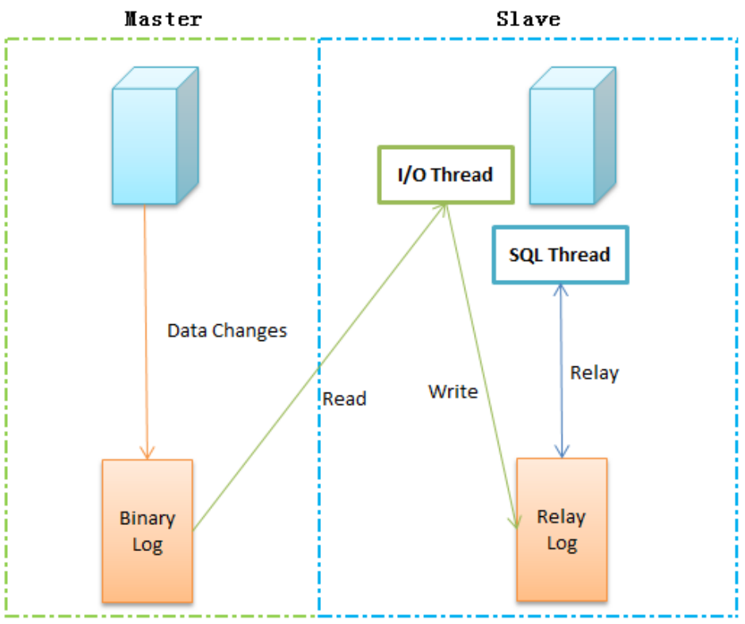

第三部分 Docker运维管理

# 1 安装mysql

## 1.1 主从复制

使用mysql官方提供的镜像制作主从复制集群配置。

**概念**

将主数据库的增删改查等操作记录到二进制日志文件中，从库接收主库日志文件，根据最后一次更新的起始位置，同步复制到从数据库中，使得主从数据库保持一致。

**作用**

- 高可用性：主数据库异常可切换到从数据库
- 负载均衡：实现读写分离
- 备份：进行日常备份

**过程**



**Binary log：主从数据库的二进制日志；Relay log：从服务器的中继日志。**

复制过程：

1. 主数据库在每次事务完成前，将该操作记录到binlog日志文件中；
2. 从数据库中有一个 I/O 线程，负责连接主数据库服务，并读取binlog日志变化，如果发现有新的变动，则将变动写入 relay-log，否则进入休眠状态；
3. 从数据库中的SQL Thread 读取中继日志，并串行执行SQL事件，使得从数据与主数据库始终保持一致。

注意事项：

1. 涉及时间函数时，会出现数据不一致，原因是，复制过程的两次IO操作和网络、磁盘效率等问题势必导致时间戳不一致
2. 涉及系统函数时，会出现不一致


## 1.2 节点信息

服务器用户名：root，密码：123456

| 主机名          | IP地址        |
| --------------- | ------------- |
| mysql-server-83 | 192.168.31.83 |
| mysql-agent-84  | 192.168.31.84 |


## 1.3 基础镜像

```shell
docker pull mysql:5.7.31
docker load -i mysql.5.7.31.tar
```


## 1.4 master-83

### 1.4.1 my.cnf

```shell
mkdir -p /data/mysql/master
cd /data/mysql/master

vi my.cnf

[mysqld]
#[必须]启用二进制日志 
log-bin=mysql-bin
#[必须]服务器唯一ID，默认是110，一般取IP最后一段，这里看情况分配 
server-id=10
```

### 1.4.2 Dockerfile

```dockerfile
FROM mysql:5.7.31 
# 作者信息
MAINTAINER mysql from date UTC by Asia/Shanghai "turbine@turbo.com" ENV TZ Asia/Shanghai
COPY my.cnf /etc/mysql/
```

### 1.4.3 制作镜像

```shell
docker build --rm -t turbo/mysqlmaster:5.7.31 .
```


### 1.4.4 运行镜像

```shell
docker run -itd --name mysql --restart always --privileged=true -p 3306:3306 -e MYSQL_ROOT_PASSWORD=admin turbo/mysqlagent:5.7.31 --character-set-server=utf8 --collation-server=utf8_general_ci

docker logs -f mysql 

进入mysql容器
docker exec -it mysql bash 

查看mysql容器linux版本
cat /etc/issue
返回信息为Debian GNU/Linux 10 \n \l 
确定linux版本为Debian 10
```


### 1.4.5 测试mysql

在容器内测试 mysql

```shell
登录
mysql mysql -uroot -p

输入密码
admin

use mysql; 
show databases; 
退出mysql
exit

退出容器
exit
```


## 1.5 agent-84

### 1.5.1 my.cnf

```shell
mkdir -p /data/mysql/agent
cd /data/mysql/agent

vi my.cnf

[mysqld]
#[必须]启用二进制日志 
log-bin=mysql-bin
#[必须]服务器唯一ID，默认是111，一般取IP最后一段，这里看情况分配 
server-id=11
```

### 1.5.2 Dockerfile

```dockerfile
FROM mysql:5.7.31 
# 作者信息
MAINTAINER mysql from date UTC by Asia/Shanghai "turbine@turbo.com" ENV TZ Asia/Shanghai
COPY my.cnf /etc/mysql/
```

### 1.5.3 制作镜像

```
docker build --rm -t turbo/mysqlagent:5.7.31 .
```

### 1.5.4 运行镜像

```shell
docker run -itd --name=mysql --restart always --privileged=true -p 3306:3306 -e MYSQL_ROOT_PASSWORD=admin turbo/mysqlagent:5.7.31 --character-set-server=utf8 --collation-server=utf8_general_ci

docker logs -f mysql 

进入mysql容器
docker exec -it mysql bash 

查看mysql容器linux版本
cat /etc/issue
返回信息为Debian GNU/Linux 10 \n \l 
确定linux版本为Debian 10
```

### 1.5.5 测试mysql

```shell
登录
mysql mysql -uroot -p

输入密码
admin
use mysql; 
show databases; 
退出mysql
exit

退出容器
exit
```


## 1.6 navicat

### 1.6.1 master-83

使用navicat客户端登录mysqlmaster-83节点，进行如下配置

```shell
#创建同步账户以及授权
create user 'turbo'@'%' identified by 'turbo'; 
grant replication slave on *.* to 'turbo'@'%'; 
flush privileges;

# 出现 [Err] 1055 - Expression #1 of ORDER BY clause is not in GROUP BY 错误的解决方案
# 在 my.cnf 配置文件中设置，然后重新制作镜像
sql_mode='STRICT_TRANS_TABLES,NO_ZERO_IN_DATE,NO_ZERO_DATE,ERROR_FOR_DIVISION_BY_ZERO,NO_AUTO_CREATE_USER,NO_ENGINE_SUBSTITUTION'


#查看master状态
show master status;

#查看二进制日志相关的配置项
show global variables like 'binlog%'; 

#查看server相关的配置项
show global variables like 'server%';
```


### 1.6.2 agent-84

使用navicat客户端登录mysqlagent-84节点，进行如下配置

```shell
#设置master相关信息
CHANGE MASTER TO
master_host='192.168.31.83',
master_user='turbo',
master_password='turbo',
master_port=3306,
master_log_file='mysql-bin.000003',
master_log_pos=741;
#启动同步 
start slave;

#查看master状态
show slave status;
```


## 1.7 主从测试

以下操作全部在master-83客户端中完成。agent-84客户端刷新查看即可。

```
测试步骤如下：    
   1.创建数据库    
      turbo
   2.创建表   
      tbuser
   3.增加数据
```


## 1.8 创建数据库

https://gitee.com/turboYuu/docker-8-1/blob/master/lab/docker-demo/src/main/resources/sql/turbo.sql

## 1.9 bitnami/mysql

### 1.9.1 官网地址

```html
https://hub.docker.com/r/bitnami/mysql
```


### 1.9.2 注意事项

**mysql主从复制中已经使用3306端口。bitnami/mysql测试用3307端口。如果需要挂载数据卷需要为目录授权**

### 1.9.3 节点信息

| 主机名          | IP地址        |
| --------------- | ------------- |
| mysql-server-83 | 192.168.31.83 |
| mysql-agent-84  | 192.168.31.84 |

### 1.9.4 基础镜像

```shell
docker pull bitnami/mysql:5.7.30
docker load -i bitnami.mysql.5.7.30.tar
```


### 1.9.5 master

```shell
运行master容器
docker run -itd --name mysql-master \  
 -p 3307:3306 \
 -e MYSQL_ROOT_PASSWORD=admin \
 -e MYSQL_REPLICATION_MODE=master \  
 -e MYSQL_REPLICATION_USER=turbo \
 -e MYSQL_REPLICATION_PASSWORD=turbo \ 
 bitnami/mysql:5.7.30
 
 
运行master容器并导入数据库。     
docker run -itd --name mysql-master \  
 -p 3307:3306 \
 -e MYSQL_ROOT_PASSWORD=admin \
 -e MYSQL_REPLICATION_MODE=master \  
 -e MYSQL_REPLICATION_USER=turbo \
 -e MYSQL_REPLICATION_PASSWORD=turbo \
 -v /data/bitnamimysql/docker-entrypoint-initdb.d:/docker-entrypoint-initdb.d \ 
 bitnami/mysql:5.7.30  
```


### 1.9.6 agent

```shell
docker run -itd --name mysql-slave \  
 -p 3307:3306 \
 -e MYSQL_REPLICATION_MODE=slave \
 -e MYSQL_REPLICATION_USER=turbo \
 -e MYSQL_REPLICATION_PASSWORD=turbo \ 
 -e MYSQL_MASTER_HOST=192.168.31.83 \  
 -e MYSQL_MASTER_ROOT_PASSWORD=admin \  
 -e MYSQL_MASTER_PORT_NUMBER=3307 \
 bitnami/mysql:5.7.30
```


## 1.10 主主复制

PXC模式，没有主从之后，每个数据库都可以进行读写，数据可以保持强一致性，执行时间较慢，由于一般是强一致性，所以一般用于存储重要的信息。

### 1.10.1 简介


#### 1.10.1.1 PXC优点

#### 1.10.1.2 PXC缺点

### 1.10.2 官网地址

```html
https://hub.docker.com/r/percona/percona-xtradb-cluster
```


### 1.10.3 节点信息

**本案例只使用mysqlserver-83服务器端点**

| 主机名          | IP地址        |
| --------------- | ------------- |
| mysql-server-83 | 192.168.31.83 |

### 1.10.4 官方镜像

```shell
docker pull percona/percona-xtradb-cluster:5.7.30
docker pull percona/percona-xtradb-cluster:5.7

docker load -i percona-xtradb-cluster.5.7.30.tar

如果觉得pxc镜像自带的PXC名字过长，我们可以将他的名字进行修改，方便使用 
docker tag percona/percona-xtradb-cluster:5.7.30 pxc:5.7.30
```


### 1.10.5 注意事项

1. **mysql主从复制中已经使用3306端口。pxc测试使用3301、3302、3303端口**
2. **主要复习docker-compose使用**
3. **在mysqlmaster-83节点完成配置。如果需要部署多台服务器，推荐使用docker-swarm集群方式**。

### 1.10.6 实现步骤

**学习重点**：**以docker-compose方式安装pxc集群**

每个PXC节点内部包含一个mysql实例，如果需要创建包含3个数据库节点的数据库集群，那么就要创建3个pxc节点。储与安全考虑，需要给PXC集群实例创建一个Docker内部网络。

```
第一步：拉取镜像
docker pull percona/percona-xtradb-cluster:5.7.30

第二步：复制重命名镜像（可选）
docker tag percona/percona-xtradb-cluster:5.7.30 pxc:5.7.30
```


### 1.10.7 docker-compose方式

#### 1.10.7.1 挂载卷

#### 1.10.7.2 修改pxc镜像名称

#### 1.10.7.3 创建网络

#### 1.10.7.4 master

#### 1.10.7.5 agent

#### 1.10.7.6 注意事项

# 2 安装elasticsearch

# 3 安装fastDFS

# 4 安装gitlab

# 5 Swarm集群管理

# 6 harbor企业级部署