第三部分 Docker运维管理

# 1 安装mysql

## 1.1 主从复制

使用mysql官方提供的镜像制作主从复制集群配置。

**概念**

将主数据库的增删改查等操作记录到二进制日志文件中，从库接收主库日志文件，根据最后一次更新的起始位置，同步复制到从数据库中，使得主从数据库保持一致。

**作用**

- 高可用性：主数据库异常可切换到从数据库
- 负载均衡：实现读写分离
- 备份：进行日常备份

**过程**


**Binary log：主从数据库的二进制日志；Relay log：从服务器的中继日志。**

复制过程：

1. 主数据库在每次事务完成前，将该操作记录到binlog日志文件中；
2. 从数据库中有一个 I/O 线程，负责连接主数据库服务，并读取binlog日志变化，如果发现有新的变动，则将变动写入 relay-log，否则进入休眠状态；
3. 从数据库中的SQL Thread 读取中继日志，并串行执行SQL事件，使得从数据与主数据库始终保持一致。

注意事项：

1. 涉及时间函数时，会出现数据不一致，原因是，复制过程的两次IO操作和网络、磁盘效率等问题势必导致时间戳不一致
2. 涉及系统函数时，会出现不一致


## 1.2 节点信息

服务器用户名：root，密码：123456

| 主机名          | IP地址        |
| --------------- | ------------- |
| mysql-server-83 | 192.168.31.83 |
| mysql-agent-84  | 192.168.31.84 |


## 1.3 基础镜像

```shell
docker pull mysql:5.7.31
docker load -i mysql.5.7.31.tar
```


## 1.4 master-83

### 1.4.1 my.cnf

```shell
mkdir -p /data/mysql/master
cd /data/mysql/master

vi my.cnf

[mysqld]
#[必须]启用二进制日志 
log-bin=mysql-bin
#[必须]服务器唯一ID，默认是110，一般取IP最后一段，这里看情况分配 
server-id=10
```

### 1.4.2 Dockerfile

```dockerfile
FROM mysql:5.7.31 
# 作者信息
MAINTAINER mysql from date UTC by Asia/Shanghai "turbine@turbo.com" ENV TZ Asia/Shanghai
COPY my.cnf /etc/mysql/
```

### 1.4.3 制作镜像

```shell
docker build --rm -t turbo/mysqlmaster:5.7.31 .
```


### 1.4.4 运行镜像

```shell
docker run -itd --name mysql --restart always --privileged=true -p 3306:3306 -e MYSQL_ROOT_PASSWORD=admin turbo/mysqlagent:5.7.31 --character-set-server=utf8 --collation-server=utf8_general_ci

docker logs -f mysql 

进入mysql容器
docker exec -it mysql bash 

查看mysql容器linux版本
cat /etc/issue
返回信息为Debian GNU/Linux 10 \n \l 
确定linux版本为Debian 10
```


### 1.4.5 测试mysql

在容器内测试 mysql

```shell
登录
mysql mysql -uroot -p

输入密码
admin

use mysql; 
show databases; 
退出mysql
exit

退出容器
exit
```


## 1.5 agent-84

### 1.5.1 my.cnf

```shell
mkdir -p /data/mysql/agent
cd /data/mysql/agent

vi my.cnf

[mysqld]
#[必须]启用二进制日志 
log-bin=mysql-bin
#[必须]服务器唯一ID，默认是111，一般取IP最后一段，这里看情况分配 
server-id=11
```

### 1.5.2 Dockerfile

```dockerfile
FROM mysql:5.7.31 
# 作者信息
MAINTAINER mysql from date UTC by Asia/Shanghai "turbine@turbo.com" ENV TZ Asia/Shanghai
COPY my.cnf /etc/mysql/
```

### 1.5.3 制作镜像

```
docker build --rm -t turbo/mysqlagent:5.7.31 .
```

### 1.5.4 运行镜像

```shell
docker run -itd --name=mysql --restart always --privileged=true -p 3306:3306 -e MYSQL_ROOT_PASSWORD=admin turbo/mysqlagent:5.7.31 --character-set-server=utf8 --collation-server=utf8_general_ci

docker logs -f mysql 

进入mysql容器
docker exec -it mysql bash 

查看mysql容器linux版本
cat /etc/issue
返回信息为Debian GNU/Linux 10 \n \l 
确定linux版本为Debian 10
```

### 1.5.5 测试mysql

```shell
登录
mysql mysql -uroot -p

输入密码
admin
use mysql; 
show databases; 
退出mysql
exit

退出容器
exit
```


## 1.6 navicat

### 1.6.1 master-83

使用navicat客户端登录mysqlmaster-83节点，进行如下配置

```shell
#创建同步账户以及授权
create user 'turbo'@'%' identified by 'turbo'; 
grant replication slave on *.* to 'turbo'@'%'; 
flush privileges;

# 出现 [Err] 1055 - Expression #1 of ORDER BY clause is not in GROUP BY 错误的解决方案
# 在 my.cnf 配置文件中设置，然后重新制作镜像
sql_mode='STRICT_TRANS_TABLES,NO_ZERO_IN_DATE,NO_ZERO_DATE,ERROR_FOR_DIVISION_BY_ZERO,NO_AUTO_CREATE_USER,NO_ENGINE_SUBSTITUTION'


#查看master状态
show master status;

#查看二进制日志相关的配置项
show global variables like 'binlog%'; 

#查看server相关的配置项
show global variables like 'server%';
```


### 1.6.2 agent-84

使用navicat客户端登录mysqlagent-84节点，进行如下配置

```shell
#设置master相关信息
CHANGE MASTER TO
master_host='192.168.31.83',
master_user='turbo',
master_password='turbo',
master_port=3306,
master_log_file='mysql-bin.000003',
master_log_pos=741;
#启动同步 
start slave;

#查看master状态
show slave status;
```


## 1.7 主从测试

以下操作全部在master-83客户端中完成。agent-84客户端刷新查看即可。

```
测试步骤如下：    
   1.创建数据库    
      turbo
   2.创建表   
      tbuser
   3.增加数据
```


## 1.8 创建数据库

https://gitee.com/turboYuu/docker-8-1/blob/master/lab/docker-demo/src/main/resources/sql/turbo.sql

## 1.9 bitnami/mysql

### 1.9.1 官网地址

```html
https://hub.docker.com/r/bitnami/mysql
```


### 1.9.2 注意事项

**mysql主从复制中已经使用3306端口。bitnami/mysql测试用3307端口。如果需要挂载数据卷需要为目录授权**

### 1.9.3 节点信息

| 主机名          | IP地址        |
| --------------- | ------------- |
| mysql-server-83 | 192.168.31.83 |
| mysql-agent-84  | 192.168.31.84 |

### 1.9.4 基础镜像

```shell
docker pull bitnami/mysql:5.7.30
docker load -i bitnami.mysql.5.7.30.tar
```


### 1.9.5 master

```shell
运行master容器
docker run -itd --name mysql-master \
 -p 3307:3306 \
 -e MYSQL_ROOT_PASSWORD=admin \
 -e MYSQL_REPLICATION_MODE=master \
 -e MYSQL_REPLICATION_USER=turbo \
 -e MYSQL_REPLICATION_PASSWORD=turbo \
 bitnami/mysql:5.7.30
 
运行master容器并导入数据库。     
docker run -itd --name mysql-master \  
 -p 3307:3306 \
 -e MYSQL_ROOT_PASSWORD=admin \
 -e MYSQL_REPLICATION_MODE=master \  
 -e MYSQL_REPLICATION_USER=turbo \
 -e MYSQL_REPLICATION_PASSWORD=turbo \
 -v /data/bitnamimysql/docker-entrypoint-initdb.d:/docker-entrypoint-initdb.d \ 
 bitnami/mysql:5.7.30  
```


### 1.9.6 agent

root账户的密码：admin

```shell
docker run -itd --name mysql-slave \
 -p 3307:3306 \
 -e MYSQL_REPLICATION_MODE=slave \
 -e MYSQL_REPLICATION_USER=turbo \
 -e MYSQL_REPLICATION_PASSWORD=turbo \
 -e MYSQL_MASTER_HOST=192.168.31.83 \
 -e MYSQL_MASTER_ROOT_PASSWORD=admin \
 -e MYSQL_MASTER_PORT_NUMBER=3307 \
 bitnami/mysql:5.7.30
```


## 1.10 主主复制

PXC模式，没有主从之后，每个数据库都可以进行读写，数据可以保持强一致性，执行时间较慢，由于一般是强一致性，所以一般用于存储重要的信息。

### 1.10.1 简介


#### 1.10.1.1 PXC优点

#### 1.10.1.2 PXC缺点

### 1.10.2 官网地址

```html
https://hub.docker.com/r/percona/percona-xtradb-cluster
```


### 1.10.3 节点信息

**本案例只使用mysqlserver-83服务器端点**，(如果多台服务器，就涉及docker集群网络)

| 主机名          | IP地址        |
| --------------- | ------------- |
| mysql-server-83 | 192.168.31.83 |

### 1.10.4 官方镜像

```shell
# 高版本在采用数据卷挂载时，要对数据据目录进行授权
docker pull percona/percona-xtradb-cluster:5.7.30
docker pull percona/percona-xtradb-cluster:5.7

docker load -i percona-xtradb-cluster.5.7.30.tar

如果觉得pxc镜像自带的PXC名字过长，我们可以将他的名字进行修改，方便使用 
docker tag percona/percona-xtradb-cluster:5.7.30 pxc:5.7.30
```


### 1.10.5 注意事项

1. **mysql主从复制中已经使用3306端口。pxc测试使用3301、3302、3303端口**
2. **主要复习docker-compose使用**
3. **在mysqlmaster-83节点完成配置。如果需要部署多台服务器，推荐使用docker-swarm集群方式**。

### 1.10.6 实现步骤

**学习重点**：**以docker-compose方式安装pxc集群**

每个PXC节点内部包含一个mysql实例，如果需要创建包含3个数据库节点的数据库集群，那么就要创建3个pxc节点。出于安全考虑，需要给PXC集群实例创建一个Docker内部网络。

```shell
第一步：拉取镜像
docker pull percona/percona-xtradb-cluster:5.7.30

第二步：复制重命名镜像（可选）
docker tag percona/percona-xtradb-cluster:5.7.30 pxc:5.7.30

第三步：删除pxc原来的镜像（可选）
docker rmi percona/percona-xtradb-cluster:5.7.30 

第四步：创建单独网络（可选）
docker network create --subnet=172.18.0.0/24 pxc-net 

第五步：准备三个数据卷。注意要给目录授权。开发环境777
docker volume create --name v1
docker volume create --name v2
docker volume create --name v3

第六步：创建第一个节点
docker run -d -p 3301:3306 -v v1:/var/lib/mysql -e MYSQL_ROOT_PASSWORD=admin -e CLUSTER_NAME=PXC -e XTRABACKUP_PASSWORD=turbine - -privileged --name=node1 --net=pxc-net --ip 172.18.0.2 pxc:5.7.30

第七步：等待节点一完全启动后，创建另外两个节点（第六步成功后）
docker run -d -p 3302:3306 -v v2:/var/lib/mysql -e MYSQL_ROOT_PASSWORD=admin -e CLUSTER_NAME=PXC -e XTRABACKUP_PASSWORD=turbine -e CLUSTER_JOIN=node1 -- privileged --name=node2 --net=pxc-net --ip 172.18.0.3 pxc:5.7.30

docker run -d -p 3303:3306 -v v3:/var/lib/mysql -e MYSQL_ROOT_PASSWORD=admin -e CLUSTER_NAME=PXC -e XTRABACKUP_PASSWORD=turbine -e CLUSTER_JOIN=node1 -- privileged --name=node3 --net=pxc-net --ip 172.18.0.4 pxc:5.7.30

完成：实现了3个节点的自动复制
```


### 1.10.7 docker-compose方式

#### 1.10.7.1 挂载卷

```shell
mkdir -p /data/pxc 
cd /data/pxc
mkdir -p v1 v2 v3 master agent 

对/data/pxc/目录及所有子目录授权
chmod 777 -R /data/pxc
```


#### 1.10.7.2 修改pxc镜像名称

```shell
docker tag percona/percona-xtradb-cluster:5.7.30 pxc:5.7.30
```


#### 1.10.7.3 创建网络

master和agent是两份docker-compose.yml文件，需要公用一个网络。网络需要提前创建

```shell
docker network create pxc_network --driver bridge 
docker network ls
```


#### 1.10.7.4 master

docker-compose.yml

```yaml
version: '3'
services:
  pxc01:
    restart: always
    image: pxc:5.7.30
    container_name: pxc01
    privileged: true
    ports:
      - 3301:3306
    environment:
      - MYSQL_ROOT_PASSWORD=admin
      - CLUSTER_NAME=pxc
    volumes:
      - /data/pxc/v1:/var/lib/mysql
networks:
  default:
    external:
      name: pxc_network
```

```shell
# /data/pxc/master 目录下，启动服务
docker-compose up -d
```


#### 1.10.7.5 agent

docker-compose.yml

```yaml
version: '3'
services:
  pxc02:
    restart: always
    image: pxc:5.7.30
    container_name: pxc02
    privileged: true
    ports:
      - 3302:3306
    environment:
      - MYSQL_ROOT_PASSWORD=admin
      - CLUSTER_NAME=pxc
      - CLUSTER_JOIN=pxc01
    volumes:
      - /data/pxc/v2:/var/lib/mysql
  pxc03:
    restart: always
    image: pxc:5.7.30
    container_name: pxc03
    privileged: true
    ports:
      - 3303:3306
    environment:
      - MYSQL_ROOT_PASSWORD=admin
      - CLUSTER_NAME=pxc
      - CLUSTER_JOIN=pxc01
    volumes:
      - /data/pxc/v3:/var/lib/mysql
networks:
  default:
    external:
      name: pxc_network
```

```shell
# /data/pxc/agent 目录下，启动服务
docker-compose up -d
```


#### 1.10.7.6 测试集群

navicat客户端中执行SQL语句

```sql
show status like 'wsrep_cluster%';
```


#### 1.10.7.7 注意事项

1. 一定要等到`master`（第一个节点）节点起来，在进行启动`agent`（其他节点）节点之间不能相互注册
2. `pxc`节点不能太多，不然会把整体的性能降低
3. `pxc`节点之间的服务器配置一致
4. `pxc`集群只支持`innoDB`引擎
5. docker-compose 网络

```yaml
1.新建网络：新建一个名称为front的bridge类型网络。但是在实际创建过程中。
docker-compose会默认 增加docker-compose.yml文件所在目录名称+front的网络。
例如：pxc/docker-compose.yml
实际创建网络名称为：pxc-front。不是很符合开发要求。

networks:
  front:
    driver: bridge
    
2.使用已存在的网络：    
  2.1创建网络：
  docker network create pxc_network --driver bridge    
  2.2使用已存在的网络
  networks:
    default:
      external:
        name: pxc_network
```


# 2 安装elasticsearch

## 2.1 docker官网

```html
https://hub.docker.com/_/elasticsearch
https://hub.docker.com/_/kibana
https://hub.docker.com/_/logstash
```


## 2.2 ELK官网

```shell
https://www.elastic.co/guide/en/elasticsearch/reference/current/docker.html 
es集群部署请参考官网帮助文档，自行练习。
```


## 2.3 基础镜像

### 2.3.1 ELK官网镜像

```shell
docker pull docker.elastic.co/elasticsearch/elasticsearch:7.7.0 
docker pull bolingcavalry/elasticsearch-head:6
```


### 2.3.2 注意事项

1. 开发环境 下载 docker官网或者elastic官方仓库里的镜像都可以
2. 运维环境大咖们推荐不要下载docker官方的镜像，最好使用elastic官方仓库里的镜像

### 2.3.3 docker官网镜像

```shell
docker pull elasticsearch:7.7.0
docker pull kibana:7.7.0
docker pull bolingcavalry/elasticsearch-head:6
```


## 2.4 前置条件

### 2.4.1 文件创建数

修改Linux系统的限制配置，将文件创建数改为65536个：

1. 修改系统中允许应用最多创建多少文件等的限制权限。Linux默认来说，一般限制应用最多创建的文件是65535个。但是ES至少需要65536的文件创建数的权限
2. 修改系统中允许用户启动的进程开启多少个线程。默认的Linux限制root用户开启的进程可以开启任意数量的线程，其他用户开启的进程可以开启1024个线程。必须修改限制数为 4096+。因为ES至少需要4096个线程池预备。

```shell
vi /etc/security/limits.conf 
#新增如下内容在limits.conf文件中 
es soft nofile 65536
es hard nofile 65536 
es soft nproc 4096 
es hard nproc 4096
```


### 2.4.2 系统控制权限

修改系统控制权限，ElasticSearch需要开辟一个65536字节以上的虚拟内存。Linux默认不允许任何用户和应用程序直接开辟这么大的虚拟内存。

```shell
vi /etc/sysctl.conf
添加参数:新增如下内容在sysctl.conf文件中，当前用户拥有的内存权限大小 

vm.max_map_count=262144

重启生效:让系统控制权限配置生效 
sysctl -p
```


## 2.5 试运行

```shell
docker run -itd --name elasticsearch -p 9200:9200 -p 9300:9300  -e "discovery.type=single-node" elasticsearch:7.7.0

docker cp elasticsearch:/usr/share/elasticsearch/config/elasticsearch.yml /data
```

### 2.5.1 elasticsearch.yml

```yaml
cluster.name: "docker-cluster" 
network.host: 0.0.0.0
http.cors.enabled: true 
http.cors.allow-origin: "*"
```


## 2.6 制作镜像

1. Dockerfile

   /data 目录下 ，和elasticsearch.yml在同一个目录下

   ```dockerfile
   FROM elasticsearch:7.7.0
   MAINTAINER elasticsearch-zh from date UTC by Asia/Shanghai "turbine@turbo.com"
   ENV TZ Asia/Shanghai
   COPY elasticsearch.yml /usr/share/elasticsearch/config/
   ```

   

2. docker build

   ```shell
   docker build --rm -t turbo/elasticsearch:7.7.0 .
   ```


## 2.7 docker-compose

1. 挂载目录权限

   ```shell
   mkdir -p /data/elasticsearch 
   chmod 777 -R /data/elasticsearch
   ```

2. docker-compose.yml

   ```yaml
   version: '3'
   services:
     elasticsaerch:
       image: turbo/elasticsearch:7.7.0
       container_name: elasticsearch770
       ports:
         - 9200:9200
         - 9300:9300
       environment:
         - "discovery.type=single-node"
         - "ES_JAVA_OPTS=-Xms2048m -Xmx2048m"
       restart: always
       volumes:
         - "/data/elasticsearch/data:/usr/share/elasticsearch/data"
         - "/data/elasticsearch/plugins:/usr/share/elasticsearch/plugins"
     kibana:
       image: kibana:7.7.0
       container_name: kibana7
       ports:
         - 5601:5601
       restart: always
       depends_on:
         - elasticsaerch
     elasticsearchhead:
       image: bolingcavalry/elasticsearch-head:6
       container_name: elasticsearchhead
       environment:
         - "TZ=Asia/Shanghai"
       ports:
         - 9100:9100
       restart: always
       depends_on:
         - elasticsaerch
   ```

3. 启动服务

   ```
   docker-compose up -d
   ```

   

## 2.8 访问测试

```
http://192.168.198.100:9200
http://192.168.198.100:9100
http://192.168.198.100:5601
```

**kibana启动报错**

```
{"type":"log","@timestamp":"2022-01-31T10:55:23Z","tags":["warning","elasticsearch","data"],"pid":6,"message":"No living connections"}
{"type":"log","@timestamp":"2022-01-31T10:55:23Z","tags":["warning","plugins","licensing"],"pid":6,"message":"License information could not be obtained from Elasticsearch due to Error: No Living connections error"}

 FATAL  Error: Setup lifecycle of "monitoring" plugin wasn't completed in 30sec. Consider disabling the plugin and re-start.
```

[Install Kibana with Docker - elastic官网Doc](https://www.elastic.co/guide/en/kibana/7.7/docker.html)

那就要制作kibana镜像了，首先 `docker-compose down`删除刚启动的容器，然后将容器中的kibana.yml配置文件复制出来

```shell
docker cp kibana7:/usr/share/kibana/config/kibana.yml /data
```

编辑kibana.yml配置文件中的 ip地址

```yaml
vim kibana.yml
#
# ** THIS IS AN AUTO-GENERATED FILE **
#

# Default Kibana configuration for docker target
server.name: kibana
server.host: "0"
elasticsearch.hosts: [ "http://192.168.1.81:9200" ]
monitoring.ui.container.elasticsearch.enabled: true
```

编辑Dockerfile文件

```dockerfile
FROM kibana:7.7.0
MAINTAINER kibana-zh from date UTC by Asia/Shanghai "turbine@turbo.com"

COPY kibana.yml /usr/share/kibana/config/
```

制作turbo/kibana:7.7.0镜像

```shell
docker build --rm -t turbo/kibana:7.7.0 .
```

修改docker-compose.yml文件，kibana镜像使用自己制作出来的镜像

```yaml
version: '3'
services:
  elasticsaerch:
    image: turbo/elasticsearch:7.7.0
    container_name: elasticsearch770
    ports:
      - 9200:9200
      - 9300:9300
    environment:
      - "discovery.type=single-node"
      - "ES_JAVA_OPTS=-Xms2048m -Xmx2048m"
    restart: always
    volumes:
      - "/data/elasticsearch/data:/usr/share/elasticsearch/data"
      - "/data/elasticsearch/plugins:/usr/share/elasticsearch/plugins"
  kibana:
    image: turbo/kibana:7.7.0
    container_name: kibana7
    ports:
      - 5601:5601
    restart: always
    depends_on:
      - elasticsaerch
  elasticsearchhead:
    image: bolingcavalry/elasticsearch-head:6
    container_name: elasticsearchhead
    environment:
      - "TZ=Asia/Shanghai"
    ports:
      - 9100:9100
    restart: always
    depends_on:
      - elasticsaerch
```

启动服务

```shell
docker-compose up -d
```

再测试一下就可以了。

## 2.9 ik分词

### 2.9.1 官网地址

```html
https://github.com/medcl/elasticsearch-analysis-ik
```

### 2.9.2 安装分词器

```shell
cd /data/elasticsearch/plugins 
mkdir -p ik

unzip elasticsearch-analysis-ik-7.7.0.zip
```

### 2.9.3 重启es

```shell
docker-compose restart
```


# 3 安装fastDFS

## 3.1 安装条件

至少需要2G以上内存

## 3.2 github官网地址

```html
https://github.com/happyfish100/ 

帮助手册地址：
https://github.com/happyfish100/fastdfs/wiki
```


## 3.3 自定义镜像

官网提供docker镜像制作素材，但是需要更改Dockerfile文件及source目录中的软件包。将官方下载的fastfs-6.06.tar.gz解压缩，里面有docker目录，提供单机版和集群版。但是都需要修改才能使用。本章节参考的是dockerfile_local单机版内容。

**下载地址**

```html
https://github.com/happyfish100/fastdfs-nginx-module
https://github.com/happyfish100/libfastcommon
http://nginx.org/download/nginx-1.16.1.tar.gz
```


## 3.5 Dockerfile

Docker文件改动两处内容：

1. **ADD时候的源文件名称，需要增加对应的版本号信息**
2. **cd目录时需要增加对应版本号信息**
3. **基础镜像从centos7升级为centos7.8.2003**

```dockerfile
# centos 7
FROM centos:7.8.2003
# 添加配置文件
# add profiles
ADD conf/client.conf /etc/fdfs/
ADD conf/http.conf /etc/fdfs/
ADD conf/mime.types /etc/fdfs/
ADD conf/storage.conf /etc/fdfs/
ADD conf/tracker.conf /etc/fdfs/
ADD fastdfs.sh /home
ADD conf/nginx.conf /etc/fdfs/
ADD conf/mod_fastdfs.conf /etc/fdfs

# 添加源文件
# add source code
ADD source/libfastcommon-1.0.43.tar.gz /usr/local/src/
ADD source/fastdfs-6.06.tar.gz /usr/local/src/
ADD source/fastdfs-nginx-module-1.22.tar.gz /usr/local/src/
ADD source/nginx-1.16.1.tar.gz /usr/local/src/

# Run
RUN yum install git gcc gcc-c++ make automake autoconf libtool pcre pcre-devel zlib zlib-devel openssl-devel wget vim -y \
  &&  mkdir /home/dfs   \
  &&  cd /usr/local/src/  \
  &&  cd libfastcommon-1.0.43/   \
  &&  ./make.sh && ./make.sh install  \
  &&  cd ../  \
  &&  cd fastdfs-6.06/   \
  &&  ./make.sh && ./make.sh install  \
  &&  cd ../  \
  &&  cd nginx-1.16.1/  \
  &&  ./configure --add-module=/usr/local/src/fastdfs-nginx-module-1.22/src/   \
  &&  make && make install  \
  &&  chmod +x /home/fastdfs.sh


# export config
VOLUME /etc/fdfs


EXPOSE 22122 23000 8888 80
ENTRYPOINT ["/home/fastdfs.sh"]
```


## 3.6 制作镜像

```shell
docker build --rm -t lagou/fastdfs:1.0 .
```


## 3.7 启动镜像

按照官网提供的方式启动，springboot项目会报找不到127.0.0.1:23000端口，需要使用--net=host方式启动


# 4 安装gitlab

## 4.1 docker官网地址

```html
https://hub.docker.com/r/gitlab/gitlab-ce
```


## 4.2 官网教程

```html
https://docs.gitlab.com/omnibus/docker/
```


## 4.3 基础镜像

```shell
英文版
docker pull gitlab/gitlab-ce:12.7.6-ce.0 

中文版
docker pull twang2218/gitlab-ce-zh:11.1.4 

最新版:不是很稳定的版本
docker pull gitlab/gitlab-ce:13.4.6-ce.0
```


## 4.5 运行容器

```shell
运行镜像：运行时间比较长，大约需要3-10分钟。可以查看日志情况。
docker run -itd --name gitlab -p 443:443 -p 80:80 -p 222:22 --restart always -m 4GB -v /data/gitlab/config:/etc/gitlab -v /data/gitlab/logs:/var/log/gitlab -v /data/gitlab/data:/var/opt/gitlab  -e TZ=Asia/Shanghai  gitlab/gitlab-ce:12.7.6-ce.0
```


## 4.6 配置gitlab

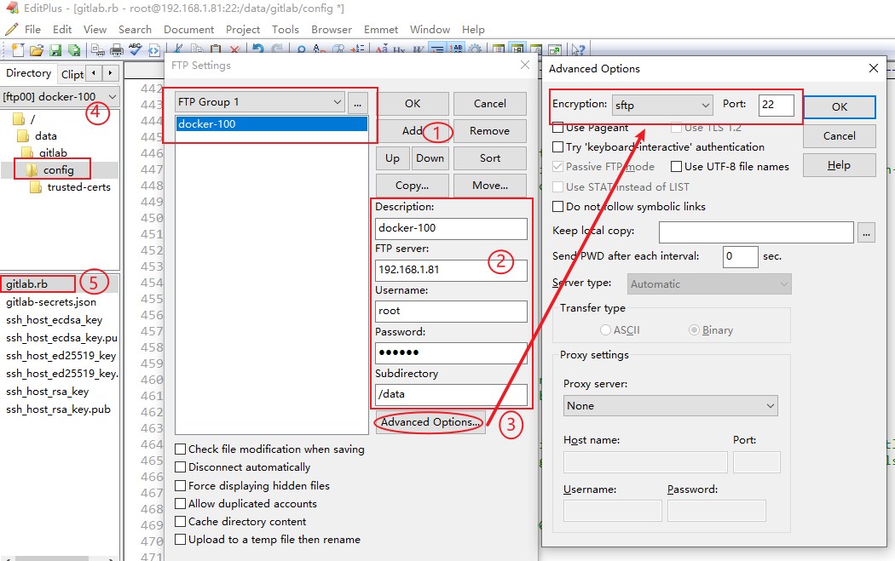

```yaml
配置项目访问地址：
external_url 'http://192.168.31.81' 

配置ssh协议所使用的访问地址和端口
gitlab_rails['gitlab_ssh_host'] = '192.168.31.81'
gitlab_rails['time_zone'] = 'Asia/Shanghai'
gitlab_rails['gitlab_shell_ssh_port'] = 222
```

配置完成后重新启动容器

```
docker restart gitlab
```

```
docker logs -f gitlab
日志中出现错误：master failed to start, check stderr log for details
chmod -R 777 /data/gitlab
然后再重启容器
```


## 4.7 登录gitlab

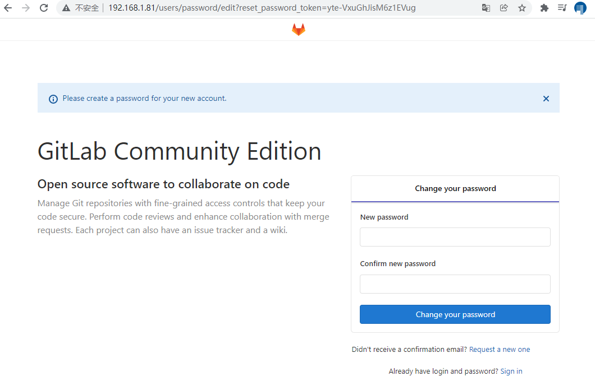

登录gitlab：用户名默认为root。第一次登录需要设置密码。此处将密码设置为12345678

```shell
username: root
password: 12345678
```


## 4.8 创建组

```
组分三类： 
Private：私有的 
Internal：内部的 
Public：公共的
```

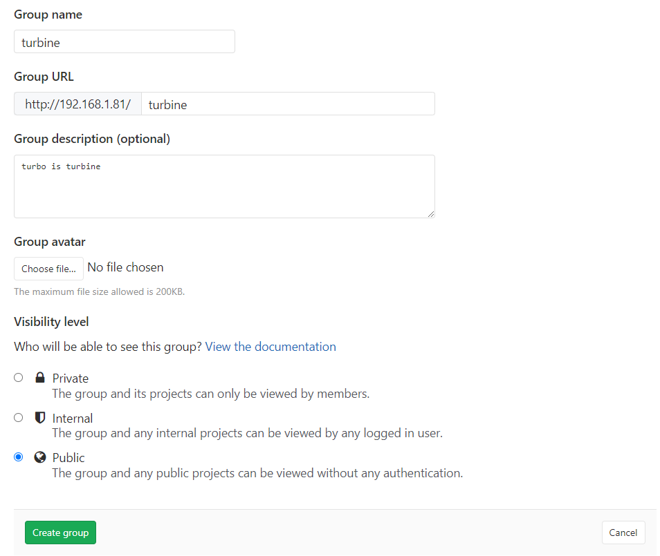

## 4.9 创建项目

```
项目分类：
根据组的分类进行分类。 

创建项目注意事项：
不需要创建README，否则本地项目无法上传到gitlab服务器上。
```

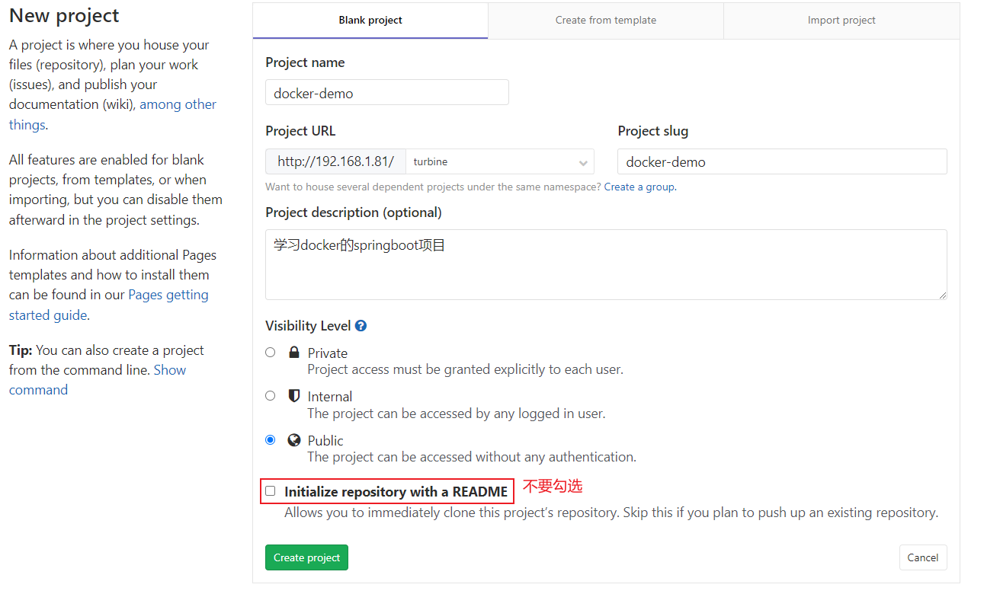

## 4.10 创建用户

```
1.创建用户
用户权限分两种： 
  Regular:普通权限用户
  Admin:具有管理员权限的用户

2.给用户分配密码
```

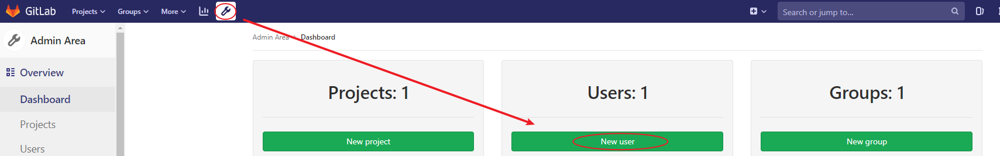


## 4.11 将用户加入群组

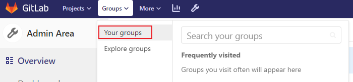

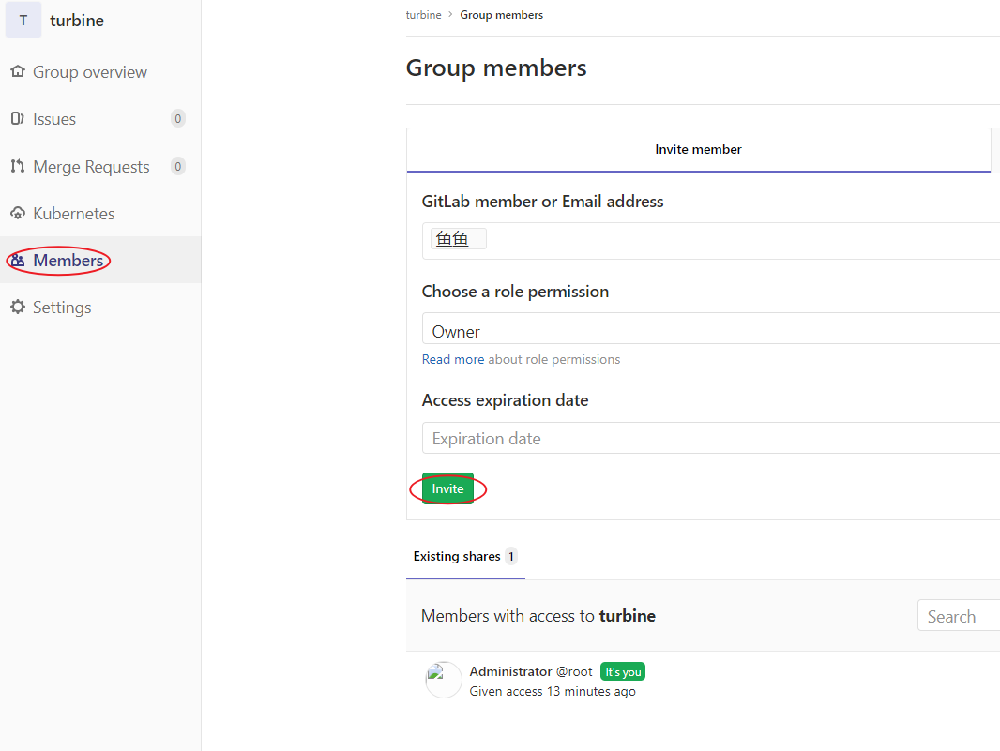

```
给群组中的用户分配权限分五种：
Guest:可以创建issue、发表评论、不能读写版本库。
Reporter:可以克隆代码，不能提交、QA、PM可以赋予这个权限。 
Developer:可以克隆代码、开发、提交、push，普通开发可以赋予这个权限。
Maintainer:可以创建项目、添加tag、保护分支、添加项目成员、编辑项目，核心开发人员可以赋予这个权限。
Owner:可以设置项目访问权限、-Visibility Level、删除项目、迁移项目、管理组成员、开发组组长可以赋予这个权限。
```


## 4.12 上传项目

```
使用idea开发工具演示
1.创建本地仓库
VCS->Enable Version Control Integration...

2.建立缓冲区
项目右键->git->Add

3.将代码提交到本地仓库
项目右键->git->Commit Directory

4.设置远程gitlab仓库地址
项目右键->git->Repository->Remote

5.将本地代码推送到远程gitlab仓库
项目右键->git->Repository->push
```

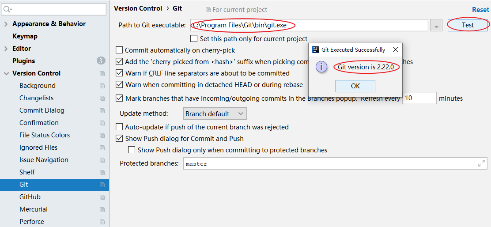

如果 VCS 下 没有 Enable Version Control Integration... ，可在下图中删除。

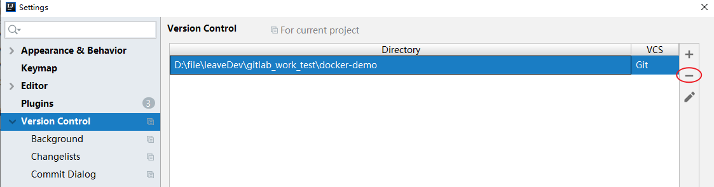

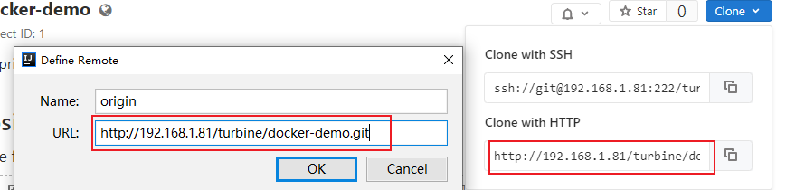

# 5 Swarm集群管理

compose、machine 和 swarm 是 docker 原生提供的三大编排工具。简称 docker 三剑客。

## 5.1 节点信息

服务器用户名：root，服务器密码：123456。及时做好子系统快照

| 主机名     | IP地址        | 说明              |
| ---------- | ------------- | ----------------- |
| manager-01 | 192.168.31.85 | swarm-manager节点 |
| work-01    | 192.168.31.86 | swarm-work01节点  |
| work-02    | 192.168.31.87 | swarm-work02节点  |


## 5.2 硬件要求

| 硬件资源 | 最小配置 | 推荐配置 |
| -------- | -------- | -------- |
| CPU      | 1 CPU    | 2 CPU    |
| 内存     | 1 GB     | 2-4 GB   |
| 硬盘     | 20 GB    | 50 GB    |


## 5.3 当前应用状态


## 5.4 容器化部署=大麻烦

- 怎么保证数据完整性
- 怎么保证客户隐私数据
- 怎么去调度容器
- 怎么去监控追踪容器
- 怎么去更新容器而不影响客户业务
- 如果容器down掉了。怎么自动恢复
- 怎么去管理很多微服务容器
- 怎么根据客户业务需求，快速方便的扩展容器


## 5.5 安装docker-swarm

### 5.5.1 官网概述

```html
https://docs.docker.com/engine/swarm/
```


### 5.5.2 概述

Docker Swarm 和 Docker Compose 一样，都是Docker官方容器编排项目，但不同的是，**Docker Compose是一个在单个服务器或主机上创建多个容器的工具**，可以将组成某个应用的多个docker容器编排在一起，同时管理。而 **Docker Swarm 则可以在多个服务器或主机上创建容器集群服务**，其主要作用是把若干台Docker主机抽象为一个整体，并且通过一个入口（docker stack）统一管理这些Docker主机上的各种Docker资源。

stack 是构成特定环境中的 service 集合，它是自动部署多个相互关联的服务的简便方法，而无需单独定义每个服务。

stack file 是一种 yaml 格式的文件，类似于 docker-compose.yml 文件，它定义了一个或多个服务，并定义了服务的环境变量、部署标签、容器数量以及相关的环境特定配置等。

Docker Swarm由两部分组成：

- Docker 集群：将一个或多个Docker节点组织起来，用户就能以集群的方式进行管理
- 应用编排：有一套API用来部署和管理容器

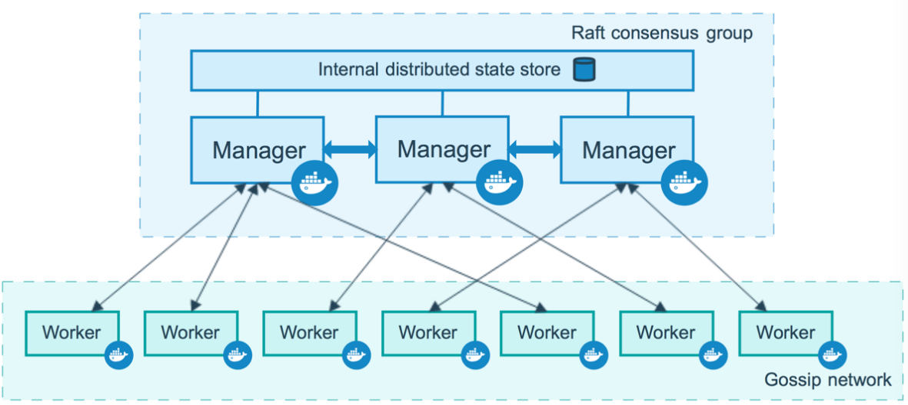


### 5.5.3 配置私有仓库

私有仓库不是集群必备的组件。集群的每个节点都需要安装镜像，如果把搭建私有仓库，下载镜像速度比较耗时

```shell
vi /etc/docker/daemon.json

"insecure-registries":["192.168.31.82:5000"] 

systemctl daemon-reload
systemctl restart docker
```


### 5.5.4 初始化第一个管理节点

关于 advertise-addr 和 listen-addr 这两个参数：

- 前者用来指定其他节点连接mo时的地址
- 后者指定承载swarm流量的IP和端口
- 会在本地新建 docker 网络

```shell
docker swarm init  --advertise-addr 192.168.31.85:2377 --listen-addr 192.168.31.85:2377

docker node ls 
docker network ls
```


### 5.5.5 如何加入新的节点

Docker Swarm 的新节点加入策略是从管理节点获取一长串命令，被称为 join token，任何想加入集群的机器只要自己执行这个 join token 即可加入Swarm集群；

如果有新的管理节点需要加入，在m0执行命令 docker swarm join-token manager 即可得到管理 manager节点的 join token，<br>如果有新的 work 节点需要加入，在m0执行命令 docker swarm join-token worker 即可得到管理 work 节点的 join token。

```shell
在manager节点执行。可以作为manager节点加入集群 
docker swarm join-token manager

在manager节点执行。可以作为worker节点加入集群 
docker swarm join-token worker

docker node ls
```


### 5.5.6 manager节点说明

MANAGER STATUS 列说明：

- Leader 意味着该节点是使得集群的所有群管理和编排决策的主要管理节点
- Reachable 意味着节点是管理者节点正在参与 Raft 共识。如果领导节点不可用，则该节点有资格被选为新领导者。
- Unavailable 意味着节点是不能与其他管理器通信的管理器。如果管理器节点不可用，你应该将新的管理器节点加入集群，或者将工作器节点升级为管理器。


AVAILABILITY列说明：

- Active 意味着调度程序可以将任务分配给节点
- Pause 意味着调度程序不会将新任务分配给节点，但现在有任务仍在运行
- Drain 意味着调度程序不会向节点分配新任务。调度程序关闭所有现有任务并在可用节点上调度它们


### 5.5.7 验证节点

```
master节点： 
docker info

work节点： 
docker info
```


### 5.5.8 节点权限提升/降低

```shell
将worker节点提升为manager节点，在manager节点执行如下命令： 
docker node promote work-01
docker node ls

将manager节点降低为worker节点，在manager节点执行如下命令： 
docker node demote work-02
docker node ls
```


### 5.5.9 脱离集群

```shell
在work-02节点使用命令：docker swarm leave

稍微等待几分钟，在manager节点使用命令：docker node ls，发现work-02节点已经脱离集群管理。
```


### 5.5.10 删除脱离集群的节点

```
先使用命令：docker node demote 节点名称。将某一个节点降为worker节点后，再删除。 

使用命令：docker node rm  节点名称|节点ID
例如:docker node rm work-02
manager节点只能强制退出。命令：docker swarm leave --force。manager退出后意味着整个swarm 不复存在。
```


## 5.6 图形界面

### 5.6.1 docker官网地址

```
https://hub.docker.com/r/dockersamples/visualizer
```


### 5.6.2 基础镜像

```shell
拉取镜像
docker pull dockersamples/visualizer:latest 

备份镜像
docker save dockersamples/visualizer:latest -o dockersamples.visualizer.tar 

还原镜像
docker load -i dockersamples.visualizer.tar
```


### 5.6.3 运行镜像

```shell
docker run -itd --name visualizer -p 8099:8080 -e HOST=192.168.31.85 -e PORT=8080 -v /var/run/docker.sock:/var/run/docker.sock dockersamples/visualizer:latest

docker service create \  
 --name=viz \
 --publish=8080:8080/tcp \
 --constraint=node.role==manager \
 --mount=type=bind,src=/var/run/docker.sock,dst=/var/run/docker.sock \ dockersamples/visualizer
```


### 5.6.4 测试镜像

```html
http://192.168.31.85:8099
```

## 5.7 swarm 命令

| 命令                    | 描述                     |
| ----------------------- | ------------------------ |
| docker swarm init       | 初始化一个 swarm 集群    |
| docker swarm join       | 加入集群作为节点或管理器 |
| docker swarm join-token | 管理用于加入集群的令牌   |
| docker swarm leave      | 离开 swarm 群集          |
| docker swarm unlock     | 解锁swarm群集            |
| docker swarm unlock-key | 管理解锁钥匙             |
| docker swarm update     | 更新 swarm 群集          |


## 5.8 node命令

| 命令                | 描述                                             |
| ------------------- | ------------------------------------------------ |
| docker node demote  | 从swarm群集管理器中降级一个或多个节点            |
| docker node inspect | 显示一个或多个节点的详细信息                     |
| docker node ls      | 列出 swarm 群集中的节点                          |
| docker node promote | 将一个或多个节点推入到群集管理器中               |
| docker node ps      | 列出在一个或多个节点上运行的任务，默认为当前节点 |
| docker node rm      | 从 swarm 群集删除一个或多个节点                  |
| docker node update  | 更新一个节点                                     |


## 5.9 service命令

### 5.9.1 命令汇总

| 命令                    | 描述                         |
| ----------------------- | ---------------------------- |
| docker service create   | 创建服务                     |
| docker service inspect  | 显示一个或多个服务的详细信息 |
| docker service logs     | 获取服务的日志               |
| docker service ls       | 列出服务                     |
| docker service rm       | 删除一个或多个服务           |
| docker service scale    | 设置服务的实例数量           |
| docker service update   | 更新服务                     |
| docker service rollback | 恢复服务至update之前的配置   |

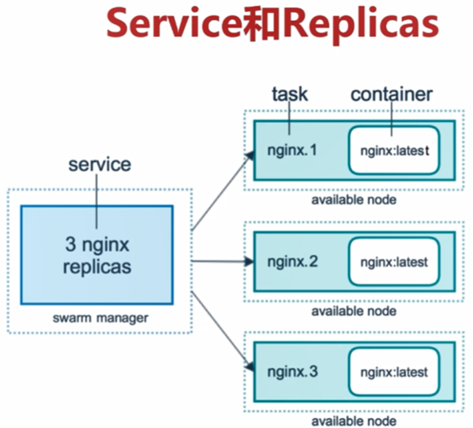

### 5.9.2 基础镜像

集群所有节点都需要下载相关镜像

```shell
docker pull nginx:1.18.0-alpine 
docker pull nginx:1.19.3-alpine
```


```shell
scp nginx.1.18.tar root@192.168.31.86:/data/
scp nginx.1.18.tar root@192.168.31.87:/data/

scp nginx.1.19.3.alpine.tar root@192.168.31.86:/data/
scp nginx.1.19.3.alpine.tar root@192.168.31.87:/data/

所有节点执行如下命令： 
cd /data
docker load -i nginx.1.18.tar
docker load -i nginx.1.19.3.alpine.tar rm -rf *
```


### 5.9.3 部署nginx

```shell
在manager节点中创建overlay网络：
docker network create -d overlay nginx-net 

创建5个nginx:alpines容器的集群：
docker service create --name nginx --network nginx-net -p 80:80 --replicas 5 nginx:1.18.0-alpine

在manager节点使用docker service ls 命令查看服务情况，worker节点无法查看： 
docker service ls

在manager或者worker节点都可以执行docker ps命令查看本虚拟机容器情况： 
docker ps

manager节点只用于管理集群，不希望部署服务。
docker node update --availability drain master-01 

使用docker service scale nginx=2命令将服务缩减为2个容器：
docker service scale nginx=2
```


### 5.9.4 升级nginx版本

```shell
进入其中一个容器查看nginx的版本信息：
注意事项：因nginx是alpine的linux版本。不能使用/bin/bash指令。 
docker  exec -it 503fe639bb89 sh
nginx -v

1.更新镜像：
docker service update --image nginx:1.19.3-alpine nginx

2.添加或者更新一个对外端口：
docker service update --publish-add 8090:80 nginx
```


### 5.9.5 删除任务

```shell
docker service rm nginx 
docker network rm nginx-net
```


## 5.10 stack命令

### 5.10.1 命令汇总

| 命令                  | 描述                       |
| --------------------- | -------------------------- |
| docker stack deploy   | 部署新的堆栈或更新现有堆栈 |
| docker stack ls       | 列出现有堆栈               |
| docker stack ps       | 列出堆栈中的任务           |
| docker stack rm       | 删除一个或多个堆栈         |
| docker stack services | 列出堆栈中的服务           |


### 5.10.2 部署nginx

#### 5.10.2.1 docker-compose.yml

```

```


#### 5.10.2.2 运行nginx

```shell
在manager节点中创建docker-compose.yml文件。执行如下命令：
docker stack deploy nginx-stack --compose-file=docker-compose.yml 或者是 
docker stack deploy nginx-stack -c docker-compose.yml

查看stack服务运行情况。执行如下命令： 
docker stack services nginx-stack

查看5个容器运行在哪个节点中。执行如下命令：
docker service ls 查看到NAME中的服务名为：nginx-stack_nginx-web 
docker service ps nginx-stack_nginx-web

进行测试：
curl 192.168.31.85
curl 192.168.31.86
curl 192.168.31.87

删除stack服务。执行如下命令： 
docker stack rm nginx-stack
```


总结：

- networks 中也可以不指定 driver:overlay，因为docker swarm 默认网络类型是 overlay。
- 整个networks都可以不用配置。stack部署时会默认创建网络。如果定义网络。在docker stack deploy 时会先默认创建一个网络，在创建一个我们自定义的网络。
- 一定要把镜像先拉取到本地再执行

## 5.11 Docker Stack和 Docker Compose区别

- Docker stack 会忽略 “构建” 指令，无法使用stack命令构建新镜像，它是需要镜像是预先已经构建好的。所以 docker-compose更适合于开发场景
- Docker Compose 是一个 Python 项目，在内部，它使用 Docker API 规范来操作容器。所以需要安装 Docker-compose，以便与Docker一起在你的计算机上使用；
- Docker Stack 功能包含在 Docker 引擎中，你不需要安装额外的包来使用它，docker stacks 只是 swarm mode 的一部分。
- Docker Stack 不支持基于第二版写的 docker-compose.yml，也就是 version 版本至少为 3 。然而Docker Compose 对版本为2和3的文件仍然可以处理；
- Docker Stack 把 Docker Compose 的所有工作都做完了，因此 docker stack 将占主导地位。同时，对于大多数用户老说，切换到使用 docker stack 既不困难，也不需要太多的开销。如果你是Docker 新手，或正在选择用于新项目的技术，请使用 docker stack。

# 6 harbor企业级部署

默认情况下，harbor不提供证书。可以在没有安全的情况下部署harbor，就可以通过HTTP方式连接到harbor。但是，只有在没有连接到外部 internet 的测试环境或开发环境中才可以使用 HTTP。在生产环境中，始终使用 HTTPS。要配置HTTPS，必须创建 SSL 证书。可以使用由受信任的第三方 CA 签名的证书，也可以使用自签名证书。本节介绍如何使用 OpenSSL 创建 CA，以及如何使用 CA 部署服务器证书和客户端证书，下面的过程假设 harbor 注册表的主机名是 harbor.turbine.com，并且它的 DNS 记录指向运行 harbor 的主机。

## 6.1 官网文档

```html
官网https配置帮助文档:
https://github.com/goharbor/harbor/blob/v1.9.4/docs/configure_https.md
```


## 6.2 解压harbor

在harbor中创建一个目录，用于存放证书

```shell
echo "192.168.31.82  harbor.turbne.com" >> /etc/hosts 
cat /etc/hosts

cd /data
tar zxf harbor-offline-installer-v1.9.4.tgz

cd harbor/ 
mkdir -p ssl
cd ssl
```


## 6.3 获得证书颁发机构

在生产环境中，应该从 CA 官方获取证书。在测试或开发环境中，可以生成自己的 CA。若要生成 CA 证书，请运行以下命令。

```shell
cd /data/harbor/ssl 
创建CA根证书
openssl genrsa -out ca.key 4096

openssl req -x509 -new -nodes -sha512 -days 3650 -subj
"/C=TW/ST=Beijing/L=Beijing/O=example/OU=Personal/CN=harbor.lagouedu.com" -key ca.key -out ca.crt
```


## 6.4 获取服务器证书

证书通常包含 .crt文件和 .key文件，例如 harbor.turbine.com.crt 和 harbor.turbine,com.key。

### 6.4.1 创建自己的私钥

```shell
openssl genrsa -out harbor.turbine.com.key 4096
```


### 6.4.2 生成证书前命请求

调整 -subj 选项中的值以反映你的组织。如果使用域名方式连接 harbor 主机，则必须将其指定为 common name（CN）属性，并在 key 和 CSR 文件命中使用它。

```shell
openssl req -sha512 -new -subj
"/C=TW/ST=Beijing/L=Beijing/O=example/OU=Personal/CN=harbor.turbine.com" -key harbor.turbine.com.key -out harbor.turbine.com.csr
```


### 6.4.3 生成注册表主机的证书

无论是使用域名还是使用IP地址连接到你的 Harbor主机，都必须创建此文件，以便你可以为 harbor 主机生成符合使用者替代名称（SAN）和 x509 v3扩展要求的证书，替换DNS 条目以反映harbor的域。

```shell
cat > v3.ext <<-EOF
authorityKeyIdentifier=keyid,issuer 
basicConstraints=CA:FALSE
keyUsage = digitalSignature, nonRepudiation, keyEncipherment, dataEncipherment extendedKeyUsage = serverAuth
subjectAltName = @alt_names 
[alt_names]
DNS.1=harbor.turbine.com EOF
```

使用 v3.ext 文件为 harbor主机生成证书

```shell
openssl x509 -req -sha512 -days 3650 -extfile v3.ext -CA ca.crt -CAkey ca.key -CAcreateserial -in harbor.turbine.com.csr -out harbor.turbine.com.crt
```


## 6.5 为docker配置服务器证书，密钥和CA

生成 ca.crt、harbor.turbine.com.crt 和 harbor.turbine.com.key 文件后，必须将他们提供给 harbor 和 Docker，并重新配置 Harbor 以使用它们。

将yourdomain.com.crt 转换为 yourdomain.com.cert，供 Docker 使用。

Docker 守护进程将 .crt文件解释为 CA 证书， .cert文件解释为客户端证书。

```shell
openssl x509 -inform PEM -in harbor.lagouedu.com.crt -out harbor.turbine.com.cert

mkdir -p /etc/docker/certs.d/harbor.turbine.com/

cp harbor.turbine.com.cert /etc/docker/certs.d/harbor.turbine.com/ 
cp harbor.turbine.com.key /etc/docker/certs.d/harbor.turbine.com/ 
cp ca.crt /etc/docker/certs.d/harbor.turbine.com/

重启docker服务： 
systemctl daemon-reload 
systemctl restart docker
```


## 6.6 修改harhor.yml文件

注释掉 http 的配置信息

```yaml
hostname: harbor.turbine.com 
https:
  port: 443
  certificate: /data/harbor/ssl/harbor.turbine.com.crt 
  private_key: /data/harbor/ssl/harbor.turbine.com.key
```


## 6.7 安装harbor

```shell
docker pull goharbor/prepare:v1.9.4 

cd /data/harbor

./prepared 
./install.sh
```


## 6.8 访问UI

```html
C:\Windows\System32\drivers\etc 

192.168.31.82 harbor.turbine.com 

https://harbor.turbine.com/
```


## 6.9 上传镜像

```shell
docker-100服务器：
将harbor服务器端生成的ca.crt文件复制到/etc/pki/ca-trust/source/anchors/中。 
执行命令更新ca证书授权：update-ca-trust
重启docker服务： 
systemctl restart docker
echo "192.168.198.101  harbor.turbine.com" >> /etc/hosts 

docker login harbor.turbine.com
admin
Harbor12345

docker load -i nginx.1.19.3.alpine.tar
docker tag nginx:1.19.3-alpine harbor.turbine.com/turbine/nginx:v1
docker push harbor.turbine.com/turbine/nginx:v1
```

