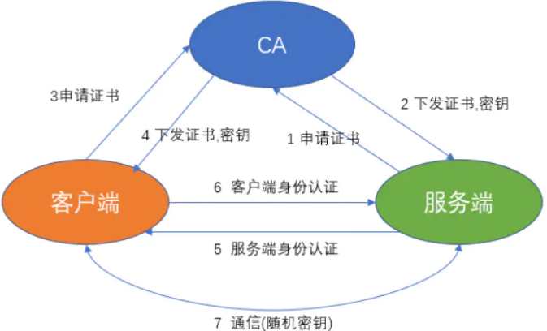

第一部分 K8s快速实战

# 前言

> 1 云平台基础概念

IaaS：基础设施服务

PaaS：平台服务

SaaS：软件服务

> 2 kubernetes 与 docker swarm 对比

长期以来，Kubernetes 和 Docker Swarm 被看作是 vs 的对手，在接下来的对比中，我们看一下它们应该在何时被使用，以及怎么一起工作的。

关于 Kubernetes 和 Docker 有无数的争论和讨论。


## K8s集群快速部署

kubernetes官网地址：国外网站，访问速度较慢。

```html
https://kubernetes.io/
```

kubernetes中文社区地址：

```html
https://www.kubernetes.org.cn/
```


k8s集群部署方式：

1. 使用minikube安装单点集群，用于测试
2. 采用工具kubeadm
3. 使用kubespray，google官方提供的工具
4. 全手动：二进制方式安装
5. 全自动安装：rancher、kubesphere


快速部署一个 Kubernetes，既拥有一个完整的集群。忽略三大步骤：

1. centos7.7操作系统配置
2. k8s集群镜像下载
3. k8s集群网络配置

|    主机名    |    主机IP     |
| :----------: | :-----------: |
| k8s-master01 | 192.168.31.52 |
|  k8s-node01  | 192.168.31.53 |
|  k8s-node02  | 192.168.31.54 |
|  k8s-node03  | 192.168.31.55 |

初始化k8s集群

```bash
kubeadm init --apiserver-advertise-address=192.168.31.52 --kubernetes-version v1.17.5 --service-cidr=10.1.0.0/16 --pod-network-cidr=10.81.0.0/16
```

```bash
mkdir -p $HOME/.kube
sudo cp -i /etc/kubernetes/admin.conf $HOME/.kube/config 
sudo chown $(id -u):$(id -g) $HOME/.kube/config
```

```bash
kubeadm join 192.168.31.52:6443 --token 8ic4bd.ns2wgycdqx5ey7go \    
  --discovery-token-ca-cert-hash sha256:3b883e6c1f0dcb29834dd08af8eb6e105854d0a475edb3630afc4539fd4f95c8
```


**K8s集群安全机制**：

Kubernetes 作为一个分布式集群的管理工具，保证集群的安全性是其一个重要的任务。API Server 是集群内部各个组件通信的中介，也是外部控制的入口。所以 Kubernetes 的安全机制基本就是围绕保护 API Server 来设计的。Kubernetes 使用了认证（Authentication）、鉴权（Authorization）、准入控制（Admission Control）三步来保证 API Server的安全。

Authentication（认证）

- 第三方授权协议：authenticating proxy

- HTTP Token认证：通过一个Token来识别合法用户

  HTTP Token的认证是用一个很长的特殊编码方式并且难以被模仿的字符串 - Token 来表达客户的一种方式。Token是一个很长的很复杂的字符串，每一个Token对应一个用户名 存储在 API Server能访问的文件中。当客户端发起 API 调用请求时，需要在 HTTP Header 里放入 Token

- HTTP Base认证：通过 用户名 + 密码 的方式认证

  用户名+ ：+ 密码 用 BASE64 算法进行编码后的字符串放在 HTTP Request中的 Heather Authorization 域里发送给服务端，服务端收到后进行编码，获取用户名及密码

- 最严格的HTTPS证书认证：基于 CA 根证书签名的客户端身份认证方式

  1. HTTPS 证书认证：采用双向加密认证方式

     

  2. 证书颁发：

     手动签发：通过k8s集群的 跟 ca 进行签发 HTTPS 证书

     自动签发：kubelet首次访问 API Server时，使用 token 认证，通过后，Controller Manager 会为 kubelet 生成一个证书，以后的访问都是用证书做认证了

  3. 安全性说明

     Controller Manager、Scheduler 与 API Server 在同一台机器，所以直接使用 API Server的非安全端口

     访问，--insecure-bind-address=127.0.0.1

     kubectl、kubelet、kube-proxy访问 API Server就都需要证书进行 HTTPS 双向认证

  4. kubeconfig 文件包含集群参数（CA证书、API Server）

# 1 Kubernetes基础组件

# 2 Kubernetes安装与配置


​                                             