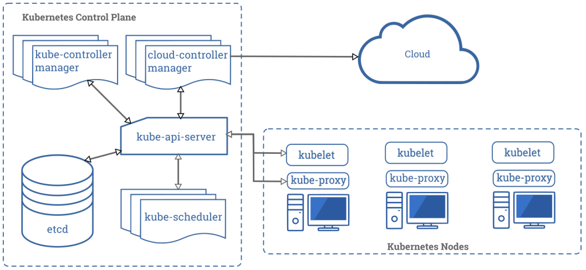

第一部分 K8s快速实战

# 前言

> 1 云平台基础概念

IaaS：基础设施服务

PaaS：平台服务

SaaS：软件服务

> 2 kubernetes 与 docker swarm 对比

长期以来，Kubernetes 和 Docker Swarm 被看作是 vs 的对手，在接下来的对比中，我们看一下它们应该在何时被使用，以及怎么一起工作的。

关于 Kubernetes 和 Docker 有无数的争论和讨论。


## K8s集群快速部署

kubernetes官网地址：国外网站，访问速度较慢。

```html
https://kubernetes.io/
```

kubernetes中文社区地址：

```html
https://www.kubernetes.org.cn/
```


k8s集群部署方式：

1. 使用minikube安装单点集群，用于测试
2. 采用工具kubeadm
3. 使用kubespray，google官方提供的工具
4. 全手动：二进制方式安装
5. 全自动安装：rancher、kubesphere


快速部署一个 Kubernetes，既拥有一个完整的集群。忽略三大步骤：

1. centos7.7操作系统配置
2. k8s集群镜像下载
3. k8s集群网络配置

|    主机名    |    主机IP     |
| :----------: | :-----------: |
| k8s-master01 | 192.168.31.52 |
|  k8s-node01  | 192.168.31.53 |
|  k8s-node02  | 192.168.31.54 |
|  k8s-node03  | 192.168.31.55 |

初始化k8s集群

```bash
kubeadm init --apiserver-advertise-address=192.168.31.52 --kubernetes-version v1.17.5 --service-cidr=10.1.0.0/16 --pod-network-cidr=10.81.0.0/16
```

```bash
mkdir -p $HOME/.kube
sudo cp -i /etc/kubernetes/admin.conf $HOME/.kube/config 
sudo chown $(id -u):$(id -g) $HOME/.kube/config
```

```bash
kubeadm join 192.168.31.52:6443 --token 8ic4bd.ns2wgycdqx5ey7go \    
  --discovery-token-ca-cert-hash sha256:3b883e6c1f0dcb29834dd08af8eb6e105854d0a475edb3630afc4539fd4f95c8
```


**K8s集群安全机制**：

Kubernetes 作为一个分布式集群的管理工具，保证集群的安全性是其一个重要的任务。API Server 是集群内部各个组件通信的中介，也是外部控制的入口。所以 Kubernetes 的安全机制基本就是围绕保护 API Server 来设计的。Kubernetes 使用了认证（Authentication）、鉴权（Authorization）、准入控制（Admission Control）三步来保证 API Server的安全。

Authentication（认证）

- 第三方授权协议：authenticating proxy

- HTTP Token认证：通过一个Token来识别合法用户

  HTTP Token的认证是用一个很长的特殊编码方式并且难以被模仿的字符串 - Token 来表达客户的一种方式。Token是一个很长的很复杂的字符串，每一个Token对应一个用户名 存储在 API Server能访问的文件中。当客户端发起 API 调用请求时，需要在 HTTP Header 里放入 Token

- HTTP Base认证：通过 用户名 + 密码 的方式认证

  用户名+ ：+ 密码 用 BASE64 算法进行编码后的字符串放在 HTTP Request中的 Heather Authorization 域里发送给服务端，服务端收到后进行编码，获取用户名及密码

- 最严格的HTTPS证书认证：基于 CA 根证书签名的客户端身份认证方式

  1. HTTPS 证书认证：采用双向加密认证方式

     

  2. 证书颁发：

     手动签发：通过k8s集群的 跟 ca 进行签发 HTTPS 证书

     自动签发：kubelet首次访问 API Server时，使用 token 认证，通过后，Controller Manager 会为 kubelet 生成一个证书，以后的访问都是用证书做认证了

  3. 安全性说明

     Controller Manager、Scheduler 与 API Server 在同一台机器，所以直接使用 API Server的非安全端口

     访问，--insecure-bind-address=127.0.0.1

     kubectl、kubelet、kube-proxy访问 API Server就都需要证书进行 HTTPS 双向认证

  4. kubeconfig 文件包含集群参数（CA证书、API Server），客户端参数（上面生成的证书和私钥），集群context信息（集群名称、用户名）。Kubenetes组件通过启动时指定不同的 kubeconfig 文件可以切换到不同的集群

# 1 Kubernetes基础组件

一个Kubernetes 集群包含集群由一组被称作节点的机器组成。这些节点上运行 Kubernetes  所管理的容器化应用。集群具有至少一个工作节点和至少一个主节点。

工作节点托管作为应用程序组件的 Pod。主节点管理集群中的工作节点和 Pod。多个主节点用于为集群提供故障转移和高可用性。

本章节概述 交付正常运行的 Kubernetes 集群所需的各种组件

这张图展示了包含所有相互关联的 Kubernetes 集群。



## 1.1 控制平面组件（Control Plane Components）

控制平面的组件对集群做出全局决策（比如调度），以及检测和响应集群事件（例如，当不满足部署的replicas字段时，启动新的 pod）。

控制平面组件可以在集群中的任何节点上运行。然而，为了简单起见，设置脚本通常会在同一个计算机上启动所有控制平面组件，并且不会在此计算机上运行用户容器。

### 1.1.1 kube-apiserver

主节点上负责提供 Kubernetes API 服务的组件；它是 Kubernetes 控制面的前端。

> 1. kube-apiserver 是 Kubernetes 最重要的核心组件之一
> 2. 提供集群管理的REST API接口，包括认证授权，数据校验以及集群状态变更等
> 3. 提供其他模块之间的数据交互和通信的枢纽（其他模块通过 API Server查询或修改数据，只有 API Server才直接操作 etcd）
> 4. 生产环境可以为 apiserver 做 LA 或 LB。在设计上考虑水平扩缩的需要。换言之，通过部署多个实例可以实现扩缩。参见构造高可用集群

### 1.1.2 etcd

> 1. kubernetes需要存储很多东西，像他本身的节点信息，组件信息，还有通过kubernetes运行的pod，deployment，service等等，都需要持久化。etcd就是它的数据中心，生产环境中为了保证数据中心的高可用和数据一致性，一般或部署最少三个节点。
> 2. 这里只部署一个节点在master。etcd也可以部署在 kubernetes 每一个节点。组成 etcd集群。
> 3. 如果已经有 etcd 外部的服务，kubernetes直接使用外部 etcd服务

etcd 是兼具一致性和高可用性的键值数据库，可以作为保存 Kubernetes 所有集群数据的后台数据库。

Kubernetes集群的etcd数据库通常需要有个备份计划，要了解etcd更深层次的信息，请参考etcd文档，也可以使用外部的ETCD集群

### 1.1.3 kube-scheduler

主节点上的组件，该组件监视那些新创建的未指定运行节点的 Pod，并选择节点让 Pod在 上面运行。

> 1. kube-scheduler 负责分配调度 Pod 到集群内的节点上，它监听 kube-apiserver，查询还未分配Node的Pod，然后根据调度策略为这些Pod分配节点

### 1.1.4 kube-controller-manager

在主节点上运行控制器的组件。

> 1.Controller Manager 由 kube-controller-manager 和 cloud-controller-manager 组成，是 Kubernetes 的大脑，它通过 apiserver监控整个集群的状态，并确保集群处于预期的工作状态。kube-controller-manager由一些列的控制器组成，像 Replication Controller控制副本，Node Controller节点控制，Deployment Controller管理 deploymenet等等 cloud-controller-manager在 Kubernetes启用Cloud Provider的时候才需要，用来配合云服务提供商的控制

### 1.1.5 云控制器管理器（cloud-controller-manager）（暂时不考录）

### 1.1.6 kubectl

## 1.2 Node组件

### 1.2.1 kubelet

### 1.2.2 kube-proxy

### 1.2.3 容器运行环境（Container Runtime）

## 1.3 插件（Addons）

### 1.3.1 KUBE-DNS

### 1.3.2 用户界面（Dashboard）

### 1.3.3 容器资源监控

### 1.3.4 集群层面日志

# 2 Kubernetes安装与配置


​                                             