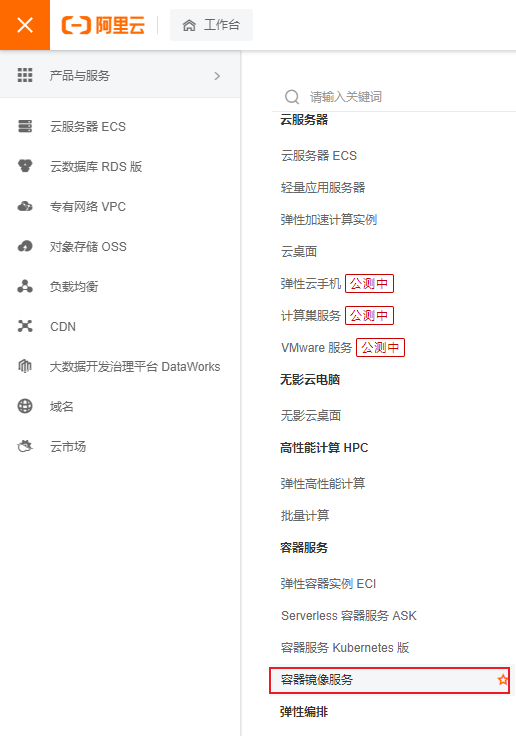
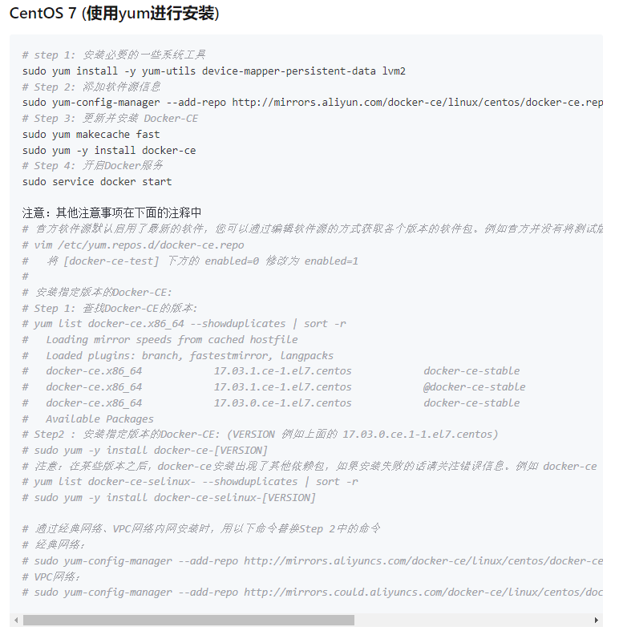
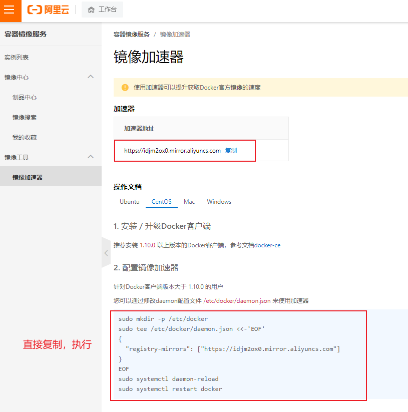

第一部分 K8s快速实战

# 前言

> 1 云平台基础概念

IaaS：基础设施服务

PaaS：平台服务

SaaS：软件服务

> 2 kubernetes 与 docker swarm 对比

长期以来，Kubernetes 和 Docker Swarm 被看作是 vs 的对手，在接下来的对比中，我们看一下它们应该在何时被使用，以及怎么一起工作的。

关于 Kubernetes 和 Docker 有无数的争论和讨论。


## K8s集群快速部署

kubernetes官网地址：国外网站，访问速度较慢。

```html
https://kubernetes.io/
```

kubernetes中文社区地址：

```html
https://www.kubernetes.org.cn/
```


k8s集群部署方式：

1. 使用minikube安装单点集群，用于测试
2. 采用工具kubeadm
3. 使用kubespray，google官方提供的工具
4. 全手动：二进制方式安装
5. 全自动安装：rancher、kubesphere


快速部署一个 Kubernetes，既拥有一个完整的集群。忽略三大步骤：

1. centos7.7操作系统配置
2. k8s集群镜像下载
3. k8s集群网络配置

|    主机名    |    主机IP     |
| :----------: | :-----------: |
| k8s-master01 | 192.168.31.52 |
|  k8s-node01  | 192.168.31.53 |
|  k8s-node02  | 192.168.31.54 |
|  k8s-node03  | 192.168.31.55 |

初始化k8s集群

```bash
kubeadm init --apiserver-advertise-address=192.168.31.52 --kubernetes-version v1.17.5 --service-cidr=10.1.0.0/16 --pod-network-cidr=10.81.0.0/16
```

```bash
mkdir -p $HOME/.kube
sudo cp -i /etc/kubernetes/admin.conf $HOME/.kube/config 
sudo chown $(id -u):$(id -g) $HOME/.kube/config
```

```bash
kubeadm join 192.168.31.52:6443 --token 8ic4bd.ns2wgycdqx5ey7go \    
  --discovery-token-ca-cert-hash sha256:3b883e6c1f0dcb29834dd08af8eb6e105854d0a475edb3630afc4539fd4f95c8
```


**K8s集群安全机制**：

Kubernetes 作为一个分布式集群的管理工具，保证集群的安全性是其一个重要的任务。API Server 是集群内部各个组件通信的中介，也是外部控制的入口。所以 Kubernetes 的安全机制基本就是围绕保护 API Server 来设计的。Kubernetes 使用了认证（Authentication）、鉴权（Authorization）、准入控制（Admission Control）三步来保证 API Server的安全。

Authentication（认证）

- 第三方授权协议：authenticating proxy

- HTTP Token认证：通过一个Token来识别合法用户

  HTTP Token的认证是用一个很长的特殊编码方式并且难以被模仿的字符串 - Token 来表达客户的一种方式。Token是一个很长的很复杂的字符串，每一个Token对应一个用户名 存储在 API Server能访问的文件中。当客户端发起 API 调用请求时，需要在 HTTP Header 里放入 Token

- HTTP Base认证：通过 用户名 + 密码 的方式认证

  用户名+ ：+ 密码 用 BASE64 算法进行编码后的字符串放在 HTTP Request中的 Heather Authorization 域里发送给服务端，服务端收到后进行编码，获取用户名及密码

- 最严格的HTTPS证书认证：基于 CA 根证书签名的客户端身份认证方式

  1. HTTPS 证书认证：采用双向加密认证方式

     

  2. 证书颁发：

     手动签发：通过k8s集群的 跟 ca 进行签发 HTTPS 证书

     自动签发：kubelet首次访问 API Server时，使用 token 认证，通过后，Controller Manager 会为 kubelet 生成一个证书，以后的访问都是用证书做认证了

  3. 安全性说明

     Controller Manager、Scheduler 与 API Server 在同一台机器，所以直接使用 API Server的非安全端口

     访问，--insecure-bind-address=127.0.0.1

     kubectl、kubelet、kube-proxy访问 API Server就都需要证书进行 HTTPS 双向认证

  4. kubeconfig 文件包含集群参数（CA证书、API Server），客户端参数（上面生成的证书和私钥），集群context信息（集群名称、用户名）。Kubenetes组件通过启动时指定不同的 kubeconfig 文件可以切换到不同的集群

# 1 Kubernetes基础组件

一个Kubernetes 集群包含集群由一组被称作节点的机器组成。这些节点上运行 Kubernetes  所管理的容器化应用。集群具有至少一个工作节点和至少一个主节点。

工作节点托管作为应用程序组件的 Pod。主节点管理集群中的工作节点和 Pod。多个主节点用于为集群提供故障转移和高可用性。

本章节概述 交付正常运行的 Kubernetes 集群所需的各种组件

这张图展示了包含所有相互关联的 Kubernetes 集群。


## 1.1 控制平面组件（Control Plane Components）

控制平面的组件对集群做出全局决策（比如调度），以及检测和响应集群事件（例如，当不满足部署的replicas字段时，启动新的 pod）。

控制平面组件可以在集群中的任何节点上运行。然而，为了简单起见，设置脚本通常会在同一个计算机上启动所有控制平面组件，并且不会在此计算机上运行用户容器。

### 1.1.1 kube-apiserver

主节点上负责提供 Kubernetes API 服务的组件；它是 Kubernetes 控制面的前端。

> 1. kube-apiserver 是 Kubernetes 最重要的核心组件之一
> 2. 提供集群管理的REST API接口，包括认证授权，数据校验以及集群状态变更等
> 3. 提供其他模块之间的数据交互和通信的枢纽（其他模块通过 API Server查询或修改数据，只有 API Server才直接操作 etcd）
> 4. 生产环境可以为 apiserver 做 LA 或 LB。在设计上考虑水平扩缩的需要。换言之，通过部署多个实例可以实现扩缩。参见构造高可用集群

### 1.1.2 etcd

> 1. kubernetes需要存储很多东西，像它本身的节点信息，组件信息，还有通过kubernetes运行的pod，deployment，service等等，都需要持久化。etcd就是它的数据中心，生产环境中为了保证数据中心的高可用和数据一致性，一般或部署最少三个节点。
> 2. 这里只部署一个节点在master。etcd也可以部署在 kubernetes 每一个节点。组成 etcd集群。
> 3. 如果已经有 etcd 外部的服务，kubernetes直接使用外部 etcd服务

etcd 是兼具一致性和高可用性的键值数据库，可以作为保存 Kubernetes 所有集群数据的后台数据库。

Kubernetes集群的etcd数据库通常需要有个备份计划，要了解etcd更深层次的信息，请参考etcd文档，也可以使用外部的 ETCD 集群

### 1.1.3 kube-scheduler

主节点上的组件，该组件监视那些新创建的未指定运行节点的 Pod，并选择节点让 Pod在 上面运行。

> 1. kube-scheduler 负责分配调度 Pod 到集群内的节点上，它监听 kube-apiserver，查询还未分配Node的Pod，然后根据调度策略为这些Pod分配节点

### 1.1.4 kube-controller-manager

在主节点上运行控制器的组件。

> 1.Controller Manager 由 kube-controller-manager 和 cloud-controller-manager 组成，是 Kubernetes 的大脑，它通过 apiserver监控整个集群的状态，并确保集群处于预期的工作状态。kube-controller-manager由一些列的控制器组成，像 Replication Controller控制副本，Node Controller节点控制，Deployment Controller管理 deploymenet等等 cloud-controller-manager在 Kubernetes启用Cloud Provider的时候才需要，用来配合云服务提供商的控制

### 1.1.5 云控制器管理器（cloud-controller-manager）（暂时不考录）

### 1.1.6 kubectl

## 1.2 Node组件

### 1.2.1 kubelet

### 1.2.2 kube-proxy

### 1.2.3 容器运行环境（Container Runtime）

## 1.3 插件（Addons）

### 1.3.1 KUBE-DNS

### 1.3.2 用户界面（Dashboard）

### 1.3.3 容器资源监控

### 1.3.4 集群层面日志

# 2 Kubernetes安装与配置

## 2.1 硬件安装要求

| 序号 | 硬件 |  要求   |
| :--: | :--: | :-----: |
|  1   | CPU  | 至少2核 |
|  2   | 内存 | 至少3G  |
|  3   | 硬盘 | 至少50G |

临时演示集群节点

|    主机名    |    主机IP     |
| :----------: | :-----------: |
| k8s-master01 | 192.168.31.61 |
|  k8s-node01  | 192.168.31.62 |
|  k8s-node02  | 192.168.31.63 |
|  k8s-node03  | 192.168.31.64 |

centos下载地址：推荐使用centos7.6以上的版本

```html
http://mirrors.aliyun.com/centos/7/isos/x86_64/
```

查看centos系统版本命令：

```bash
cat /etc/centos-release
```

配置阿里云 yum 源

```bash
1.下载安装wget
yum install -y wget

2.备份默认的yum
mv /etc/yum.repos.d /etc/yum.repos.d.backup

3.设置新的yum目录
mkdir -p /etc/yum.repos.d

4.下载阿里yum配置到该目录中，选择对应版本
wget -O /etc/yum.repos.d/CentOS-Base.repo http://mirrors.aliyun.com/repo/Centos-7.repo

5.更新epel源为阿里云epel源
mv /etc/yum.repos.d/epel.repo /etc/yum.repos.d/epel.repo.backup 
mv /etc/yum.repos.d/epel-testing.repo /etc/yum.repos.d/epel-testing.repo.backup
wget -O /etc/yum.repos.d/epel.repo http://mirrors.aliyun.com/repo/epel-7.repo

6.重建缓存 
yum clean all
yum makecache

7.看一下yum仓库有多少包 
yum repolist
yum update
```

升级系统内核

```bash
rpm -Uvh http://www.elrepo.org/elrepo-release-7.0-3.el7.elrepo.noarch.rpm
yum --enablerepo=elrepo-kernel install -y kernel-lt
grep initrd16 /boot/grub2/grub.cfg
grub2-set-default 0

reboot
```

查看centos系统内核命令：

```bash
uname -r
uname -a
```

查看cpu命令：

```bash
lscpu
```

查看内存命令：

```bash
free
free -h
```

查看硬盘信息

```bash
fdisk -l
```

## 2.2 centos7系统配置

### 2.2.1 关闭防火墙

```bash
systemctl stop firewalld
systemctl disable firewalld
```

### 2.2.2 关闭selinux

```bash
sed -i 's/SELINUX=enforcing/SELINUX=disabled/g' /etc/sysconfig/selinux
setenforce 0
```

### 2.2.3 网桥过滤

```bash
vi /etc/sysctl.conf

net.bridge.bridge-nf-call-ip6tables = 1
net.bridge.bridge-nf-call-iptables = 1
net.bridge.bridge-nf-call-arptables = 1
net.ipv4.ip_forward=1
net.ipv4.ip_forward_use_pmtu = 0

生效命令 
sysctl --system 
查看效果
sysctl -a|grep "ip_forward"
```

### 2.2.4 开启IPVS

```bash
安装IPVS
yum -y install ipset ipvsdm

编译ipvs.modules文件
vi /etc/sysconfig/modules/ipvs.modules

文件内容如下
#!/bin/bash
modprobe -- ip_vs
modprobe -- ip_vs_rr
modprobe -- ip_vs_wrr
modprobe -- ip_vs_sh
modprobe -- nf_conntrack_ipv4

赋予权限并执行
chmod 755 /etc/sysconfig/modules/ipvs.modules && bash /etc/sysconfig/modules/ipvs.modules &&lsmod | grep -e ip_vs -e nf_conntrack_ipv4

重启电脑，检查是否生效 
reboot
lsmod | grep ip_vs_rr
```

### 2.2.5 同步时间

```bash
安装软件
yum -y install ntpdate

向阿里云服务器同步时间
ntpdate time1.aliyun.com

删除本地时间并设置时区为上海
rm -rf /etc/localtime
ln -s /usr/share/zoneinfo/Asia/Shanghai /etc/localtime

查看时间
date -R || date
```

### 2.2.6 命令补全

```bash
安装bash-completion
yum -y install bash-completion bash-completion-extras

使用bash-completion
source /etc/profile.d/bash_completion.sh
```

### 2.2.7 关闭swap分区

```bash
临时关闭： 
swapoff -a

永久关闭： 
vi /etc/fstab

将文件中的/dev/mapper/centos-swap这行代码注释掉
#/dev/mapper/centos-swap swap  swap    defaults        0 0 

确认swap已经关闭：若swap行都显示    0 则表示关闭成功
free -m
```

### 2.2.8 hosts配置

```bash
vi /etc/hosts 

文件内容如下:
cat <<EOF >>/etc/hosts
192.168.31.62 k8s-master01
192.168.31.63 k8s-node01
192.168.31.64 k8s-node02
192.168.31.65 k8s-node03
EOF
```


## 2.3 安装docker

### 2.3.1 阿里云开发者平台

[docker官方安装过程](https://docs.docker.com/engine/install/centos/)

可以参考[阿里云官网](https://www.aliyun.com/)提供的docker安装教程进行安装。






### 2.3.2 安装 docker前置条件

```bash
yum install -y yum-utils device-mapper-persistent-data lvm2
```

### 2.3.3 添加源

```bash
yum-config-manager --add-repo http://mirrors.aliyun.com/docker- ce/linux/centos/docker-ce.repo

yum makecache fast
```

### 2.3.4 查看docker最新版本

```bash
yum list docker-ce --showduplicates | sort -r
```

### 2.3.5 安装docker

```bash
安装最新版本
yum -y install docker-ce 

安装指定版本：
yum -y install docker-ce-18.09.8 

可以通过docker version命令查看
docker-client版本：当前最新版本 
docker-server版本为：18.09.8
```

### 2.3.6 开启docker服务

```bash
systemctl start docker
systemctl status docker
```

### 2.3.7 安装阿里云镜像加速器

```shell
sudo mkdir -p /etc/docker
sudo tee /etc/docker/daemon.json <<-'EOF'
{
  "registry-mirrors": ["https://idjm2ox0.mirror.aliyuncs.com"]
}
EOF
sudo systemctl daemon-reload
sudo systemctl restart docker
```



### 2.3.8 设置 docker 开启 启动服务

```bash
systemctl enable docker
```

### 2.3.9 修改Cgroup Driver

```bash
修改daemon.json，新增：

"exec-opts": ["native.cgroupdriver=systemd"]

重启docker服务：
systemctl daemon-reload
systemctl restart docker
查看修改后状态：
docker info | grep Cgroup
```

>***修改cgroupdriver是为了消除安装k8s集群时的告警：***
>
>[WARNING IsDockerSystemdCheck]:
>detected “cgroupfs” as the Docker cgroup driver. The recommended driver is “systemd”.
>Please follow the guide at https://kubernetes.io/docs/setup/cri/......

2.2.10 复习 docker 常用命令

```bash
docker -v
docker version
docker info
```

## 2.4 使用 kubeadm快速安装

| 软件 | kubeadm                            | kubelet                                                      | kubectl                            | docker-ce                 |
| ---- | ---------------------------------- | ------------------------------------------------------------ | ---------------------------------- | ------------------------- |
| 版本 | 初始化集群管理<br>集群版本：1.17.5 | 用于接收 api-server指令，<br>对 pod 声明周期进行管理，版本：1.17.5 | 集群命令行管理工具<br>版本：1.17.5 | 推荐使用版本：<br>19.03.8 |

## 2.5 安装 yum 源

### 2.5.1 新建 repo 文件

```bash
vi /etc/yum.repos.d/kubernates.repo
```

### 2.5.2 文件内容

```bash
[kubernetes]
name=Kubernetes
baseurl=https://mirrors.aliyun.com/kubernetes/yum/repos/kubernetes-el7-x86_64
enabled=1
gpgcheck=1
repo_gpgcheck=1
gpgkey=https://mirrors.aliyun.com/kubernetes/yum/doc/yum-key.gpg
       https://mirrors.aliyun.com/kubernetes/yum/doc/rpm-package-key.gpg
```

### 2.5.3 更新缓存

```bash
yum clean all
yum -y makecache
```

### 2.5.4 验证源是否可用

```bash
yum list | grep kubeadm

如果提示要验证yum-key.gpg是否可用，输入y。 
查找到kubeadm。显示版本
```

### 2.5.5 查看k8s版本

```bash
yum list kubelet --showduplicates | sort -r
```

### 2.5.6 安装 k8s-1.17.5

```bash
yum install -y kubelet-1.17.5 kubeadm-1.17.5 kubectl-1.17.5
```

## 2.6 设置 kubelet

### 2.6.1 增加配置信息

```bash
如果不配置kubelet，可能会导致K8S集群无法启动。为实现docker使用的cgroupdriver与kubelet 使用的cgroup的一致性。
vi /etc/sysconfig/kubelet

KUBELET_EXTRA_ARGS="--cgroup-driver=systemd"
```

### 2.6.2 设置开机启动

```bash
systemctl enable kubelet
```


## 2.7 初始化镜像

如果是第一次安装k8s，手里没有备份好的镜像，可以执行如下操作。也可以使用资料包中的镜像备份，跳过本章节学习内容。

### 2.7.1 查看安装集群需要的镜像

```bash
kubeadm config images list
```

### 2.7.2 编写执行脚本

```bash
mkdir -p /data
cd /data
vi images.sh

#!/bin/bash
# 下面的镜像应该去除"k8s.gcr.io"的前缀，版本换成kubeadm config images list命令获取 到的版本
images=(
   kube-apiserver:v1.17.5
   kube-controller-manager:v1.17.5
   kube-scheduler:v1.17.5
   kube-proxy:v1.17.5    pause:3.1
   etcd:3.4.3-0    coredns:1.6.5 )
for imageName in ${images[@]} ;
do
   docker pull registry.cn-hangzhou.aliyuncs.com/google_containers/$imageName    
   docker tag registry.cn-hangzhou.aliyuncs.com/google_containers/$imageName k8s.gcr.io/$imageName
   docker rmi registry.cn-hangzhou.aliyuncs.com/google_containers/$imageName done
```

### 2.7.3 执行脚本

```bash
mkdir -p /data 
cd /data
给脚本授权
chmod +x images.sh
执行脚本
./images.sh
```

### 2.7.4 保存镜像

idea 的列编辑模式：alt + 鼠标左键

```bash
docker save -o k8s.1.17.5.tar \
k8s.gcr.io/kube-proxy:v1.17.5  \ 
k8s.gcr.io/kube-apiserver:v1.17.5 \
k8s.gcr.io/kube-controller-manager:v1.17.5 \ 
k8s.gcr.io/kube-scheduler:v1.17.5 \
k8s.gcr.io/coredns:1.6.5 \ 
k8s.gcr.io/etcd:3.4.3-0 \ 
k8s.gcr.io/pause:3.1 \
```

```bash
docker save -o k8s.1.17.5.node.tar \
k8s.gcr.io/kube-proxy:v1.17.5  \ 
k8s.gcr.io/pause:3.1 \
```


## 2.8 导入镜像

### 2.8.1 导入master节点镜像 tar 包

```bash
master节点需要全部镜像
docker load -i k8s.1.17.5.tar
```

### 2.8.2 导入 node节点镜像 tar 包

```bash
node节点需要kube-proxy:v1.17.5和pause:3.1,2个镜像 
docker load -i k8s.1.17.5.node.tar
```

## 2.9 初始化集群

配置k8s集群网络

### 2.9.1 calico 官网地址

```bash
官网下载地址：
https://docs.projectcalico.org/v3.14/manifests/calico.yaml 

github地址：
https://github.com/projectcalico/calico 

镜像下载：
docker pull calico/cni:v3.14.2
docker pull calico/pod2daemon-flexvol:v3.14.2
docker pull calico/node:v3.14.2
docker pull calico/kube-controllers:v3.14.2
```

```bash
配置hostname：
hostnamectl set-hostname k8s-master01 
配置ip地址：
```

### 2.9.2 初始化集群信息：calico网络

```bash
kubeadm init --apiserver-advertise-address=192.168.31.61 --kubernetes-version v1.17.5 --service-cidr=10.1.0.0/16 --pod-network-cidr=10.81.0.0/16
```

### 2.9.3 执行配置命令

```bash

```

### 2.9.4 node节点加入集群信息

```bash

```

### 2.9.5 kubectl命令自动补全

```bash

```

### 2.9.6 发送邮件问题

```bash

```

### 2.9.7 yum-key.gpg 验证未通过

```bash

```


​                                             