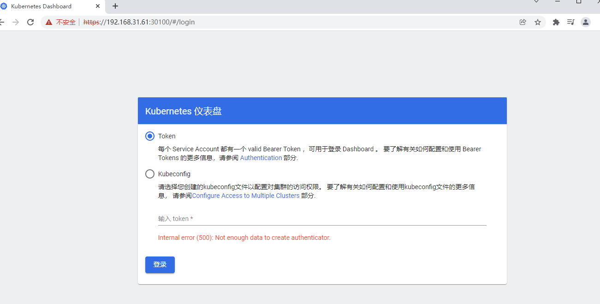
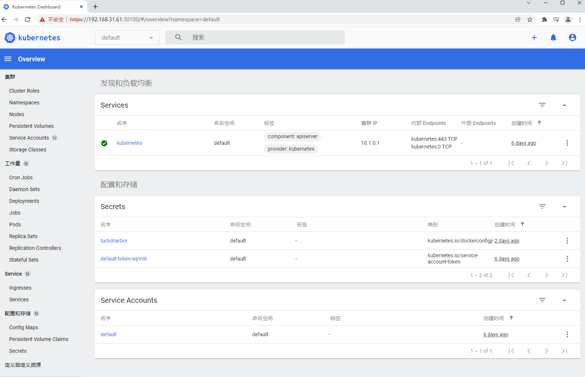
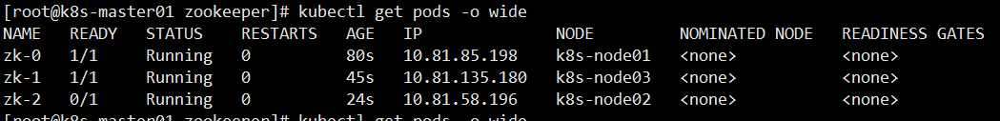
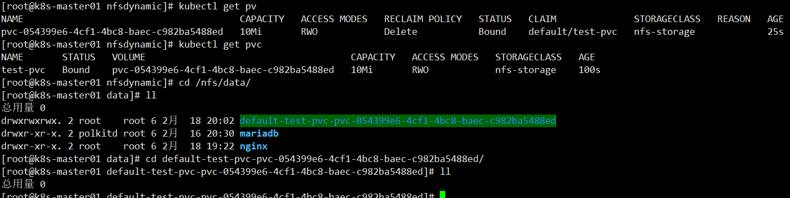
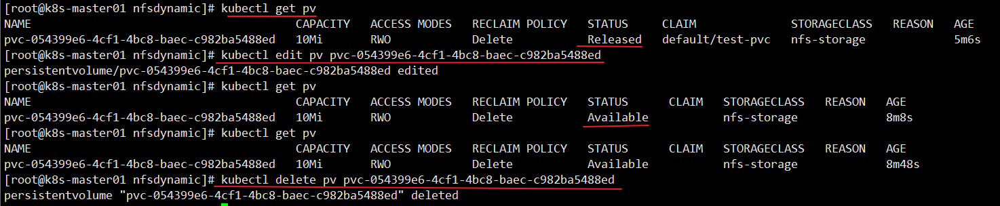
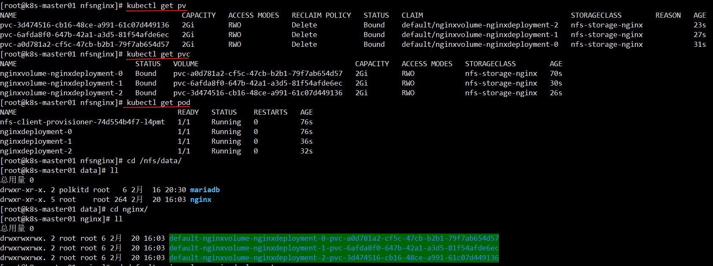

第十部分 K8s运维篇-常用软件安装

# 1 dashboard

在kubeadm方式安装的k8s集群中安装 Dashboard。

## 1.1 Dashboard简介

K8s的可视化工具

## 1.2 官网地址

```html
https://github.com/kubernetes/dashboard

下载配置文件
https://github.com/kubernetes/dashboard/blob/v2.0.3/aio/deploy/recommended.yaml
```

## 1.3 安装镜像

```
kubernetsui 下边的镜像不需要科学上网

所有节点
docker pull kubernetesui/dashboard:v2.0.3
docker pull kubernetesui/metrics-scraper:v1.0.4
```

## 1.4 修改配置文件

### 1.4.1 控制器部分

```bash
179行左右 修改下载策略
     containers:
       - name: kubernetes-dashboard
         image: kubernetesui/dashboard:v2.0.3          
         imagePullPolicy: IfNotPresent
         
262行左右。新增下载策略           
     containers:
       - name: dashboard-metrics-scraper
         image: kubernetesui/metrics-scraper:v1.0.4          
         imagePullPolicy: IfNotPresent
```


### 1.4.2 service部分

默认Dashboard只能集群内访问，修改Service 为 NodePort 类型，暴露到外部访问。找到Service配置。在配置文件上边。增加 type:NodePort 和 nodePort:30100 端口

```yaml
kind: Service
apiVersion: v1
metadata:
  labels:
    k8s-app: kubernetes-dashboard
  name: kubernetes-dashboard
  namespace: kubernetes-dashboard
spec:
  ports:
    - port: 443
      targetPort: 8443
      nodePort: 30100
  type: NodePort
  selector:
    k8s-app: kubernetes-dashboard
```


# 2 管理 Service Accounts

# 3 RBAC

使用RBAC鉴权。基于角色（Role）的访问控制

# 4 Dashboard新增用户

## 4.1 使用资源文件方式新增用户

在配置文件下边增加用户及给用户授予集群管理员角色

```yaml
---
apiVersion: v1
kind: ServiceAccount
metadata:
  labels:
    k8s-app: kubernetes-dashboard
  name: dashboard-admin
  namespace: kubernetes-dashboard
---
apiVersion: rbac.authorization.k8s.io/v1
kind: ClusterRoleBinding
metadata:
  name: dashboard-admin-cluster-role
roleRef:
  apiGroup: rbac.authorization.k8s.io
  kind: ClusterRole
  name: cluster-admin
subjects:
  - kind: ServiceAccount
    name: dashboard-admin
    namespace: kubernetes-dashboard
```


## 4.2 使用命令行方式新增用户

## 4.3 部署dashboard

部署完dashboard服务，可以选在使用token认证方式登录或者kubeconfig认证方式登录dashboard。

```bash
kubectl apply -f .

kubectl get pods -n kubernetes-dashboard -o wide

kubectl get svc -n kubernetes-dashboard

kubectl delete -f .
```




## 4.4 token认证方式

### 4.4.1 分步查看 token 信息

```bash
1.根据命名空间找到我们创建的用户
kubectl get sa -n kubernetes-dashboard

2.查看我们创建用户的详细信息。找到token属性对应的secret值
kubectl describe sa dashboard-admin -n kubernetes-dashboard
kubectl describe secrets dashboard-admin-token-7rwn4 -n kubernetes-dashboard

3.或者是根据命名空间查找secrets。获得dashboard-admin用户的secret。 
kubectl get secrets -n kubernetes-dashboard
kubectl describe secrets dashboard-admin-token-7rwn4 -n kubernetes-dashboard
```


### 4.4.2 快速查看 token 信息

```bash
kubectl -n kubernetes-dashboard describe secret $(kubectl -n kubernetes-dashboard get secret | grep dashboard-admin | awk '{print $1}')
```

## 4.5 浏览器访问

```html
注意：是https方式访问
https://192.168.31.61:30100/
```



## 4.6 kubeConfig认证方式

了解即可

```bash
以下命令可以一起执行。可以更改dashboard-admin.conf的生成目录。关键点还是要首先或者 dashboard-admin用户的secret值。

DASH_TOCKEN=$(kubectl get secret -n kubernetes-dashboard dashboard-admin-token-7rwn4 -o jsonpath={.data.token}|base64 -d)

kubectl config set-cluster kubernetes --server=192.168.31.61:6443 --kubeconfig=/root/dashboard-admin.conf

kubectl config set-credentials dashboard-admin --token=$DASH_TOCKEN --kubeconfig=/root/dashboard-admin.conf

kubectl config set-context dashboard-admin@kubernetes --cluster=kubernetes --user=dashboard-admin --kubeconfig=/root/dashboard-admin.conf

kubectl config use-context dashboard-admin@kubernetes --kubeconfig=/root/dashboard-admin.conf

将生成的dashboard-admin.conf上传到windows系统中。浏览器选择dashboard-admin.conf文件即可用于登录dashboard
```


# 5 使用statefulSet创建Zookeeper集群

https://kubernetes.io/zh/docs/tutorials/stateful-application/zookeeper/

## 5.2 安装镜像

```bash
k8s官方提供进行国内无法下载，使用国内镜像地址下载。需要修改官网默认给的yaml文件，去掉官网镜 ，使用我们下载的镜像。
docker pull mirrorgooglecontainers/kubernetes-zookeeper:1.0-3.4.10
```


## 5.3 资源文件清单

```yaml
apiVersion: v1
kind: Service
metadata:
  name: zk-hs
  labels:
    app: zk
spec:
  ports:
    - port: 2888
      name: server
    - port: 3888
      name: leader-election
  clusterIP: None
  selector:
    app: zk
---
apiVersion: v1
kind: Service
metadata:
  name: zk-cs
  labels:
    app: zk
spec:
  ports:
    - port: 2181
      name: client
  selector:
    app: zk
---
apiVersion: policy/v1beta1
kind: PodDisruptionBudget
metadata:
  name: zk-pdb
spec:
  selector:
    matchLabels:
      app: zk
  maxUnavailable: 1
---
apiVersion: apps/v1
kind: StatefulSet
metadata:
  name: zk
spec:
  selector:
    matchLabels:
      app: zk
  serviceName: zk-hs
  replicas: 3
  updateStrategy:
    type: RollingUpdate
  podManagementPolicy: OrderedReady
  template:
    metadata:
      labels:
        app: zk
    spec:
      affinity:
        podAntiAffinity:
          requiredDuringSchedulingIgnoredDuringExecution:
            - labelSelector:
                matchExpressions:
                  - key: "app"
                    operator: In
                    values:
                      - zk
              topologyKey: "kubernetes.io/hostname"
      containers:
        - name: kubernetes-zookeeper
          imagePullPolicy: Always
          image: "mirrorgooglecontainers/kubernetes-zookeeper:1.0-3.4.10"
          resources:
            requests:
              memory: "1Gi"
              cpu: "0.5"
          ports:
            - containerPort: 2181
              name: client
            - containerPort: 2888
              name: server
            - containerPort: 3888
              name: leader-election
          command:
            - sh
            - -c
            - "start-zookeeper \
          --servers=3 \
          --data_dir=/var/lib/zookeeper/data \
          --data_log_dir=/var/lib/zookeeper/data/log \
          --conf_dir=/opt/zookeeper/conf \
          --client_port=2181 \
          --election_port=3888 \
          --server_port=2888 \
          --tick_time=2000 \
          --init_limit=10 \
          --sync_limit=5 \
          --heap=512M \
          --max_client_cnxns=60 \
          --snap_retain_count=3 \
          --purge_interval=12 \
          --max_session_timeout=40000 \
          --min_session_timeout=4000 \
          --log_level=INFO"
          readinessProbe:
            exec:
              command:
                - sh
                - -c
                - "zookeeper-ready 2181"
            initialDelaySeconds: 10
            timeoutSeconds: 5
          livenessProbe:
            exec:
              command:
                - sh
                - -c
                - "zookeeper-ready 2181"
            initialDelaySeconds: 10
            timeoutSeconds: 5
          volumeMounts:
            - name: datadir
              mountPath: /var/lib/zookeeper
      securityContext:
        runAsUser: 1000
        fsGroup: 1000
      volumes:
        - name: datadir
          emptyDir: {}
```


## 5.4 部署zookeeper

```bash
kubectl apply -f .

监控zookeeper启动过程 
kubectl get pods -o wide -w

kubectl delete -f .
```



# 6 statefulSet

# 7 动态PV

## 7.1 安装镜像

```bash
由于quay.io仓库部分镜像国内无法下载，所以替换为其他镜像地址
docker pull vbouchaud/nfs-client-provisioner:v3.1.1
```


## 7.2 nfs服务端配置

```bash
mkdir -p /nfs/data/
chmod 777 /nfs/data/

yum install -y nfs-utils rpcbind 

更改归属组与用户
chown nfsnobody /nfs/data/ 

vi /etc/exports

/nfs/data *(rw,fsid=0,sync,no_wdelay,insecure_locks,no_root_squash) 

为了方便接下来两个实验，提前建立2个共享子目录。
mkdir -p /nfs/data/mariadb 
mkdir -p /nfs/data/nginx

systemctl start rpcbind
systemctl start nfs

设置开启启动
systemctl enable rpcbind
systemctl enable nfs
```


## 7.3 nfs的storageClass配置

### 7.3.1 rbac

nfsdynamic/nfsrbac.yml。每次配置文件，只需要调整 ClusterRoleBinding、RoleBinding 的 namespace 值，如果服务是部署在默认的namespace 中，配置文件不需要调整。

```yaml
apiVersion: v1
kind: ServiceAccount
metadata:
  name: nfs-client-provisioner
---
apiVersion: rbac.authorization.k8s.io/v1
kind: ClusterRole
metadata:
  name: nfs-client-provisioner-runner
rules:
  - apiGroups: [""]
    resources: ["persistentvolumes"]
    verbs: ["get", "list", "watch", "create", "delete"]
  - apiGroups: [""]
    resources: ["persistentvolumeclaims"]
    verbs: ["get", "list", "watch", "update"]
  - apiGroups: ["storage.k8s.io"]
    resources: ["storageclasses"]
    verbs: ["get", "list", "watch"]
  - apiGroups: [""]
    resources: ["events"]
    verbs: ["create", "update", "patch"]
---
apiVersion: rbac.authorization.k8s.io/v1
kind: ClusterRoleBinding
metadata:
  name: run-nfs-client-provisioner
subjects:
  - kind: ServiceAccount
    name: nfs-client-provisioner
    namespace: default  #替换成要部署NFS Provisioner的namespace
roleRef:
  apiGroup: rbac.authorization.k8s.io
  kind: ClusterRole
  name: nfs-client-provisioner-runner
---
apiVersion: rbac.authorization.k8s.io/v1
kind: Role
metadata:
  name: leader-locking-nfs-client-provisioner
rules:
  - apiGroups: [""]
    resources: ["endpoints"]
    verbs: ["get", "list", "watch", "create", "update", "patch"]
---
apiVersion: rbac.authorization.k8s.io/v1
kind: RoleBinding
metadata:
  name: leader-locking-nfs-client-provisioner
subjects:
  - kind: ServiceAccount
    name: nfs-client-provisioner
    namespace: default # 替换成要部署NFS Provisioner的namespace
roleRef:
  apiGroup: rbac.authorization.k8s.io
  kind: Role
  name: leader-locking-nfs-client-provisioner
```


### 7.3.2 storageClass

nfsdynamic/nfsstorage.yml

```yaml
apiVersion: apps/v1
kind: Deployment
metadata:
  name: nfs-client-provisioner
  labels:
    app: nfs-client-provisioner
spec:
  replicas: 1
  strategy:
    #设置升级策略为删除再创建(默认为滚动更新)
    type: Recreate
  selector:
    matchLabels:
      app: nfs-client-provisioner
  template:
    metadata:
      labels:
        app: nfs-client-provisioner
    spec:
      serviceAccountName: nfs-client-provisioner
      containers:
        - name: nfs-client-provisioner
          #由于quay.io仓库部分镜像国内无法下载，所以替换为其他镜像地址
          image: vbouchaud/nfs-client-provisioner:v3.1.1
          volumeMounts:
            - mountPath: /persistentvolumes
              name: nfs-client-root
          env:
            - name: PROVISIONER_NAME
              value: nfs-client     # --- nfs-provisioner的名称，以后设置的 storageclass要和这个保持一致
            - name: NFS_SERVER
              value: 192.168.31.61  # NFS服务器地址，与volumes.nfs.servers保 持一致
            - name: NFS_PATH
              value: /nfs/data      # NFS服务共享目录地址，与volumes.nfs.path 保持一致
      volumes:
        - name: nfs-client-root
          nfs:
            path: /nfs/data         # NFS服务器目录，与 spec.containers.env.value保持一致
            server: 192.168.31.61   # NFS服务器地址，与 spec.containers.env.value保持一致

---
apiVersion: storage.k8s.io/v1
kind: StorageClass
metadata:
  name: nfs-storage
  annotations:
    storageclass.kubernetes.io/is-default-class: "true" #设置为默认的 storageclass
provisioner: nfs-client                                 #动态卷分配者名称，必须 和创建的"provisioner"变量中设置的name一致
parameters:
  archiveOnDelete: "true"                               #设置为"false"时删除 PVC不会保留数据,"true"则保留数据
mountOptions:
  - hard                                                #指定为硬挂载方式
  - nfsvers=4                                            #指定NFS版本，这个需要 根据    NFS Server 版本号设置
```


## 7.4 测试pvc

nfsdynamic/nfstestpvc.yml

用于测试nfs动态pv是否成功。

```yaml
apiVersion: v1
kind: PersistentVolumeClaim
metadata:
  name: test-pvc
spec:
  storageClassName: nfs-storage
  accessModes:
    - ReadWriteOnce
  resources:
    requests:
      storage: 10Mi
```


## 7.5 部署nfs测试服务

```yaml
kubectl apply -f .

查看storageClass
kubectl get storageclasses.storage.k8s.io || kubectl get sc

查看mariadb服务
kubectl get svc 

查看pv pvc 

查看statefulSet 
kubectl get sts

查看mariadb、storageClass的pods 
kubectl get pods
```



## 7.6 删除服务

pv是动态生成，通过查看pv状态，发现pv不会自动回收。

```bash
删除mariadb服务 
kubectl delete -f .

查看动态nfs的pv状态。发现pv的status状态是：Released 
kubectl get pv

编译pv的配置文件
kubectl edit pv pvc-054399e6-4cf1-4bc8-baec-c982ba5488ed 

将spec.claimRef属性下的所有内容全部删除
claimRef:
   apiVersion: v1
   kind: PersistentVolumeClaim    name: test-pvc
   namespace: default
   resourceVersion: "162046"
   uid: 59fb2735-9681-426a-8805-8c94685a07e3 
   
再次查看pv状态。发现pv的status状态是：Available
kubectl get pv 

删除pv
kubectl delete pv pvc-054399e6-4cf1-4bc8-baec-c982ba5488ed

删除共享目录动态pv的目录
rm -rf default-test-pvc-pvc-054399e6-4cf1-4bc8-baec-c982ba5488ed
```



# 8 动态PV案例一

部署3个副本的nginx服务。主要学习 **volumeClaimTemplate** 属性。

## 8.1 statefulset组成

statefulset的三个组成部分：

- `Headless Service`：名为nginx，用来定义 Pod 网络标识（DNS domain）。
- `StatefulSet`：定义具体应用，名为Nginx，有三个Pod副本，并为每个Pod定义了一个域名
- `volumeClaimTemplates`：存储卷申请模板，创建PVC，指定pvc名称大小，将自动创建pvc，且pvc必须由存储类供应。

**为什么需要 headless service 无头服务？**

在用Deployment时，每一个Pod名称是没有顺序的，是随机字符串，因此是Pod名称是无序的，但是在 statefulset中 要求必须是有序，每一个pod不能被随意取代，pod重建后 pod 名称还是一样的。而 pod IP 是变化的，所以是以 Pod 名称来识别。Pod 名称是 Pod 唯一性的标识符，必须持久稳定有效。这时候要用到无头服务，它可以给每个 Pod 一个唯一的名称。

**为什么需要volumeClaimTemplate？**

对于有状态的副本集都会用到持久化存储，对于分布式系统来讲，它的最大特点是数据不一样，所以各个节点不能使用同一存储卷，每个节点都有自己的专用存储，但是如果在Deployment中的Pod template 里定义的存储卷，是所有副本集共用一个存储卷面数据是相同的，因为是基于模板来的，而statefulset中每个 Pod 都要有自己的专有存储卷，所以statefulset的存储卷就不能再用Pod模板来创建了，于是statefulSet使用volumeClaimTemplate，称为卷申请模板，它会为每个Pod 生成不同的pvc，并绑定pv，从而实现各 pod 有专用存储。

这就是为什么要用volumeClaimTemplate的原因。

## 8.2 nfs服务

### 8.2.1 rbac

nfsnginx/nfsnginxrbac.yml。与前文保持一致。

```yaml
apiVersion: v1
kind: ServiceAccount
metadata:
  name: nfs-client-provisioner
---
apiVersion: rbac.authorization.k8s.io/v1
kind: ClusterRole
metadata:
  name: nfs-client-provisioner-runner
rules:
  - apiGroups: [""]
    resources: ["persistentvolumes"]
    verbs: ["get", "list", "watch", "create", "delete"]
  - apiGroups: [""]
    resources: ["persistentvolumeclaims"]
    verbs: ["get", "list", "watch", "update"]
  - apiGroups: ["storage.k8s.io"]
    resources: ["storageclasses"]
    verbs: ["get", "list", "watch"]
  - apiGroups: [""]
    resources: ["events"]
    verbs: ["create", "update", "patch"]
---
apiVersion: rbac.authorization.k8s.io/v1
kind: ClusterRoleBinding
metadata:
  name: run-nfs-client-provisioner
subjects:
  - kind: ServiceAccount
    name: nfs-client-provisioner
    namespace: default  #替换成要部署NFS Provisioner的namespace
roleRef:
  apiGroup: rbac.authorization.k8s.io
  kind: ClusterRole
  name: nfs-client-provisioner-runner
---
apiVersion: rbac.authorization.k8s.io/v1
kind: Role
metadata:
  name: leader-locking-nfs-client-provisioner
rules:
  - apiGroups: [""]
    resources: ["endpoints"]
    verbs: ["get", "list", "watch", "create", "update", "patch"]
---
apiVersion: rbac.authorization.k8s.io/v1
kind: RoleBinding
metadata:
  name: leader-locking-nfs-client-provisioner
subjects:
  - kind: ServiceAccount
    name: nfs-client-provisioner
    namespace: default # 替换成要部署NFS Provisioner的namespace
roleRef:
  apiGroup: rbac.authorization.k8s.io
  kind: Role
  name: leader-locking-nfs-client-provisioner
```


### 8.2.2 storageClass

nfsnginx/nfsnginxstorage.yml。与前文介绍类似，注意修改storageClass的名称

```yaml
apiVersion: apps/v1
kind: Deployment
metadata:
  name: nfs-client-provisioner
  labels:
    app: nfs-client-provisioner
spec:
  replicas: 1
  strategy:
    #设置升级策略为删除再创建(默认为滚动更新)
    type: Recreate
  selector:
    matchLabels:
      app: nfs-client-provisioner
  template:
    metadata:
      labels:
        app: nfs-client-provisioner
    spec:
      serviceAccountName: nfs-client-provisioner
      containers:
        - name: nfs-client-provisioner
          #由于quay.io仓库部分镜像国内无法下载，所以替换为其他镜像地址
          image: vbouchaud/nfs-client-provisioner:v3.1.1
          volumeMounts:
            - mountPath: /persistentvolumes
              name: nfs-client-root
          env:
            - name: PROVISIONER_NAME
              value: nfs-client-nginx  # --- nfs-provisioner的名称，以后设置的 storageclass要和这个保持一致
            - name: NFS_SERVER
              value: 192.168.31.61  # NFS服务器地址，与volumes.nfs.servers保 持一致
            - name: NFS_PATH
              value: /nginx      # NFS服务共享目录地址，与volumes.nfs.path 保持一致
      volumes:
        - name: nfs-client-root
          nfs:
            path: /nginx         # NFS服务器目录，与 spec.containers.env.value保持一致
            server: 192.168.31.61   # NFS服务器地址，与 spec.containers.env.value保持一致

---
apiVersion: storage.k8s.io/v1
kind: StorageClass
metadata:
  name: nfs-storage-nginx
  annotations:
    storageclass.kubernetes.io/is-default-class: "true" #设置为默认的 storageclass
provisioner: nfs-client-nginx    #动态卷分配者名称，必须 和创建的"provisioner"变量中设置的name一致
parameters:
  archiveOnDelete: "true"      #设置为"false"时删除 PVC不会保留数据,"true"则保留数据
mountOptions:
  - hard             #指定为硬挂载方式
  - nfsvers=4        #指定NFS版本，这个需要 根据    NFS Server 版本号设置
```


## 8.3 nginx服务

如果定义多个副本。必须使用 volumeClaimTemplate 属性。如果定义1个副本。可以使用pod+pvc方式。

nfsnginx/nginxstatefulset.yml

```yaml
apiVersion: apps/v1
kind: StatefulSet
metadata:
  name: nginxdeployment
  labels:
    app: nginxdeployment
spec:
  replicas: 3
  serviceName: nginxsvc
  template:
    metadata:
      name: nginxdeployment
      labels:
        app: nginxdeployment
    spec:
      containers:
        - name: nginxdeployment
          image: nginx:1.17.10-alpine
          imagePullPolicy: IfNotPresent
          ports:
            - containerPort: 80
          volumeMounts:
            - mountPath: /usr/share/nginx/html/
              name: nginxvolume
      restartPolicy: Always
  volumeClaimTemplates:
    - metadata:
        name: nginxvolume
        annotations:
          volume.beta.kubernetes.io/storage-class: "nfs-storage-nginx"
      spec:
        accessModes:
          - ReadWriteOnce
        resources:
          requests:
            storage: 2Gi
  selector:
    matchLabels:
      app: nginxdeployment
---
apiVersion: v1
kind: Service
metadata:
  name: nginxsvc
spec:
  selector:
    app: nginxdeployment
  ports:
    - port: 80
  clusterIP: None
```


## 8.4 部署nginx服务

```bash
kubectl apply -f .
kubectl get pods -o wide
kubectl get pv
kubectl get pvc
```



# 9 动态PV案例二

部署mariadb数据库服务。

## 9.1 nfs服务

### 9.1.1 rbac

nfsmariadb/nfsrbac.yml。与前文保持一致

```yaml
apiVersion: v1
kind: ServiceAccount
metadata:
  name: nfs-client-provisioner
---
apiVersion: rbac.authorization.k8s.io/v1
kind: ClusterRole
metadata:
  name: nfs-client-provisioner-runner
rules:
  - apiGroups: [""]
    resources: ["persistentvolumes"]
    verbs: ["get", "list", "watch", "create", "delete"]
  - apiGroups: [""]
    resources: ["persistentvolumeclaims"]
    verbs: ["get", "list", "watch", "update"]
  - apiGroups: ["storage.k8s.io"]
    resources: ["storageclasses"]
    verbs: ["get", "list", "watch"]
  - apiGroups: [""]
    resources: ["events"]
    verbs: ["create", "update", "patch"]
---
apiVersion: rbac.authorization.k8s.io/v1
kind: ClusterRoleBinding
metadata:
  name: run-nfs-client-provisioner
subjects:
  - kind: ServiceAccount
    name: nfs-client-provisioner
    namespace: default  #替换成要部署NFS Provisioner的namespace
roleRef:
  apiGroup: rbac.authorization.k8s.io
  kind: ClusterRole
  name: nfs-client-provisioner-runner
---
apiVersion: rbac.authorization.k8s.io/v1
kind: Role
metadata:
  name: leader-locking-nfs-client-provisioner
rules:
  - apiGroups: [""]
    resources: ["endpoints"]
    verbs: ["get", "list", "watch", "create", "update", "patch"]
---
apiVersion: rbac.authorization.k8s.io/v1
kind: RoleBinding
metadata:
  name: leader-locking-nfs-client-provisioner
subjects:
  - kind: ServiceAccount
    name: nfs-client-provisioner
    namespace: default # 替换成要部署NFS Provisioner的namespace
roleRef:
  apiGroup: rbac.authorization.k8s.io
  kind: Role
  name: leader-locking-nfs-client-provisioner
```


### 9.1.2 storageClass

nfsmariadb/nfsmariadbstorage.yml。与前文介绍类似，注意修改storageClass的名称

```yaml
apiVersion: apps/v1
kind: Deployment
metadata:
  name: nfs-client-provisioner
  labels:
    app: nfs-client-provisioner
spec:
  replicas: 1
  strategy:
    #设置升级策略为删除再创建(默认为滚动更新)
    type: Recreate
  selector:
    matchLabels:
      app: nfs-client-provisioner
  template:
    metadata:
      labels:
        app: nfs-client-provisioner
    spec:
      serviceAccountName: nfs-client-provisioner
      containers:
        - name: nfs-client-provisioner
          #由于quay.io仓库部分镜像国内无法下载，所以替换为其他镜像地址
          image: vbouchaud/nfs-client-provisioner:v3.1.1
          volumeMounts:
            - mountPath: /persistentvolumes
              name: nfs-client-root
          env:
            - name: PROVISIONER_NAME
              value: nfs-client-mariadb # --- nfs-provisioner的名称，以后设置的 storageclass要和这个保持一致
            - name: NFS_SERVER
              value: 192.168.31.61  # NFS服务器地址，与volumes.nfs.servers保 持一致
            - name: NFS_PATH
              value: /mariadb      # NFS服务共享目录地址，与volumes.nfs.path 保持一致
      volumes:
        - name: nfs-client-root
          nfs:
            path: /mariadb         # NFS服务器目录，与 spec.containers.env.value保持一致
            server: 192.168.31.61   # NFS服务器地址，与 spec.containers.env.value保持一致

---
apiVersion: storage.k8s.io/v1
kind: StorageClass
metadata:
  name: nfs-storage-mariadb
  annotations:
    storageclass.kubernetes.io/is-default-class: "true" #设置为默认的 storageclass
provisioner: nfs-client-mariadb    #动态卷分配者名称，必须 和创建的"provisioner"变量中设置的name一致
parameters:
  archiveOnDelete: "true"          #设置为"false"时删除 PVC不会保留数据,"true"则保留数据
mountOptions:
  - hard                           #指定为硬挂载方式
  - nfsvers=4                      #指定NFS版本，这个需要 根据    NFS Server 版本号设置
```


## 9.2 mariadb 资源文件

### 9.2.1 pvc

nfsmariadb/mariadbpvc.yml。为后续容灾测试方便。单独创建 pvc 文件

```yaml
apiVersion: v1
kind: PersistentVolumeClaim
metadata:
  name: mariadbpvc
spec:
  storageClassName: nfs-storage-mariadb
  accessModes:
    - ReadWriteOnce
  resources:
    requests:
      storage: 5Gi
```


### 9.2.2 statefulset

nfsmariadb/mariadbstatefulset.yml

```yaml
apiVersion: v1
kind: Service
metadata:
  name: mariadbsvc
spec:
  selector:
    app: mariadbsts
  ports:
    - port: 3306
  clusterIP: None
---
apiVersion: apps/v1
kind: StatefulSet
metadata:
  name: mariadbsts
  labels:
    app: mariadbsts
spec:
  replicas: 1
  serviceName: mariadbsvc
  template:
    metadata:
      name: mariadbsts
      labels:
        app: mariadbsts
    spec:
      containers:
        - name: mariadbsts
          image: mariadb:10.5.2
          imagePullPolicy: IfNotPresent
          ports:
            - containerPort: 3306
          env:
            - name: MYSQL_ROOT_PASSWORD
              value: admin
            - name: TZ
              value: Asia/Shanghai
            - name: MYSQL_DATABASE
              value: test
          args:
            - "--character-set-server=utf8mb4"
            - "--collation-server=utf8mb4_unicode_ci"
          volumeMounts:
            - mountPath: /var/lib/mysql
              name: mariadb-data
      restartPolicy: Always
      volumes:
        - name: mariadb-data
          persistentVolumeClaim:
            claimName: mariadbpvc
  selector:
    matchLabels:
      app: mariadbsts
```


## 9.3 部署 mariadb 服务

```bash
部署服务
kubectl apply -f .

查看storage
kubectl get storageclasses.storage.k8s.io

查看pv绑定情况
kubectl get pv

查看pvc绑定情况
kubectl get pvc

查看服务
kubectl get svc

查看statefulse
kubectl get sts

查看pod
kubectl get pods
```


## 9.4 测试 mariadb

```bash
查看statefulset的服务名称 
kubectl get svc

创建一个临时的pod用于访问statefulset。通过statefulset的服务名进行访问：-hmariadbsvc。
语法规则：--command -- mysql,mysql与--之间有空格。
kubectl run mariadb-test --image=mariadb:10.5.2 --restart=Never -it --rm --command -- mysql -hmariadbsvc -uroot -padmin

命令行方式查看database
show databases;

命令行方式创建database
create database turbo;

进入容器查看database目录
kubectl exec -it mariadbsts-0 sh
cd /var/lib/mysql
ls
exit

查看nfs共享目录，自动创建目录格式为：${namespace}-${pvcName}-${pvName}的文件夹 
cd /nfs/data
ls
cd default-mariadbpvc-pvc-26c5785e-5703-4175-bc6a-3f9097d51d98/
ls
```


## 9.5 容灾测试

### 9.5.1 删除 pod 测试

```bash
删除pod进行测试
kubectl get pvc
kubectl delete pod

进入容器查看database目录
kubectl exec -it mariadbsts-0 sh 
cd /var/lib/mysql
ls
exit

查看nfs共享目录中database保存情况 
cd /nfs/data
ls
cd default-mariadbpvc-pvc-26c5785e-5703-4175-bc6a-3f9097d51d98/
ls

临时客户端查看
kubectl run mariadb-test --image=mariadb:10.5.2 --restart=Never -it --rm --command -- mysql -hmariadbsvc -uroot -padmin
show databases;
exit
```


### 9.5.2 删除 statefulset

```bash
kubectl delete -f .
```

