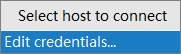
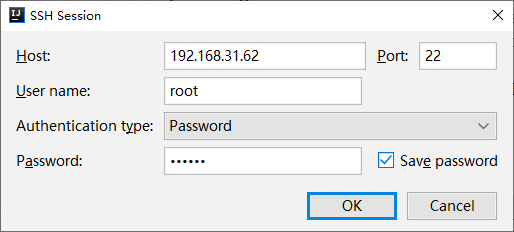

第三部分 K8s快速入门之资源文件

# 1 idea安装k8s插件

## 1.1 idea插件官网地址

```html
https://plugins.jetbrains.com/ 

kubernetes地址：
https://plugins.jetbrains.com/plugin/10485-kubernetes
```

## 1.2 查找对应自己idea版本的k8s插件信息

```html
help->about->查看idea内部版本信息
一定要注意版本信息，否则无法安装
```


### 1.3 离线安装k8s插件

```html
因国外网站网速较慢，在线安装有安装失败的危险。推荐大家下载idea对应版本的插件后，进行离线安装

193.5662.65
settings->plugins->Install Plugin from Disk->插件安装目录 

安装完成后重启idea开发工具
```


# 2 idea配置SSH客户端

目标：在idea中打开终端操作 k8s 集群 master 节点。

下图是 idea 2019.1.3 版本的操作：







## 2.1 idea配置

```
settings->Tools->SSH Configurations->新建
```

## 2.2 使用SSH客户端

```html
Tools->Start SSH session->选择我们刚刚配置的ssh客户端名称
```

## 2.3 新建yml类型文件

idea默认没有yml文件类型。可以通过 new -> file -> 手工输入 *.yml 创建 yml 类型文件。也可以通过配置增加 yml 类型文件。

```

```


# 3 Remote Host

目标：将idea 工程中的文件上传 k8s 集群 master 节点

## 3.1 idea 配置

```
Tools->Deployment->Configurations->配置Remote Host
```

## 3.2 使用 Remote Host

```html
可以将本工程中的文件上传k8s集群
```


# 4 NameSpace

## 4.1 创建 NameSpace

```html
操作指南：
settings->Editor->Live Template->Kubernetes->查看自动生成的模板信息内容
```

### 4.1.1 turbonamespace.yml

```yaml
apiVersion: v1 
kind: Namespace 
metadata:
  name: turbo
```

通过idea的Remote Host快速将 yml文件上传 k8s 集群进行测试

```bash
mkdir -p /data/namespaces 
cd /data/namespaces

kubectl apply -f turbonamespace.yml
```

## 4.2 删除NameSpace

```bash
kubectl delete -f turbonamespace.yml
```


# 5 pod

## 5.1 创建pod

在idea工程 resource/pod/tomcatpod.yml

```yaml
apiVersion: v1
kind: Pod
metadata:
  name: tomcat-pod
  labels:
    app: tomcat-pod
spec:
  containers:
    - name: tomcat-pod
      image: tomcat:9.0.20-jre8-alpine
      imagePullPolicy: IfNotPresent
  restartPolicy: Always
```

## 5.2 镜像下载策略、重启策略

```bash
imagePullPolicy:
   Always:总是拉取pull
   IfNotPresent:如果本地有镜像，使用本地，如果本地没有镜像，下载镜像。
   Never:只使用本地镜像，从不拉取
```


```bash
restartPolicy:
   Always：只要退出就重启。
   OnFailure：失败退出时（exit code不为0）才重启
   Never：永远不重启
```


## 5.2 运行 pod

```bash
kubectl apply -f tomcatpod.yml
# 通过资源文件创建pod，不会生成deployment控制器
```

## 5.4 测试 pod

```bash
curl 10.81.85.198:8080
```

## 5.5 删除pod

```bash
kubectl delete -f tomcatpod.yml
```


# 6 deployment

## 6.1 创建deployment

在idea工程 resource/pod/tomcatdeployment.yml

```yaml
apiVersion: apps/v1
kind: Deployment
metadata:
  name: tomcat-deployment
  labels:
    app: tomcat-deployment
spec:
  replicas: 3
  template:
    metadata:
      name: tomcat-deployment
      labels:
        app: tomcat-deployment
    spec:
      containers:
        - name: tomcat-deployment
          image: tomcat:9.0.20-jre8-alpine
          imagePullPolicy: IfNotPresent
      restartPolicy: Always
  selector:
    matchLabels:
      app: tomcat-deployment
```


matchLabels

```
总结：
在Deployment中必须写matchLables
在定义模板的时候必须定义labels,因为Deployment.spec.selector是必须字段,而他又必须和template.labels对应
```


## 6.2 运行deployment

```bash
kubectl apply -f tomcatdeployment.yml
```


## 6.3 控制器类型

| 控制器类型  | 作用                                                         |
| ----------- | ------------------------------------------------------------ |
| Deployment  | 声明式更新控制器，用于发布无状态应用                         |
| ReplicaSet  | 副本集控制器，用于对Pod进行副本规模 扩大或裁剪               |
| StatefulSet | 有状态副本集，用于发布有状态应用                             |
| DaemonSet   | 在k8s集群每一个Node上运行一个副本，用于发布监控或日志收集类等应用 |
| Job         | 运行一次性作业任务                                           |
| CronJob     | 运行周期性作业任务                                           |

## 6.4 Deployment控制器介绍

具有上线部署、滚动升级、创建副本、回滚到以前某一版本（成功/稳定）等功能。

Deployment包含ReplicaSet，除非需要自定义升级功能或者根本不需要升级 Pod，否则还是建议使用Deployment而不直接使用ReplicaSet。

## 6.5 删除 Deployment 

```bash
kubectl delete -f tomcatdeployment.yml
```


# 7 service

## 7.1 创建service

在idea工程 resource/pod/tomcatservice.yml

```yaml
apiVersion: apps/v1
kind: Deployment
metadata:
  name: tomcat-deployment
  labels:
    app: tomcat-deployment
spec:
  replicas: 3
  template:
    metadata:
      name: tomcat-deployment
      labels:
        app: tomcat-pod
    spec:
      containers:
        - name: tomcat-deployment
          image: tomcat:9.0.20-jre8-alpine
          imagePullPolicy: IfNotPresent
          ports:
            - containerPort: 8080
      restartPolicy: Always
  selector:
    matchLabels:
      app: tomcat-pod
---
apiVersion: v1
kind: Service
metadata:
  name: tomcat-svc
spec:
  selector:
    # 标签选择必须是template.labels.app
    app: tomcat-pod
  ports:
    - port: 8888 # 对集群内其他服务暴露的端口号
      targetPort: 8080
      nodePort: 30088
      protocol: TCP
  type: NodePort
```

### 7.1.1 service 的 selector

```yaml
请各位小伙伴注意：
service.spec.selector.app选择的内容仍然是template.label.app内容。而不是我们 deployment控制器的label内容
```


### 7.1.2 service类型

```yaml
ClusterIP：默认，分配一个集群内部可以访问的虚拟IP 
NodePort：在每个Node上分配一个端口作为外部访问入口
LoadBalancer：工作在特定的Cloud Provider上，例如Google Cloud，AWS，OpenStack 
ExternalName：表示把集群外部的服务引入到集群内部中来，即实现了集群内部pod和集群外部的服务 进行通信
```


### 7.1.3 service参数

```yaml
port ：访问service使用的端口 
targetPort ：Pod中容器端口
NodePort： 通过Node实现外网用户访问k8s集群内service(30000-32767)  
```


## 7.2 运行service

```bash
kubectl apply -f tomcatservice.yml
```


## 7.3 删除service

```bash
kubectl delete -f tomcatservice.yml
```