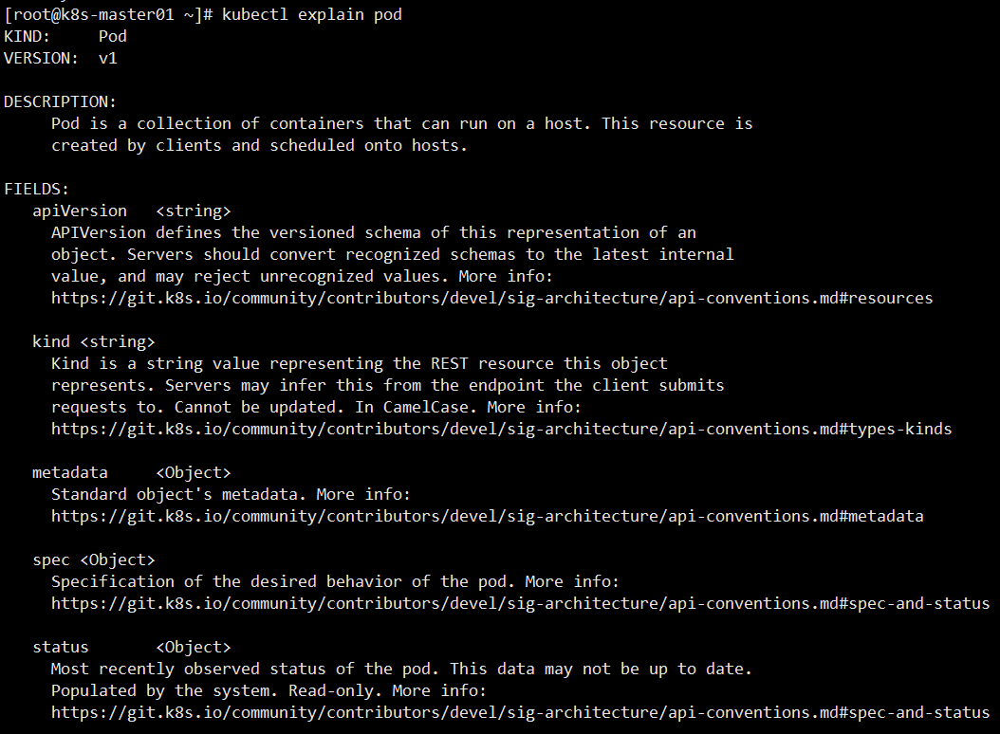
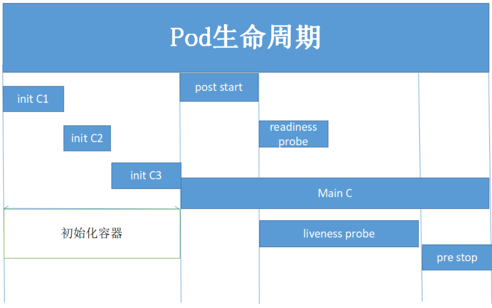
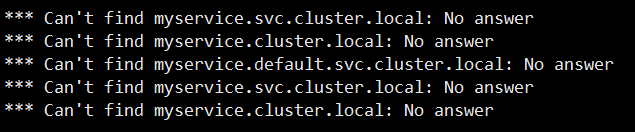
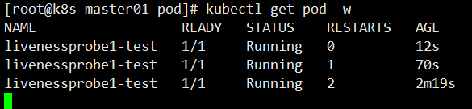
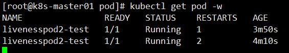
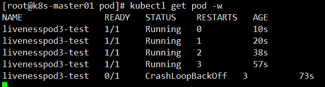

> 第四部分 资源清单-pod进阶

# 1 资源清单格式

## 1.1 简介

资源清单有5个顶级字段组成：`apiVersion`、`kind`、`metadata`、`spec`、`status`

```yaml
apiVersion: group/apiversion # 如果没有给定group 名称，那么默认为core，可以使用 kubectl apiversions # 获取当前k8s版本上所有的apiVersion版本信息(每个版本可能不同)
kind: #资源类别 
metadata: #资源元数据
  name
  namespace
  lables
  annotations # 主要目的是方便用户阅读查找 
spec: # 期望的状态（disired state）
status: # 当前状态，本字段由 Kubernetes自身维护，用户不能去定义
```

## 1.2 资源的 apiVersion 版本信息

使用kubectl命令可以查看 apiVersion 各个版本信息

```bash
kubectl api-versions
```

## 1.3 获取字段设置帮助文档

```bash
kubectl explain pod
```



## 1.4 字段配置格式类型

资源清单中大致可以分为如下几种类型：

<map[String]string><[]string><[]Object>

```shell
apiVersion <string> 			#表示字符串类型
metadata <Object> 				#表示需要嵌套多层字段
labels <map[string]string> 		#表示由k:v组成的映射 
finalizers <[]string> 			#表示字串列表 
ownerReferences <[]Object> 		#表示对象列表 
hostPID <boolean> 				#布尔类型
priority <integer> 				#整型
name <string> -required- 		#如果类型后面接 -required-，表示为必填字段
```


# 2 pod生命周期

## 2.1 案例



实验需要准备镜像

```bash
docker pull busybox:1.32.0
docker pull nginx:1.17.10-alpine
```

### 2.1.1 initC 案例

initC 特点：

1. initC总是运行到成功完成为止。
2. 每个initC容器都必须在下一个initC启动之前成功完成。
3. 如果initC容器运行失败，K8S集群会不断的重启该pod，直到initC容器成功为止。
4. 如果pod对应的 restartPolicy 为never，它就不会重新启动。

pod/initcpod.yml 文件，***需要准备 busybox:1.32.0镜像***

```yaml
apiVersion: v1
kind: Pod
metadata:
  name: initcpod-test
  labels:
    app: initcpod-test
spec:
  containers:
    - name: initcpod-test
      image: busybox:1.32.0
      imagePullPolicy: IfNotPresent
      command: ['sh','-c','echo The app is running! && sleep 3600']
  initContainers:
    - name: init-myservice
      image: busybox:1.32.0
      imagePullPolicy: IfNotPresent
      command: ['sh','-c','until nslookup myservice; do echo waitting for myservice; sleep 2; done;']
    - name: init-mydb
      image: busybox:1.32.0
      imagePullPolicy: IfNotPresent
      command: ['sh','-c','until nslookup mydb;do echo waitting for mydb; sleep 2; done;']
  restartPolicy: Always
```

查看 init-myservice 的日志 `kubectl logs -f initcpod-test -c init-myservice`




pod/initcservice1.yml

```yaml
apiVersion: v1
kind: Service
metadata:
  name: myservice
spec:
  selector:
    app: myservice
  ports:
    - port: 80
      targetPort: 9376
      protocol: TCP
```


pod/initcservice2.yml

```yaml
apiVersion: v1
kind: Service
metadata:
  name: mydb
spec:
  selector:
    app: mydb
  ports:
    - port: 80
      targetPort: 9377
      protocol: TCP
```


执行命令

```bash
先查看pod启动情况
kubectl get pods

详细查看pod启动情况
kubectl describe pod initcpod-test

查看myapp-pod中的第一个initContainer日志
kubectl logs initcpod-test -c init-myservice

运行init-myservice服务
kubectl apply -f initcservice1.yml

查看init-myservice服务运行情况
kubectl get svc

查看myapp-pod运行情况，需要耐心等一会，会发现pod的第一个init已经就绪
kubectl get pods

运行init-mydb服务
kubectl apply -f initcservice2.yml

查看init-myservice服务运行情况
kubectl get svc

查看myapp-pod运行情况，需要耐心等一会，会发现pod的两个init已经就绪，pod状态为ready
kubectl get pod -w
```

### 2.1.2 readinessProbe(就绪检测)

容器就绪检测案例，***需要准备 nginx:1.17.10-alpine镜像***

pod/readinessprobepod.yml

```yaml
apiVersion: v1
kind: Pod
metadata:
  name: readinesspod-test
  labels:
    app: readinesspod-test
spec:
  containers:
    - name: readinesspod-test
      image: nginx:1.17.10-alpine
      imagePullPolicy: IfNotPresent
      readinessProbe:
        httpGet:
          port: 80
          path: /index1.html
        initialDelaySeconds: 2
        periodSeconds: 3
  restartPolicy: Always
```


执行命令

```bash
创建pod
kubectl apply -f readinessprobepod.yml

检查pod状态，虽然pod状态显示running但是ready显示0/1，因为就绪检查未通过
kubectl get pods

查看pod详细信息，文件最后一行显示readiness probe failed。。。。
kubectl describe pod readinesspod-test

进入pod内部，因为是alpine系统，需要使用sh命令
kubectl exec -it readinesspod-test sh

进入容器内目录
cd /usr/share/nginx/html/

追加一个index1.html文件
echo "welcome turbo" >> index1.html 

退出容器，再次查看pod状态，pod已经正常启动
exit
kubectl get pods
```


### 2.1.3 livenessProbe(存活检测)

容器存活检测，***需要准备busybox:1.32.0镜像*** 

pod/livenessprobepod.yml

```yaml
apiVersion: v1
kind: Pod
metadata:
  name: livenessprobe1-test
  labels:
    app: ivenessprobe1-test
spec:
  containers:
    - name: ivenessprobe1-test
      image: busybox:1.32.0
      imagePullPolicy: IfNotPresent
      command: ['sh','-c','touch /tmp/livenesspod;sleep 30; rm -rf /tmp/livenesspod; sleep 3600;']
      livenessProbe:
        exec:
          command: ['test','-e','/tmp/livenesspod']
        initialDelaySeconds: 1
        periodSeconds: 3
  restartPolicy: Always
```


执行命令

```bash
创建pod
kubectl apply -f livenessprobepod.yml

监控pod状态变化,容器正常启动
kubectl get pod -w

等待30秒后，发现pod的RESTARTS值从0变为1.说明pod已经重启一次。
```



### 2.1.4 livenessprobe 案例二

容器存活检测案例，***需要准备 nginx:1.17.10-alpine镜像***

pod/livenessprobepod2.yml

```yaml
apiVersion: v1
kind: Pod
metadata:
  name: livenesspod2-test
  labels:
    app: livenesspod2-test
spec:
  containers:
    - name: livenesspod2-test
      image: nginx:1.17.10-alpine
      imagePullPolicy: IfNotPresent
      livenessProbe:
        httpGet:
          port: 80
          path: /index.html
        initialDelaySeconds: 1
        timeoutSeconds: 10
  restartPolicy: Always
```

执行命令

```bash
创建pod
kubectl apply -f livenessprobepod2.yml

查看pod状态
kubectl get pod

查看容器IP，访问index.html页面。index.html页面可以正常访问。
kubectl get pod -o wide
curl 10.81.58.199

进入容器内部
kubectl exec -it livenesspod2-test sh

删除index.html文件,退出容器
rm -rf /usr/share/nginx/html/index.html
exit

再次监控pod状态，等待一段时间后，发现pod的RESTARTS值从0变为1.说明pod已经重启一次。
kubectl get pod -w

进入容器删除文件一条命令执行rm -rf命令后退出容器。
kubectl exec -it livenesspod2-test --rm -rf /usr/share/nginx/html/index.html

再次监控pod状态，等待一段时间后，发现pod的RESTARTS值从1变为2.说明pod已经重启一次。
kubectl get pod -w

因为liveness监控index.html页面已经被删除，所以pod需要重新启动，重启后又重新创建nginx 镜像。nginx镜像中默认有index.html页面。
```



### 2.1.5 livenessprobe案例三

容器存活检测案例，***需要准备 nginx:1.17.10-alpine镜像***

pod/livenessprobepod3.yml

```yaml
apiVersion: v1
kind: Pod
metadata:
  name: livenesspod3-test
  labels:
    app: livenesspod3-test
spec:
  containers:
    - name: livenesspod3-test
      image: nginx:1.17.10-alpine
      imagePullPolicy: IfNotPresent
      livenessProbe:
        tcpSocket:
          # 检测8080端口，如果8080端口没有反馈信息，重启pod
          port:  8080
        initialDelaySeconds: 10
        periodSeconds: 3
        timeoutSeconds: 5
  restartPolicy: Always
```

执行命令

```bash
创建pod
kubectl apply -f livenessprobepod3.yml 

查看pod状态
kubectl get pod -w

存活检测监听8080端口，8080端口没有反馈信息后重启pod，RESTARTS值从0变为1
```



### 2.1.6 钩子函数案例

pod/lifeclepod.yml

```yaml
apiVersion: v1
kind: Pod
metadata:
  name: lifecle-test
  labels:
    app: lifecle-test
spec:
  containers:
    - name: lifecle-test
      image: busybox:1.32.0
      imagePullPolicy: IfNotPresent
      command: ['sh','-c','sleep 5000']
      lifecycle:
        postStart:
          exec:
            command: ['mkdir','-p','/turbo/k8s/index.html']
  restartPolicy: Always
```

执行命令

```bash
创建pod
kubectl apply -f lifeclepod.yml 

查看pod状态
kubectl get pod

进入容器内部，查看是否创建了/lagou/k8s/index.html文件 
kubectl exec -it lifecle-test sh
```


# 3 总结pod生命周期

pod对象自从创建开始至终止退出的时间范围称为生命周期，在这段时间中，pod会处于多种不同的状态，并执行一些操作；其中，创建主容器为必须的操作，其他可选操作还包括运行初始化容器（init container）、容器启动后钩子（start hook）、容器的存活性探测（liveness probe）、就绪性探测（readiness probe）以及容器终止前钩子（pre stop hook）等，这些操作是否执行取决于pod的定义。

## 3.1 pod 的相位

使用`kubectl get pods` 命令，STATUS被称之为相位（phase）。

无论是手动创建还是通过控制器创建 pod，pod对象总是应该处于其生命进程中以下几个相位之一：

- pending：apiservice 创建了 pod 资源对象并存入 etcd 中，但它尚未被调度完成或者仍处于下载镜像的过程中
- running：pod已经被调度至某节点，并且所有容器都已经被 kubelet 创建完成
- succeeded：pod中的所有容器都已经成功终止并且不会被重启
- failed：所有容器都已经终止，但至少有一个容器终止失败，即容器返回了非0值的退出状态或已经被系统终止。
- unknow：apiservice 无法正常获取到 pod 对象的状态信息，通常是由于其无法于所在工作节点的 kubelet 通信所致。

pod的相位是在其生命周期中的宏观概念，而非对容器或pod对象的综合汇总，而且相位的数量和含义被严格界定。


## 3.2 pod的创建过程

pod 是 k8s 的基础单元，以下为一个 pod 资源对象的典型创建过程：

1. 用户通过 kubectl 或 其他 api 客户端提交pod spec给api server
2. api server尝试着将 pod 对象的相关信息存入 etcd 中，待写入操作执行完成，api server即会返回确认信息至客户端。
3. api server开始反映 etcd 中的状态变化
4. 所有k8s组件均使用watch机制来跟踪检查api server上的相关变动
5. kube-scheduler 通过其 watch 觉察到 api server 创建了新的pod对象 但尚未绑定至任何工作节点
6. kube-scheduler 为pod对象挑选一个工作节点并将结果信息更新至 api server
7. 调度结果信息由 api server 更新至 etcd，而且 api server 也开始反映此 pod 对象的调度结果
8. pod 被调度到目标工作节点上的 kubelet 尝试在当前节点上调用 docker 启动容器，并将容器的结果状态回送至api server
9. api server 将 pod 状态信息存入 etcd 中
10. 在etcd确认写入操作完成后，api server 将确认信息发送至相关的 kubelet。

## 3.3 pod生命周期中重要行为

除了创建应用容器之外，用户还可以为pod对象定义其生命周期中的多种行为，如初始化容器，存活性探测及就绪性探测等。

1. 初始化容器

   初始化容器即应用程序的主容器启动之前要运行的容器，常用于为主容器执行一些预置操作，它们具有两种典型特征：

   - 初始化容器必须运行完成直至结束，若某初始化容器运行失败，那么k8s需要重启它直到成功完成
   - 每个初始化容器都必须按定义的顺序串行运行


有不少场景都需要在应用容器启动之前进行部分初始化操作，例如，等在其他相关联组件服务可用、基于环境变量或配置模板为应用程序生成配置文件、从配置中心获取配置等。初始化容器的典型应用需求具体包含如下几种。

1. 用于运行特定的工具程序，出于安全等反面的原因，这些程序不适于包含在主容器镜像中
2. 提供主容器镜像中不具备的工具程序或自定义代码
3. 为容器镜像的构建和部署人员提供了分离、独立工作的途径，使得它们不必协同起来制作单个镜像文件
4. 初始化容器和主容器处于不同的文件系统视图中，因此可以分别安全地使用敏感数据，例如 secrets资源
5. 初始化容器要先于 应用容器串行启动并运行完成，因此可用于延后应用容器的启动直至其依赖的条件得到满足

pod资源的spec.initContainers字段以列表的形式定义可用的初始化容器，其嵌套可用字段类似于spec.containers 。

## 3.4 生命周期钩子函数

容器生命周期钩子使它能够感知其自身生命周期管理中的事件，并在相应的时刻到来时运行由用户指定的处理程序代码。k8s为容器提供了两种生命周期钩子：

- postStart：于容器创建完成之后立即运行的钩子处理器（handler），不过k8s无法确保它一定会于容器中的entrypoint之前运行
- preStop：于容器终止操作之前立即运行的钩子处理器，它以同步的方式调用，因此在其完成之前会阻塞删除容器的操作调用。

钩子处理器的实现方法由 Exec和 HTTP两种，前一种在钩子事件触发时直接在当前容器中运行由用户定义的命令，后一种则是在当前容器中向某 url 发起 http 请求。postStart 和 preStop 处理器定义在 spec.lifecycle 嵌套字段中。

## 3.5 容器探测

容器探测时pod对象生命周期中的一项重要的日常任务，它是 kubelet对容器周期性执行的健康状态诊断，诊断操作由容器的处理器进行定义。k8s支持三种容器探针用于pod探测：

- ExecAction：在容器中执行一个命令，并根据其返回的状态码进行诊断的操作称为Exec探测，状态码为 0 表示成功，否则即为不健康状态
- TCPSocketAction：通过与容器的某 TCP 端口尝试建立连接进行诊断，端口能够成功打开即为正常，否则为不健康状态
- HTTPGetAction：通过向容器IP地址的某指定端口的指定path发起HTTP GET请求进行诊断，响应码大于等于200 且小于 400时即为成功。

任何一种探测方式都可能存在三种结果：

- success(成功)：容器通过了诊断
- failure(失败)：容器未通过诊断
- unknow(未知)：诊断失败，因此不会采取任何行动


kubelet可在活动容器上执行两种类型的检测：

（***livenessProbe***）存活性检测：用于判定容器是否处于运行状态，一旦此类检测未通过，kubelet 将杀死容器并根据 restartPolicy 决定是否将其重启；未定义存活性检测的容器默认状态为 success

（***readinessProbe***）就绪性检测：用于判断容器是否准备就绪并可对外提供服务；未通过检测的容器意味着尚未准备就绪，端点控制器会将其 IP 从所有匹配到此pod对象的service对象的端点列表中移除；检测通过之后，会再次将其 IP 添加到端点列表中。

## 3.6 容器的重启策略

容器程序发生崩溃或容器申请超出限制的资源等原因都可能会导致 pod 对象的终止，此时是否应该重建该 pod 对象则取决于其重启策略（restartPolicy）属性的定义：

- Always
- OnFailuer
- Never

## 3.7 pod的终止过程


