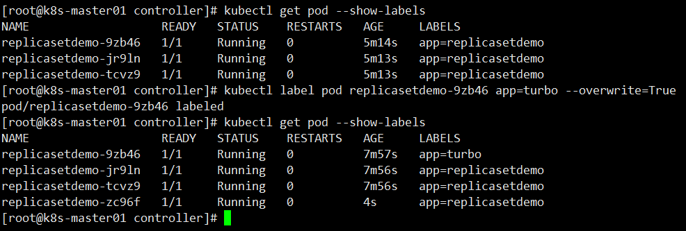
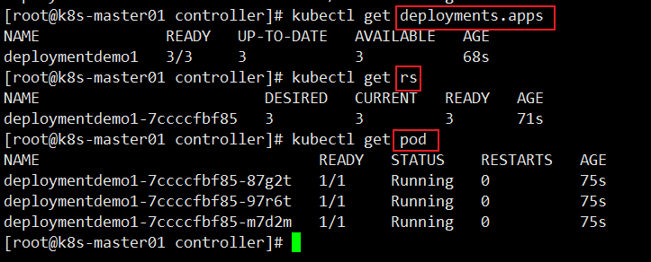

第五部分 K8s-pod控制器进阶

# 1 简介

Controller Manager 由 kube-controller-manager 和 cloud-controller-manager 组成，是Kubernetes 的大脑，它通过 apiserver 监控整个集群的状态，并确保集群处于预期的工作状态。

**kube-controller-manager 由一些列的控制器组成**

```bash
1 Replication Controller
2 Node Controller
3 CronJob Controller
4 DaemonSet Controller
5 Deployment Controller
6 Endpoint Controller
7 Garbage Collector
8 Namespace Controller
9 Job Controller
10 Pod AutoScaler
11 RelicaSet
12 Service Controller
13 ServiceAccount Controller
14 StatefulSet Controller
15 Volume Controller
16 Resource quota Controller
```

**cloud-controller-manager 在 Kubernetes 启用 Cloud Provider 的时候才需要，用来配合云服务提供商的控制，也包括一些列的控制器**

```bash
1 Node Controller
2 Route Controller
3 Service Controller
```

从 v1.6 开始，cloud provider已经经历了几次重大重构，以便在不修改 Kubernetes 核心代码的同时构建自定义的云服务商支持。

# 2 常见 Pod 控制器及其含义

1. ReplicaSet：适合无状态的服务部署

   用户创建指定数量的pod副本数量，确保 pod 副本数量符合预期状体，并且支持滚动式自动扩容和缩容功能。<br>ReplicaSet 主要由三个组件组成：

   - 用户期望的 pod 副本数量
   - 标签选择器，判断哪个 pod 归自己管理
   - 当现存的 pod 数量不足，会根据 pod 资源模板进行新建
   
   帮助用户管理无状态的 pod 资源，精确反映用户自定义的目标数量，**但是 ReplicaSet 不是直接使用的控制器，而是使用Deployment**。
   
2. deployment：适合无状态的服务部署

   工作在ReplicaSet之上，用于管理无状态应用，目前来说最好的控制器，支持滚动更新和回滚功能，还提供声明式配置。

3. StatefullSet：适合有状态的服务部署。需要学完存储卷后进行系统学习

4. Daemon：一次部署，所有的node节点都会部署，例如一些典型的应用场景：

   - 运行集群存储 daemon，例如在每个Node上运行 glusterd、ceph
   - 在每个Node上运行日志收集daemon，例如fluentd、logstash
   - 在每个Node上运行监控 daemon，例如 Prometheus Node Exporter

   用于确保集群中的每一个节点只运行特定的 pod 副本，通常用于实现系统级后台任务，比如ELK 服务

   特性：服务是无状态的，服务必须是守护进程

5. Job：一次性的执行任务。只要完成就立即退出，不需要重启或重建

6. Cronjob：周期性的执行任务。周期性任务控制，不需要持续后台运行。

# 3 使用镜像

```bash
演示pod的控制器升级使用：
docker pull nginx:1.17.10-alpine
docker pull nginx:1.18.0-alpine
docker pull nginx:1.19.2-alpine
```


# 4 replication Controller 控制器

replication controller 简称 RC，是 Kubernetes 系统中的核心概念之一，简单说，他其实定义了一个期望的场景，即声明某种pod的副本数量在任意时刻都符合某个预期值，所以 RC 的定义包含以下部分：

- pod 期待的副本数量
- 用于筛选目标 pod 的 Label Selector
- 当 pod 的副本数量小于期望值时，用于创建新的 pod 的 pod模板（template）

# 5 ReplicaSet

Replication Controller 用来确保容器应用额副本数始终保持在用户定义的副本数，即如果有容器异常退出，会自动创建新的Pod来替代；而如果异常多出来的容器也会自定回收。

在新版本的 Kubernetes 中建议使用 ReplicaSet 来取代 ReplicationController。ReplicaSet 和 ReplicationController没有本质的不同，只是名字不一样，并且 ReplicaSet 支持集合式的 selector。

虽然ReplicaSet可以独立使用，但一般还是建议使用 Deployment 来自动管理 ReplicaSet，这样就无需担心跟其他机制的不兼容问题（比如 ReplicaSet不支持 rolling-update，但Deployment支持）

## 5.1 ReplicaSet模板说明

```yaml
apiVersion: apps/v1 # api版本定义
kind: ReplicaSet   # 定义资源类型为ReplicaSet
metadata: # 元数据定义
  name: myapp
  namespace: default
  labels:
    app: myapp
spec: # ReplicaSet的规格定义
  replicas: 2 # 定义副本数量为2
  template: # pod的模板定义
    metadata: # pod的元数据定义
      name: myapp # 自定义pod的名称
      labels: # 定义pod的标签，需要和上面定义的标签一致，也可以多出其他标签
        app: myapp
        release: canary
        environment: qa
    spec: # pod 的规格定义
      containers: # 容器定义
        - name: myapp # 容器名称
          image: nginx:1.17.10-alpine # 容器镜像
          imagePullPolicy: IfNotPresent
          ports: # 暴露端口
            - containerPort: 80
              name: http
      restartPolicy: Always
  selector:  # 标签选择器，定义匹配 pod 的标签
    matchLabels:
      app: myapp
      release: canary
```


可以通过kubectl命令行方式获取更加详细信息

```bash
kubectl explain rs
kubectl explain rs.spec
kubectl explain rs.spec.template.spec
```


## 5.2 部署ReplicaSet

controller/replicasetdemo.yml

```yaml
apiVersion: apps/v1
kind: ReplicaSet
metadata:
  name: replicasetdemo
  labels:
    app: replicasetdemo
spec:
  replicas: 3
  template:
    metadata:
      name: replicasetdemo
      labels:
        app: replicasetdemo
    spec:
      containers:
        - name: replicasetdemo
          image: nginx:1.17.10-alpine
          imagePullPolicy: IfNotPresent
          ports:
            - containerPort: 80
      restartPolicy: Always
  selector:
    matchLabels:
      app: replicasetdemo
```


## 5.3 运行ReplicaSet

```bash
运行ReplicaSet
kubectl apply -f replicasetdemo.yml 

查看rs控制器
kubectl get rs 

查看pod信息
kubectl get pod 

查看pod详细信息
kubectl describe pod replicasetdemo-7fdd7b5f67-5gzfg

测试controller控制器下的pod删除、重新被controller控制器拉起
kubectl delete pod --all 
kubectl get pod

修改pod的副本数量:通过命令行方式
kubectl scale replicaset replicasetdemo --replicas=8 
kubectl get rs

修改pod的副本数量:通过资源清单方式
kubectl edit replicasets.apps replicasetdemo 
kubectl get rs

显示pod的标签
kubectl get pod --show-labels 
修改pod标签(label)
kubectl label pod replicasetdemo-652lc app=turbo --overwrite=True
再次显示pod的标签：发现多了一个pod，原来的rs中又重新拉起一个pod，说明rs是通过label去管理pod
kubectl get pod --show-labels 

删除rs
kubectl delete rs replicasetdemo
```



## 5.4 总结

kubectl命令行工具适用于RC的绝大部分命令同样适用于ReplicaSet，此外，我们当前很多好单独使用 ReplicaSet，它主要被Deployment这个更高层的资源对象所使用，从而形成一整套 Pod 创建，删除，更新的编排机制，我们在使用 Deployment 时无需关心它是如何维护和创建 ReplicaSet的，这一切都是自动发生的。

最后，总结一下 RC（ReplicaSet）的一些特性和作用：

- 在绝大多数情况下，我们通过定义一个RC实现Pod的创建及副本数量的自动控制
- 在RC里包括完整的Pod定义模板
- RC通过Label Selector机制实现对Pod副本的自动控制
- 通过改变 RC 里的 Pod 副本数量，可以实现Pod的扩容和缩容
- 通过改变RC里Pod模板中的镜像版本，可以实现滚动升级

# 6 Deployment

Deployment是Kubernetes在1.2 版本中引入的新概念，用于更好的解决Pod的编排问题，为此，Deployment在内部使用了ReplicaSet来实现目的。我们可以把Deployment理解为ReplicaSet的一次升级，两者相似度超过了90%

Deployment的使用场景有以下几个：

- 创建一个Deployment对象来生成对应的ReplicaSet并完成 Pod 副本的创建
- 检查Deployment的状态来看部署动作是否完成（Pod副本数量是否达到了预期的值）
- 更新Deployment以创建新的Pod（比如镜像升级）
- 如果当前 Deployment 不稳定，可以回滚到一个早先的 Deployment 版本
- 暂停 Deployment 以便于一次性修改多个 PodTemplateSpec的配置项，之后在恢复Deployment，进行新的发布
- 扩展 Deployment 以应对高负载
- 查看 Deployment 的状态，依次作为发布是否成功的标志
- 清理不再需要的旧版本 ReplicaSet

## 6.1 Deployment模板说明

可以通过kubectl命令行方式获取更加详细信息

```bash
kubectl explain deploy
kubectl explain deploy.spec
kubectl explain deploy.spec.template.spec
```


## 6.2 部署Deployment

除了API生命 与 Kind 类型有区别，Deployment的定义与Replica Set的定义跟类似。

controller/deploymentdemo.yml

```yaml
apiVersion: apps/v1
kind: Deployment
metadata:
  name: deploymentdemo1
  labels:
    app: deploymentdemo1
spec:
  replicas: 3
  template:
    metadata:
      name: deploymentdemo1
      labels:
        app: deploymentdemo1
    spec:
      containers:
        - name: deploymentdemo1
          image: nginx:1.17.10-alpine
          imagePullPolicy: IfNotPresent
          ports:
            - containerPort: 80
      restartPolicy: Always
  selector:
    matchLabels:
      app: deploymentdemo1
```


## 6.3 运行 Deployment

```bash
kubectl apply -f deploymentdemo.yml 

查看deployment
kubectl get rs
查看rs:deployment名称+hashcode码组成

查看pod
kubectl get pod
```



## 6.4 镜像更新升级

### 6.4.1 命令行方式

```bash
升级nginx镜像版本为1.18.0
kubectl set image deployment deploymentdemo1 deploymentdemo1=nginx:1.18.0-alpine

查看pod升级情况 
kubectl get pods -w

进去某一个pod内部，查看nginx升级版本信息
kubectl exec -it deploymentdemo1-df6bc5d4c-flc7b sh 
nginx -v
exit
```


### 6.4.2 yml文件方式

```bash
升级nginx镜像版本为1.19.2-alpine
kubectl edit deployments.apps deploymentdemo1 

查看pod升级情况
kubectl get pods -w

进去某一个pod内部，查看nginx升级版本信息
kubectl exec -it deploymentdemo1-584f6b54dd-4l62t sh 
nginx -v
exit
```


## 6.5 Deployment扩容

### 6.5.1 命令行方式

```bash
kubectl scale deployment deploymentdemo1 --replicas=15

kubectl get pods
```


### 6.5.2 yml文件方式

```bash
kubectl edit deployments.apps deploymentdemo1

kubectl get pods
```


## 6.6 滚动更新

### 6.6.1 概述

微服务部署：蓝绿部署、滚动部署、灰度部署、金丝雀发布。

1. 蓝绿部署 是不停老版本，部署新版本然后进行测试，确认OK，将流量切到新版本，然后老版本同时也升级到新版本。蓝绿部署无需停机，并且风险较小。
2. 滚动部署：一般是取出一个或者多个服务器停止服务，执行更新，并重新将其投入使用。周而复始，直到集群中所有的实例都更新成新版本。这种部署方式相对于蓝绿部署，更加节约资源——它不需要运行两个集群，两倍的实例数，我们可以部分部署，例如每次只取出集群的 20% 进行升级
3. 灰度部署 是指在黑与白之间，能够平滑过渡的一种发布方式，AB test 就是一种灰度发布方式，让一部分用户继续使用A，一部分用户开始使用B，如果用户B没有什么反对以见，那么逐步扩大范围，把所有用户迁移到B上面来。灰度发布可以保证整体系统的稳定，在初始灰度的时候就可以发现、调整问题，以保证其影响度。而我们平常所说的**金丝雀部署就是灰度发布的一种方式**。

### 6.6.2 金丝雀发布

Deployment控制器支持自定义控制更新过程中的滚动节奏，如 “暂停（pause）” 或 “继续（resume）” 更新操作。比如 等待第一批新的 pod 资源创建完成后立即暂停更新过程，此时，仅存在一部分新版本的应用，主体部分还是旧的版本。然后，再筛选一小部分的用户请求路由到新版本的 Pod 应用，继续观察能否稳定的按期望的方式运行。确定没问题之后，再继续完成余下的 Pod 资源滚动更新，否则立即回滚更新操作，这就是所谓的金丝雀发布（Canary Release）

```bash
更新deployment的nginx:1.18.0-alpine版本，并配置暂停deployment
kubectl set image deployment deploymentdemo1 deploymentdemo1=nginx:1.18.0-alpine && kubectl rollout pause deployment deploymentdemo1

观察更新状态
kubectl rollout status deployments deploymentdemo1

监控更新的过程，可以看到已经新增了一个资源，但是并未按照预期的状态去删除一个旧的资源，就是因为使用了pause暂停命令
kubectl get pods -l app=deploymentdemo1 -w

确保更新的pod没问题了，继续更新
kubectl rollout resume deploy deploymentdemo1

查看最后的更新情况
kubectl get pods -l app=deploymentdemo1 -w

进去某一个pod内部，查看nginx更新版本信息
kubectl exec -it deploymentdemo1-df6bc5d4c-flc7b sh 
nginx -v
```


## 6.7 Deployment版本回退


### 6.7.1 rollout常见命令

| 子命令  | 功能说明                   |
| ------- | -------------------------- |
| history | 查看rollout操作历史        |
| pause   | 将提供的资源设定为暂停状态 |
| restart | 重启某资源                 |
| resume  | 将某资源从暂停状态恢复正常 |
| status  | 查看rollout操作状态        |
| undo    | 回滚前 - rollout           |


### 6.7.2 history操作

```bash
kubectl rollout history deployment deploymentdemo1
```


### 6.7.3 status操作

```bash
kubectl rollout status deployment deploymentdemo1
```


### 6.7.4 undo操作

```bash
回滚版本信息
kubectl rollout undo deployment deploymentdemo1 

查看pod回滚情况
kubectl get pods -w

进去某一个pod内部，查看nginx回滚版本信息
kubectl exec -it deploymentdemo1-df6bc5d4c-flc7b sh 
nginx -v
```


## 6.8 Deployment 更新策略

## 6.9 总结

# 7 DaemonSet

# 8 Job

# 9 StatefulSet


