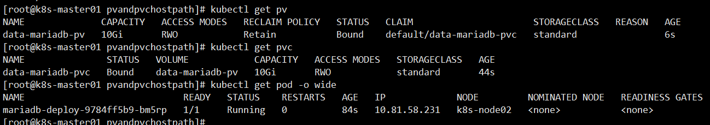

第七部分 K8s高级篇-volume(存储)

[卷-K8s-官网参考](https://kubernetes.io/zh/docs/concepts/storage/volumes/)

# 1 准备镜像

k8s集群每个node节点需要下载镜像：

```bash
docker pull mariadb:10.5.2
```


# 2 安装mariaDB

## 2.1 部署service

maria/mariadb.yml

```yaml
apiVersion: apps/v1
kind: Deployment
metadata:
  name: mariadb-deploy
  labels:
    app: mariadb-deploy
spec:
  replicas: 1
  template:
    metadata:
      name: mariadb-deploy
      labels:
        app: mariadb-deploy
    spec:
      containers:
        - name: mariadb-deploy
          image: mariadb:10.5.2
          imagePullPolicy: IfNotPresent
          env:
            - name: MYSQL_ROOT_PASSWORD
              value: admin #这是 mysql root 用户的密码
            - name: TZ
              value: Asia/Shanghai
          args:
            - "--character-set-server=utf8mb4"
            - "--collation-server=utf8mb4_unicode_ci"
          ports:
            - containerPort: 3306
      restartPolicy: Always
  selector:
    matchLabels:
      app: mariadb-deploy
---
apiVersion: v1
kind: Service
metadata:
  name: mariadb-svc
spec:
  selector:
    app: mariadb-deploy
  ports:
    - port: 3306
      targetPort: 3306
      nodePort: 30036
  type: NodePort
```


## 2.2 运行服务

```bash
kubectl apply -f .

kubectl get pod -o wide
```


## 2.3 客户端测试

```bash
IP:192.168.31.61
username:root 
password:admin 
prot: 30036
```


## 2.4 删除 service

```bash
kubectl delete -f mariadb.yml
```


# 3 secret

[secret-K8s-官网参考](https://kubernetes.io/zh/docs/concepts/configuration/secret/)

Secret 解决了密码、token、密钥等敏感数据的配置问题，而不需要把这些敏感数暴露到镜像或者 Pod Spec 中。Secret 可以以 Volume 或者环境变量的方式使用。

Secret 有三种类型：

- Service Account：用来访问 Kubernetes API，由 Kubernetes 自动创建，并且会自动挂载到Pod 的 /run/secrets/kubernetes.io/serviceaccount 目录中。
- Opaque：base64编码格式的Secret，用来存储密码、密钥等
- kubernetes.io/dockerconfigjson：用来存储私有 docker registry 的认证信息

## 3.1 Service Account

Service Account 简称 sa，Service Account 用来访问 Kubernetes API，由 Kubernetes自动创建，并且会自动挂载到 Pod 的 /run/secrets/kubernetes.io/serviceaccount 目录中

```bash
查询命名空间为kube-system的pod信息 
kubectl get pod -n kube-system

进入pod:kube-proxy-48bz4
kubectl exec -it kube-proxy-48bz4 -n kube-system sh 

cd /run/secrets/kubernetes.io/serviceaccount
ls

cat ca.crt
cat namespace
cat token
```


## 3.2 Opaque Secret

Opaque 类型的数据是一个 map 类型，要求 value 是 base64 编码格式。

### 3.2.1 加密解密

使用命令行方式对需要加密的字符串进行加密。例如：mysql数据库的密码。

```bash
对admin字符串进行base64加密:获得admin的加密字符串"YWRtaW4=" 
echo -n "admin" | base64

base64解密：对加密后的字符串进行解密 
echo -n "YWRtaW4=" | base64 -d
```


### 3.2.2 资源文件方式创建

对mariadb数据库密码进行加密

```yaml
apiVersion: v1
kind: Secret
metadata:
  name: mariadbsecret
type: Opaque
data:
  password: YWRtaW4=
  # 
  username: cm9vdA==
```


### 3.2.3 升级mariadb的service

```yaml
          env:
            - name: MYSQL_ROOT_PASSWORD
              #这是 mysql root 用户的密码
              valueFrom:
                secretKeyRef:
                  key: password
                  name: mariadbsecret
            - name: TZ
              value: Asia/Shanghai
```


### 3.2.4 全部资源文件清单

secret/mariadbsecret.yml

```yaml
apiVersion: v1
kind: Secret
metadata:
  name: mariadbsecret
type: Opaque
data:
  password: YWRtaW4=
  # 
  username: cm9vdA==
```

secret/mariadb.yml

```yaml
apiVersion: apps/v1
kind: Deployment
metadata:
  name: mariadb-deploy
  labels:
    app: mariadb-deploy
spec:
  replicas: 1
  template:
    metadata:
      name: mariadb-deploy
      labels:
        app: mariadb-deploy
    spec:
      containers:
        - name: mariadb-deploy
          image: mariadb:10.5.2
          imagePullPolicy: IfNotPresent
          env:
            - name: MYSQL_ROOT_PASSWORD
              #这是 mysql root 用户的密码
              valueFrom:
                secretKeyRef:
                  key: password
                  name: mariadbsecret
            - name: TZ
              value: Asia/Shanghai
          args:
            - "--character-set-server=utf8mb4"
            - "--collation-server=utf8mb4_unicode_ci"
          ports:
            - containerPort: 3306
      restartPolicy: Always
  selector:
    matchLabels:
      app: mariadb-deploy
---
apiVersion: v1
kind: Service
metadata:
  name: mariadb-svc
spec:
  selector:
    app: mariadb-deploy
  ports:
    - port: 3306
      targetPort: 3306
      nodePort: 30036
  type: NodePort
```


### 3.2.5 运行service

```bash
kubectl apply -f .

kubectl get secret
kubectl get svc
```


### 3.2.6 客户端测试

```bash
IP:192.168.31.61
username:root 
password:admin 
prot: 30036
```


### 3.2.7 删除service、secret

```bash
kubectl delete -f .

kubectl get secret
kubectl get svc
```


## 3.3 安装harbor私服

[参考docker部分的内容](https://github.com/turboYuu/java-advanced-gitbook/blob/master/8-stage/1-module/2-Docker-core-theory.md#53-%E4%BC%81%E4%B8%9A%E7%A7%81%E6%9C%8D)，使用192.168.31.82

### 3.3.1 harbor官网地址

```html
harbor官网地址： 
https://goharbor.io/

github官网地址：
https://github.com/goharbor/harbor
```

### 3.3.2 docker-compose

[参考docker部分的笔记](https://github.com/turboYuu/java-advanced-gitbook/blob/master/8-stage/1-module/2-Docker-core-theory.md#45-docker-compose%E5%AE%89%E8%A3%85)

```bahs
验证docker-compose
docker-compose -v
```

### 3.3.3 安装harbor

```bash
1.解压软件 
cd /data
tar zxf harbor-offline-installer-v1.9.4.tgz

2.进入安装目录 
cd harbor

3.修改配置文件 
vi harbor.yml
  3.1修改私服镜像地址 
  hostname: 192.168.31.82
  3.2修改镜像地址访问端口号 
  port: 5000
  3.3harbor管理员登录系统密码
  harbor_admin_password: Harbor12345
  3.4修改harbor映射卷目录 
  data_volume: /data/harbor
  
4.安装harbor
  4.1执行启动脚本,经过下述3个步骤后，成功安装harbor私服 
  ./install.sh
  4.2准备安装环境：检查docker版本和docker-compose版本
  4.3加载harbor需要的镜像
  4.4准备编译环境
  4.5启动harbor。通过docker-compose方式启动服务
  4.6google浏览器访问harbor私服 
  http://192.168.31.82:5000    
  username: admin
  password: Harbor12345
  
5.关闭harbor服务
docker-compose down [-v]
```

### 3.3.4 新建项目

```bash
在harbor中新建公共项目： 
turbine
```

### 3.3.5 配置私服

```bash
k8s集群master节点配置docker私服：master节点用于上传镜像。其余工作节点暂时不要配置私服地址。

vi /etc/docker/daemon.json
"insecure-registries":["192.168.31.82:5000"]

重启docker服务：
systemctl daemon-reload 
systemctl restart docker
```

### 3.3.6 登录私服

```bash
docker login -u admin -p Harbor12345 192.168.31.82:5000 

退出私服
docker logout 192.168.31.82:5000
```

### 3.3.7 上传mariadb镜像

```bash
docker tag mariadb:10.5.2 192.168.31.82:5000/turbine/mariadb:10.5.2

docker push 192.168.31.82:5000/turbine/mariadb:10.5.2

docker rmi -f 192.168.31.82:5000/turbine/mariadb:10.5.2
```

### 3.3.8 修改mariadb镜像地址

修改 secret/maraiadb.yml 文件，将image地址修改为harbor私服地址

```yaml
image: 192.168.31.82:5000/turbine/mariadb:10.5.2
```

运行服务

```bash
kubectl apply -f .

查看pod信息：发现镜像拉取失败，STATUS显示信息为"ImagePullBackOff" 
kubectl get pods

查看pod详细信息:拉取harbor私服镜像失败。 
kubectl describe pod mariadb-7b6f895b5b-mc5xp

删除服务：
kubectl delete -f .
```


## 3.4 注册私服

使用 kubectl 创建 docker registry 认证的

```bash
语法规则：
kubectl create secret docker-registry myregistrykey --docker-server=REGISTRY_SERVER --docker-username=DOCKER_USER --docker-password=DOCKER_PASSWORD --docker-email=DOCKER_EMAIL
例子：
kubectl create secret docker-registry turboharbor --docker-server=192.168.31.82:5000 --docker-username=admin --docker-password=Harbor12345 --docker-email=harbor@turbo.com

k8s集群其余工作节点配置docker私服地址： 
vi /etc/docker/daemon.json
"insecure-registries":["192.168.31.82:5000"]

重启docker服务： 
systemctl daemon-reload
systemctl restart docker
```


## 3.5 secret升级mariadb

将mariadb镜像修改为harbor私服地址。在创建 Pod 的时候，通过 imagesPullSecrets 引用刚创建的 `myregistrykey`

```yaml
    spec:
      imagePullSecrets:
        - name: turboharbor
      containers:
        - name: mariadb-deploy
          image: 192.168.31.82:5000/turbine/mariadb:10.5.2
```

### 3.5.1 全部资源文件清单

mariadbsecret.yml

```yaml
apiVersion: v1
kind: Secret
metadata:
  name: mariadbsecret
type: Opaque
data:
  password: YWRtaW4=
  # 
  username: cm9vdA==
```


mariadb.yml

```yaml
apiVersion: apps/v1
kind: Deployment
metadata:
  name: mariadb-deploy
  labels:
    app: mariadb-deploy
spec:
  replicas: 1
  template:
    metadata:
      name: mariadb-deploy
      labels:
        app: mariadb-deploy
    spec:
      imagePullSecrets:
        - name: turboharbor
      containers:
        - name: mariadb-deploy
          image: 192.168.31.82:5000/turbine/mariadb:10.5.2
          imagePullPolicy: IfNotPresent
          env:
            - name: MYSQL_ROOT_PASSWORD
              #这是 mysql root 用户的密码
              valueFrom:
                secretKeyRef:
                  key: password
                  name: mariadbsecret
            - name: TZ
              value: Asia/Shanghai
          args:
            - "--character-set-server=utf8mb4"
            - "--collation-server=utf8mb4_unicode_ci"
          ports:
            - containerPort: 3306
      restartPolicy: Always
  selector:
    matchLabels:
      app: mariadb-deploy
---
apiVersion: v1
kind: Service
metadata:
  name: mariadb-svc
spec:
  selector:
    app: mariadb-deploy
  ports:
    - port: 3306
      targetPort: 3306
      nodePort: 30036
  type: NodePort
```


## 3.6 客户端测试

```bash
IP:192.168.31.61
username:root 
password:admin 
prot: 30036
```


# 4 configmap

[ConfigMap-K8s-官网参考](https://kubernetes.io/zh/docs/concepts/configuration/configmap/)

ConfigMap 顾名思义，用于保存配置数据的键值对，可以用来保存单个属性，也可以保存配置文件。

ConfigMaps 允许你将配置构件 与 映射内容解耦，以保持容器化应用程序的可移植性。configmap 可以从文件、目录 或者 key-value 字符串创建等 创建 configmap。也可以通过 kubectl create -f 从描述文件创建。可以使用 kubectl create 创建命令。创建 ConfigMap 的方式有 4 种：

1. 直接在命令行中指定 configmap 参数创建，即 `--from-literal`。
2. 指定文件创建，即将一个配置文件创建为一个 ConfigMap，--from-file=<文件>
3. 指定目录创建，即将一个目录下的所有配置文件创建为一个 ConfigMap，--from-file=<目录>
4. 先写好标准的configmap的yaml文件，然后kubectl create -f 创建

## 4.1 命令行方式

从 key-value 字符串创建，官方翻译是从字面值中创建 ConfigMap。

### 4.1.1 语法规则

```bash
kubectl create configmap map的名字 --from-literal=key=value 

如果有多个key，value。可以继续在后边写
kubectl create configmap map的名字
  --from-literal=key1=value1
  --from-literal=key2=value2
  --from-literal=key3=value4
```


### 4.1.2 案例

```bash
创建configmap
kubectl create configmap helloconfigmap --from-literal=turbo.hello=world

查看configmap
kubectl get configmap helloconfigmap -o go-template='{{.data}}'

删除configmap
kubectl delete configmaps helloconfigmap
```

```html
在使用kubectl get获取资源信息的时候,可以通过-o(--output简写形式)指定信息输出的格式,
如果指定的是yaml或者json输出的是资源的完整信息,

实际工作中,输出内容过少则得不到我们想要的信息,输出内容过于详细又不利于快速定位的我们想要找到的内容,
其实-o输出格式可以指定为go-template 然后指定一个template,这样我们就可以通过go-template获取我们想要的内容.
go-template与 kubernetes无关,它是go语言内置的一种模板引擎.这里不对go-template做过多解释,
仅介绍在 kubernetes中获取资源常用的语法,想要获取更多内容,大家可以参考相关资料获取帮助。
大家记住是固定语法即可。
```


## 4.2 配置文件方式

### 4.2.1 语法规则

```bash
语法规则如下：当 --from-file指向一文件，key的名称是文件名称，value的值是这个文件的内容。
kubectl create configmap cumulx-test --from-file=xxxx
```


### 4.2.2 案例

创建一个配置文件：jdbc.properties

```properties
vi jdbc.properties

jdbc.driverclass=com.mysql.jdbc.Driver
jdbc.url=jdbc:mysql://localhost:3306/test
jdbc.username=root
jdbc.password=admin
```


```bash
创建configmap换用其他方式查看信息
kubectl create configmap myjdbcmap --from-file=jdbc.properties 

查看configmap详细信息
kubectl describe configmaps myjdbcmap
```


## 4.3 目录方式

### 4.3.1 语法规则

```bash
语法规则如下：当 --from-file指向一个目录，每个目录中的文件直接用于填充ConfigMap中的key,key的名称是文件名称，value的值是这个文件的内容。下面的命令读取/data目录下的所有文件
kubectl create configmap cumulx-test --from-file=/data/
```


### 4.3.2 案例

```bash
kubectl create configmap myjdbcconfigmap --from-file=/data/jdbc.properties 

查看configmap详细信息
kubectl describe configmaps myjdbcmap
```


## 4.4 资源文件方式

### 4.4.1 yml文件

```yaml
apiVersion: v1
kind: ConfigMap
metadata:
  name: myjdbcconfigmap
data:
  jdbc-driverclass: com.mysql.jdbc.Driver
  jdbc-url: jdbc:mysql://localhost:3306/test
  jdbc-username: root
  jdbc-password: admin
```


### 4.4.2 运行yml文件

```bash
kubectl apply -f mariadb-configmap.yml 

查看configmap详细信息
kubectl describe configmaps mariadbconfigmap
```


# 5 configmap 升级 mariadb

## 5.1 获得 my.cnf 文件

```bash
运行测试镜像：
docker run --name some-mariadb -e MYSQL_ROOT_PASSWORD=my-secret-pw -d 192.168.31.82:5000/turbine/mariadb:10.5.2

将my.cnf文件从容器中复制到/data目录
docker cp some-mariadb:/etc/mysql/my.cnf /data 

停止容器
docker stop some-mariadb 

删除容器
docker rm some-mariadb 

删除镜像
docker rmi -f 192.168.31.82:5000/turbine/mariadb:10.5.2

更改my.cnf文件中的端口号为：3307
```


## 5.2 生成 configmap 文件

data/mariadbconfigmap.yml

```bash
将my.cnf文件中mariadb数据库启动端口号修改为3307，
将my.cnf文件上传master节点，首先通过命令行方式生成configmap资源。
再通过命令行方式将configmap反向生成yaml文件。
将生成文件copy回 idea开发工具。修改yaml文件备用。

kubectl create configmap mysqlini --from-file=my.cnf 
kubectl get configmap mysqlini -o yaml > mariadbconfigmap.yml
```


## 5.3 修改 mariadb.yml

```yaml
          volumeMounts:
            - mountPath: /etc/mysql/mariadb.conf.d/ # 容器内的挂载目录
              name: turbo-mariadb # 随便给一个名字,这个名字必须与volumes.name 一致
          ports:
            - containerPort: 3307
      restartPolicy: Always
      volumes:
        - name: turbo-mariadb
          configMap:
            name: mariadbconfigmap
```


## 5.4 全部资源文件清单

### 5.4.1 configmap/mariadbsecret.yml

```yaml
apiVersion: v1
kind: Secret
metadata:
  name: mariadbsecret
type: Opaque
data:
  password: YWRtaW4=
  # mariadb的用户名root加密，用于演示，无实际效果
  username: cm9vdA==
```

### 5.4.2 configmap/mariadb.yml

**需要再次调整，加入私服镜像信息**

注意修改 pod 的端口号为 3307，service的targetPort端口号为 3307

```yaml
apiVersion: apps/v1
kind: Deployment
metadata:
  name: mariadb-deploy
  labels:
    app: mariadb-deploy
spec:
  replicas: 1
  template:
    metadata:
      name: mariadb-deploy
      labels:
        app: mariadb-deploy
    spec:
      imagePullSecrets:
        - name: turboharbor
      containers:
        - name: mariadb-deploy
          image: 192.168.31.82:5000/turbine/mariadb:10.5.2
          imagePullPolicy: IfNotPresent
          env:
            - name: MYSQL_ROOT_PASSWORD
              #这是 mysql root 用户的密码
              valueFrom:
                secretKeyRef:
                  key: password
                  name: mariadbsecret
            - name: TZ
              value: Asia/Shanghai
          args:
            - "--character-set-server=utf8mb4"
            - "--collation-server=utf8mb4_unicode_ci"
          volumeMounts:
            - mountPath: /etc/mysql/mariadb.conf.d/ # 容器内的挂载目录
              name: turbo-mariadb # 随便给一个名字,这个名字必须与volumes.name 一致
          ports:
            - containerPort: 3307
      restartPolicy: Always
      volumes:
        - name: turbo-mariadb
          configMap:
            name: mariadbconfigmap
  selector:
    matchLabels:
      app: mariadb-deploy
---
apiVersion: v1
kind: Service
metadata:
  name: mariadb-svc
spec:
  selector:
    app: mariadb-deploy
  ports:
    - port: 3307
      targetPort: 3307
      nodePort: 30036
  type: NodePort
```

### 5.4.3 configmap/mariadbconfigmap.yml

```yaml
apiVersion: v1
data:
  my.cnf: "# MariaDB database server configuration file.\n#\n# You can copy this file
    to one of:\n# - \"/etc/mysql/my.cnf\" to set global options,\n# - \"~/.my.cnf\"
    to set user-specific options.\n# \n# One can use all long options that the program
    supports.\n# Run program with --help to get a list of available options and with\n#
    --print-defaults to see which it would actually understand and use.\n#\n# For
    explanations see\n# http://dev.mysql.com/doc/mysql/en/server-system-variables.html\n\n#
    This will be passed to all mysql clients\n# It has been reported that passwords
    should be enclosed with ticks/quotes\n# escpecially if they contain \"#\" chars...\n#
    Remember to edit /etc/mysql/debian.cnf when changing the socket location.\n[client]\nport\t\t=
    3307\nsocket\t\t= /var/run/mysqld/mysqld.sock\n\n# Here is entries for some specific
    programs\n# The following values assume you have at least 32M ram\n\n# This was
    formally known as [safe_mysqld]. Both versions are currently parsed.\n[mysqld_safe]\nsocket\t\t=
    /var/run/mysqld/mysqld.sock\nnice\t\t= 0\n\n[mysqld]\n#\n# * Basic Settings\n#\n#user\t\t=
    mysql\npid-file\t= /var/run/mysqld/mysqld.pid\nsocket\t\t= /var/run/mysqld/mysqld.sock\nport\t\t=
    3307\nbasedir\t\t= /usr\ndatadir\t\t= /var/lib/mysql\ntmpdir\t\t= /tmp\nlc_messages_dir\t=
    /usr/share/mysql\nlc_messages\t= en_US\nskip-external-locking\n#\n# Instead of
    skip-networking the default is now to listen only on\n# localhost which is more
    compatible and is not less secure.\n#bind-address\t\t= 127.0.0.1\n#\n# * Fine
    Tuning\n#\nmax_connections\t\t= 100\nconnect_timeout\t\t= 5\nwait_timeout\t\t=
    600\nmax_allowed_packet\t= 16M\nthread_cache_size       = 128\nsort_buffer_size\t=
    4M\nbulk_insert_buffer_size\t= 16M\ntmp_table_size\t\t= 32M\nmax_heap_table_size\t=
    32M\n#\n# * MyISAM\n#\n# This replaces the startup script and checks MyISAM tables
    if needed\n# the first time they are touched. On error, make copy and try a repair.\nmyisam_recover_options
    = BACKUP\nkey_buffer_size\t\t= 128M\n#open-files-limit\t= 2000\ntable_open_cache\t=
    400\nmyisam_sort_buffer_size\t= 512M\nconcurrent_insert\t= 2\nread_buffer_size\t=
    2M\nread_rnd_buffer_size\t= 1M\n#\n# * Query Cache Configuration\n#\n# Cache only
    tiny result sets, so we can fit more in the query cache.\nquery_cache_limit\t\t=
    128K\nquery_cache_size\t\t= 64M\n# for more write intensive setups, set to DEMAND
    or OFF\n#query_cache_type\t\t= DEMAND\n#\n# * Logging and Replication\n#\n# Both
    location gets rotated by the cronjob.\n# Be aware that this log type is a performance
    killer.\n# As of 5.1 you can enable the log at runtime!\n#general_log_file        =
    /var/log/mysql/mysql.log\n#general_log             = 1\n#\n# Error logging goes
    to syslog due to /etc/mysql/conf.d/mysqld_safe_syslog.cnf.\n#\n# we do want to
    know about network errors and such\n#log_warnings\t\t= 2\n#\n# Enable the slow
    query log to see queries with especially long duration\n#slow_query_log[={0|1}]\nslow_query_log_file\t=
    /var/log/mysql/mariadb-slow.log\nlong_query_time = 10\n#log_slow_rate_limit\t=
    1000\n#log_slow_verbosity\t= query_plan\n\n#log-queries-not-using-indexes\n#log_slow_admin_statements\n#\n#
    The following can be used as easy to replay backup logs or for replication.\n#
    note: if you are setting up a replication slave, see README.Debian about\n#       other
    settings you may need to change.\n#server-id\t\t= 1\n#report_host\t\t= master1\n#auto_increment_increment
    = 2\n#auto_increment_offset\t= 1\n#log_bin\t\t\t= /var/log/mysql/mariadb-bin\n#log_bin_index\t\t=
    /var/log/mysql/mariadb-bin.index\n# not fab for performance, but safer\n#sync_binlog\t\t=
    1\nexpire_logs_days\t= 10\nmax_binlog_size         = 100M\n# slaves\n#relay_log\t\t=
    /var/log/mysql/relay-bin\n#relay_log_index\t= /var/log/mysql/relay-bin.index\n#relay_log_info_file\t=
    /var/log/mysql/relay-bin.info\n#log_slave_updates\n#read_only\n#\n# If applications
    support it, this stricter sql_mode prevents some\n# mistakes like inserting invalid
    dates etc.\n#sql_mode\t\t= NO_ENGINE_SUBSTITUTION,TRADITIONAL\n#\n# * InnoDB\n#\n#
    InnoDB is enabled by default with a 10MB datafile in /var/lib/mysql/.\n# Read
    the manual for more InnoDB related options. There are many!\ndefault_storage_engine\t=
    InnoDB\ninnodb_buffer_pool_size\t= 256M\ninnodb_log_buffer_size\t= 8M\ninnodb_file_per_table\t=
    1\ninnodb_open_files\t= 400\ninnodb_io_capacity\t= 400\ninnodb_flush_method\t=
    O_DIRECT\n#\n# * Security Features\n#\n# Read the manual, too, if you want chroot!\n#
    chroot = /var/lib/mysql/\n#\n# For generating SSL certificates I recommend the
    OpenSSL GUI \"tinyca\".\n#\n# ssl-ca=/etc/mysql/cacert.pem\n# ssl-cert=/etc/mysql/server-cert.pem\n#
    ssl-key=/etc/mysql/server-key.pem\n\n#\n# * Galera-related settings\n#\n[galera]\n#
    Mandatory settings\n#wsrep_on=ON\n#wsrep_provider=\n#wsrep_cluster_address=\n#binlog_format=row\n#default_storage_engine=InnoDB\n#innodb_autoinc_lock_mode=2\n#\n#
    Allow server to accept connections on all interfaces.\n#\n#bind-address=0.0.0.0\n#\n#
    Optional setting\n#wsrep_slave_threads=1\n#innodb_flush_log_at_trx_commit=0\n\n[mysqldump]\nquick\nquote-names\nmax_allowed_packet\t=
    16M\n\n[mysql]\n#no-auto-rehash\t# faster start of mysql but no tab completion\n\n[isamchk]\nkey_buffer\t\t=
    16M\n\n#\n# * IMPORTANT: Additional settings that can override those from this
    file!\n#   The files must end with '.cnf', otherwise they'll be ignored.\n#\n!include
    /etc/mysql/mariadb.cnf\n!includedir /etc/mysql/conf.d/\n"
kind: ConfigMap
metadata:
  name: mariadbconfigmap
```


## 5.5 运行服务

```bash
部署服务
kubectl apply -f .

查看相关信息
kubectl get configmaps 
kubectl get pods
```


## 5.6 查看 mariadb容器日志

```bash
查看mariadb容器日志：观察mariadb启动port是否为3307 
kubectl logs -f mariadb-5d99587d4b-xwthc
```


## 5.7 客户端测试

```bash
IP:192.168.31.61 
username:root 
password:admin 
prot: 30036
```


# 6 label操作

前面学习了如何给 pod 打标签及[修改pod的标签值](https://github.com/turboYuu/java-advanced-gitbook/blob/master/8-stage/2-module/5-K8s-Controller-Manager.md#53-%E8%BF%90%E8%A1%8Creplicaset)。在某些特殊情况下，需要将某些服务固定在一台宿主机上，k8s可以使用 label 给node节点打赏标签来满足这种需求。


## 6.1 添加 label操作

```bash
kubectl label nodes <node-name> <label-key>=<label-value> 

为k8s-node01节点打标签
kubectl label nodes k8s-node01 mariadb=mariadb 

查看node节点label值
kubectl get nodes --show-labels
```


## 6.2 修改Label的值

**语法**：**需要加上`--overwrite`参数**

```bash
kubectl label nodes <node-name> <label-key>=<label-value> --overwrite 

修改k8s-node01节点label值
kubectl label nodes k8s-node01 mariadb=mariadb10.5 --overwrite 

查看node节点label值
kubectl get nodes --show-labels
```


## 6.3 删除label语法

```bash
注意事项：label的可以后边要增加"-"
kubectl label nodes <node-name> <label-key>- 

删除k8s-node01节点mariadb的label
kubectl label nodes k8s-node01 mariadb- 

查看node节点label值
kubectl get nodes --show-labels
```


## 6.4 mariaDB 部署

通过指定 node 节点 lable，将mariaDB部署到指定节点。方便演示 volume的各种方式。

### 6.4.1 指定node

```bash
kubectl label nodes k8s-node01 mariadb=mariadb 

查看node节点label值
kubectl get nodes --show-labels
```


### 6.4.2 service部署

```bash
在spec.template.spec属性下增加nodeSelector属性。 
spec:
  nodeSelector: #根据label设置，配置节点选择器       
    mariadb: mariadb  #语法规则: key: value     
  containers:
```


## 6.5 全部资源文件清单

labels/mariadbsecret.yml

```yaml
apiVersion: v1
kind: Secret
metadata:
  name: mariadbsecret
type: Opaque
data:
  password: YWRtaW4=
  # mariadb的用户名root加密，用于演示，无实际效果
  username: cm9vdA==
```


labels/mariadb.yml

```yaml
apiVersion: apps/v1
kind: Deployment
metadata:
  name: mariadb-deploy
  labels:
    app: mariadb-deploy
spec:
  replicas: 1
  template:
    metadata:
      name: mariadb-deploy
      labels:
        app: mariadb-deploy
    spec:
      nodeSelector:
        mariadb: mariadb
      imagePullSecrets:
        - name: turboharbor
      containers:
        - name: mariadb-deploy
          image: 192.168.31.82:5000/turbine/mariadb:10.5.2
          imagePullPolicy: IfNotPresent
          env:
            - name: MYSQL_ROOT_PASSWORD
              #这是 mysql root 用户的密码
              valueFrom:
                secretKeyRef:
                  key: password
                  name: mariadbsecret
            - name: TZ
              value: Asia/Shanghai
          args:
            - "--character-set-server=utf8mb4"
            - "--collation-server=utf8mb4_unicode_ci"
          volumeMounts:
            - mountPath: /etc/mysql/mariadb.conf.d/ # 容器内的挂载目录
              name: turbo-mariadb # 随便给一个名字,这个名字必须与volumes.name 一致
          ports:
            - containerPort: 3307
      restartPolicy: Always
      volumes:
        - name: turbo-mariadb
          configMap:
            name: mariadbconfigmap
  selector:
    matchLabels:
      app: mariadb-deploy
---
apiVersion: v1
kind: Service
metadata:
  name: mariadb-svc
spec:
  selector:
    app: mariadb-deploy
  ports:
    - port: 3307
      targetPort: 3307
      nodePort: 30036
  type: NodePort
```


labels/mariadbconfigmap.yml

```yaml
apiVersion: v1
data:
  my.cnf: "省略中间数据部分“
kind: ConfigMap
metadata:
  name: mariadbconfigmap
```


## 6.6 客户端测试

```
IP:192.168.31.62
username:root 
password:admin 
prot: 30036
```


# 7 volume

## 7.1 hostPath（卷的入门）

hostPath类型的存储卷是指将工作节点上某文件系统的目录或文件挂载于 Pod 中的一种存储卷。把宿主机上的目录挂载到容器，但是在每个节点上都要有，因为不确定容器会分配到哪个节点。也是把存储从宿主机挂载到 K8s 集群上，但它有许多限制，例如只支持单节点（Node），而且只支持 ”ReadWriteOnce“ 模式。

### 7.1.1 指定node节点

```bash
kubectl label nodes k8s-node01 mariadb=mariadb 

查看node节点label值
kubectl get nodes --show-labels
```


### 7.1.2 挂载卷

```yaml
语法：
1. volumeMounts为containers下级key，containers.volumeMounts。volumes与 containers平级。
2. containers.volumeMounts.name与volumes.name值一致。
3. containers.volumeMounts.mountPath是容器内目录
4. volumes.hostPath.path是宿主机挂载目录
5. volumes.hostPath.type值必须为"Directory"

containers 
  volumeMounts:
    - mountPath: /var/lib/mysql      
    name: mariadb-volume
    ....... 
volumes:
  - name: mariadb-volume     
  hostPath:
    path: /data/mariadb 
    type: Directory
    
    
例如： 
  volumeMounts:
    - mountPath: /var/lib/mysql      
    name: mariadb-volume 
restartPolicy: Always
volumes:
  - name: mariadb-volume    
  hostPath:
    path: /data/mariadb      
    type: Directory
```


### 7.1.3 全部资源文件清单

hostPath/mariadbsecret.yml

```yaml
apiVersion: v1
kind: Secret
metadata:
  name: mariadbsecret
type: Opaque
data:
  password: YWRtaW4=
  # mariadb的用户名root加密，用于演示，无实际效果
  username: cm9vdA==
```


hostPath/mariadb.yml

```yaml
apiVersion: apps/v1
kind: Deployment
metadata:
  name: mariadb-deploy
  labels:
    app: mariadb-deploy
spec:
  replicas: 1
  template:
    metadata:
      name: mariadb-deploy
      labels:
        app: mariadb-deploy
    spec:
      nodeSelector:
        mariadb: mariadb
      imagePullSecrets:
        - name: turboharbor
      containers:
        - name: mariadb-deploy
          image: 192.168.31.82:5000/turbine/mariadb:10.5.2
          imagePullPolicy: IfNotPresent
          env:
            - name: MYSQL_ROOT_PASSWORD
              #这是 mysql root 用户的密码
              valueFrom:
                secretKeyRef:
                  key: password
                  name: mariadbsecret
            - name: TZ
              value: Asia/Shanghai
          args:
            - "--character-set-server=utf8mb4"
            - "--collation-server=utf8mb4_unicode_ci"
          volumeMounts:
            - mountPath: /etc/mysql/mariadb.conf.d/ # 容器内的挂载目录
              name: turbo-mariadb # 随便给一个名字,这个名字必须与volumes.name 一致
            - mountPath: /var/lib/mysql # 容器内的挂载目录
              name: turbo-volume-mariadb
          ports:
            - containerPort: 3307
      restartPolicy: Always
      volumes:
        - name: turbo-mariadb
          configMap:
            name: mariadbconfigmap
        - name: turbo-volume-mariadb
          hostPath:
            path: /data/mariadb
            type: Directory
  selector:
    matchLabels:
      app: mariadb-deploy
---
apiVersion: v1
kind: Service
metadata:
  name: mariadb-svc
spec:
  selector:
    app: mariadb-deploy
  ports:
    - port: 3307
      targetPort: 3307
      nodePort: 30036
  type: NodePort
```


hostPath/mariadbconfigmap.yml

```yaml
apiVersion: v1
data:
  my.cnf: "省略..."
kind: ConfigMap
metadata:
  name: mariadbconfigmap
```

### 7.1.4 客户端测试

```bash
IP:192.168.31.63
username:root 
password:admin 
prot: 30036
```


## 7.2 emptyDir

emptyDir存储卷是Pod生命周期中的一个临时目录你，在Pod对象被移除时会被一并删除，用得少。例如：同一 pod内的多个容器间文件共享，或者作为容器数据的临时存储目录用于数据缓存系统等。可以自己查资料学习。

# 8 PV&&PVC

[Persistent Volumes - K8s 官网参考](https://kubernetes.io/docs/concepts/storage/persistent-volumes/)

## 8.1 简介

部署mysql之前，需要先了解一个概念：有状态服务。这是一种特殊的服务，简单的归纳下就是会产生需要持久化的数据，并且有很强的 I/O需求，且重启需要依赖上次存储到的磁盘的数据，如典型的mysql，kafka，zookeeper等等。

在我们有比较优秀的商业存储的前提下，非常推荐使用有状态服务进行部署，计算和存储分离那是相当爽的。在实际生产中如果没有这种存储，localPV 也是不错的选择，当然 localPV 其实和 hostPath 是一样的。当然我们在开发测试环境也是可以自己搭建一套简单的，如NFS 服务，来享受存储和计算分离的爽快感。

Kubernetes中定义一种资源类型 Stateful Service 即有状态服务，有状态服务需要的持久化数据动态绑定我们可以利用存储的API PersistentVolume（PV） 和 PersistentVolumeClaim（PVC）来进行需要的相关数据的绑定和存储。

## 8.2 PV概念

persistentVolume：是由管理员设置的存储，它是集群的一部分。就像节点时集群中的资源一样，PV也是集群中的资源。PV是Volumes之类的卷插件，但具有独立于使用PV的 pod 的生命周期。此API对象包含存储实现的细节，即 NFS、iSCSI或者特定于云供应商的存储系统。

## 8.3 PVC概念

persistentVolumeClaim 是用户存储的请求。它与 pod 相似，pod消耗节点资源，PVC 消耗PV 资源。pod可以请求特定级别的资源（CPU和内存）。声明 可以请求特定的大小和访问模式。例如：可以以读/写一次 或者 只读多次模式挂载。

## 8.4 PV & PVC

PV 就好比是一个仓库，我们需要先购买一个仓库，即定义一个PV存储服务，例如 CEPH，NFS，Local Hostpath等等。

PVC 就好比是 租户，**pv和pvc是一对一绑定的**，挂载到 POD 中，一个PVC可以被多个 pod 挂载

## 8.5 全部资源文件清单

### 8.5.1 pv

pvandpvchostpath/mariadbpv.yml

```yaml
apiVersion: v1
kind: PersistentVolume
metadata:
  name: data-mariadb-pv
  labels:
    app: mariadb-pv
spec:
  accessModes:
    - ReadWriteOnce # hostpath 模式只支持 ReadWriteOnce
  capacity:
    storage: 10Gi
  hostPath:
    path: /data/mariadb
    type: DirectoryOrCreate
  persistentVolumeReclaimPolicy: Retain
  storageClassName: standard
  volumeMode: Filesystem
```

### 8.5.2 pvc

pvandpvchostpath/mariadbpvc.yml

```yaml
apiVersion: v1
kind: PersistentVolumeClaim
metadata:
  name: data-mariadb-pvc
  labels:
    app: mariadb-pvc
spec:
  accessModes:
    - ReadWriteOnce
  storageClassName: standard
  resources:
    requests:
      storage: 5Gi
```

### 8.5.3 service

```yaml
      volumes:  
        - name: turbo-volume-mariadb
          persistentVolumeClaim:
            claimName: data-mariadb-pvc
```

完整文件信息

pvandpvchostpath/mariadb.yml

```yaml
apiVersion: apps/v1
kind: Deployment
metadata:
  name: mariadb-deploy
  labels:
    app: mariadb-deploy
spec:
  replicas: 1
  template:
    metadata:
      name: mariadb-deploy
      labels:
        app: mariadb-deploy
    spec:
      nodeSelector:
        mariadb: mariadb
      imagePullSecrets:
        - name: turboharbor
      containers:
        - name: mariadb-deploy
          image: 192.168.31.82:5000/turbine/mariadb:10.5.2
          imagePullPolicy: IfNotPresent
          env:
            - name: MYSQL_ROOT_PASSWORD
              #这是 mysql root 用户的密码
              valueFrom:
                secretKeyRef:
                  key: password
                  name: mariadbsecret
            - name: TZ
              value: Asia/Shanghai
          args:
            - "--character-set-server=utf8mb4"
            - "--collation-server=utf8mb4_unicode_ci"
          volumeMounts:
            - mountPath: /etc/mysql/mariadb.conf.d/ # 容器内的挂载目录
              name: turbo-mariadb # 随便给一个名字,这个名字必须与volumes.name 一致
            - mountPath: /var/lib/mysql # 容器内的挂载目录
              name: turbo-volume-mariadb
          ports:
            - containerPort: 3307
      restartPolicy: Always
      volumes:
        - name: turbo-mariadb
          configMap:
            name: mariadbconfigmap
        - name: turbo-volume-mariadb
          persistentVolumeClaim:
            claimName: data-mariadb-pvc
  selector:
    matchLabels:
      app: mariadb-deploy
---
apiVersion: v1
kind: Service
metadata:
  name: mariadb-svc
spec:
  selector:
    app: mariadb-deploy
  ports:
    - port: 3307
      targetPort: 3307
      nodePort: 30036
  type: NodePort
```

### 8.5.4 secret

pvandpvchostpath/mariadbsecret.yml

```yaml
apiVersion: v1
kind: Secret
metadata:
  name: mariadbsecret
type: Opaque
data:
  password: YWRtaW4=
  # mariadb的用户名root加密，用于演示，无实际效果
  username: cm9vdA==
```

### 8.5.5 configmap

pvandpvchostpath/mariadbconfigmap.yml

```yaml
apiVersion: v1
data:
  my.cnf: "省略..."
kind: ConfigMap
metadata:
  name: mariadbconfigmap
```




## 8.6 客户端测试

```
IP:192.168.31.61
username:root 
password:admin 
prot: 30036
```


## 8.7 PV&&PVC理论补充

### 8.7.1 存储机制介绍

### 8.7.2 PV 支持存储的类型

PersistentVolume 类型实现为插件，目前 Kubernetes 支持以下插件：

```bash
RBD：Ceph 块存储。
FC：光纤存储设备。
NFS：网络问卷存储卷。
iSCSI：iSCSI 存储设备。
CephFS：开源共享存储系统。
Flocker：一种开源共享存储系统。
Glusterfs：一种开源共享存储系统。
Flexvolume：一种插件式的存储机制。
HostPath：宿主机目录，仅能用于单机。
AzureFile：Azure 公有云提供的 File。
AzureDisk：Azure 公有云提供的 Disk。
ScaleIO Volumes：DellEMC 的存储设备。
StorageOS：StorageOS 提供的存储服务。
VsphereVolume：VMWare 提供的存储系统。
Quobyte Volumes：Quobyte 提供的存储服务。
Portworx Volumes：Portworx 提供的存储服务。 
GCEPersistentDisk：GCE 公有云提供的 PersistentDisk。
AWSElasticBlockStore：AWS 公有云提供的 ElasticBlockStore。
```


### 8.7.3 PV 的生命周期

### 8.7.4 PV 的常用配置参数

#### 8.7.4.1 存储能力（capacity）

#### 8.7.4.2 存储卷模式（volumeMode）

#### 8.7.4.3 访问模式（accessModes）

#### 8.7.4.4 挂载参数（mountOptions）

#### 8.7.4.5 存储类（storageClassName）

#### 8.7.4.6 回收策略（persistentVolumeReclaimPolicy）

### 8.7.5 PVC 常用参数

#### 8.7.5.1 筛选器（selector）

#### 8.7.5.2 资源请求（resources）

#### 8.7.5.3 存储类（storageClass）

#### 8.7.5.4 访问模式（accessModes）

# 9 NFS存储卷

## 9.1 NFS介绍

NFS 是 Network FileSystem 的缩写，顾名思义就是网络文件存储系统，分为服务端（Server）和 客户端（Client）。最早由 sum 公司开发，是类 unix 系统间实现磁盘共享的一种方法。它允许网络中的计算机之间通过 TCP/IP 网络共享资源。通过 NFS，我们本地 NFS 的客户端应用可以透明地读写位于服务端 NFS 服务器上的文件，就像访问本地文件一样方便。简单地理解，NFS 就是可以透过网络，让不同的主机，不同的操作系统可以共享存储的服务。

NFS 在文件传送或信息传递过程中依赖于 RPC（Remote Procedure Call）协议，即远程过程调用。NFS 的各项功能都必须要向 RPC 来注册，如此一来 RPC 才了解 NFS 这个服务的各项功能 Port、PID、NFS在服务器所监听的 IP 等，而客户端才能透过 RPC 的询问找到正确对应的端口。所以，NFS 必须要有 RPC 存在时才能成功的提供服务，简单的理解二者关系：NFS是一个文件存储系统，而 RPC 是负责信息的传输。

## 9.2 NFS 共享存储方式

- 手动方式静态创建所需要的 PV 和 PVC
- 通过创建 PVC 动态的创建对应 PV，无需手动创建 PV

## 9.3 NFS 安装

k8s集群所有节点都需要安装 NFS 服务。本章节实验选用 k8s 的 master节点作为 NFS 服务的 server 端。

```bash
yum install -y nfs-utils rpcbind
```


## 9.4 创建共享目录

在master节点上操作：

```bash
在master节点创建目录 
mkdir -p /nfs/mariadb 
chmod 777 /nfs/mariadb

更改归属组与用户
chown nfsnobody /nfs/mariadb
或者
chown -R nfsnobody:nfsnobody /nfs/mariadb

vi /etc/exports
/nfs/mariadb *(rw,no_root_squash,no_all_squash,sync)
```

### 9.4.1 参数说明

| 参数 | 说明 |
| ---- | ---- |
|      |      |
|      |      |
|      |      |
|      |      |
|      |      |
|      |      |
|      |      |
|      |      |
|      |      |
|      |      |
|      |      |
|      |      |
|      |      |


## 9.5 启动 NFS 服务

k8s集群所有节点启动 NFS 服务

```bash
systemctl start rpcbind
systemctl start nfs

设置开启启动
systemctl enable rpcbind 
systemctl enable nfs
```


## 9.6 测试 NFS 服务

```bash
在另一台 Linux 虚拟机上测试一下，是否能够正确挂载: 
showmount -e 192.168.31.61

在客户端创建挂在目录 
mkdir -p /data/mariadb

挂载远端目录到本地 /data/mariadb 目录
mount 192.168.31.61:/nfs/mariadb /data/mariadb 

NFS服务端写入
$ echo "This is NFS server." > /nfs/mariadb/nfs.txt 

客户端读取（没有的话可以重新连接linux）
cat /data/mariadb/nfs.txt 

客户端写入
$ echo "This is NFS client." >> /data/mariadb/nfs.txt 

服务端读取
$ cat /nfs/mariadb/nfs.txt

都是没问题的，这是因为上边设置了 NFS 远端目录权限为 rw 拥有读写权限，如果设置为 ro，那么 客户端只能读取，不能写入，根据实际应用场景合理配置，这里就不在演示了。这里提一下，NFS 默认使用 UDP 协议来进行挂载，为了提高 NFS 的稳定性，可以使用 TCP 协议挂载，那么客户端挂载命令可使用如下命令

mount 192.168.31.61:/nfs/mysql /data/mysql -o proto=tcp -o nolock
```


## 9.7 客户端卸载 NFS 挂载目录

```
umount /data/mariadb/ 

强制卸载
umount  -l /data/mariadb/
```


## 9.8 NFS4 服务

```bash
使用NFS4协议方式进行多共享目录配置。所有共享目录的根目录为/nfs/data。
服务器端 的/etc/exports文件中的配置为：
vi /etc/exports

/nfs/data *(rw,fsid=0,sync,no_wdelay,insecure_locks,no_root_squash)

K8S的静态NFS服务PV的nfs:path 的值不用写共享根目录，直接写/mariadb即可。K8S会帮我们配置成/nfs/data/mariadb目录

重启NFS
systemctl restart rpcbind 
systemctl restart nfs
```


## 9.9 pv配置

```yaml
  mountOptions:
    - hard
    - nfsvers=4.1
  nfs:
    path: /mariadb
    server: 192.168.31.61
```


## 9.10 全部配置文件清单

### 9.10.1 pv

nfs/mariadbpv.yml

```yaml
apiVersion: v1
kind: PersistentVolume
metadata:
  name: data-mariadb-pv
  labels:
    app: mariadb-pv
spec:
  accessModes:
    - ReadWriteOnce
  capacity:
    storage: 10Gi
  mountOptions:
    - hard
    - nfsvers=4.1
  nfs:
    path: /mariadb
    server: 192.168.31.61
  persistentVolumeReclaimPolicy: Retain
  storageClassName: standard
  volumeMode: Filesystem
```

### 9.10.2 pvc

nfs/mariadbpvc.yml

```yaml
apiVersion: v1
kind: PersistentVolumeClaim
metadata:
  name: data-mariadb-pvc
  labels:
    app: mariadb-pvc
spec:
  accessModes:
    - ReadWriteOnce
  storageClassName: standard
  resources:
    requests:
      storage: 5Gi
```

### 9.10.3 service

nfs/mariadb.yml

```yaml
apiVersion: apps/v1
kind: Deployment
metadata:
  name: mariadb-deploy
  labels:
    app: mariadb-deploy
spec:
  replicas: 1
  template:
    metadata:
      name: mariadb-deploy
      labels:
        app: mariadb-deploy
    spec:
      nodeSelector:
        mariadb: mariadb
      imagePullSecrets:
        - name: turboharbor
      containers:
        - name: mariadb-deploy
          image: 192.168.31.82:5000/turbine/mariadb:10.5.2
          imagePullPolicy: IfNotPresent
          env:
            - name: MYSQL_ROOT_PASSWORD
              #这是 mysql root 用户的密码
              valueFrom:
                secretKeyRef:
                  key: password
                  name: mariadbsecret
            - name: TZ
              value: Asia/Shanghai
          args:
            - "--character-set-server=utf8mb4"
            - "--collation-server=utf8mb4_unicode_ci"
          volumeMounts:
            - mountPath: /etc/mysql/mariadb.conf.d/ # 容器内的挂载目录
              name: turbo-mariadb # 随便给一个名字,这个名字必须与volumes.name 一致
            - mountPath: /var/lib/mysql # 容器内的挂载目录
              name: turbo-volume-mariadb
          ports:
            - containerPort: 3307
      restartPolicy: Always
      volumes:
        - name: turbo-mariadb
          configMap:
            name: mariadbconfigmap
        - name: turbo-volume-mariadb
          persistentVolumeClaim:
            claimName: data-mariadb-pvc
  selector:
    matchLabels:
      app: mariadb-deploy
---
apiVersion: v1
kind: Service
metadata:
  name: mariadb-svc
spec:
  selector:
    app: mariadb-deploy
  ports:
    - port: 3307
      targetPort: 3307
      nodePort: 30036
  type: NodePort
```

### 9.10.4 secret

nfs/mariadbsecret.yml

```yaml
apiVersion: v1
kind: Secret
metadata:
  name: mariadbsecret
type: Opaque
data:
  password: YWRtaW4=
  # mariadb的用户名root加密，用于演示，无实际效果
  username: cm9vdA==
```

### 9.10.5 configmap

nfs/mariadbconfigmap.yml

```yaml
apiVersion: v1
data:
  my.cnf: "省略..."
kind: ConfigMap
metadata:
  name: mariadbconfigmap
```


## 9.11客户端测试

```bash
IP:192.168.31.61
username:root 
password:admin 
prot: 30036
```


## 9.12 集群调度

### 9.12.1 固定节点

#### 9.12.1.1 Pod.spec.nodeSelector

```bash
前边的课程已经给大家介绍过 关键技能点：
1.给某一个节点打标签
kubectl label nodes k8s-node01 mariadb=mariadb

2.pod的控制器中增加配置属性
...
   spec:
     nodeSelector:
       mariadb: mariadb
...
```


#### 9.12.1.2 Pod.spec.nodeName

```bash
删除k8s-node01节点mariadb的label
kubectl label nodes k8s-node01 mariadb- 

kubectl label nodes k8s-node01 --show-labels
```

pod控制器关键代码

```yaml
  spec:
    nodeName: k8s-node01
```


## 9.13 全部资源文件清单

固定节点集群调度，只需要修改 nfs/mariadb.yml

```yaml
    spec:
      nodeSelector:
        mariadb: mariadb
```

或者

```yaml
    spec:
      nodeName: k8s-node02
```


## 9.14 集群调度原理

### 9.14.1 Scheduler 调度步骤

## 9.15 集群调度策略

### 9.15.1 常用预选策略

### 9.15.2 常用优先函数

## 9.16 节点亲和性调度

[亲和性调度-K8s-官网参考](https://kubernetes.io/zh/docs/concepts/scheduling-eviction/assign-pod-node/#%E4%BA%B2%E5%92%8C%E6%80%A7%E4%B8%8E%E5%8F%8D%E4%BA%B2%E5%92%8C%E6%80%A7)

### 9.16.1 节点亲和性规则

required（硬亲和性，不能商量，必须执行）、preferred（软亲和性，可以商量，选择执行）。

- 硬亲和性规则不满足时，Pod 会置于 Pending 状态；软亲和性规则不满足时，会选择一个不匹配的节点
- 当节点标签改变而不再符合此节点亲和性规则时，不会将 Pod 从该节点移出，仅对新建的Pod对象生效

### 9.16.2 节点硬亲和性

requiredDuringSchedulingIgnoredDuringExecution

- 方式一：Pod 使用 spec.nodeSelector（基于等值关系）；Pod使用 spec.nodeName
- 方式二：Pod 使用 spec.affinity 支持 matchExpressions 属性（复杂标签选择机制）

### 9.16.3 全部资源文件清单

在labels的基础上，修改labels/mariadb.yml，删除spec.nodeSelector或者 spec.nodeName信息。

技能点概述：Pod.spec.affinity

```yaml
    spec:
      affinity:
        nodeAffinity:
          requiredDuringSchedulingIgnoredDuringExecution:
            nodeSelectorTerms:
              - matchExpressions:
                  - key: kubernetes.io/hostname # 某一个node节点标签的key
                    operator: In
                    values:
                      - k8s-node05 # key对应的值
```

```bash
可以先使用命令获得节点标签及真实节点名称: 
kubectl get nodes --show-labels
```

键值运算关系

```bash
In：label 的值在某个列表中
NotIn：label 的值不在某个列表中 
Gt：label 的值大于某个值
Lt：label 的值小于某个值
Exists：某个label 存在 
DoesNotExist：某个label 不存在     
```

全部资源文件清单：labels/mariadb.yml

```yaml
apiVersion: apps/v1
kind: Deployment
metadata:
  name: mariadb-deploy
  labels:
    app: mariadb-deploy
spec:
  replicas: 1
  template:
    metadata:
      name: mariadb-deploy
      labels:
        app: mariadb-deploy
    spec:
      affinity:
        nodeAffinity:
          requiredDuringSchedulingIgnoredDuringExecution:
            nodeSelectorTerms:
              - matchExpressions:
                  - key: kubernetes.io/hostname # 某一个node节点标签的key
                    operator: In
                    values:
                      - k8s-node05 # key对应的值
      imagePullSecrets:
        - name: turboharbor
      containers:
        - name: mariadb-deploy
          image: 192.168.31.82:5000/turbine/mariadb:10.5.2
          imagePullPolicy: IfNotPresent
          env:
            - name: MYSQL_ROOT_PASSWORD
              #这是 mysql root 用户的密码
              valueFrom:
                secretKeyRef:
                  key: password
                  name: mariadbsecret
            - name: TZ
              value: Asia/Shanghai
          args:
            - "--character-set-server=utf8mb4"
            - "--collation-server=utf8mb4_unicode_ci"
          volumeMounts:
            - mountPath: /etc/mysql/mariadb.conf.d/ # 容器内的挂载目录
              name: turbo-mariadb # 随便给一个名字,这个名字必须与volumes.name 一致
          ports:
            - containerPort: 3307
      restartPolicy: Always
      volumes:
        - name: turbo-mariadb
          configMap:
            name: mariadbconfigmap
  selector:
    matchLabels:
      app: mariadb-deploy
---
apiVersion: v1
kind: Service
metadata:
  name: mariadb-svc
spec:
  selector:
    app: mariadb-deploy
  ports:
    - port: 3307
      targetPort: 3307
      nodePort: 30036
  type: NodePort
```


### 9.16.4 错误节点信息

如果我们选择的节点不存在，pod状态会一直处于Pending。例如：

spec.affinity.nodeAffinity

```yaml
      affinity:
        nodeAffinity:
          requiredDuringSchedulingIgnoredDuringExecution:
            nodeSelectorTerms:
              - matchExpressions:
                  - key: kubernetes.io/hostname # 某一个node节点标签的key
                    operator: In
                    values:
                      - k8s-node05 # key对应的值
```

```bash
集群中不存在k8s-node05的节点。当我们部署服务时，查看pod信息，会发现pod一直处于Pending 

kubectl apply -f .
kubectl get pods -o wide

查看pod详细信息：发现提示没有节点的提示。
kubectl describe pods mariadb-deploy-9d5457866-rxcr2
```

### 9.16.5 节点软亲和性

preferredDuringSchedulingIgnoredDuringExecution

- 柔性控制逻辑，当条件不满足时，能接收被编排于其他不符合条件的节点之上
- 权重 weight 定义优先级，1-100 值越大优先级越高


### 9.16.6 全部文件清单

lablel/mariadb.yml，删除spec.nodeSelector或者 spec.nodeName信息。

技能点概述：Pod.spec.affinity

```yaml
      affinity:
        nodeAffinity:
          preferredDuringSchedulingIgnoredDuringExecution:
            - preference:
                matchExpressions:
                  - key: kubernetes.io/hostname
                    operator: In
                    values:
                      - k8s-node02
              weight: 1
```

```bash
可以先使用命令获得节点标签及真实节点名称: 
kubectl get nodes --show-labels
```

键值运算关系

```bash
In：label 的值在某个列表中
NotIn：label 的值不在某个列表中 
Gt：label 的值大于某个值
Lt：label 的值小于某个值
Exists：某个label 存在 
DoesNotExist：某个label 不存在     
```

完整文件 lablel/mariadb.yml：

```yaml
apiVersion: apps/v1
kind: Deployment
metadata:
  name: mariadb-deploy
  labels:
    app: mariadb-deploy
spec:
  replicas: 1
  template:
    metadata:
      name: mariadb-deploy
      labels:
        app: mariadb-deploy
    spec:
      affinity:
        nodeAffinity:
          preferredDuringSchedulingIgnoredDuringExecution:
            - preference:
                matchExpressions:
                  - key: kubernetes.io/hostname
                    operator: In
                    values:
                      - k8s-node05
              weight: 20
      imagePullSecrets:
        - name: turboharbor
      containers:
        - name: mariadb-deploy
          image: 192.168.31.82:5000/turbine/mariadb:10.5.2
          imagePullPolicy: IfNotPresent
          env:
            - name: MYSQL_ROOT_PASSWORD
              #这是 mysql root 用户的密码
              valueFrom:
                secretKeyRef:
                  key: password
                  name: mariadbsecret
            - name: TZ
              value: Asia/Shanghai
          args:
            - "--character-set-server=utf8mb4"
            - "--collation-server=utf8mb4_unicode_ci"
          volumeMounts:
            - mountPath: /etc/mysql/mariadb.conf.d/ # 容器内的挂载目录
              name: turbo-mariadb # 随便给一个名字,这个名字必须与volumes.name 一致
          ports:
            - containerPort: 3307
      restartPolicy: Always
      volumes:
        - name: turbo-mariadb
          configMap:
            name: mariadbconfigmap
  selector:
    matchLabels:
      app: mariadb-deploy
---
apiVersion: v1
kind: Service
metadata:
  name: mariadb-svc
spec:
  selector:
    app: mariadb-deploy
  ports:
    - port: 3307
      targetPort: 3307
      nodePort: 30036
  type: NodePort
```


### 9.16.7 错误节点信息

如果我们选择的节点不存在，pod也会启动成功。例如：

Pod.spec.affinity

```yaml
      affinity:
        nodeAffinity:
          preferredDuringSchedulingIgnoredDuringExecution:
            - preference:
                matchExpressions:
                  - key: kubernetes.io/hostname
                    operator: In
                    values:
                      - k8s-node05
              weight: 1
```

```bash
集群中不存在k8s-node05的节点。当我们部署服务时，查看pod信息

kubectl apply -f .

kubectl get pods -o wide

查看pod详细信息：发现提示没有节点的提示。
kubectl describe pods mariadb-deploy-9d5457866-rxcr2
```


## 9.17 Pod资源亲和调度

### 9.17.1 Pod 硬亲和度

requiredDuringSchedulingIgnoredDuringExecution

Pod 亲和性描述一个 Pod 与 具有某些特征的现存 Pod 运行位置的依赖关系；即需要事先存在被依赖的 Pod 对象

### 9.17.2 Pod软亲和度

preferredDuringSchedulingIgnoredDuringExecution


## 9.18 污点和容忍度

[污点和容忍度 K8s 官网参考](https://kubernetes.io/zh/docs/concepts/scheduling-eviction/taint-and-toleration/)

污点`Taints 是定义在node节点` 上的键值型属性数据，用于让节点拒绝将 Pod 调度运行于其上，除非 Pod 有接纳节点污点的容忍度。

容忍度`tolerations 是定义在Pod`上的键值属性数据，用于配置可容忍的污点，允许（但并不要求）Pod调度到带有与之匹配的污点的节点上。

对于 nodeAffinity 无论是硬策略（硬亲和）还是软策略（软亲和）方式，都是调度 pod 到预期节点上，而 Taints 恰好与之相反，如果一个节点标记为 Taints，除非 pod 也被标识为可以容忍污点节点，否则该 Taints 节点不会被调度 pod。

节点亲和性，是 pod 的一种属性（偏好或硬件要求），它使 pod 被吸引到一类特定的节点。Taint 则相反，它使节点能够排斥一类特定的 pod。<br>Taint 和 torleration 相互配合，可以用来避免 pod 被分配到不合适的节点上。<br>每个节点上都可以应用一个或多个 taint，这表示对于那些不能容忍这个 taint 的 pod，是不会被该节点接受的。<br>如果将 toleration 应用于 pod 上，则表示这些 pod 可以（但不要求）被调度到具有匹配 taint 的节点上。

### 9.18.1 定义污点和容忍度

污点定义于`nodes.spec.taints`属性。容忍度定义于 `pods.spec.tolerations`属性。

使用 kubectl taint 命令可以给某个 Node 节点设置污点，Node 被设置上污点之后就和 Pod 之间存在了一种相斥关系，可以让 Node 拒绝 Pod 的调度执行，甚至将 Node 已经存在的 Pod 驱逐出去。

语法：`key=value:effect`（key 和 value 可以自定义）。

```
查看node节点名称 
kubectl get nodes

查看master节点详细信息：通过观taints察属性，发现master节点默认被打上一个污点。 
kubectl describe nodes k8s-master01
```


### 9.18.2 effect定义排斥等级

- `NoSchedule`：不能容忍，但仅影响调度过程，已调度上去的 pod 不受影响，仅对新增加的 pod 生效。

  解释说明：表示 k8s 将不会将 Pod 调度到具有该污点的 Node 上。

- `PreferNoSchedule`：柔性约束，节点现存 Pod 不受影响，如果是在是没有符合的节点，也可以调度上来。

  解释说明：表示 k8s 将不会将 Pod 调度到具有该污点的 Node 上。

- `NoExecute`：不能容忍，当污点变动时，Pod 对象会被驱逐。

  解释说明：表示 k8s 将不会将 Pod 调度到具有该污点的 Node 上，同时会将 Node 上已经存在的 Pod 驱逐出去

### 9.18.3 全部资源文件清单

本案例 演示 创建、删除 污点 及 驱逐 pod 的过程。

#### 9.18.3.1 污点语法

```bash
创建污点:语法规则
kubectl taint nodes node1 key1=value1:NoSchedule 

删除污点:语法规则
kubectl taint nodes node1 key1:NoSchedule-
```

```bash
创建污点
kubectl taint nodes k8s-node03 offline=testtaint:NoExecute

删除污点
kubectl taint nodes k8s-node03 offline=testtaint:NoExecute-
```


#### 9.18.3.2 deploymentdemo 控制器

产生10个副本

```yaml
apiVersion: apps/v1
kind: Deployment
metadata:
  name: deploymentdemo1
  labels:
    app: deploymentdemo1
spec:
  replicas: 10
  template:
    metadata:
      name: deploymentdemo1
      labels:
        app: deploymentdemo1
    spec:
      containers:
        - name: deploymentdemo1
          image: nginx:1.17.10-alpine
          imagePullPolicy: IfNotPresent
          ports:
            - containerPort: 80
      restartPolicy: Always
  selector:
    matchLabels:
      app: deploymentdemo1
```

#### 9.18.3.3 设置污点

```bash
观察每个节点pod运行情况 
kubectl get pods -o wide 

在某一个节点创建污点并驱逐pod
kubectl taint nodes k8s-node03 offline=testtaint:NoExecute 

查看pod被驱逐过程
kubectl get pods -o wide 

删除污点
kubectl taint nodes k8s-node03 offline=testtaint:NoExecute-

查看节点污点信息
kubectl describe nodes k8s-node03
```


### 9.18.4 在Pod上定义容忍度时

1. 等值比较 容忍度 与 污点 在 key 、value、effect 三者完全匹配
2. 存在性判断 key、effect 完全匹配，value使用空值

### 9.18.5 全部资源文件清单

本案例 演示 创建 、删除 及 驱逐 pod 的过程

#### 9.18.5.1 设置污点

```bash
在某一个节点创建污点
kubectl taint nodes k8s-node03 offline=testtaint:NoSchedule 

查看节点污点信息
kubectl describe nodes k8s-node03
```

#### 9.18.5.2 deploymentdemo 控制器

产生10个副本，

```yaml
apiVersion: apps/v1
kind: Deployment
metadata:
  name: deploymentdemo1
  labels:
    app: deploymentdemo1
spec:
  replicas: 10
  template:
    metadata:
      name: deploymentdemo1
      labels:
        app: deploymentdemo1
    spec:
      containers:
        - name: deploymentdemo1
          image: nginx:1.17.10-alpine
          imagePullPolicy: IfNotPresent
          ports:
            - containerPort: 80
      restartPolicy: Always
  selector:
    matchLabels:
      app: deploymentdemo1
```

#### 9.18.5.3 查看部署情况

```bash
部署控制器
kubectl apply -f deploymentdemo.yml 

查看是否有pod被部署到k8s-node03节点，都不会调度到 k8s-node3 节点上。
kubectl get pods -o wide 

删除控制器
kubectl delete -f deploymentdemo.yml
```

#### 9.18.5.4 设置pod容忍度

```yaml
    spec:
      tolerations:
        - key: "offline"
          value: "testtaint"
          effect: "NoSchedule"
          operator: "Equal"
```

完整控制器清单

```yaml
apiVersion: apps/v1
kind: Deployment
metadata:
  name: deploymentdemo1
  labels:
    app: deploymentdemo1
spec:
  replicas: 10
  template:
    metadata:
      name: deploymentdemo1
      labels:
        app: deploymentdemo1
    spec:
      tolerations:
        - key: "offline"
          value: "testtaint"
          effect: "NoSchedule"
          operator: "Equal"
      containers:
        - name: deploymentdemo1
          image: nginx:1.17.10-alpine
          imagePullPolicy: IfNotPresent
          ports:
            - containerPort: 80
      restartPolicy: Always
  selector:
    matchLabels:
      app: deploymentdemo1
```

#### 9.18.5.5 部署控制器

```yaml
部署控制器
kubectl apply -f deploymentdemo.yml 

查看pod详细信息,k8s-node03节点上存在被调度上去的pod
kubectl get pods -o wide 

删除控制器
kubectl delete -f deploymentdemo.yml 

删除污点
kubectl taint nodes k8s-node03 offline=testtaint:NoSchedule-
```

