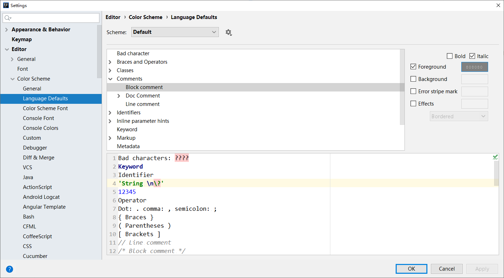
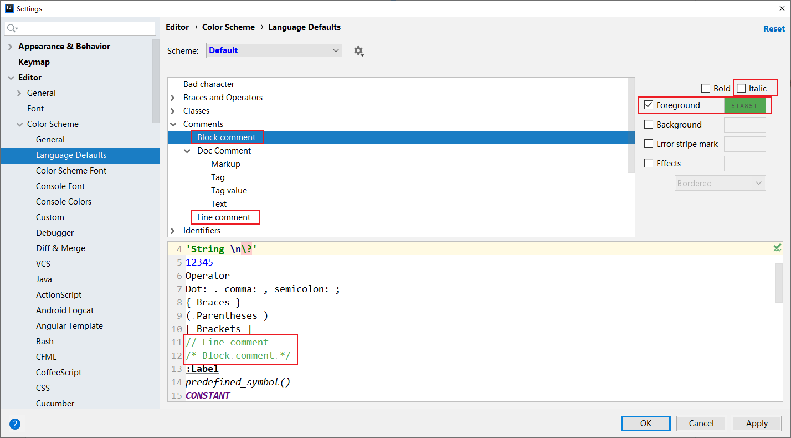

# 1 Linux VM


## 1.1 VirtualBox Centos 配置网卡


## 1.2 VirtualBox Centos 配置多个网卡


# 2 idea 配置





# 3 git 配置多个远程仓库

```shell
# git 添加远程仓库
git remote add
# 显示git中配置的远程仓库
git remote -v


git remote add [-t <branch>] [-m <master>] [-f] [--[no-]tags] [--mirror=<fetch|push>] <name> <url>
# 将你的git仓库地址添加到git remote配置中
git remote add origin git@github.com:myusername/myrepository.git


# 删除某个远程仓库的关联
git remote remove <name>
git remote rm origin

# 推送到指定仓库指定分支
git push origin master

# 从指定仓库指定分支中拉取
git pull origin master
```


