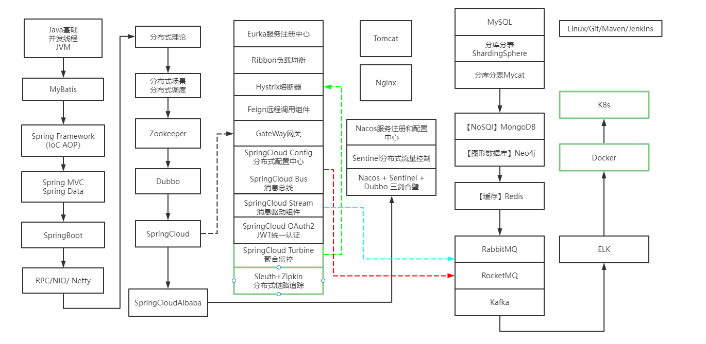

# Java高级第一版

> **Preface**

***All the shine of a thousand spotlights***

***never be enough for me***

> **学习路线**

> 工具

时序图 - StarUML

流程图 - ProcessOn

编辑 - Typora [常用快捷键](https://support.typoraio.cn/Shortcut-Keys/)

开发 - idea

> **github**

[github名称 ：turbo-github](https://github.com/turboYuu/java-advanced-gitbook)

> **gitbook** npm

https://www.npmjs.com/package/gitbook

npm版本： 6.4.1

node版本： v10.14.0

> gitbook 地址

https://turboyuu.gitbook.io/java-advanced/

