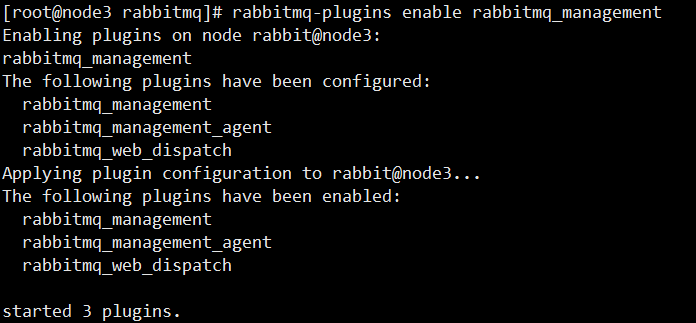

RabbitMQ + 镜像队列 + HAProxy 实现负载均衡的集群

# 1 集群管理（RabbitMQ扩容）

## 1.1 环境介绍

| hostname | IP             |
| -------- | -------------- |
| node2    | 192.168.31.122 |
| node3    | 192.168.31.123 |
| node4    | 192.168.31.124 |
|          |                |

注意:修改三台节点hostname文件，设置主机名，分别为：node2，node3，node4

修改三台节点的/etc/hosts文件，设置节点名称和ip地址的映射关系


单机部署

关闭防火墙

## 1.2 从node2拷贝.erlang.cookie到node3、node4的相应目录

在node2上启动RabbitMQ生成` /var/lib/rabbitmq/.erlang.cookie`


修改node3和node4上该文件的所有者为rabbitmq:rabbitmq：

```
chown rabbitmq:rabbitmq /var/lib/rabbitmq/.erlang.cookie
```


## 1.3 启动node2、node3、node4上的RabbitMQ

```
rabbitmq-server -detached
```

## 1.4 将node3和node4这两个节点加入到集群中


默认情况下一个节点也是集群

在node3、node4上分别执行

```shell
# 停止Erlang VM上运行的RabbitMQ应用，保持Erlang VM的运行
rabbitmqctl stop_app

# 移除当前RabbitMQ虚拟主机中的所有数据：重置
rabbitmqctl reset

# 将当前RabbitMQ的主机加入到rabbit@node2这个虚拟主机的集群中。一个节点也是集群。
rabbitmqctl join_cluster rabbit@node2

# 启动当前Erlang VM上的RabbitMQ应用
rabbitmqctl start_app
```


注意：

1.`rabbit@node2`表示RabbitMQ节点名称，默认前缀就是`rabbit`，`@`之后是当前虚拟主机所在的物理主机`hostname`。

2.注意检查下hostname要可以相互ping通

3.join_cluster默认使用disk模式，后面可以加入参数--ram启用内存模式

## 1.5 移除节点node3

```shell
# 将虚拟主机（RabbitMQ的节点）rabbit@node3从集群中移除，但是rabbit@node3还保留集群信 息
# 还是会尝试加入集群，但是会被拒绝。可以重置rabbit@node3节点。
rabbitmqctl forget_cluster_node rabbit@node3
```


## 1.6 启动移除节点node3


## 1.7 修改集群名称

```shell
#修改集群名称（任意节点执行都可以）
rabbitmqctl set_cluster_name rabbitcluster
#查看集群状态（任意节点执行都可以）
rabbitmqctl cluster_status
```


```
#在node3上修改集群名称
# 不一定在一个集群中，只要.erlang.cookie元数据一致，就可以连接到对应节点，进行修改
rabbitmqctl --node rabbit@node4 set_cluster_name rabbits
```


## 1.8 将node3重新加入集群

```shell
[root@node3 rabbitmq]# rabbitmqctl stop_app
Stopping rabbit application on node rabbit@node3 ...
[root@node3 rabbitmq]# rabbitmqctl reset
Resetting node rabbit@node3 ...
[root@node3 rabbitmq]# rabbitmqctl join_cluster rabbit@node2
Clustering node rabbit@node3 with rabbit@node2
[root@node3 rabbitmq]# rabbitmqctl start_app
Starting node rabbit@node3 ...
[root@node3 rabbitmq]# rabbitmqctl cluster_status
```


## 1.9 web控制台

在node3节点上启动rabbitmq_management插件

```
rabbitmq-plugins enable rabbitmq_management
```




```shell
#在集群中的三个节点上的任意一个添加用户，设置用户标签，设置用户权限，
[root@node3 rabbitmq]# rabbitmqctl add_user root 123456
Adding user "root" ...
[root@node3 rabbitmq]# rabbitmqctl set_user_tags root administrator
Setting tags for user "root" to [administrator] ...
[root@node3 rabbitmq]# rabbitmqctl set_permissions -p / root "^$" "^$" ".*"
Setting permissions for user "root" in vhost "/" ...

```


可以在web控制台查看集群信息。如果要看到所有节点的运行情况，需要都启用`rabbitmq_management`插件。


在node2、node4上打开rabbitmq_management插件

```
rabbitmq-plugins enable rabbitmq_management
```

现在就可以在node3的web页面看到 node2、node4的数据


root/123456也可以登录node2:15672和node4:15672，因为node3上添加的root用户是全局的，没有指定具体节点


# 2 RabbitMQ镜像集群配置（消息分片存储，单点故障）

RabbitMQ中队列的内容是保存在单个节点本地的（声明队列节点）。和交换器、绑定不同，它们是对集群中所有节点。如此，则**队列存在单点故障**，解决方式之一就是使用**镜像队列**，在多个节点上拷贝队列副本。


```
rabbitmqctl set_policy half "^queue.*1$" '{"ha-mode":"exactly","ha-params":2}'
```


```
rabbitmqctl set_policy half "^queue.*1$" '{"ha-mode":"exactly","ha-params":1}'
```


# 3 负载均衡 HAProxy

```
wget https://www.haproxy.org/download/2.0/src/haproxy-2.0.1.tar.gz
```


编译安装过程

```
yum install gcc -y

tar -xvf haproxy-2.0.1.tar.gz 
cd haproxy-2.0.1
#使用linux-glibc编译
make TARGET=linux-glibc

make install
mkdir /etc/haproxy

#赋权
groupadd -r -g 149 haproxy 
# 添加用户
useradd -g haproxy -r -s /sbin/nologin -u 149 haproxy 

#创建haproxy配置文件
touch /etc/haproxy/haproxy.cfg
```


如果觉得编译安装，麻烦可以yum安装

```
yum -y install haproxy
```

如果使用yum安装，那么haproxy默认在/usr/sbin/haproxy下安装，并且会自动创建配置文件/etc/haproxy/haproxy.cfg


```shell
global
	log 127.0.0.1 local0 info
   	# 服务器最大并发连接数；如果请求的连接数高于此值，将其放入请求队列，等待其它连接被释 放；
  	maxconn 5120    
  	# chroot /tmp    
  	# 指定用户
  	uid 149    
  	# 指定组
  	gid 149
   	# 让haproxy以守护进程的方式工作于后台，其等同于“-D”选项的功能    
   	# 当然，也可以在命令行中以“-db”选项将其禁用；
   	daemon
   	# debug参数    
   	quiet
   	# 指定启动的haproxy进程的个数，只能用于守护进程模式的haproxy；    
   	# 默认只启动一个进程，
   	# 鉴于调试困难等多方面的原因，在单进程仅能打开少数文件描述符的场景中才使用多进程模式；    
   	# nbproc 20
   	nbproc 1
   	pidfile /var/run/haproxy.pid

defaults
	log global
   	# tcp：实例运行于纯TCP模式，第4层代理模式，在客户端和服务器端之间将建立一个全双工的 连接，
   	# 且不会对7层报文做任何类型的检查；    
   	# 通常用于SSL、SSH、SMTP等应用；   
   	mode tcp
   	option tcplog
   	option dontlognull    
   	retries 3
   	option redispatch    
   	maxconn 2000
   	# contimeout 5s    
   	timeout connect 5s
   	# 客户端空闲超时时间为60秒则HA 发起重连机制    
   	timeout client 60000
   	# 服务器端链接超时时间为15秒则HA 发起重连机制    
   	timeout server 15000
   	
listen rabbitmq_cluster
	# VIP，反向代理到下面定义的三台Real Server    
	bind 192.168.31.133:5672
   	#配置TCP模式
   	mode tcp
   	#简单的轮询
   	balance roundrobin    
   	# rabbitmq集群节点配置
   	# inter 每隔五秒对mq集群做健康检查，2次正确证明服务器可用，2次失败证明服务器不可用， 并且配置主备机制
   	server rabbitmqNode1 192.168.31.122:5672 check inter 5000 rise 2 fall 2
	server rabbitmqNode2 192.168.31.123:5672 check inter 5000 rise 2 fall 2
	server rabbitmqNode3 192.168.31.124:5672 check inter 5000 rise 2 fall 2
	
#配置haproxy web监控，查看统计信息
listen stats
	bind 192.168.31.133:9000
	mode http
   	option httplog
   	# 启用基于程序编译时默认设置的统计报告    
   	stats enable
   	#设置haproxy监控地址为http://node1:9000/rabbitmq-stats    
   	stats uri /rabbitmq-stats
   	# 每5s刷新一次页面
   	stats refresh 5s
```


```
haproxy -f /etc/haproxy/haproxy.cfg 
```


# 4 监控