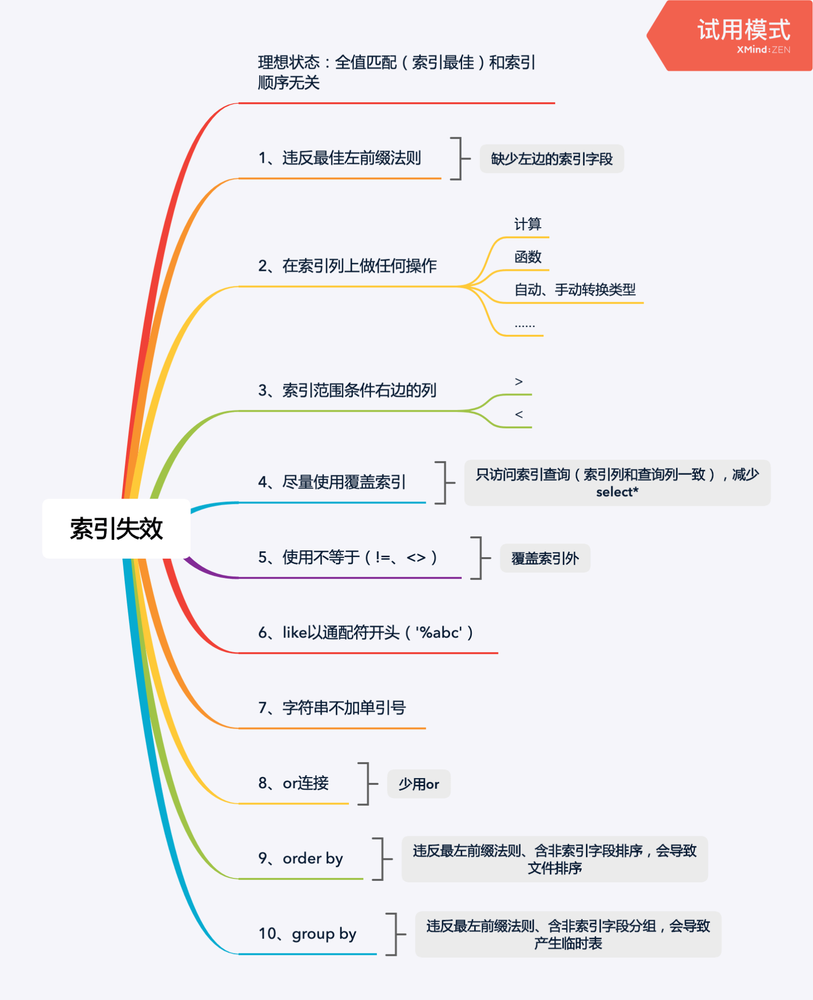
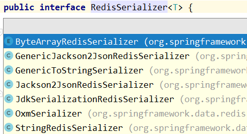

2.1 用多线程做过什么？ 重复计算，excel导入

2.2 多线程之间的同步机制有哪些？ 共享内存和消息传递

2.3 Java有哪些锁？reentrantlock的优点是什么？ 

2.4 什么是可重入锁？ 

2.5 数据库隔离级别，RC和RR分别说一下 读已提交和可重复读

2.6 什么是不可重复读？ 在同一个事务中查询同一行记录，先后两个不一致

2.7 分布式的CAP说一下？ 
2.8 Eureka保证的是哪两个？ 
2.9 CP和AP在某个机器宕机的情况下会有什么反应，比如有五台机器，有一台宕机了，CP和AP的策略是什么 
2.10 你觉得什么时候用AP什么时候用CP？ 2.11 有用过什么垃圾回收器 
2.12 CMS和G1的区别，各自的优势 

作者：Spark.
链接：https://leetcode-cn.com/circle/discuss/nAMzQc/
来源：力扣（LeetCode）
著作权归作者所有。商业转载请联系作者获得授权，非商业转载请注明出处。

# 面试题

------

## 2021-10-27 用友

zookeeper 的ZAB协议

滑动窗口

------

## 2021-10-28 BOSS直聘

Spring 事务

elastic-job如何确保不重复执行

------

2021-10-31

1. SpringBoot的初始化流程
2. MySQL 事务的实现（MVCC、锁、undo log、redo log、binlog）
3. Redission分布式锁的源码思想

算法：大数据排序

1. MySQL中 MVCC的实现 （隐藏列[隐藏id，事务id，回滚指针]，undo log，read view）

2. AP模型的分布式锁，CP模型的分布式锁

3. MySQL事务失效的场景

   

------

## 2021-11-02	百融云创 望京

1. Redis的序列化，Redis集群，哪些数据会存放到Redis中

   

2. 线程顺序执行的控制，线程池核心线程数大小设置

3. java安全

4. spring拦截器和过滤器

5. new A();

   包括两部分**类加载**和**初始化对象**。

   类加载：加载、验证、准备、解析、**初始化**、使用、卸载

   初始化对象：在堆空间分配内存空间、对实例变量赋值、执行初始化代码

6. RabbitMQ的消费顺序

7. ELK的mapping

## 2021-11-15 金山云

1. Java中的线程池，tomcat中的线程池

2. 线程池中AQS部分，线程池状态

3. 进程，线程，协程

4. 并发、并行

5. JVM虚拟机栈的调优参数

6. NIO和BIO的区别

   - BIO是以流的方式，而NIO是以缓冲区的方式处理数据
   - BIO是阻塞的，NIO是非阻塞的
   - BIO基于字符流和字节流进行操作，而NIO基于Channel和Buffer进行操作

7. IO模型

   - blocking IO，阻塞IO
   - nonblocking IO，非阻塞IO
   - IO multiplexing，多路复用IO
   - signal driven IO，信号驱动 IO
   - asynchronous IO，异步 IO

8. JMM

   

## 2021-12-07 自如面试

1. 红黑树（什么部分是红色，什么不是是黑色）
2. synchronized 锁的类别
3. Java命令有哪些（例如：jps）
4. http连接池
5. rocketmq实现3s的延时队列
6. eurak和nacos的区别
7. K8s
8. double什么时候会出现精度失效，bigdecimal
9. 线程安全
10. 单例模式中被final修饰的类实例，会被spring容器包裹吗？（我觉得不会）
11. Redis Cluster中如何查看一条数据在哪个服务器上

# 技术面试部分

- 现在的技术栈是什么，做什么产品，团队的人员数量是多少
- 并发量，吞吐量大小
- 项目的版本周期
- 和市场中同类产品相比，有什么特点和优势
- 加班情况，是否大小周
- 上下班时间，是否弹性
- 是否需要写工作周报
- 

# 薪资部分

- 薪资结构，是否包括绩效
- 有没有项目奖金，奖金如何计算
- 年终奖怎么计算，什么时候发，奖金的考核方法，设置标准，如何计算，大多数员工可以拿到几个月，我现在入职，有年终奖码。
- 还有没其他福利，比如，交通补助，餐饮补助，加班补助，租房补助等
- 五险一金的缴纳基数 ，试用期是否缴纳，试用期的时间长短，试用期工资是多少。
- 有无商业补充保险